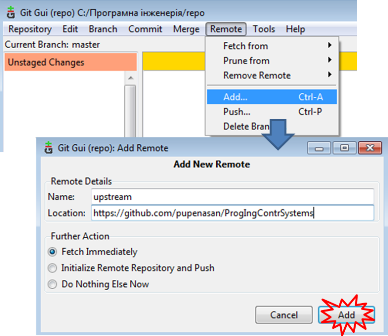

[<- До підрозділу](README.md)

## 3. Робота з форками 

Якщо є бажання зробити внесок до існуючого публічного сховища, проте у користувача немає  права на це, він можете створити для себе ***форк*** (***`fork`***) цього репозиторію. У цьому випадку GitHub створює копію цього сховища, що є існує в просторі імен користувача, який може викладати до неї зміни. Форк дозволяє вносити зміни в репозиторій, не впливаючи на оригінальне (вихідне) сховище. Користувач може отримувати оновлення з оригінального сховища або надсилати зміни з нього з допомогою ***запитів на пул*** (pull requests).

Хоч створення форку оригінального сховища подібне до створення його копії, між ними залишається зв'язок, який дає можливість:

- використовувати запит на пул, щоб запропонувати зміни від форку до ***оригінального*** сховища, також відомого як ***upstream***-сховище;
- вносити зміни з upstream-сховища до локального форку шляхом синхронізації;

Видалення форку не видаляє оригінальне upstream сховище. Можна вносити будь-які зміни у форк  - додавати співавторів, перейменувати файли, генерувати сторінки GitHub - не впливаючи на upstream-сховище. Однак не можна відновити сховище форк після його видалення. 

У проектах з відкритим кодом форки часто використовуються для повторення ідей або змін до того, як вони будуть запропоновані назад у upstream-сховище. Після внесення змін у форк, можна відкрити запит на пул для порівняння сховища форку з upstream-сховищем. Це може надати можливість надсилати запити на зміни до гілки форку будь-кому, хто має доступ на зміни до upstream-сховища. Це прискорює співпрацю, дозволяючи підтримуючим репозиторіям можливість локально робити коміти або запускати тести, перед тим як зробити запит на пул для об'єднання (мерджа). 

При необхідності створення копії наявного сховища без необхідності в майбутньому синхронізації та об'єднання гілок з upstream-сховищем, використовується дублювання (duplicate ) репозиторію. Можна також використовувати сховище як шаблон. Для отримання додаткової інформації див. [Дублювання сховища](https://help.github.com/en/articles/duplicating-a-repository) та [Створення репозиторію з шаблону](https://help.github.com/en/github/creating-cloning-and-archiving-repositories/creating-a-template-repository) 

Ви повинні сконфігурувати в Git підключення локального репозиторію до віддаленого оригінального (upstream) сховища  для синхронізації змін, що Ви робите у вашому форку для зміни їх в оригінальному репозиторію. Це також дозволить синхронізувати зміни у форку при зміні їх у оригінальному репозиторію. 

Для Windows через Git Bash:            

1. Відкрийте Git Bash.

2. Виведіть список сконфігурованих на даний момент відділених репозиторіїв для форка.

   ```shell
   git remote -v
   > origin  https://github.com/YOUR_USERNAME/YOUR_FORK.git (fetch)
   > origin  https://github.com/YOUR_USERNAME/YOUR_FORK.git (push)
   ```

3. Вкажіть новий віддалений оригніальний (*upstream* ) репозиторій  щоб можна було синхронізувати Ваш форк зі змінами в ньому.

   ```shell
   git remote add upstream https://github.com/ORIGINAL_OWNER/ORIGINAL_REPOSITORY.git
   ```

4. Перевірте нове сховище, яке ви вказали для свого форку. 

   ```shell
   git remote -v
   > origin    https://github.com/YOUR_USERNAME/YOUR_FORK.git (fetch)
   > origin    https://github.com/YOUR_USERNAME/YOUR_FORK.git (push)
   > upstream  https://github.com/ORIGINAL_OWNER/ORIGINAL_REPOSITORY.git (fetch)
   > upstream  https://github.com/ORIGINAL_OWNER/ORIGINAL_REPOSITORY.git (push)
   ```

Для Windows через Git Gui:     

1. Відкрийте Git Gui.
2. Вкажіть новий віддалений оригніальний (*upstream* ) репозиторій  щоб можна було синхронізувати Ваш форк зі змінами в ньому, наприклад.

 

рис.3. Добавлення репозиорію.

Після добавлення в конфігурації посилання на віддаленний репозиторій, можна синхронізувати з ним локальний репозиторй. У  Git Bash це робиться наступним чином                    

1. Відкрийте Git Bash.

2. Перейдіть на необхідну робочу директорію.

3. Отримайте нові дані (комміти) з віддаленого `upstream` сховища через команду `fetch` . У результаті комміти з `master` оригінального `upstream` будуть збережені в локальній папці `upstream/master`.

   ```shell
   git fetch upstream
   > remote: Counting objects: 75, done.
   > remote: Compressing objects: 100% (53/53), done.
   > remote: Total 62 (delta 27), reused 44 (delta 9)
   > Unpacking objects: 100% (62/62), done.
   > From https://github.com/ORIGINAL_OWNER/ORIGINAL_REPOSITORY
   >  * [new branch]      master     -> upstream/master
   ```

4. Перейдіть (Check out) на вашу локальну гілку форка `master` .

   ```shell
   git checkout master
   > Switched to branch 'master'
   ```

5. Злийте (Merge) зміни з `upstream/master` у локальну гілку  `master`. Це приводить гілку  `master` вашого форка синхронізованою до оригінального сховища, не втрачаючи локальних змін.

   ```shell
   git merge upstream/master
   > Updating a422352..5fdff0f
   > Fast-forward
   >  README                    |    9 -------
   >  README.md                 |    7 ++++++
   >  2 files changed, 7 insertions(+), 9 deletions(-)
   >  delete mode 100644 README
   >  create mode 100644 README.md
   ```

    If your local branch didn't have any unique commits, Git will instead perform a "fast-forward":  

   Якщо у вашої локальної гілки не було жодних унікальних комітів, Git замість цього здійснить "швидку перемотку" ("fast-forward"):

   ```shell
   git merge upstream/master
   > Updating 34e91da..16c56ad
   > Fast-forward
   >  README.md                 |    5 +++--
   >  1 file changed, 3 insertions(+), 2 deletions(-)
   ```

Зверніться до [довідникової системи GitHub](https://help.github.com/en/github/collaborating-with-issues-and-pull-requests/about-forks) для детального вивчення матеріалу.

