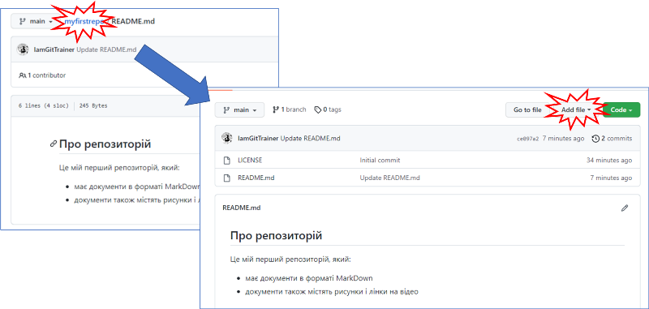
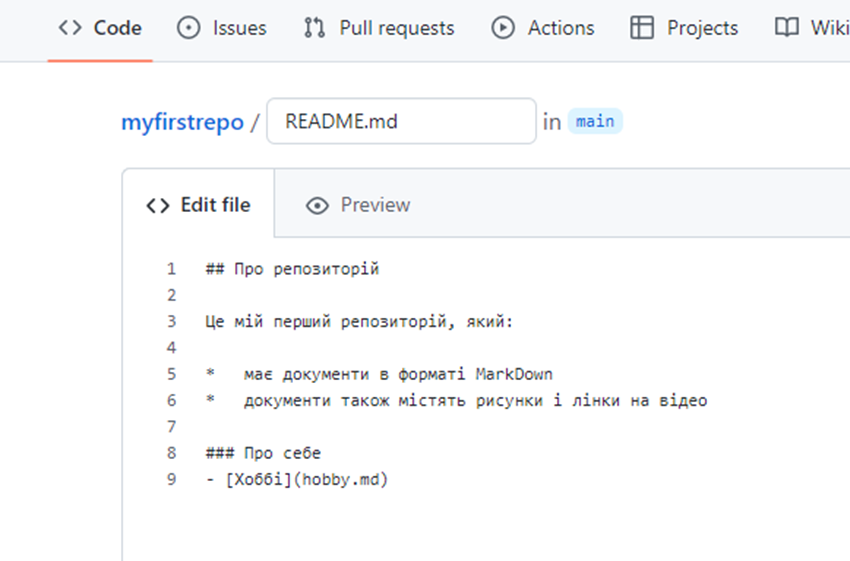

[<- До підрозділу](README.md)		[Коментувати](#feedback)

# Вступ до GitHub: практична частина

**Тривалість**: 1 академічна година (0.5 пари)

**Мета:**  Ознайомитися з платформою GitHub як інструментом для створення, публікації та обговорення документів. Отримати базові практичні навички роботи з публічними і приватними репозиторіями та публікації простого веб-сайту засобами GitHub Pages.

## Лабораторна установка для проведення лабораторної роботи у віртуальному середовищі.

**Апаратне забезпечення, матеріали та інструменти для проведення віртуальної лабораторної роботи.** 

- персональний комп’ютер з доступом до Інтернету

**Програмне забезпечення, що використане у віртуальній лабораторній роботі.** 

- сучасний веб-браузер

Локальні інструменти розроблення та система керування версіями Git у межах цієї лабораторної роботи не використовуються.

## Загальна постановка задачі

У межах практичної роботи необхідно:

- створити обліковий запис користувача на платформі GitHub;
- ознайомитися з базовими елементами інтерфейсу репозиторію;
- взяти участь в обговоренні відкритого репозиторію;
- створити власний публічний репозиторій;
- підготувати та опублікувати текстові матеріали у форматі Markdown;
- опублікувати веб-сторінку на основі репозиторію за допомогою GitHub Pages;
- створити приватний репозиторій та надати доступ іншому користувачу.

Після виконання лабораторної роботи здобувач:

- розуміє призначення GitHub як платформи для спільної роботи з документами;
- вміє створювати та налаштовувати публічні і приватні репозиторії;
- познайомиться з форматуванням текстів у Markdown;
- вміє публікувати простий веб-сайт на базі репозиторію GitHub;
- розуміє принципи взаємодії користувачів у межах репозиторію (коментарі, запрошення, співавтори).

## Послідовність виконання роботи

### 1. Реєстрація на GitHub 

- [ ] Ознайомтеся з [Вступ до GitHub: теоретична частина](teor.md)

Для виконання цього пункту необхідно:

- мати доступ до своєї електронної пошти 
- придумати пароль, який містить:
  - довжиною принаймні 8 символів
  - принаймні одну велику і одну малу літеру
  - принаймні одну цифру
  - принаймні один спеціальний символ, наприклад `_`

- придумати ім'я користувача, наприклад ім'я та прізвище на латині, можливо з цифрами 

- [ ] Зайдіть на сторінку [GitHub](https://github.com/)
- [ ] Натисніть `Sign Up` щоб зареєструватися, якщо у Вас ще немає облікового запису. Якщо Ви вже колись реєструвалися, то треба зайти під існуючим обліковим записом, тобто натиснути `Sign In` та переходити до наступного пункту практичного завдання.    


рис.1.

- [ ] Введіть свою поштову адресу і натисніть `Continue`


рис.2.

- [ ] Придумайте пароль, який містиме принаймні 8 літер, одну цифру, один особливий символ (`-`,`_`) і таке інше, принаймні одну маленьку і одну велику літеру. Запишіть цей пароль у поле вводу і натисніть `Continue`


рис.3.

- [ ] У поле імені користувача `Enter username` введіть назву користувача одним словом, без пробілів і спец. символів. Треба добитися щоб внизу поля вводу з'явився напис  `<Ім'я користувача> is available` . Після цього натиснути `Continue`.


рис.4.

- [ ] Далі Вам запропонують погодитися або відмовитися отримувати новини та оновлення через пошту. Можете написати `y`  або `n` і натиснути  `Continue`.


рис.5. 

- [ ] Далі запропонують пройти перевірку, чи Ви не робот. Натисніть `Перевірити` і виберіть картинки які Вам скажуть (в 2 кроки). 


рис.6.

- [ ] Після проходження перевірки натисніть `Create account`


рис.7.

- [ ] На наступному кроці Вам запропонують ввести перевірочний код, який Вам відправлять на пошту. Відкрийте пошту і введіть ті цифри, що Вам прийшли на пошту.   


рис.8.

- [ ] На наступних сторінках треба ввести певну інформацію про себе. На першій сторінці виберіть як саме Ви будете використовувати репозиторій в команді, можете вибрати  `Just Me` і натиснути `Continue` 


рис.9.

- [ ] Далі необхідно вибрати якими функціями плануєте користуватися. Наприклад `Project Management`.


рис.10.

- [ ] Далі виберіть `Continue for Free`, щоб вказати що Ви хочете вибрати безкоштовний план. 


рис.11.

### 2. Створення коментарю у відкритому репозиторії  

Репозиторії можна сприймати як сукупність файлів для певного проекту. Але в GitHub є ще додаткові інструменти для керування цим проектом. Наприклад, репозиторій Git4All наразі містить небагато файлів, але там можна задавати питання і обговорювати різноманітну проєктну діяльність в напрямку використання GitHub в створенні документів. У цьому  пункті треба залишити коментар у загальному репозиторію. 

- [ ] У рядку пошуку GitHub введіть `git4all` для пошуку необхідного репозиторію і натисніть `All GitHub`


рис.12.

- [ ] У знайденому буде різноманітні ресурси, серед яких репозиторії `GitHub`. Натисніть по `pupenasan/Git4All`.


рис.13.

- [ ] Ви перейдете на репозиторій `pupenasan` , який призначено саме для тих, хто хоче використати GitHub для своєї діяльності, яка не пов'язана з програмуванням. Тут багато вкладок, перегляньте ті частини, які виділені червоним на рис. 13:

- вгорі назва репозиторію яка складається 2 3-х частин: `користувач/назва`, зліва в назві значок і справа `Public` вказує на те, що цей репозиторій загальнодоступний і його може переглядати і коментувати будь хто з користувачів GitHub 
- Нижче йдуть закладки, які надають різні можливості роботи з репозиторієм. Наразі нас цікавить:
  - `Code` - де відображається перелік файлів в репозиторії а для деяких файлів можна переглянути і зміст. За замовченням внизу відображається зміст файлу `README.md`
  - `Issues`, `Discussions`  - дає можливість обговорювати проєктну діяльність, тобто задавати питання, робити зауваження тощо    


рис.14.

- [ ] Скористаємося обговореннями для створення першого повідомлення. Перейдіть в закладку `Issues` і натисніть по темі `Ласкаво просимо до клубу`.


рис.15.

GitHub в багатьох діяльностях передбачає використання спеціального формату тексту `Markdown`. У рамках філософії проекту `Git4All` , знання  `Markdown` - це одна з обов'язкових компетентностей, які треба набути в рамках роботи з GitHub. Пізніше можна опанувати його з використанням матеріалів мікромодулю [Markdown](../../docs/md/README.md), якщо Ви ще цього не зробили. Але наразі можна не вникати в усі його подробиці, а просто скористатися кнопками меню для швидкого редагування, як показано на рисунку нижче. Наприклад для товстого шрифту використовується дві зірочки праворуч і ліворуч від тексту (`**Олександр**`) .  

- [ ] Напишіть певний текст в коментарі, представтеся, напишіть коротко що очікуєте від знайомства з GitHub. Після редагування, перегляньте форматований результат, натиснувши `Preview` . 


рис.16.

5) Якщо результат задовольняє натисніть кнопку `Comment` , якщо ні - на вкладці `Write` виправте текст на необхідний, після чого повторіть спробу. 


рис.17.

Ви навчилися робити коментарі і пізніше зможете коментувати будь-які відкриті проекти на просторах GitHub! У тому числі, можете задавати питання в межах народного посібнику. Але, є один нюанс! Тепер Ви автоматично підписалися на відповіді в даній гілці. Тобто тепер, кожного разу, як хтось залишатиме коментар, Вам на пошту будуть приходити повідомлення. Щоб цього не відбувалося, треба відписатися, натиснувши `Unsubscribe` або вибравши відповідний пункт `Not subscribed` в меню `Notification` теми.  


рис.18.

### 3. Налаштування власного профілю  

На GitHub варто залишити про себе якусь інформацію, якщо Ви хочете щоб з Вами могли контактувати інші люди зі спільними інтересами. Для цього треба заповнити свій профіль. Заповнений профіль спрощує ідентифікацію користувача під час спільної роботи над репозиторіями та обговорень.

- [ ] Відкрийте налаштування свого профілю через пункт меню `Your profile`  в правому верхньому кутку.


рис.19.

У цьому вікні Ви побачите інформацію стосовно Вашого профілю, включаючи статистику дій, ваші проекти, репозиторії тощо 

- [ ] Звісно, ще рано казати про якусь статистику, тим не менше познайомтеся зі змістом цього вікна. 


рис.20.

На налаштування усіх властивостей профілю можна потрапити різними способами. 

- [ ] Перейдіть до меню `Settings`


рис.21.

- [ ] Тепер виберіть фотографію для аватарки


рис.22.

- [ ] Заповніть поля імені та натисніть кнопку `Update Profile`


рис.23.

- [ ] Для виходу на основну сторінку натисніть зображення котика в лівому верхньому кутку, який є символом GitHub. 


рис.24.

### 4. Створення свого власного відкритого репозиторію  

Прийшов час створити власний відкритий репозиторій, який буде доступний для перегляду і коментування усім охочим. Це може бути наприклад якийсь відкритий проект, до якого Ви хочете залучити усіх охочих. 

Репозиторій GitHub (і Git) - це сховище файлів та усіх його попередніх версій. Умовно його можна представити як папку з проектними файлами, старі версії яких за необхідності зміни, можуть зберігатися в схованій папці. У цьому практичному занятті ці особливості керування версіями та всі інші дуже важливі функції не будуть розглядатися. Просто вважатимемо для простоти, що це така загальнодоступна папка з файлами. Тим не менше пізніше варто опанувати матеріал мікромодуля [Системи керування версіями](../git/README.md) , зокрема в частині Git, якщо Ви цього не зробили.

- [ ] Перейдіть на основну сторінку клікнувши емблему GitHub. Натисніть `Create repository`


рис.25.

- [ ] Заповніть основні поля: 

- назва - `myfirstrepo` 
- опис `Мій перший репозиторій`
- тип: `Public`, тобто може бачити і коментувати усі в системі  
- `Add Readme` - у репозиторій при створенні додається файл `README.md` який описує загальні властивості репозиторію.
- `MIT License` - при такій ліцензії усі мають право поширювати зміст Вашого репозиторію кому завгодно, використовувати його у своїх цілях тощо

- [ ] Натисніть `Create repository`. 


рис.26.

Тепер Ваш перший репозиторій створено. В ньому зараз всього два файли, один з яких `README.md` вже навіть відображається. У наступному пункті будете заповнювати його.


рис.27.

### 5. Створення документів в Markdown

У цьому пункті необхідно створити в межах репозиторію документ в форматі Markdown. Про даний формат можна дізнатися детальніше з мікромодулю [Markdown](../../docs/md/README.md). 

- [ ] Відкрийте онлайн редактор Markdown <https://onlinemarkdowneditor.dev>. У редакторі вже буде набраний для прикладу документ. Використовуючи кнопку `Source` переключіться в режим ресурсу, щоб переглянути вигляд окремих елементів.    


рис.28.

- [ ] Натисніть `Ctrl+A` щоб виділити весь зміст вікна. Натисніть `Delete` та видаліть весь зміст. Далі наберіть наступний зміст:

```
Про репозиторій
Це мій перший репозиторій, який:
- має документи в форматі Markdown
- документи також містять рисунки і лінки на відео 
```

- [ ] Використовуючи кнопки форматування на панелі інструментів відформатуйте текст, як показано на рисунку.  


рис.29

- [ ] Переключіться на режим ресурсу `Source` і скопіюйте вихідний текст в буфер обміну. Перейдіть на свій репозиторій і включіть редагування. 


рис.30

- [ ] Вставте скопійований текст. Перейдіть в режим `Preview` для перегляду форматованого тексту. Натисніть `Commit changes` щоб зміни вступили в силу (що насправді значить ця команда розглянемо іншим разом).


рис.31.

- [ ] Перейдіть в корінь репозиторію і натисніть `AddFile -> Create New File` для створення нового файлу.



рис.32.

- [ ] Використовуючи вже відомий онлайн редактор створіть опис свого хоббі та вставте туди рисунок зі свого ПК. Скопіюйте зміст в новостворений файл на назвіть його `hobby.md`. Використовуючи `Preview` проконтролюйте щоб вигляд його був правильний. Натисніть `Commit New File`  


рис.33.

- [ ] Тепер у Вас в репозиторії є ще один файл md (Markdown). Але в його змісті є посилання на зовнішній рисунок. Варто його розмістити в цьому репозиторію і змінити лінк на нього. Для цього добавте цей файл рисунку у свій репозиторій. 


рис.34.

- [ ] Після добавлення натисніть `Commit Changes`.


рис.35.

- [ ] Відкрийте `hobby.md` і переключіться в його редагування.


рис.36.

- [ ] Змініть посилання так, щоб вказівка була на завантажений файл. Використовуючи `Preview` проконтролюйте, що все відображається коректно `commit changes`.

```

```


рис.37.

### 6. Створення веб-сайту на базі власного відкритого репозиторію  

Для того щоб з відкритих репозиторіїв зробити Веб-сайт, треба виставити відповідні опції. 

- [ ] Зайдіть в налаштування репозиторію `Settings`


рис.38. 

- [ ] Далі перейдіть на розділ `Pages`


рис.39.

- [ ] У ресурсах звідки буде формуватися веб-сайт вкажіть основну гілку `main`. Після цього натисніть `Save`


рис.40.

- [ ] Можна (необов’язково) також вибрати тему оформлення. Зараз це робиться наступним чином:
  - створення в репозиторії файлу `_config.yml`  для налаштування стилю
  - вписати в файл наступний зміст

```yaml
theme: jekyll-theme-leap-day
```

Сайт тепер доступно за посиланням, яке вказано на сторінці налаштування. Воно має наступну адресу за замовченням.

```http
https://ім’якористувача.github.io/назварепозиторія/
```


рис.41.

- [ ] Відкрийте посилання в новому вікні. Якщо там немає нічого, почекайте кілька хвилин, і оновіть сторінку.  Там має бути зміст Вашого файлу README але вже в форматі веб-сторінки.

Тепер увесь Ваш зміст репозиторію кожного разу при зміні буде публікуватися на веб сайті. Звісно для цього потрібен час, а при публікації можуть виникати помилки. Для простих сайтів, зроблених на базі ваших файлів Markdown малоймовірно що сайт не опублікується. Але щоб знати це достовірно, варто подивитися на результат виконання публікації.  

- [ ] Перейдіть на вкладку `Actions`. На рис.42 видно що сайт успішно опублікувався два рази, про що свідчить зелені галочки у відповідних записах. Під час публікації індикатор буде виглядати як "в прогресі". Якщо публікація не вдалася, то він буде червоним з відповідним написом. Клікнувши по запису можна подивитися деталі.


рис.42.

У нас два файли а ми бачимо тільки одну сторінку. Тепер необхідно зробити зміни і вставити в основний файл README посилання на сторінку `hobby.md`.  

- [ ] Перейдіть на вкладку з кодом а далі в режим редагування.


рис.43.

- [ ] Прості зміни в тексті зробимо власними силами, без використання сторонніх редакторів. Змініть сторінку, добавивши туди текст:

```
### Про себе
- [Хоббі](hobby.md)
```

- [ ] Використайте `Preview` для перегляду, після чого натисніть `Commit Changes`



рис.44.

- [ ] Перейдіть на вкладку `Actions` там повинен бути показаний прогрес виконання процесу розгортання. Дочекайтеся завершення і оновіть веб-сторінку розгорнутого сайту. 


рис.45.

### 7. Створення свого власного приватного репозиторію  

Приватний репозиторій надає доступ тільки для запрошених до нього співавторів. При цьому можна налаштувати так, щоб тільки певні користувачі мали можливість зміни його змісту. У безкоштовній підписці немає можливості будувати сайти на базі приватних репозиторіїв, але вони для цього і не призначені.

- [ ] У лівому кутку натисніть `New` для створення нового репозиторію. Назвіть його `firstprivate`, виставте налаштування, як показано на рис.46. Не забудьте вибрати опцію `Private`. 


рис.46.  


Репозиторій створено. Тепер там можна робити те саме, що і у публічних репозиторіях (є звичайно певні обмеження). Але крім Вас більше ніхто не має до нього доступу. Тепер треба запросити до репозиторію когось із зареєстрованих на платформі GitHub знайомих. Наприклад одногрупників або колег. Нижче наведений приклад запрошення автора даного практичного заняття. 

- [ ] Знайдіть в GitHub користувача якого хочете запросити до свого власного приватного репозиторію. Це можна зробити через вікно пошуку наприклад вказавши нікнейма користувача, або пошту (якщо учасник вказав її в своєму профілі). Зверніть увагу на місце пошуку в полі пошуку, там може бути вказано конкретний репозиторій, треба очистити усі префікси для вдалого пошуку. Результати пошуку виділяються за категоріями (рис.47). У розділі `Users` виберіть користувача і передивіться його профіль. 


рис.47.

- [ ] Перейдіть знову до свого приватного репозиторію. Зайдіть на закладку `Settings -> Collaborators`


рис.48.

- [ ] Враховуючи що Ви зайшли до зони підвищеного контролю, GitHub змусить Вас повторно ввести пароль.


рис.49.

- [ ] Після вводу паролю,  натисніть `Add people` .

 

рис.50.

- [ ] Тепер треба ввести ім'я користувача, вибрати його і відправити запрошення. Перелік запрошених і добавлених користувачів відображається в цьому вікні. Тепер треба чекати поки користувач підтвердить запрошення.


рис.51.

- [ ] Вибраному користувачу прийде на пошту запрошення, яке він повинен відкрити і підтвердити.


рис.52.

Тепер над даним репозиторієм працюють два користувачі. Звісно цей самий принцип працює і для відкритих репозиторіїв, якщо Ви хочете добавити туди когось для редагування.

## Запитання для самоперевірки

1. Яке призначення GitHub? 
2. Які типи репозиторіїв доступні в GitHub?
3. Які функції роботи з репозиторієм у GitHub використані в даній практичній роботі?
4. Розкажіть про добавлення користувачів до репозиторію в GitHub. Чи було це застосовано в даній практичній роботі?
5. Розкажіть про можливості перегляду історії змін у GitHub. Чи було це застосовано в даній практичній роботі?
6. Розкажіть про можливості сервісу Issue, які з них Ви використали в цій практичній роботі?
7. Розкажіть про можливості публікації веб-сторінок на базі GitHub. 

## Джерела

1. [Як почати користуватися GitHub для створення документів та сайту ](../workshop1/README.md)


## Автори


Практичне заняття розробив [Олександр Пупена](https://github.com/pupenasan) .

## Feedback

Якщо Ви хочете залишити коментар у Вас є наступні варіанти:

- [Обговорення у WhatsApp](https://chat.whatsapp.com/BRbPAQrE1s7BwCLtNtMoqN)
- [Обговорення в Телеграм](https://t.me/+GA2smCKs5QU1MWMy)
- [Група у Фейсбуці](https://www.facebook.com/groups/asu.in.ua)

Про проект і можливість допомогти проекту написано [тут](https://asu-in-ua.github.io/atpv/)

