[<- До підрозділу](README.md)		[Коментувати](#feedback)

#  Вступ до GitHub: теоретична частина

## 1. Загальні основи GitHub

**GitHub** — це онлайнова платформа для зберігання, публікації та спільної роботи з цифровими матеріалами. Первинно вона створювалася для програмістів, однак сьогодні GitHub широко використовується для роботи з документацією, навчальними матеріалами, методичними посібниками, технічними описами та публічними інформаційними ресурсами. У межах цього розділу GitHub розглядається не як інструмент програмування, а як універсальна платформа для організації та публікації інформації. Зрештою матеріали цієї лекції також розміщені на GitHub, тому з ним Ви вже і так працюєте, навіть не зареєструвавшись. 

Основною одиницею роботи в GitHub є **репозиторій**. Репозиторій можна розглядати як структуроване сховище файлів, яке:

- містить поточну версію матеріалів;
- зберігає історію змін;
- має засоби для обговорення та взаємодії між користувачами.

Так, наприклад, матеріали цієї лекції розміщені в репозиторії [https://github.com/asu-in-ua/atpv](https://github.com/asu-in-ua/atpv).

Репозиторії GitHub базуються на системі керування версіями Git. Про Git Ви можете почитати з розділу посібника [Системи керування версіями](../git/README.md). Саме Git визначає внутрішню модель зберігання даних: фіксацію станів файлів, ведення історії змін та зв’язки між версіями. GitHub використовує Git як технічну основу, але не обмежується лише керуванням версіями. Платформа доповнює Git засобами веб-доступу, організації репозиторіїв, колективної взаємодії, обговорень та публікації матеріалів. Таким чином, Git і GitHub виконують різні ролі: Git відповідає за модель версій і зберігання змін, а GitHub надає інфраструктуру для роботи з цими репозиторіями у спільному та публічному середовищі. Детальніше взаємодія Git і GitHub розглядається окремо. У межах цієї лекції увага зосереджена на загальних функціях GitHub. Технічні аспекти взаємодії з Git і робота з локальними інструментами керування версіями винесені в окремі матеріали.

GitHub  виділяє кілька типів репозиторіїв залежно від рівня доступу:

- публічні – доступні для перегляду всіма користувачами; наприклад, [https://github.com/asu-in-ua/atpv](https://github.com/asu-in-ua/atpv) є публічним репозиторієм, тому Ви можете читати, копіювати і навіть змінювати (за певних умов) матеріали даного репозиторію;
- приватні – доступні лише явно запрошеним користувачам;
- внутрішні – доступні всім учасникам певної організації в GitHub.

Функціональні можливості GitHub не залежать від типу репозиторію. Різниця між тарифними планами стосується насамперед режиму доступу до сховищ та можливостей керування організаціями. Публічні репозиторії доступні безкоштовно, тоді як приватні та внутрішні репозиторії можуть мати обмеження залежно від обраного плану та типу облікового запису.

GitHub використовується через облікові записи користувачів та організацій. Реєстрація користувача є безкоштовною і надає доступ до основних можливостей платформи: перегляду публічних репозиторіїв, створення власних репозиторіїв та участі в обговореннях. 

Окрім індивідуальних облікових записів, GitHub підтримує організації, які дозволяють об’єднувати користувачів, централізовано керувати доступом до репозиторіїв і спільно працювати з матеріалами в межах спільних проєктів. Так, наприклад, [https://github.com/asu-in-ua/atpv](https://github.com/asu-in-ua/atpv) публікується як проєкт  некомерційної і поки неофіційної організації `asu-in-ua`.

## 2. Перелік сервісів GitHub

GitHub надає для репозиторіїв широкий набір сервісів, які забезпечують спільну роботу, обговорення, автоматизацію процесів та аналіз стану проєктів. На рис.1 показано приклад зовнішнього вигляду вікна репозиторію для дисципліни «Програмна інженерія в системах керування».

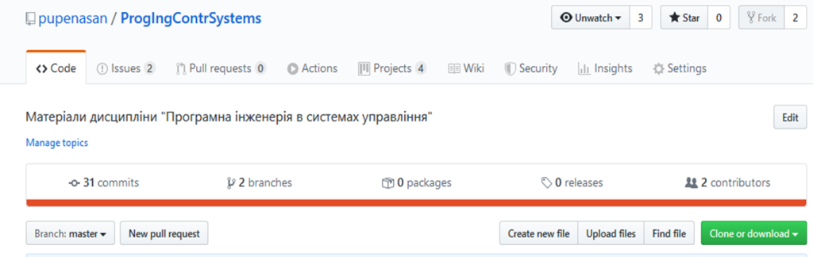

рис. 1. Закладки вікна репозиторію

GitHub пропонує такі основні функції роботи з репозиторієм (див. рис. 1):

- `Code` – перегляд вмісту репозиторію, файлів будь-якої версії; вмістом можуть бути не лише програмні коди, а й будь-які інші типи файлів;
- `Issues` – постановка та обговорення питань, зауважень і пропозицій, пов’язаних із репозиторієм;
- `Pull requests` – запити на внесення змін до репозиторію, зокрема для об’єднання гілок;
- `Actions` – автоматизація дій над репозиторієм у вигляді робочих процесів (workflow), таких як збирання, тестування та розгортання;
- `Projects` – керування проєктною діяльністю, зокрема з використанням підходів типу Kanban;
- `Wiki` – створення та підтримка вікі-сторінок проєкту;
- `Security` – налаштування політик безпеки та контроль уразливостей;
- `Insights` – перегляд аналітичної інформації щодо активності та стану репозиторію;
- `Settings` – загальні налаштування репозиторію та керування доступом.

Поступово в цій та інших лекціях більшість із зазначених можливостей розглядатимуться детальніше.

Загальноприйнятою практикою є розміщення в кореневій директорії репозиторію (а також у його підкаталогах) файлу `README` у форматі Markdown. Вміст цього файлу автоматично відображається в інтерфейсі GitHub. Зазвичай у `README` подають загальний опис проєкту, умови використання та ліцензування, рекомендації щодо роботи з матеріалами, правила взаємодії учасників та іншу інформацію, важливу для розуміння проєкту.

## 3. Розміщення матеріалів безпосередньо у GitHub

GitHub дозволяє працювати з файлами репозиторію без використання локальних інструментів і без прямої взаємодії з системою керування версіями Git. Уся робота з матеріалами може виконуватися через веб-інтерфейс GitHub. Через браузер користувач може:

- створювати нові файли в репозиторії;
- редагувати наявні файли;
- переглядати історію змін файлів;
- додавати зображення та інші вкладення;
- видаляти або перейменовувати файли.

Усі ці дії виконуються безпосередньо в інтерфейсі репозиторію через вкладку `Code`.

Створення та редагування файлів здійснюється за допомогою вбудованого редактора. Він дозволяє вводити текстовий вміст файлу, форматувати його з використанням Markdown (детальніше про формат розглядається в окремому мікромодулі  [Markdown](../../docs/md/README.md)) та попередньо переглядати результат перед збереженням.

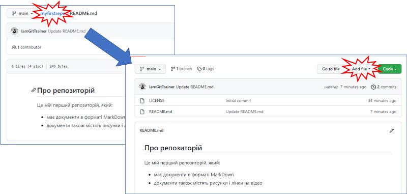
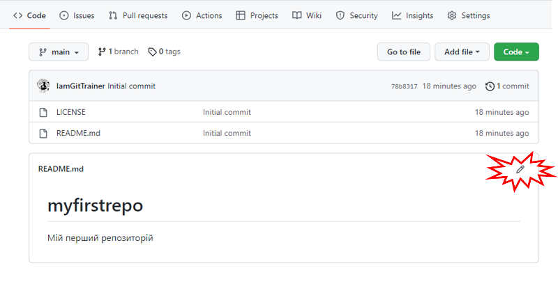

рис. 2. Створення та редагування файлу

Редагування файлу не призводить до автоматичного збереження змін у репозиторії. Для фіксації нового стану файлів користувач повинен явно підтвердити внесення змін, натиснувши кнопку `Commit changes`. З точки зору механізмів Git, на яких базуються репозиторії, це означає створення нового коміту (знімку), однак деталі цього процесу на даному етапі не розглядаються. Під час збереження змін користувач додає короткий опис внесених правок, який відображається в історії репозиторію.

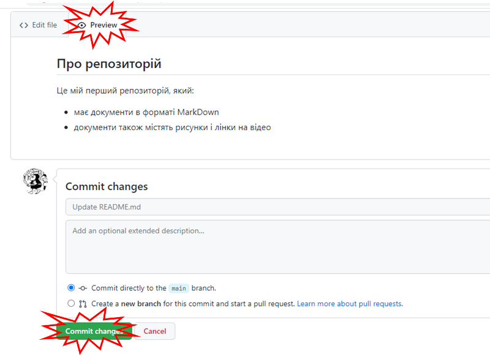

рис. 3. Попередній перегляд та фіксація змін у репозиторії

Аналогічно до файлової системи, файли в репозиторії можуть групуватися в каталоги. Це дозволяє структурувати навчальні та методичні матеріали, відокремлювати тексти, зображення та інші ресурси і підтримувати зрозумілу ієрархію проєкту.

## 4. Історія змін

Однією з ключових можливостей GitHub є збереження та перегляд історії змін матеріалів репозиторію. Репозиторії GitHub базуються на Git, тому для користувачів, знайомих із Git, основні принципи роботи з історією змін є вже відомими. Відмінність полягає насамперед у використанні веб-інтерфейсу. Кожна підтверджена зміна фіксує стан файлів на певний момент часу і зберігається як окремий запис в історії репозиторію. Це дозволяє відстежувати еволюцію матеріалів незалежно від того, чи працює з ними один користувач, чи група осіб. На рис. 4 показано документ `contents.md`, який було збережено в репозиторії як частину знімка з ідентифікатором [`2031b7f`](https://github.com/asu-in-ua/atpv/commit/2031b7f97bb60557161d37baa89eae7cf9e9093a).

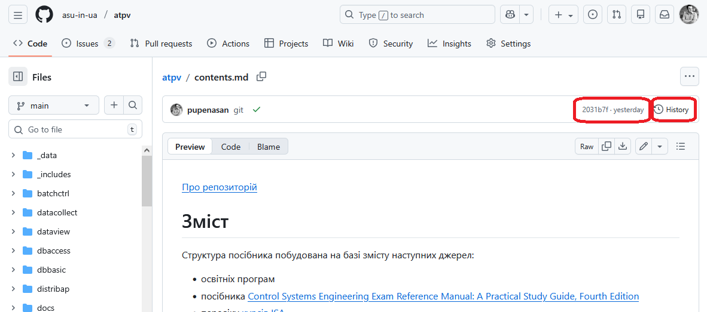

рис.4. Перегляд змісту файлу з окремого 

Історія змін доступна безпосередньо через веб-інтерфейс GitHub. Користувач може переглядати список зафіксованих змін, бачити час їх внесення, автора та короткий опис. Перехід до перегляду історії змін здійснюється за допомогою кнопки `History`, як показано на рис. 5.

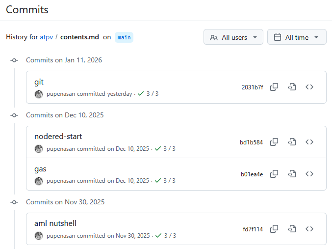

рис.5. Історія змін

На рис. 5 наведено приклад фрагмента історії змін для окремого файлу ([за посиланням](зhttps://github.com/asu-in-ua/atpv/commits/main/contents.md)). Для кожного знімка можна переглянути як стан самого файлу, так і перелік змін, які були зафіксовані на відповідний момент часу.

Окрім перегляду, історія змін може використовуватися для порівняння різних версій файлів. GitHub наочно відображає відмінності між версіями, підсвічуючи додані, змінені та видалені фрагменти. Такий спосіб представлення є зручним під час рецензування матеріалів, обговорення правок або аналізу помилок. На рис. 6 показано приклад відображення змін у текстовому файлі. Так само, як і в Git, символ `+` позначає додані фрагменти, а символ `-` — видалені. Також відображається, які файли були додані (`+`), видалені  (`-`)  або змінені  (`+-`).

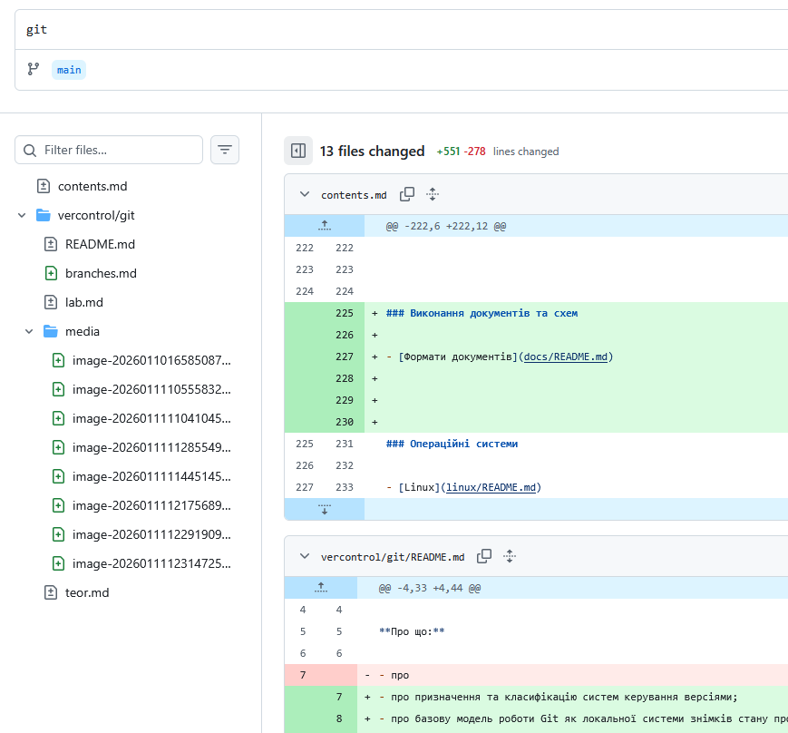

рис.6. Відображення змін у файлі

Збереження історії змін дозволяє повернутися до попередніх станів матеріалів у разі помилкових або небажаних правок. Навіть якщо файл було змінено або видалено, його попередні версії залишаються доступними в історії репозиторію, що підвищує надійність роботи з матеріалами.

Таким чином, історія змін у GitHub виконує не лише роль архіву, а й є інструментом аналізу, контролю якості та колективної взаємодії. Вона дозволяє працювати з матеріалами усвідомлено, розуміючи контекст і послідовність внесених змін.

## 5. Додавання користувачів до репозиторію як механізм спільної роботи

GitHub підтримує спільну роботу над матеріалами шляхом надання доступу кільком користувачам до одного репозиторію. Такий підхід дозволяє організувати колективну діяльність без дублювання файлів і використання зовнішніх засобів обміну даними. Доступ до репозиторію може надаватися шляхом запрошення інших користувачів платформи. Запрошені користувачі отримують можливість переглядати вміст репозиторію, а залежно від наданих прав — також вносити зміни, додавати нові матеріали або брати участь в обговореннях.

Механізм додавання користувачів є особливо важливим для приватних репозиторіїв, де доступ за замовчуванням обмежений навіть для перегляду. У таких випадках власник репозиторію самостійно визначає коло учасників і керує їхніми правами доступу. Для публічних репозиторіїв додавання користувачів використовується переважно для надання права редагування матеріалів. Ці користувачі є учасниками проєкту (Contributors) і показані в огляді репозиторію.

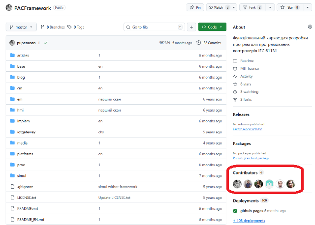

рис.7. Учасники проєкту 

Кожен користувач, який має доступ до репозиторію, працює з єдиним джерелом матеріалів. Усі внесені зміни фіксуються в історії репозиторію із зазначенням автора, що забезпечує прозорість спільної роботи та персональну відповідальність за правки.

Таким чином, додавання користувачів до репозиторію є базовим механізмом організації сумісної роботи в GitHub. Він дозволяє поєднувати індивідуальну відповідальність із колективним опрацюванням матеріалів та створює основу для масштабування проєктів — від роботи невеликої групи до діяльності в межах організації.

Тим не менше, спільна робота в GitHub не обмежується лише безпосереднім додаванням користувачів до репозиторію. Існує ще один поширений підхід, за якого учасники можуть пропонувати зміни без надання їм прямого доступу на редагування. У цьому випадку робота виконується з копією репозиторію, а зміни передаються власнику у вигляді пропозицій для включення до основного сховища. Такий підхід широко застосовується в публічних проєктах і дозволяє поєднати відкритість до внесків із контролем за змінами. Це розглядатиметься в інших лекціях.

## 6. Issues як інструмент обговорення та координації

Хоч репозиторії передусім є сховищами Git, платформа GitHub надає низку сервісів, які спрощують сумісну роботу над репозиторіями та перетворюють їх на центр проєктної діяльності. Під час спільної роботи важливу роль відіграють структуровані обговорення між учасниками проєкту та іншими зареєстрованими користувачами GitHub. Для цього використовується сервіс `Issues` (питання та обговорення).

Сервіс `Issues` може застосовуватися незалежно від наявності програмного коду і є універсальним засобом комунікації з форматом, частково подібним до інтернет-форумів. Issues можуть використовуватися для:

- постановки запитань щодо матеріалів;
- обговорення пропозицій та ідей;
- фіксації зауважень і помилок;
- координації роботи між учасниками проєкту.

Кожне issue є окремою темою обговорення з власною історією повідомлень. На рис. 8 показано фрагмент переліку issues для одного з навчальних проєктів.

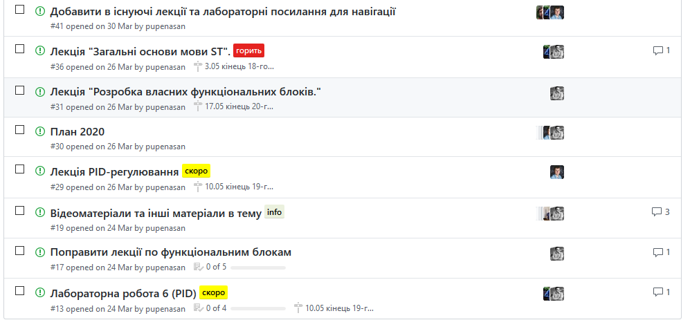

рис.8. Зовнішній вигляд Issues. 

Після створення issues можуть закриватися у разі вирішення питання або повторно відкриватися за потребою. Їх можна групувати та візуально позначати за допомогою міток (labels). На рис. 8 мітки використовуються для позначення пріоритету за часом. У проєктах з програмування також поширені стандартні мітки, наприклад `bug` або `question` (рис. 9). За потреби може використовуватися контроль часу та інші допоміжні атрибути. Завдяки цьому сервіс `Issues` може виконувати роль простого інструменту керування завданнями або обговореннями в межах проєкту.

рис.9. Робота з Issues

Під час створення та коментування issues доступні розширені можливості форматування тексту з використанням Markdown, зокрема форматування тексту, вставлення посилань і зображень, таблиць тощо. Подібно до форумів, користувачі можуть згадувати інших учасників і реагувати на повідомлення. Це дозволяє вести структуроване та наочне обговорення без використання зовнішніх засобів комунікації.

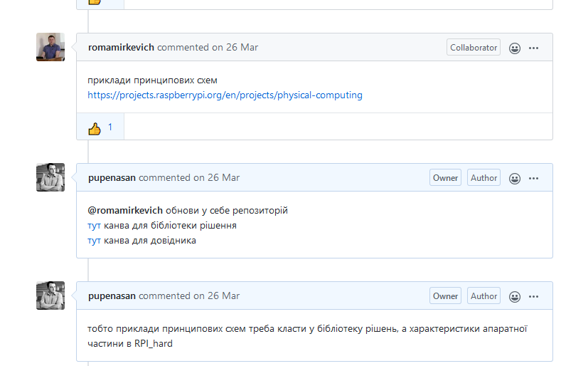

рис.10. Приклад обговорення

## 7. Публічні веб-сторінки на базі репозиторію

GitHub підтримує механізм публікації веб-сторінок без використання окремого хостингу. Для цього використовується сервіс GitHub Pages, який дозволяє перетворювати вміст репозиторію на веб-сайт і забезпечує його доступ через мережу Інтернет. Публікація виконується без налаштування серверного середовища та не потребує додаткової інфраструктури.

Основою для формування веб-сторінок зазвичай є файли у форматі Markdown. Платформа автоматично обробляє ці файли та перетворює їх у HTML-сторінки, які відображаються у вигляді повноцінного веб-сайту. Таким чином, ті самі матеріали можуть використовуватися як для роботи в репозиторії, так і для їх публічного представлення.

Механізм публікації веб-сторінок базується на:

- виборі джерела публікації, наприклад гілки або каталогу репозиторію;
- автоматичній обробці матеріалів платформою GitHub;
- генерації веб-сторінок із використанням стандартного шаблону або теми оформлення.

Користувач працює з тими самими файлами, що й у репозиторії, тоді як платформа забезпечує їх веб-представлення та оновлення при зміні матеріалів. Завдяки цьому репозиторій одночасно виконує роль сховища та джерела публічного контенту.

GitHub Pages часто застосовується для:

- публікації навчальних матеріалів;
- створення та підтримки документації;
- розміщення методичних посібників;
- публікації простих інформаційних веб-сайтів

Наприклад, репозиторій [https://github.com/asu-in-ua/atpv](https://github.com/asu-in-ua/atpv) на якому розміщено матеріали цього курсу, опубліковано також у вигляді веб-сайту за адресою [https://asu-in-ua.github.io/atpv/](https://asu-in-ua.github.io/atpv/). Таким чином, дана лекція доступна за двома посиланнями:

- як вихідний файл Markdown на репозиторії [https://github.com/asu-in-ua/atpv/blob/main/vercontrol/github/teor.md](https://github.com/asu-in-ua/atpv/blob/main/vercontrol/github/teor.md)
- як HTML-файл, що автоматично згенерований на основі вихідного Markdown-файлу та опублікований на сайті - [https://asu-in-ua.github.io/atpv/vercontrol/github/teor.html](https://asu-in-ua.github.io/atpv/vercontrol/github/teor.html)  

З огляду на те, що GitHub автоматично перетворює Markdown у HTML, навчальні матеріали можуть однаково використовуватися як у вигляді вихідних файлів репозиторію, так і у вигляді веб-сторінок. 

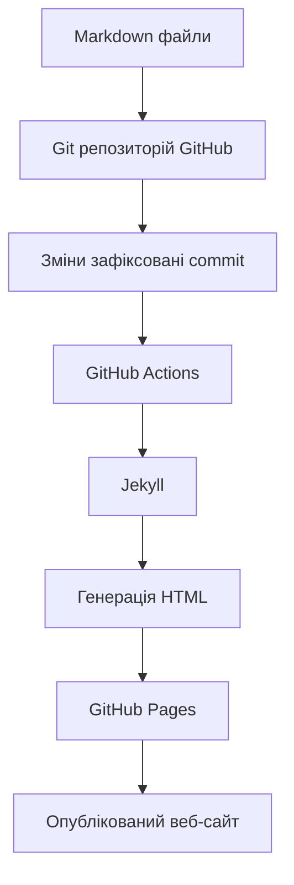

## 8. Наступні кроки

У цій лекції було розглянуто GitHub як платформу для зберігання, публікації та спільної роботи з матеріалами. Основну увагу приділено роботі з репозиторіями через веб-інтерфейс, організації матеріалів, обговоренням, історії змін та публікації веб-сторінок.

Подальше вивчення GitHub передбачає розширення цих знань у двох напрямах. По-перше, практичне закріплення розглянутих можливостей під час роботи з реальними репозиторіями та матеріалами. Це можна зробити виконавши практичне заняття [Вступ до GitHub: практична частина](lab.md).

По-друге, поступовий перехід до інтеграції GitHub із системою керування версіями Git, що дозволяє працювати з репозиторіями локально та ефективно організовувати командну розробку. У наступних матеріалах розглянуто взаємодію Git і GitHub, механізми внесення змін і їх узгодження, розширені сценарії спільної роботи та інше. 

## Запитання для самоперевірки

1. Яке призначення GitHub? 
2. Які типи репозиторіїв доступні в GitHub?
3. Які функції роботи з репозиторієм пропонує GitHub?
4. Розкажіть про добавлення користувачів до репозиторію в GitHub.
5. Розкажіть про можливості перегляду історії змін.
6. Розкажіть про можливості сервісу Issue.
7. Розкажіть про можливості публікації веб-сторінок на базі GitHub. 

## Джерела

1. 

## Відеозаписи лекцій

- [Створення документації на основі MarkDown](https://youtu.be/B-s3QVcrIwM)

## Автори

Теоретичне заняття розробив [Олександр Пупена](https://github.com/pupenasan)

## Feedback

Якщо Ви хочете залишити коментар у Вас є наступні варіанти:

- [Обговорення у WhatsApp](https://chat.whatsapp.com/BRbPAQrE1s7BwCLtNtMoqN)
- [Обговорення в Телеграм](https://t.me/+GA2smCKs5QU1MWMy)
- [Група у Фейсбуці](https://www.facebook.com/groups/asu.in.ua)

Про проект і можливість допомогти проекту написано [тут](https://asu-in-ua.github.io/atpv/)

