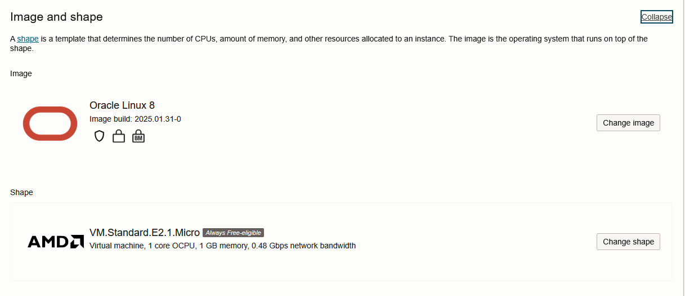

[<- До підрозділу](README.md)

# Створення віртуальної машини в Oracle Cloud: практична частина

Дане практичне заняття не завершено. Автору не вдалося забезпечити нормальне функціонування віртуальних машин та взаємодію з ними. Початково передбачалося створення віртуальних машин  A1 з ОС Ubuntu, однак так і не вдалося. Після вибору ВМ за замовченням (див. нижче), вони створювалися, однак з часом підключення до них через консоль Cloud Shell було неможливим. Якщо хтось користується даними сервісами, можете завершити дану роботу. 


**Тривалість**: 

**Мета:**  

## Лабораторна установка для проведення лабораторної роботи у віртуальному середовищі.

**Апаратне забезпечення, матеріали та інструменти для проведення віртуальної лабораторної роботи.** 


**Програмне забезпечення, що використане у віртуальній лабораторній роботі.** 

1. 

## Загальна постановка задачі

У лабораторній роботі використовується хмарні віртуальні машини https://cloud.oracle.com, який надає безкоштовне безлімітне по часу використання різними хмарними ресурсами, у тому числі віртуальними машинами в певному обсязі ([деталі Free Teer](https://docs.oracle.com/en-us/iaas/Content/FreeTier/freetier.htm)), а також надає платні ресурси на 250 Євро. 

Цілі роботи: 

- налаштувати віртуальну локальну мережу між хостовою та гостьовою ОС для проведення наступних лабораторних робіт
- встановити сніфер Wireshark та отримати навички роботи з ним
- проаналізувати структуру кадрів Ethernet та ARP-пакетів

## Послідовність виконання роботи

### 1. Реєстрація на Oracle Cloud

- [ ] Зареєструйтеся на https://cloud.oracle.com . При реєстрації треба врахувати кілька ключових особливостей Oracle Cloud:

- реєстрація потребує приєднати банківську карту до акаунту; під час підключення карти з неї буде сплачено суму в еквіваленті порядку 1 євро, однак кошти згодом будуть повернуті на картку; пропонуємо створити для цього віртуальну банківську картку, на якій утримувати невелику суму (але >1 євро);
- відомі часті випадки, коли карта банку не валідується в  Oracle Cloud, у цьому разі спробуйте іншу карту. 
- після повторного входження потребується двофакторна автентифікація, для чого на смартфон необхідно встановити ПЗ з класу Authentificator та підключити до нього аккаунт Oracle Cloud; кожного разу при входженні в кабінет https://cloud.oracle.com необхідно буде проходити автентифікацію як через логін пароль так і з використанням Authentificator
- для хостингу ресурсів у якості `home region` вибирайте найближче до Вас географічне розміщення з запропонованих а також важливо, найменш навантажених       

Можна використати і інших постачальників хмарних сервісів типу IaaS, які пропонують можливість створювати віртуальні машини Linux. Вартість використання на багатьох сервісах є досить лояльними, зокрема, наприклад https://us.ovh.com/us/order/vps/?v=3#/vps/build.  Надалі розглядаються кроки по створенню віртуальної машини в https://cloud.oracle.com за умови проходження усіх процедур реєстрації.

### 2. Створення віртуальної машини в хмарі

- [ ] На панелі керування виберіть опцію `Create VM Instance`, наприклад в `Menu` -> `Compute` -> `Instances`. Виберуть наступні налаштування (при виборі компонентів звертайте увагу на наявність примітки  `Always Free-eligible`)
  - shape (в налаштуваннях Image and shape) - залиште налаштування за замовченням (див рис.1):
    - VM.Standard.E2.1.Micro
    - 1 OCPU, 1 Гб ОС (за замовченням)
  - Image (в налаштуваннях Image and shape) :
    - Oracle Linux 
  - Завантажте собі на комп'ютер приватний та публічні ключі SSH (див. рис.2), це треба зробити обов'язково при створенні машини, щоб можна було підключатися по SSH 
  - Інші налаштування також залиште за замовченням, натисніть кнопку `Create` внизу екрану




рис.1. Зовнішній вигляд частини вікна з налаштуваннями  Image and shape для створення віртуальної машини


рис.2. Зовнішній вигляд частини вікна з кнопками завантаження ключів SSH для створення віртуальної машини

- [ ] Після створення автоматично перейдете у вікно перегляду інформації про віртуальну машину. У розділі Instance access знайдіть наступну інформацію і скопіюйте: 
  - публічну IP адресу
  - Username

### 3. Підключення до віртуальної машини через Cloud Shell

Cloud Shell - це термінал на основі веб-браузера, доступ до якого можна отримати з консолі. Для нього створюється окрема віртуальна машина.

- [ ] У меню Developer Tools відкрийте Cloud Shell 


- [ ] З часом внизу з'явиться вікно терміналу. У ньому на запрошення відображення посібника `Would you like to run a tutorial to learn more about all the features included in Cloud Shell? (Type N to quit) [Y|N]` натисніть `N`.
- [ ] Завантажте на машину з консоллю приватний ключ. Для цього в правому кутку консолі виберіть відповідний пункт меню - `Upload`.  


- [ ] Після завантаження перевірте, що файл приватного ключа є в переліку файлів за допомогою команди `ls`:

```
mynic@cloudshell:~ (eu-frankfurt-1)$ ls
ssh-key-2025-02-16.key
```

- [ ] Змініть параметри доступу до ключа:

```
chmod 600 ssh-key-2025-02-16.key
```

- [ ] Підключіться до віртуальної машини, використовуючи команду

```
ssh -i шлях_до_ключа користувач@IP
```

Наприклад

```
ssh -i ssh-key-2025-02-16.key opc@130.162.237.84
```

Після підключення вийде наступне повідомлення

```
FIPS mode initialized
The authenticity of host '130.162.237.84' can't be established.
ECDSA key fingerprint is SHA256:...
ECDSA key fingerprint is SHA1:...
Are you sure you want to continue connecting (yes/no)? yes
```

- [ ] Наберіть `yes` для встановлення з'єднання
- [ ] Після вдалого підключення має вийти подібне до наступного повідомлення

```
[opc@instance-20250216-1111 ~]$ C
```


### 4. Встановлення PuTTY

Даний пункт необхідно виконувати для користувачів Windows, на якому відсутні засоби підключення по SSH

- [ ] Завантажте дистрибутив PuTTY з сайту https://www.chiark.greenend.org.uk/~sgtatham/putty/latest.html для вашої ОС
- [ ] Встановіть PuTTY

### 5. Підключення до віртуальної машини по SSH з PuTTY

- [ ] Запустіть на виконання 


