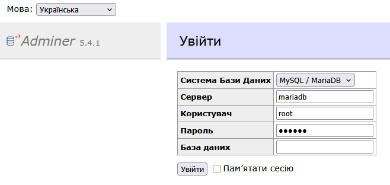
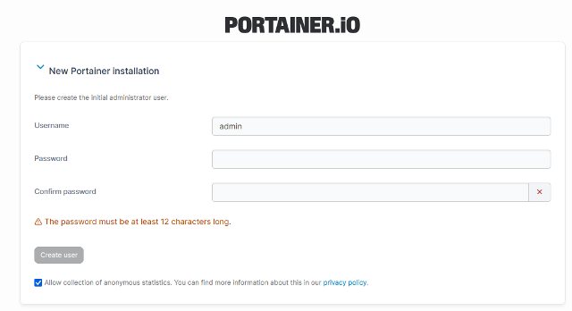
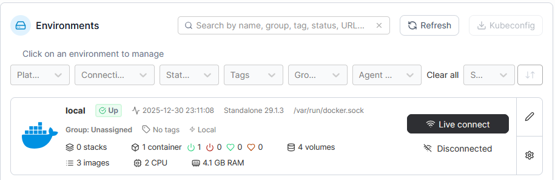
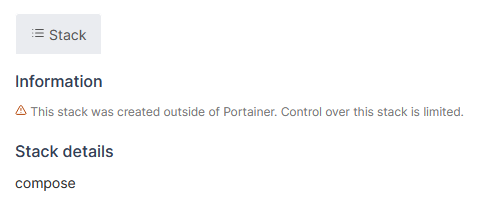

[<- До підрозділу](README.md)		[Коментувати](#feedback)

# Основи розгортання сервісів у Docker: практична частина

**Тривалість**: 4 акад. год (2 пари)

**Мета:**  Навчитися запускати та керувати контейнерами Docker на прикладі двох сервісів: MariaDB (БД) та Adminer (веб-адмінка), використовуючи мережу і томи.

## Лабораторна установка для проведення лабораторної роботи у віртуальному середовищі.

Апаратне забезпечення, матеріали та інструменти для проведення віртуальної лабораторної роботи.

- ПК 

Програмне забезпечення, що використане у віртуальній лабораторній роботі.

1. docker
1. portainer

## Загальна постановка задачі

Цілі роботи: 

- сформувати розуміння різниці між Docker-образом і контейнером;
- набути навичок запуску, зупинки та перезапуску контейнерів, перегляду журналів;
- набути навичок відображення портів і використання змінних середовища;
- зрозуміти призначення Docker-томів і принцип збереження даних незалежно від контейнера;
- зрозуміти роль Docker-мереж для ізоляції та взаємодії контейнерів;
- навчитися створювати простий Docker-образ за допомогою Dockerfile;
- набути навичок опису і запуску багатосервісного середовища за допомогою Docker Compose;
- ознайомитися з Portainer як веб-інтерфейсом для огляду та керування Docker-середовищем.

## Пререквізити

- повинна бути встановлена віртуальна машина з Debian, порядок встановлення за [посиланням](../vbox/labdebian.md)

## Послідовність виконання роботи

- [ ] Ознайомтеся з [Контейнери Docker: теоретична частина](teor.md)

## Частина 1. Docker

### 1. Встановлення Docker

- [ ] Запустіть віртуальну машину з Debian
- [ ] Якщо хостова машина з Windows то рекомендується працювати через Putty, який дає можливість копіювати та вставляти команди, підключіться до системи VM  

- [ ] Увійдіть у систему під користувачем з правами адміністратора
- [ ] Оновіть список пакетів операційної системи

```bash
sudo apt update
```

- [ ] Встановіть службові пакети, необхідні для безпечного додавання офіційного репозиторію Docker і подальшого коректного встановлення Docker Engine через пакетний менеджер Debian.

```bash
sudo apt install -y ca-certificates curl gnupg lsb-release
```

- [ ] Цей крок додає офіційний GPG-ключ Docker, який використовується системою пакетів Debian для перевірки автентичності та цілісності пакетів, що завантажуються з репозиторію Docker.

```bash
sudo mkdir -p /etc/apt/keyrings
curl -fsSL https://download.docker.com/linux/debian/gpg | sudo gpg --dearmor -o /etc/apt/keyrings/docker.gpg
```

- [ ] Цей крок додає офіційний репозиторій Docker до системи керування пакетами Debian, що дозволяє встановлювати і оновлювати Docker Engine з перевіреного джерела та отримувати актуальні версії програмного забезпечення.

```bash
echo \
"deb [arch=$(dpkg --print-architecture) signed-by=/etc/apt/keyrings/docker.gpg] \
https://download.docker.com/linux/debian $(lsb_release -cs) stable" | \
sudo tee /etc/apt/sources.list.d/docker.list > /dev/null
```

- [ ] Оновіть список пакетів з урахуванням нового репозиторію:

```bash
sudo apt update
```

- [ ] Встановіть Docker Engine:

```bash
sudo apt install -y docker-ce docker-ce-cli containerd.io
```

- [ ] Перевірте встановлення Docker:

```bash
docker version
```

Має вивести щось на кшталт:

```bash
Client: Docker Engine - Community
 Version:           29.1.3
 API version:       1.52
 Go version:        go1.25.5
 Git commit:        f52814d
 Built:             Fri Dec 12 14:49:42 2025
 OS/Arch:           linux/amd64
 Context:           default
permission denied while trying to connect to the docker API at unix:///var/run/docker.sock
```

- [ ] Переконайтесь, що служба Docker запущена:

```shell
sudo systemctl status docker
```

- [ ] Має вивести щось на кшталт

```bash
● docker.service - Docker Application Container Engine
     Loaded: loaded (/usr/lib/systemd/system/docker.service; enabled; preset: enabled)
     Active: active (running) since Tue 2025-12-30 10:31:44 UTC; 44s ago
 Invocation: 3cf1c0a5634d411498f2c0fcf6248d17
TriggeredBy: ● docker.socket
       Docs: https://docs.docker.com
   Main PID: 1556 (dockerd)
      Tasks: 9
     Memory: 26.1M (peak: 29.6M)
        CPU: 257ms
     CGroup: /system.slice/docker.service
             └─1556 /usr/bin/dockerd -H fd:// --containerd=/run/containerd/containerd.sock

```

- [ ] Додайте користувача до групи `docker`. Цей крок потрібен, коли необхідно запускати команди Docker без `sudo`, оскільки додавання користувача до групи `docker` надає йому відповідні права доступу до Docker Engine; зазвичай це роблять у навчальних і робочих середовищах для зручності, але не є обов’язковим з точки зору працездатності Docker.

```bash
sudo usermod -aG docker $USER
```

### 2. Завантаження образу та запуск контейнера MariaDB

На цьому етапі лабораторної роботи перехід у робочий каталог не потрібен, оскільки використовується лише запуск готового Docker-образу без локальних файлів проєкту.

- [ ] Завантажте офіційний Docker-образ MariaDB:

```bash
docker pull mariadb
```


Ця команда завантажує образ MariaDB в локальний репозиторій з Docker Hub. Він буде використаний як шаблон для створення контейнера системи керування базою даних. Після виконання команди `docker pull` образ зберігається у внутрішньому сховищі Docker Engine на хості, а не в поточному каталозі користувача. Docker керує цим сховищем самостійно, типово воно розташоване в каталозі `/var/lib/docker`. Користувач не працює з цими файлами напряму і взаємодіє з образами лише через команди Docker, незалежно від того, з якої папки вони виконуються.

- [ ] Переконайтесь, що образ завантажений:

```bash
docker images
```

У списку образів повинен бути присутній образ `mariadb`.

- [ ] Запустіть контейнер MariaDB з мінімальними параметрами:

```bash
docker run -d \
  --name mariadb \
  -e MARIADB_ROOT_PASSWORD=secret \
  mariadb
```

де:

- `-d` — запуск контейнера у фоновому режимі;
- `--name mariadb` — задання імені контейнера для зручної ідентифікації та подальшого керування;
- `-e MARIADB_ROOT_PASSWORD=secret` — передача змінної середовища, яка задає пароль адміністратора (root) бази даних, тобто пароль `secret`;
- `mariadb` — назва Docker-образу, з якого створюється контейнер.

Змінна середовища — це параметр у форматі `ІМ’Я=ЗНАЧЕННЯ`, який передається процесу під час його запуску і використовується програмою для початкового налаштування. Змінні середовища в Docker використовуються для параметризації контейнерів під час запуску і дозволяють налаштовувати поведінку сервісу без зміни Docker-образу. 

Наведені вище параметри є мінімально необхідними для запуску працездатного сервера MariaDB у контейнері без додаткових сервісів і налаштувань.

- [ ] Перевірте, що контейнер працює:

```bash
docker ps
```

Команда `docker ps` використовується для перегляду запущених контейнерів. Вивід матиме приблизно такий вигляд:

```bash
CONTAINER ID   IMAGE     COMMAND                  CREATED         STATUS         PORTS      NAMES
b6fdf0d7edfb   mariadb   "docker-entrypoint.s…"   2 minutes ago   Up 2 minutes   3306/tcp   mariadb
```

де:

- `CONTAINER ID` - ідентифікатор контейнера;
- `IMAGE` -  образ, з якого створений контейнер;
- `COMMAND` - команда (процес), яка запускається всередині контейнера як основний; 
- `CREATED` - час, що минув з моменту створення контейнера;
- `STATUS` - поточний стан контейнера і тривалість його роботи;
- `PORTS` - інформація про відображення портів контейнера.
- `NAMES` -  ім’я контейнера;

Контейнер `mariadb` має статус `Up`.

Команда `docker ps` показує лише запущені контейнери, а `docker ps -a` — всі контейнери незалежно від їхнього стану. Цю команду ми використовуватиме нижче.

- [ ] Перегляньте журнали запуску MariaDB:

```bash
docker logs mariadb
```

У журналах має бути видно, що сервер бази даних успішно ініціалізувався і готовий приймати з’єднання. Образ MariaDB завантажений, контейнер бази даних запущений і працює.

### 3. Підключення до MariaDB та перевірка роботи БД

- [ ] Підключіться до MariaDB всередині контейнера:

```bash
docker exec -it mariadb mariadb -u root -p
```

де: 

- Команда `docker exec` дозволяє виконувати команди всередині запущеного контейнера, незалежно від типу сервісу, за умови що контейнер працює і необхідна команда присутня в його середовищі.
-  `-it` використовується тоді, коли потрібно спілкуватися з процесом усередині контейнера в режимі командного рядка, а не просто запустити його у фоновому режимі. 
- `mariadb` (перше) - Ім’я контейнера, всередині якого буде виконуватись команда.
- `mariadb` (друге) - Назва програми, яку потрібно запустити всередині контейнера. У цьому випадку це клієнт MariaDB (консольний SQL-клієнт).
- `-u root` - параметр клієнта MariaDB, який вказує користувача БД: `root` — адміністратор бази даних.
- `-p` - параметр клієнта MariaDB, який означає “запитати пароль”. 
- Після запуску команда попросить ввести пароль користувача `root`.

- [ ] Введіть пароль адміністратора БД (той, що задавали при запуску контейнера), наприклад `secret`

- [ ] Перевірте доступні бази даних:

```sql
SHOW DATABASES;
```

Має вивести перелік баз даних

- [ ] Створіть тестову базу даних:

```sql
CREATE DATABASE labdb;
```

- [ ] Переконайтесь, що база створена:

```sql
SHOW DATABASES;
```

- [ ] Вийдіть з клієнта MariaDB:

```sql
EXIT;
```

У результаті виконано підключення до MariaDB всередині контейнера, створено тестову базу даних, що підтверджує коректну роботу сервера БД.

### 4. Робота з контейнером

#### 4.1. Процеси в середині контейнера

- [ ] Перегляньте процеси контейнера з хоста:

```
docker top mariadb
```

Команда показує процеси, які Docker бачить усередині контейнера, без входу в нього.

- [ ] Запустіть перегляд процесів зсередини контейнера:

```
docker exec -it mariadb ps aux
```

Ця команда запускає утиліту `ps` всередині контейнера і показує всі активні процеси з точки зору контейнерного середовища. Зверніть увагу на основний процес сервера БД: процес `mariadbd` (або `mysqld`) який є головним і відповідає за роботу контейнера. Інший процес є тимчасовим і створюється лише для виконання команди, запущеної через `docker exec` (у даному випадку `ps`), після завершення якої цей процес одразу зникає і не впливає на роботу контейнера.

#### 4.2. Зупинка та повторний старт контейнера

- [ ] Зупиніть контейнер MariaDB:

```bash
docker stop mariadb
```

Контейнер зупиняється, але не видаляється, його файловий шар з даними залишається.

- [ ] Переконайтесь, що контейнер зупинений:

```bash
docker ps -a
```

Контейнер `mariadb` має статус `Exited`.

- [ ] Запустіть контейнер MariaDB знову:

```bash
docker start mariadb
```

- [ ] Переконайтесь, що контейнер працює:

```bash
docker ps
```

- [ ] Підключіться до MariaDB і перевірте наявність створеної раніше БД:

```bash
docker exec -it mariadb mariadb -u root -p
```

```
SHOW DATABASES;
```

- [ ] Вийдіть з клієнта MariaDB:

```sql
EXIT;
```

Після зупинки і повторного запуску контейнера MariaDB раніше створені бази даних залишилися доступними.

Docker-образ є незмінним і використовується лише як шаблон для контейнера. Контейнер має власний записуваний шар, у якому зберігаються всі зміни, зокрема дані БД. Операції `stop` і `start` не призводять до втрати даних, оскільки контейнер не видаляється. Дані будуть втрачені лише у разі видалення контейнера (`docker rm`) без використання Docker volume.

### 5. Ознайомлення з Docker volume та персистентністю даних

#### 5.1. Створення власного тома

- [ ] Перегляньте наявні Docker volumes:

```bash
docker volume ls
```

Навіть якщо користувач явно не створює volume, Docker може автоматично створювати анонімні томи для зберігання даних контейнера, але для керованої і передбачуваної роботи з даними слід використовувати іменовані volumes.

- [ ] Створіть іменований volume для даних MariaDB:

```bash
docker volume create mariadb_data
```

Volume призначений для зберігання даних БД незалежно від життєвого циклу контейнера.

- [ ] Переконайтесь, що volume створений:

```bash
docker volume ls
```

- [ ] Перегляньте детальну інформацію про volume:

```bash
docker volume inspect mariadb_data
```

Команда показує, де фізично зберігаються дані volume на хості та як ним керує Docker. Наприклад:

```json
[
    {
        "CreatedAt": "2025-12-30T13:25:52Z",
        "Driver": "local",
        "Labels": null,
        "Mountpoint": "/var/lib/docker/volumes/mariadb_data/_data",
        "Name": "mariadb_data",
        "Options": null,
        "Scope": "local"
    }
]
```

Значить наступне

- `Name: "mariadb_data"` - Ім’я Docker volume, яке ви створили і використовуєте для зберігання даних.
- `Driver: "local"` - Тип драйвера volume. `local` означає, що дані зберігаються на локальному диску хоста і керуються самим Docker.
- `Mountpoint: "/var/lib/docker/volumes/mariadb_data/_data"` - Фізичний каталог на хості, де Docker реально зберігає файли цього volume.
- `CreatedAt: "2025-12-30T13:25:52Z"` - Час створення volume.
- `Scope: "local"` - Volume доступний лише на цьому хості (не розподілений між кількома вузлами).
- `Labels: null`, `Options: null` - Для цього volume не задано додаткових міток або параметрів.

Старий контейнер не можна “перепід’єднати” до нового volume, оскільки конфігурація монтування фіксується під час створення контейнера. Тому, щоб використати новий том, контейнер потрібно видалити і створити заново з потрібним volume.

#### 5.2. Створення нової версії контейнеру MariaDB 

- [ ] Зупиніть і видаліть старий контейнер MariaDB (без видалення volume)

```bash
docker stop mariadb
docker rm mariadb
```

- [ ] Переконайтесь, що контейнер видалений:

```
docker ps -a
```

- [ ] Запустіть новий контейнер і “прикріпіть” volume

```bash
docker ps -a
```

Для MariaDB дані всередині контейнера зберігаються у каталозі `/var/lib/mysql`, тому volume монтуємо саме туди:

```bash
docker run -d \
  --name mariadb \
  -e MARIADB_ROOT_PASSWORD=secret \
  -v mariadb_data:/var/lib/mysql \
  mariadb
```

де `-v mariadb_data:/var/lib/mysql` значить наступне:

- Ліва частина `mariadb_data` - ім’я Docker volume на хості.
- Права частина `/var/lib/mysql` - шлях у контейнері, куди Docker “підставляє” volume.

Завдяки цьому файли БД пишуться не в файлову систему контейнера, а в volume. Контейнер можна видалити, а дані не зникають.

- [ ] Перевірте, що volume реально змонтований у контейнер

```bash
docker inspect mariadb --format '{{json .Mounts}}'
```

У виводі має бути щось на кшталт:

```json
[{"Type":"volume","Name":"mariadb_data","Source":"/var/lib/docker/volumes/mariadb_data/_data","Destination":"/var/lib/mysql","Driver":"local","Mode":"z","RW":true,"Propagation":""}]
```

#### 5.3. Створення БД MariaDB 

- [ ] Створення тестової БД:

```bash
docker exec -it mariadb mariadb -uroot -psecret -e "CREATE DATABASE testdb;"
```

#### 5.4. Перевірка збереження БД в тому після перевидалення 

- [ ] Перезапуск через видалення:

```bash
docker stop mariadb
docker rm mariadb

docker run -d \
  --name mariadb \
  -e MARIADB_ROOT_PASSWORD=secret \
  -v mariadb_data:/var/lib/mysql \
  mariadb
```

Цей набір команд спочатку зупиняє і видаляє існуючий контейнер `mariadb`, а потім створює і запускає новий контейнер з тим самим ім’ям, але вже з підключеним Docker volume `mariadb_data`, у який монтується каталог `/var/lib/mysql` для збереження даних бази поза файловою системою контейнера.

- [ ] Перевірка, що БД `testdb` лишилась:

```bash
docker exec -it mariadb mariadb -uroot -psecret -e "SHOW DATABASES;"
```

### 6. Підключення до MariaDB з окремого контейнера

На попередніх етапах робота з БД виконувалась зсередини контейнера через `docker exec`. На практиці адміністрування БД зазвичай здійснюється з окремого клієнта. Для цього буде використано веб-адмінку з іменем Adminer, яка працює як окремий сервіс і підключається до MariaDB по мережі Docker.

#### 6.1. Створення окремої мережі Docker

- [ ] Створіть user-defined мережу з іменем `labnet`:

```bash
docker network create labnet
```

Окрема мережа дозволяє контейнерам знаходити один одного за іменами і є стандартною практикою для сервісної взаємодії.

- [ ] Переконайтесь, що мережа створена:

```bash
docker network ls
```

Виведе щось на кшталт:

```bash
NETWORK ID     NAME      DRIVER    SCOPE
404aa65e64b2   bridge    bridge    local
996f48fb4bff   host      host      local
a014f5c5462f   labnet    bridge    local
479cff49ae4e   none      null      local
```

де поля:

- `NETWORK ID` - Внутрішній ідентифікатор мережі Docker.
- `NAME` - Логічна назва мережі, яку використовують у командах Docker.
- `DRIVER` - Тип реалізації мережі (як Docker її будує).
- `SCOPE` - Область дії мережі (у цьому випадку тільки локальний хост).

Пояснення по рядках:

- `NAME = bridge, DRIVER = bridge` - Стандартна мережа Docker, створюється автоматично. Якщо мережу не вказано при `docker run`, контейнер підключається саме до неї.
- `NAME = host, DRIVER = host` - Контейнер використовує мережевий стек хоста без ізоляції.
- `NAME = none, DRIVER = null` - Контейнер запускається без мережевого доступу.
- `NAME = labnet, DRIVER = bridge` - User-defined bridge мережа, створена вручну для лабораторної роботи. Вона використовує той самий тип драйвера `bridge`, але має інші властивості, зокрема DNS за іменами контейнерів.

Однаковий DRIVER (`bridge`) не означає однакову поведінку мережі; означена користувачем мережа `labnet` і стандартна `bridge` реалізовані одним драйвером, але мають різні можливості і призначення.

#### 6.2. Підключення контейнера MariaDB до мережі

- [ ] Підключіть вже запущений контейнер MariaDB до мережі:

```bash
docker network connect labnet mariadb
```

Контейнер можна підключити до мережі без його перезапуску.

#### 6.3. Запуск контейнера Adminer

- [ ] Запустіть Adminer у тій самій мережі:

```bash
docker run -d \
  --name adminer \
  --network labnet \
  -p 8080:8080 \
  adminer
```

Adminer створюється і запускається як окремий контейнер та одразу підключається до мережі `labnet`. Порт 8080 відображений на хост для доступу до веб-інтерфейсу через браузер. Якщо Docker-образ `adminer` відсутній локально, команда `docker run` автоматично завантажує його з репозиторію перед створенням контейнера.

- [ ] Перевірте стан образів

```bash
docker images
```

#### 6.4. Підключення до MariaDB через Adminer

- [ ] Відкрийте у браузері хостової машини:

```
http://debian132:8080
```

де `debian132` - це ім'я віртуальної машини, або IP-адресу 

- [ ] Вкажіть параметри підключення:
- система: MariaDB / MySQL
- сервер: `mariadb`
- користувач: `root`
- пароль: `secret`



рис.1.

Ім’я контейнера `mariadb` використовується як ім’я сервера завдяки DNS-механізму user-defined мережі Docker.

#### 6.5. Перевірка доступу до даних

- [ ] Переконайтесь, що створена раніше база даних `testdb` доступна через Adminer
- [ ] (Опційно) Створіть таблицю або додайте тестовий запис

Веб-адмінка є окремим сервісом, а не частиною БД. Взаємодія між контейнерами здійснюється через user-defined мережу. Відображення портів використовується лише для доступу з хоста, а не для зв’язку між контейнерами. Така схема безпосередньо відповідає реальній сервісній архітектурі.

### 7. Аналіз схеми взаємодії контейнерів

На цьому етапі в лабораторній роботі використовується два контейнери (MariaDB і Adminer), які взаємодіють між собою через мережу Docker, а доступ користувача до сервісів здійснюється через відображення портів.

- [ ] Перевірте список запущених контейнерів:

```bash
docker ps
```

Очікуваний результат: Запущені контейнери `mariadb` і `adminer`.

- [ ] Перегляньте детальну інформацію про мережу:

```bash
docker network inspect labnet
```

У виводі буде видно, що обидва контейнери підключені до мережі `labnet` і мають власні IP-адреси. Наприклад:

```json
[
    {
        "Name": "labnet",
        "Id": "a014f5c5462fda8e70f66573d3749b11d4bf849d34d4a5e73c3c1dc96f5cc19e",
        "Created": "2025-12-30T13:59:30.060512346Z",
        "Scope": "local",
        "Driver": "bridge",
        "EnableIPv4": true,
        "EnableIPv6": false,
        "IPAM": {
            "Driver": "default",
            "Options": {},
            "Config": [
                {
                    "Subnet": "172.18.0.0/16",
                    "IPRange": "",
                    "Gateway": "172.18.0.1"
                }
            ]
        },
        "Internal": false,
        "Attachable": false,
        "Ingress": false,
        "ConfigFrom": {
            "Network": ""
        },
        "ConfigOnly": false,
        "Options": {},
        "Labels": {},
        "Containers": {
            "3a9482770931707be643459f473deb6f37deda1003c9a5b107ec380a55ea30ae": {
                "Name": "adminer",
                "EndpointID": "eaa226f75909c7286db43d4afb7c7024e0fb849010b2b681ac9c397719a99adc",
                "MacAddress": "02:0f:35:13:0b:ef",
                "IPv4Address": "172.18.0.3/16",
                "IPv6Address": ""
            },
            "6dda63622c0d1ccbf1cf76cedb9f3490f5420fd365ef499cf2b454216de4ffdd": {
                "Name": "mariadb",
                "EndpointID": "31e75a8ac0b9bb64ca1e1770cb161541d8e2c87c20812f0c952b945c6fe343d3",
                "MacAddress": "22:c6:4e:0e:fe:45",
                "IPv4Address": "172.18.0.2/16",
                "IPv6Address": ""
            }
        },
        "Status": {
            "IPAM": {
                "Subnets": {
                    "172.18.0.0/16": {
                        "IPsInUse": 5,
                        "DynamicIPsAvailable": 65531
                    }
                }
            }
        }
    }
]

```

У мережі означеної користувачем Docker кожен контейнер автоматично отримує DNS-ім’я, яке збігається з його іменем. У цій лабораторній:

- ім’я сервера БД: `mariadb`
- це ім’я використовується в Adminer як адреса сервера

- [ ] Зверніть увагу на параметр запуску Adminer:

```text
-p 8080:8080
```

Відображення порту використовується лише для доступу з хоста до контейнера Adminer. Для взаємодії контейнерів між собою відображення портів не потрібне.

Кожен контейнер є окремим сервісом. Взаємодія між сервісами здійснюється через означену користувачем мережу Docker. Імена контейнерів використовуються як мережеві імена сервісів. Відображення портів потрібне лише для доступу ззовні Docker-середовища. Така схема є типовою для подальшого переходу до Docker Compose.

## Частина 2. Docker Compose

На попередній частині лабораторної роботи всі сервіси створювалися вручну за допомогою команд Docker, без використання конфігураційних файлів. У системі вже існують окремі об’єкти Docker: контейнери, мережа та Docker volume з даними бази даних. Окремої конфігурації у вигляді файлу ще не існує, але поточний стан середовища фактично виконує її роль. 

Для опису та керування багатосервісними середовищами існують спеціальні інструменти оркестрації, які дозволяють фіксувати таку конфігурацію декларативно, у вигляді структурованого опису. Один із них - Docker Compose, який є простим і зручним інструментом, призначеним для локальної розробки та навчальних сценаріїв, і виступає логічним продовженням ручної роботи з Docker. Наразі Docker Compose інтегрований у Docker і використовується як підкоманда `docker compose`, тоді як раніше він постачався як окремий інструмент.

У цій частині Ви попрактикуєтеся у впорядкуванні вже створеного Docker-середовища та ознайомитеся з підходом декларативного опису сервісів за допомогою Docker Compose як зручного механізму керування багатоконтейнерними конфігураціями.

У наступній, третій частині лабораторної роботи, це середовище буде доповнене вебінтерфейсом Portainer, який дозволяє візуально переглядати та керувати контейнерами, образами, мережами і томами, а також спостерігати, як конфігурація, описана в Docker Compose, відображається у реальному стані Docker-системи.

Перед переходом до Docker Compose доцільно зупинити і видалити вручну створені контейнери, зберігши дані у Docker volume, щоб подальше керування середовищем виконувалося вже засобами Compose.

### 8. Зупинка та видалення контейнерів 

- [ ] Перевірте список запущених контейнерів:

```bash
docker ps
```

У списку повинні бути присутні контейнери `mariadb` та `adminer`.

- [ ] Зупиніть контейнер Adminer:

```bash
docker stop adminer
```

- [ ] Зупиніть контейнер MariaDB:

```bash
docker stop mariadb
```

- [ ] Переконайтесь, що контейнери зупинені:

```bash
docker ps -a
```

Контейнери `adminer` та `mariadb` мають мати статус `Exited`.

- [ ] Видаліть контейнер Adminer:

```bash
docker rm adminer
```

- [ ] Видаліть контейнер MariaDB:

```bash
docker rm mariadb
```

- [ ] Переконайтесь, що контейнери видалені:

```bash
docker ps -a
```

Контейнери `adminer` та `mariadb` повинні бути відсутні у списку.

Контейнер і образ є різними об’єктами Docker; видалення контейнера не впливає на наявність образу у локальному репозиторії. 

- [ ] Перевірте які образи є в локальному репозиторії. 

```
docker images
```

Має залишитися обидва образи

- [ ] Перевірте, що томи Docker (volume) з даними також залишився:

```bash
docker volume ls
```

Тому `mariadb_data` присутній у системі.

Таким чином вручну створені контейнери зупинені та видалені, при цьому дані бази даних збережені у Docker volume

### 9. Запуск середовища за допомогою Docker Compose

На попередніх етапах сервіси створювалися і запускалися вручну окремими командами Docker. Docker Compose дозволяє описати те саме середовище у вигляді одного файлу та керувати всіма сервісами як єдиним цілим.

#### 9.1. Підготовка робочого каталогу

- [ ] Створіть окремий каталог для конфігурації Docker Compose:

```bash
mkdir compose
cd compose
```

Docker Compose використовує файл конфігурації, який зберігається у робочому каталозі.

#### 9.2. Створення файлу конфігурації Docker Compose

- [ ] Створіть файл `docker-compose.yml`

```bash
nano docker-compose.yml
```

- [ ] Скопіюйте туди наступним вміст:

```yaml
services:
  mariadb:
    image: mariadb
    container_name: mariadb
    environment:
      MARIADB_ROOT_PASSWORD: secret
    volumes:
      - mariadb_data:/var/lib/mysql

  adminer:
    image: adminer
    container_name: adminer
    ports:
      - "8080:8080"
    depends_on:
      - mariadb

volumes:
  mariadb_data:
    external: true
    name: mariadb_data
```

- [ ] Натисніть `Ctrl+X` потім `Y` , потім `Enter` для збереження файлу.

Цей файл `docker-compose.yml` описує два сервіси, які працюють разом: базу даних MariaDB і вебінтерфейс для роботи з нею, а також підключає вже існуючий Docker volume для збереження даних. Пояснення по розділах

`services` - Описує контейнери, які мають бути створені та запущені в межах одного compose-проєкту.

`mariadb` - Сервіс бази даних.

- `image: mariadb` вказує, що контейнер створюється з офіційного образу MariaDB.
- `container_name: mariadb` задає фіксоване ім’я контейнера, а не автоматичне ім’я Compose.
- `environment` передає змінні середовища в контейнер. `MARIADB_ROOT_PASSWORD` задає пароль користувача root під час першого запуску.
- `volumes` підключає Docker volume `mariadb_data` до каталогу `/var/lib/mysql` всередині контейнера, де MariaDB зберігає свої файли.

`adminer` - Сервіс вебінтерфейсу для адміністрування бази даних.

- `image: adminer` використовує готовий образ Adminer.
- `container_name: adminer` фіксує ім’я контейнера.
- `ports` проброшують порт 8080 контейнера на порт 8080 хоста, щоб вебінтерфейс був доступний з браузера.
- `depends_on` вказує, що контейнер Adminer має запускатися після контейнера MariaDB.

`volumes` - Описує volumes, які використовуються у compose-проєкті.

- `external: true` означає, що volume не створюється Docker Compose, а вже існує в системі.
- `name: mariadb_data` задає точне ім’я існуючого volume, який буде підключений до контейнера MariaDB.

Тобто Docker Compose запускає пов’язаний набір контейнерів як єдине середовище, при цьому дані MariaDB зберігаються у вже створеному volume і не залежать від життєвого циклу контейнерів.

#### 9.3. Запуск сервісів через Docker Compose

- [ ] Запустіть середовище:

```bash
docker compose up -d
```

де:

`up` - створює і запускає всі сервіси, описані у файлі `docker-compose.yml`.

- створює мережі;
- створює томи;
- створює контейнери;
- запускає контейнери у правильному порядку.

`-d` (*detached mode*) - запускає сервіси у фоновому режимі, тобто консоль не блокується і повертається керування користувачу. Без `-d` журнали сервісів виводилися прямо в консоль, робота зупинялася до завершення виконання.

- [ ] Перевірте стан сервісів:

```bash
docker compose ps
```

Сервіси `mariadb` та `adminer` мають мати статус `running`.

#### 9.4. Перевірка доступу до сервісів

- [ ] Використовуючи Adminer gереконайтесь , що БД  `testdb` існує 


Середовище MariaDB та Adminer розгорнуте і керується за допомогою Docker Compose, а дані бази даних зберігаються у Docker-томі.

- Docker Compose дозволяє описати багатосервісне середовище у вигляді одного файлу.
- Один файл замінює набір команд `docker run`, `docker network` і `docker volume`.
- Керування сервісами стає відтворюваним і зручним.
- Такий підхід є базовим для подальшого розгортання складніших систем.

### 10. Поведінка контейнерів після перезавантаження системи

#### 10.1. Перевірка стану контейнерів після перезапуску

- [ ] Перезапустіть віртуальну машину

```bash
sudo reboot
```

- [ ] Після перезапуску перевірте стан контейнерів

```
docker ps
```

Список буде порожній.

Після перезавантаження операційної системи Docker Engine запускається автоматично, однак контейнери, створені за допомогою Docker Compose, не запускаються самі по собі. Це пов’язано з тим, що Docker Compose є інструментом керування і опису середовища, а не службою, яка постійно працює у фоні. У результаті після перезапуску системи: Docker працює, але сервіси, описані у `docker-compose.yml`, залишаються зупиненими.

Щоб контейнери запускалися автоматично разом із Docker Engine, необхідно задати політику перезапуску контейнерів.

#### 10.2. Добавлення політики автоматичного перезапуску

У Docker Compose політика перезапуску контейнерів налаштовується параметром `restart` для кожного сервісу:

```yaml
restart: unless-stopped
```

Ця політика означає, що контейнер буде автоматично запускатися після перезавантаження системи, доки його не зупинять вручну.

- [ ] Запустіть редактор для редагування `docker-compose.yml`

```bash
cd compose
nano docker-compose.yml
```

- [ ] За допомогою `Ctrl+K` видаліть увесь зміст
- [ ] Скопіюйте у файл модифікований варіант, де вставлені два рядки `restart: unless-stopped`

```yaml
services:
  mariadb:
    image: mariadb
    container_name: mariadb
    environment:
      MARIADB_ROOT_PASSWORD: secret
    volumes:
      - mariadb_data:/var/lib/mysql
    restart: unless-stopped

  adminer:
    image: adminer
    container_name: adminer
    ports:
      - "8080:8080"
    restart: unless-stopped

volumes:
  mariadb_data:
    external: true
    name: mariadb_data
```

- [ ] Натисніть `Ctrl+X` потім `Y` , потім `Enter` для збереження файлу.

- [ ] Запустіть середоивще

```bash
docker compose up -d
```

#### 10.3. Повторна перевірка стану контейнерів після перезапуску

- [ ] Перезапустіть віртуальну машину

```bash
sudo reboot
```

- [ ] Після перезапуску перевірте стан контейнерів

```
docker ps
```

Там повинні бути два запущені контейнери.

Після додавання політики перезапуску:

- система перезавантажується;
- Docker Engine стартує як служба;
- Docker автоматично запускає контейнери;
- запуск Docker Compose вручну не потрібен.

#### 10.4. Зупинка та видалення контейнерів

Docker Compose керує середовищем, означеним у конкретному файлі конфігурації, тому команди Compose прив’язані до каталогу або до явно вказаного файлу `docker-compose.yml`.

- [ ] Зупиніть виконання контейнерів

```bash
cd compose
docker compose stop
```

- [ ] Після перезапуску перевірте стан контейнерів

```bash
docker ps
```

- [ ] Виведіть список усіх контейнерів docker

```bash
docker ps -a
```

`docker ps` без параметрів показує тільки запущені контейнери, а ключ `-a` додає до списку зупинені та завершені.

- [ ] Видаліть усі контейнери що створені  compose

```
docker compose down
```

- [ ] Перевірте що контейнери дійсно були видалені

```
docker ps -a
```


## Частина 3. Portainer

Portainer — це вебінтерфейс для керування Docker-середовищем, який доповнює, а не замінює Docker Compose. Якщо Docker Compose використовується для опису та відтворення конфігурації середовища у вигляді файлу, то Portainer дозволяє спостерігати і керувати фактичним станом Docker Engine у реальному часі.

На відміну від Docker Compose, який працює з декларативним описом сервісів і вимагає взаємодії через командний рядок, Portainer надає наочне уявлення про контейнери, образи, мережі та томи через браузер. Це спрощує аналіз стану середовища, діагностику помилок, перегляд журналів, а також контроль ресурсів без необхідності виконувати низку CLI-команд.

Важливо, що Portainer бачить результати роботи Docker Compose: сервіси, запущені через `docker compose`, відображаються у Portainer як реальні контейнери та stacks, а їхній стан відповідає фактичному стану Docker. При цьому Docker Compose залишається джерелом істини для конфігурації, тоді як Portainer виступає інструментом спостереження, оперативного керування та навчального аналізу середовища.

У контексті лабораторної роботи Portainer дозволяє зв’язати декларативний опис середовища у `docker-compose.yml` з реальними об’єктами Docker, побачити, як томи, мережі та сервіси виглядають «на практиці», і зрозуміти різницю між описом конфігурації та її виконанням.

### 11. Розгортання Portainer для керування Docker-середовищем

На цьому етапі до вже створеного Docker-середовища додається Portainer – вебінтерфейс для спостереження та керування контейнерами, образами, мережами і томами. Його використання дозволяє наочно побачити результат роботи Docker Compose і зв’язати декларативний опис середовища з його фактичним станом у Docker Engine.

Portainer запуcкається як окремий контейнер і підключений до Docker Engine через Unix-сокет. Це стандартний підхід для локального середовища та навчальних сценаріїв.

#### 11.1. Створення тому та контейнеру Portainer

- [ ] Створіть том для збереження даних Portainer

```bash
docker volume create portainer_data
```

Цей том буде використовуватися для збереження налаштувань Portainer і не залежатиме від життєвого циклу контейнера.

- [ ] Запустіть контейнер Portainer

```bash
docker run -d \
  --name portainer \
  --restart=unless-stopped \
  -p 9000:9000 \
  -v /var/run/docker.sock:/var/run/docker.sock \
  -v portainer_data:/data \
  portainer/portainer-ce
```

Щоб контейнер запускався автоматично після перезавантаження хоста або Docker, необхідно явно задати політику перезапуску за допомогою параметра `--restart`. Без цього Docker не запускає контейнери автоматично.

- [ ] Перевірте, що контейнер запущений

```bash
docker ps
```

У списку має з’явитися контейнер `portainer` зі станом `Up`.

Пояснення параметрів запуску

- `-p 9000:9000` відкриває вебінтерфейс Portainer на порту 9000 хоста.
- `-v /var/run/docker.sock:/var/run/docker.sock` надає Portainer доступ до Docker Engine.
- `-v portainer_data:/data` підключає том для збереження конфігурації Portainer.

Після цього Portainer буде доступний у браузері за адресою:

```bash
http://<IP_VM>:9000
```

У наступних пунктах буде виконано первинне налаштування Portainer і перевірено, як у ньому відображається середовище, створене за допомогою Docker Compose.

#### 11.2. Створення паролю

- [ ] З хостової машини відкрийте веб-консоль, наприклад: 

```bash
http://debian132:9000
```

- [ ] При першому запуску необхідно створити пароль принаймні з 12 символів, наприклад `Portainer_12345`



рис.2. 

#### 11.3. Перезапуск контейнеру Portainer

- [ ] Перезапустіть portainer

```bash
docker restart portainer
```

- [ ] Ще раз зайдіть на веб-консоль


### 12. Початок роботи у Portainer

На цьому етапі перевіряється, як Portainer відображає середовище, створене за допомогою Docker Compose. Важливо побачити, що Portainer працює не з описом `docker-compose.yml`, а з реальними об’єктами Docker, які були створені Compose.

#### 12.1. Вибір локального Docker-середовища

- [ ] На головному екрані натисніть `Get Started`
- [ ] Оберіть локальне середовище `Docker (Local / Docker)`



рис.3.

- [ ] Дочекайтесь завершення ініціалізації

Після цього:

- у верхній частині інтерфейсу зникне напис `Environment: None selected`;
- Portainer почне відображати реальні об’єкти Docker Engine.

#### 12.2. Перевірка доступності контейнерів

- [ ] У лівому меню перейдіть у Containers
- [ ] Переконайтесь, що у списку присутній `portainer` і він знаходиться в стані `running`.

Відсутність інших контейнерів у Portainer після першого входу є очікуваною, оскільки у попередній частині лабораторної роботи вручну створені контейнери були зупинені і видалені. Дані при цьому не втрачені, оскільки вони зберігаються у Docker томах, а не у файловій системі контейнерів.

#### 12.3. Перевірка stack (compose-проєктів)

- [ ] У лівому меню відкрийте розділ `Stacks`.
- [ ] Переконайтесь, що stacks, створені Docker Compose, відсутні.

Це означає, що Docker Compose ще не застосовувався до поточного середовища.

#### 12.4. Перевірка томів

- [ ] Перейдіть у розділ `Volumes`.
- [ ] З командного рядку запустіть команду 

```bash
docker volume ls
```

Перелік томів повинен співпадати. Інформація, яку Portainer відображає для Docker томів, у CLI отримується кількома окремими командами (`docker volume inspect`, `docker ps --filter volume=...`), тоді як Portainer об’єднує ці дані в одному інтерфейсі. Тому Portainer значно спрощує роботу з контейнерами та їх адмінітсрування. 

- [ ] Переконайтесь, що у списку присутній том `mariadb_data`.

- [ ] Зверніть увагу на томи, позначені як `unused`.

Наявність томів без контейнерів, які їх використовують (`unused`), підтверджує, що дані зберігаються незалежно від життєвого циклу контейнерів.

#### 12.5. Очищення невикористовуваних томів

У процесі експериментів і повторних запусків контейнерів Docker часто створює тимчасові або анонімні томи, які з часом перестають використовуватися. Такі томи займають місце на диску і у навчальному середовищі не мають практичної цінності, тому їх можна видаляти. Portainer дозволяє керувати Docker томами без використання командного рядка. У навчальному сценарії це зручно, оскільки дозволяє наочно побачити наслідки дій і зменшує кількість помилок.

- [ ] У розділі `Volumes` оберіть томи, які позначені як `unused`, за винятком `mariadb_data`. Це мають бути томи за замовченням, які використовувалися у попередніх частинах лабораторних робіт. 
- [ ] Натисніть `Remove` і підтвердіть видалення.

Видалення невикористовуваних томів через Portainer:

- не впливає на запущені контейнери;
- дозволяє очистити Docker-середовище від залишкових даних експериментів;
- наочно демонструє, що томи є окремими об’єктами, якими можна керувати незалежно від контейнерів.

Такий підхід логічно підводить до наступного кроку, де Docker Compose буде використаний для повторного створення середовища вже «під контролем» Portainer.

### 13. Запуск Docker Compose середовища та спостереження за ним у Portainer

На цьому етапі Docker Compose використовується як єдине джерело істини для опису і запуску середовища. Контейнери, мережі та томи створюються виключно на основі файлу `docker-compose.yml`. Portainer при цьому не виконує запуск середовища, а використовується для спостереження і перевірки фактичного стану Docker Engine після застосування compose-конфігурації.

Цей крок дозволяє чітко побачити різницю між декларативним описом середовища і його виконанням.

#### 13.1. Запуск середовища через Docker Compose

- [ ] У командному рядку перейдіть у каталог з файлом `docker-compose.yml` (якщо ще не там)  і запустіть контейнери:

```bash
cd compose
docker compose up -d
```

У результаті Docker Compose:

- створює необхідні контейнери;
- підключає мережі та томи;
- запускає сервіси відповідно до опису у compose-файлі.

#### 13.2. Перевірка появи stack у Portainer

Docker Compose автоматично додає службові мітки до контейнерів. Portainer використовує ці мітки для групування контейнерів у stack. У Docker Compose і Portainer термін *stack* використовується для позначення набору сервісів, описаних одним файлом `docker-compose.yml`.

- [ ] У вебінтерфейсі Portainer перейдіть у розділ `Stacks`.
- [ ] Переконайтесь, що з’явився новий stack, назва якого відповідає імені каталогу compose-проєкту - `compose`.
- [ ] Відкрийте stack і перегляньте список сервісів.

У stack мають бути присутні сервіси `mariadb` та `adminer`.

#### 13.3. Перевірка контейнерів

Після запуску compose-контейнери мають бути створені і запущені автоматично.

- [ ] Перейдіть у розділ `Containers`.
- [ ] Переконайтесь, що контейнери `mariadb` та `adminer` знаходяться у стані running.
- [ ] Зверніть увагу, що контейнер `portainer` не входить до compose-stack і керується окремо.

#### 13.4. Перевірка підключення тому

На цьому кроці перевіряється, що Docker Compose коректно підключив зовнішній том, створений на попередніх етапах, а дані MariaDB зберігаються поза контейнером.

- [ ] Перейдіть у розділ `Volumes`.
- [ ] Знайдіть том `mariadb_data`.
- [ ] Переконайтесь, що він більше не позначений як `unused`.
- [ ] Відкрийте інформацію про том і перевірте, що він використовується контейнером `mariadb`.

#### 13.5. Перевірка доступності сервісів

Цей крок підтверджує, що сервіси не лише запущені, а й доступні для використання.

- [ ] Відкрийте у браузері хоста адресу:

```
http://debian132:8080
```

- [ ] Переконайтеся що там є `testdb` яка створена в першій частині роботи 

Успішне підключення через Adminer підтверджує:

- коректний запуск Docker Compose середовища;
- працездатність мережевої взаємодії між контейнерами;
- правильне підключення зовнішнього тому з даними.

### 14. Обмеження керування compose-stack, створеним через Docker Compose CLI

На цьому етапі compose-stack було створено за допомогою команди `docker compose up`. Portainer коректно відображає такий stack, але не є його джерелом істини. Тому керування таким stack через вебінтерфейс є обмеженим. Це захисний механізм, який запобігає розсинхронізації між станом Docker Compose і Portainer.

#### 14.1. Перевірка повідомлення про обмежене керування

- [ ] У Portainer перейдіть у розділ `Stacks`.
- [ ] Відкрийте compose-stack, створений у попередньому пункті.
- [ ] Зверніть увагу на інформаційне повідомлення про те, що stack був створений поза Portainer.



Відсутність кнопок керування stack (зупинки або запуску) на цьому екрані є очікуваною.

#### 14.2. Перевірка стану контейнерів

Хоча керування stack обмежене, Portainer продовжує відображати реальний стан контейнерів.

- [ ] Перейдіть у розділ `Containers`.
- [ ] Переконайтесь, що контейнери `mariadb` та `adminer` знаходяться у стані running.
- [ ] Зверніть увагу, що зупинка або запуск цих контейнерів через Portainer впливає лише на окремі контейнери, а не на stack як ціле.

#### 14.3. Перегляд журналів контейнерів

- [ ] Відкрийте контейнер `mariadb`.
- [ ] Перейдіть у вкладку `Logs`.
- [ ] Переконайтесь, що журнали відповідають нормальному запуску сервісу.

Для порівняння, журнали контейнера через командний рядок можна переглянути командою:

```
docker logs mariadb
```

Ця команда виводить ті самі журнали, які Portainer показує у вкладці `Logs`. Різниця полягає лише у способі доступу: Portainer надає зручний вебінтерфейс, тоді як CLI використовується для прямого доступу до Docker Engine.

#### 14.4. Inspect

Inspect дозволяє переглянути повну конфігурацію контейнера: змінні середовища, підключені томи, мережі, мітки, параметри запуску.

- [ ] Відкрийте контейнер `mariadb`.
- [ ] Перейдіть у вкладку `Inspect`.

Відповідна CLI-команда:

```
docker inspect mariadb
```

#### 14.5. Stats

Stats показує використання ресурсів контейнером у реальному часі.

- [ ] Перейдіть у вкладку `Stats`.
- [ ] Зверніть увагу на завантаження CPU, використання пам’яті та мережеву активність.

Відповідна CLI-команда:

```
docker stats mariadb
```

#### 14.6. Console

`Console` відкриває інтерактивну сесію всередині контейнера. Це дозволяє подивитися стан сервісу і файлову систему контейнера без підключення по SSH і без використання командного рядка хоста.

- [ ] Перейдіть у вкладку `Console`.
- [ ] Запустіть оболонку контейнера (якщо доступна).

Відповідна CLI-команда:

```
docker exec -it mariadb /bin/bash
```

(або `/bin/sh`, залежно від образу)

- [ ] Спробуйте наступні команди

| команда                | призначення                                                  | примітка |
| ---------------------- | ------------------------------------------------------------ | -------- |
| `hostname`             | Повертає ім’я контейнера і підтверджує, що команда виконується саме всередині нього. |          |
| `ps aux`               | Перевірка запущених процесів. Дозволяє побачити, що сервер MariaDB дійсно запущений як процес усередині контейнера. |          |
| `df -h`                | Перевірка точки монтування тому.                             |          |
| `ls -l /var/lib/mysql` | Перегляд вмісту каталогу з даними. Дозволяє переконатися, що файли бази фізично присутні і зберігаються у томі. |          |
| `mariadb --version`    | Перевірка доступності клієнта MariaDB. Показує, що в контейнері доступні клієнтські утиліти для роботи з БД. |          |
| exit                   | Акуратний вихід з консолі                                    |          |

Ці команди не змінюють конфігурацію контейнера і не впливають на дані. Вони використовуються для діагностики і підтвердження того, що сервіс працює коректно і використовує підключений Docker том.

#### 14.7. Attach

Attach під’єднує користувача до стандартного вводу і виводу вже запущеного процесу контейнера.

Відповідна CLI-команда:

```
docker attach mariadb
```

#### 14.8. Висновок щодо ролей інструментів

Цей пункт фіксує принципову різницю між Docker Compose і Portainer:

- [ ] Docker Compose, запущений через CLI, повністю керує життєвим циклом compose-stack.
- [ ] Portainer у цьому випадку виконує роль інструменту спостереження і діагностики.
- [ ] Повноцінне керування stack через Portainer можливе лише тоді, коли stack створений безпосередньо у Portainer.

Цей висновок є підготовчим етапом до наступного пункту, де compose-stack буде створено вже через вебінтерфейс Portainer з повним доступом до керування.

### 15. Створення та керування compose-stack безпосередньо через Portainer

У попередніх пунктах compose-stack було створено через Docker Compose CLI, тому Portainer мав лише обмежений доступ до керування ним. На цьому етапі compose-stack створюється безпосередньо у Portainer, що робить його джерелом істини для цього середовища і надає повний набір керуючих дій: запуск, зупинку, перезапуск та оновлення.

Цей крок демонструє, у чому полягає практична різниця між stack, створеним зовні, і stack, створеним у Portainer.

#### 15.1. Зупинка і видалення існуючого compose-stack

Перед створенням stack у Portainer необхідно прибрати stack, створений через CLI, щоб уникнути конфліктів і дублювання контейнерів.

- [ ] У командному рядку зупиніть і видаліть compose-stack:

```bash
docker compose down
```

Ця команда:

- зупиняє контейнери;
- видаляє контейнери та мережу stack;
- не видаляє зовнішній том `mariadb_data`.

#### 15.2. Створення stack у Portainer

На цьому кроці той самий compose-опис використовується, але вже через вебінтерфейс Portainer.

- [ ] У Portainer перейдіть у розділ `Stacks`.
- [ ] Натисніть `Add stack`.
- [ ] Задайте ім’я stack, наприклад `mariadbstack`
- [ ] Скопіюйте вміст файлу `docker-compose.yml` у поле редактора.

```yaml
services:
  mariadb:
    image: mariadb
    container_name: mariadb
    environment:
      MARIADB_ROOT_PASSWORD: secret
    volumes:
      - mariadb_data:/var/lib/mysql
    restart: unless-stopped

  adminer:
    image: adminer
    container_name: adminer
    ports:
      - "8080:8080"
    restart: unless-stopped

volumes:
  mariadb_data:
    external: true
    name: mariadb_data
```

- [ ] Натисніть `Deploy the stack` внизу сторінки

Portainer створить контейнери, мережу і підключить зовнішній том відповідно до compose-опису.

#### 15.3. Керування stack через Portainer

Оскільки stack створений у Portainer, вебінтерфейс отримує повний контроль над його життєвим циклом.

- [ ] Відкрийте створений stack.
- [ ] Переконайтесь, що доступні кнопки:
  - `Stop this stack`
  - `Delete this stack`

- [ ] Виконайте послідовно наступні команди:

-  зупинити stack;
-  переконатися, що контейнери перейшли у стан stopped;
-  знову запустити stack.

#### 15.4. Перевірка збереження даних

Цей крок підтверджує, що незалежно від способу керування stack, дані залишаються у зовнішньому томі.

- [ ] Перейдіть у розділ `Volumes`.
- [ ] Відкрийте том `mariadb_data`.
- [ ] Переконайтесь, що він використовується контейнером `mariadb`.
- [ ] За потреби перевірте дані через Adminer.

#### 15.5. Висновок

Цей пункт закріплює ключові принципи лабораторної роботи:

- Docker Compose визначає структуру середовища;
- Portainer може бути або інструментом спостереження, або інструментом керування залежно від того, де створений stack;
- томи забезпечують збереження даних незалежно від контейнерів і способу запуску.

Після цього етапу Portainer використовується як основний інтерфейс керування compose-середовищем без застосування командного рядка.


## Джерела

1. 


## Автори


Практичне заняття розробив  [Олександр Пупена](https://github.com/pupenasan). 

## Feedback

Якщо Ви хочете залишити коментар у Вас є наступні варіанти:

- [Обговорення у WhatsApp](https://chat.whatsapp.com/BRbPAQrE1s7BwCLtNtMoqN)
- [Обговорення в Телеграм](https://t.me/+GA2smCKs5QU1MWMy)
- [Група у Фейсбуці](https://www.facebook.com/groups/asu.in.ua)

Про проект і можливість допомогти проекту написано [тут](https://asu-in-ua.github.io/atpv/)
