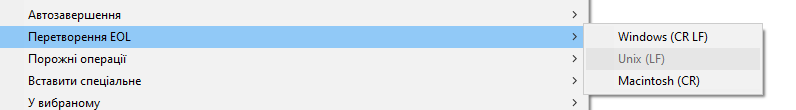
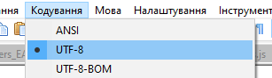
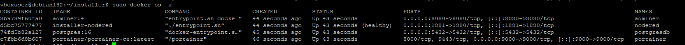
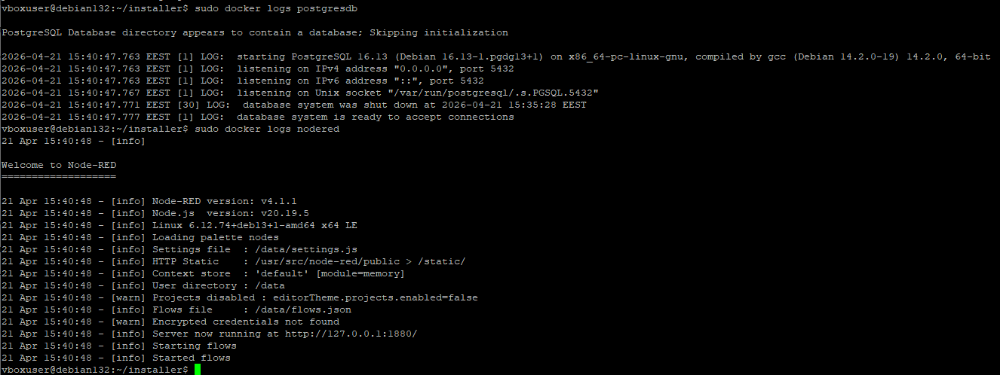
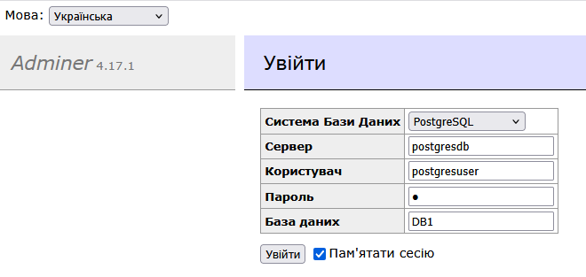

[<- До підрозділу](README.md)		[Коментувати](#feedback)

# Автоматичне розгортання системи на базі docker : практичне заняття

**Тривалість**: 2 акад. год (1 пара)

**Мета:**  Навчитися автоматично розгортати усе необхідне ПЗ на базі docker.

## Лабораторна установка для проведення лабораторної роботи у віртуальному середовищі.

Апаратне забезпечення, матеріали та інструменти для проведення віртуальної лабораторної роботи.

- ПК 

Програмне забезпечення, що використане у віртуальній лабораторній роботі.

1. docker
1. portainer

## Загальна постановка задачі

У роботі необхідно розгорнути на ОС Debian application stack (програмний стек), тобто сукупність взаємопов’язаних сервісів, які спільно забезпечують роботу прикладної системи. Розгортання виконується з використанням контейнеризації на базі Docker. Стек включає такі сервіси:

- Node-RED — середовище для побудови логіки обробки даних;
- PostgreSQL — реляційна система керування базами даних;
- Adminer — веб-інтерфейс для адміністрування бази даних;
- Portainer — веб-інтерфейс для керування Docker.

Сервіси розгортаються як окремі контейнери та взаємодіють між собою в межах єдиної мережі Docker.

Цілі роботи

- сформувати файли конфігурації для розгортання стеку;
- сформувати структуру каталогу інсталятора;
- реалізувати Dockerfile для створення кастомного образу Node-RED;
- описати стек сервісів у файлі `docker-compose.yml`;
- розробити скрипт автоматизованого розгортання `install.sh`;
- виконати розгортання стеку на віртуальній машині з ОС Debian;
- перевірити працездатність сервісів та їх взаємодію;
- ознайомитися з підключенням Node-RED до PostgreSQL

## Пререквізити

- повинна бути встановлена віртуальна машина з Debian, порядок встановлення за [посиланням](../vbox/labdebian.md)
- передбачається що користувач знайомий з техніками, які використовуються у практичній частині [Основи розгортання сервісів у Docker: практична частина](lab.md)
- на ПК розробника повинен бути встановлений node-red

## Послідовність виконання роботи

### 1. Формування завдання

- [ ] Прочитайте наведене нижче завдання і за потреби адаптуйте його під власні вимоги.

Для прикладу необхідно розгорнути стек із такими сервісами: 

- Node-RED версії 4.1.1. Вимоги до сервісу:

  - встановлені пакунки

    ```
    node-red-contrib-s7@3.1.0
    node-red-node-mysql@2.0.0
    node-red-contrib-modbus@5.42.0
    @flowfuse/node-red-dashboard@1.23.0
    node-red-contrib-postgresql
    ```

  - налаштування `settings.js`

    - доступ до редактора Node-RED: користувач `nodereduser`, пароль `1`
    - файл `echarts.min.js` має бути розміщений у каталозі статичних файлів за шляхом `/static/scripts/`
       Файл можна завантажити за [посиланням](https://github.com/apache/echarts/blob/master/dist/echarts.min.js)

  - мають бути розгорнуті потоки існуючого проєкту з використанням файлів `flows.json` та `flows_cred.json`

  - зовнішній доступ до WEB-інтерфейсу має бути доступний через порт `8081`

- PostgreSQL. Вимоги до сервісу:

  - зовнішній доступ через порт `5432`
  - користувач адміністратора `postgresuser`
  - пароль адміністратора `1`
  - база даних `DB1`

- Adminer. Вимоги до сервісу:

  -  доступ ззовні по порту `8080`


### 2. Формування папки з вихідними файлами

Для виконання завдання необхідно підготувати всі потрібні файли. Вони розміщуються в каталозі `installer`, який має знаходитися в домашній папці користувача або бути туди скопійований. Структура каталогу має такий вигляд:

```
installer/
├─ install.sh
├─ config.env
├─ docker-compose.yml
├─ Dockerfile
└─ nodered/
    ├─ flows.json
    ├─ settings.js.template
    └─ public/
        └─ scripts/
            └─ echarts.min.js
```

Прототип для наповнення папки розміщено за [цим посиланням](./labdeployinstaller)

- [ ] Створіть на комп'ютері розробника каталог `installer`
- [ ] У каталозі `installer` створіть каталог `nodered`
- [ ] У каталозі `installer/nodered` створіть підкаталоги `public/scripts`
- [ ] Скопіюйте файл `echarts.min.js` у каталог `installer/nodered/public/scripts`. Файл можна завантажити [за посиланням](https://github.com/apache/echarts/blob/master/dist/echarts.min.js)

### 3. Створення шаблону `settings.js`

У цьому пункті формується шаблон конфігураційного файлу Node-RED (`settings.js`), який буде використовуватися під час інсталяції.
 Шаблон містить параметри, що задаються динамічно (користувач, пароль, секрет для шифрування), і надалі автоматично заповнюється у скрипті `install.sh`.

- [ ] Створіть шаблон для `settings.js` , для цього

- Завантажте оригінальний файл `settings.js` за [посиланням](https://github.com/node-red/node-red/blob/4.1.1/packages/node_modules/node-red/settings.js)
- скопіюйте цей файл в папку `nodered/`
- перейменуйте файл на `settings.js.template`
- відкрийте файл з використанням редактору, наприклад Notepad++ і змініть в потрібних місцях (знімаючи коментарі) наступним чином:

```js
	credentialSecret: "__NODERED_CREDENTIAL_SECRET__",   
	adminAuth: {
		type: "credentials",
		users: [{
			username: "__NODERED_USER__",
			password: "__NODERED_PASSWORD_HASH__",
			permissions: "*"
		}]
	},         
	httpStatic: [
        {path: '/usr/src/node-red/public/', root: "/" }
    ],
    httpStaticRoot: '/static/',
```

- [ ] Збережіть файл.

#### Примітка щодо використання шаблонних маркерів

У файлі `settings.js.template` використовуються спеціальні шаблонні маркери виду:

```
__NODERED_USER__
__NODERED_PASSWORD_HASH__
__NODERED_CREDENTIAL_SECRET__
```

Ці маркери не є реальними значеннями — вони слугують плейсхолдерами (заглушками), які під час виконання інсталяційного скрипта автоматично замінюються на актуальні параметри. Заміна виконується у скрипті `install.sh` (див. нижче) за допомогою утиліти `sed`, яка підставляє значення змінних із файлу `config.env`. Такий підхід дозволяє:

- не зберігати чутливі дані (паролі, секрети) у відкритому вигляді у файлах проєкту;
- використовувати один і той самий шаблон для різних інсталяцій;
- централізовано керувати конфігурацією через `config.env`;
- автоматизувати процес розгортання без ручного редагування файлів.

Використання подвійного підкреслення (`__...__`) обрано як простий і наочний спосіб позначення змінних, які підлягають заміні.

### 4. Формування `config.env`

У цьому пункті формується файл конфігурації `config.env`, який містить усі основні параметри майбутньої системи. Цей файл використовується інсталяційним скриптом та Docker Compose для підстановки змінних середовища під час розгортання сервісів. У файлі задаються:

- шляхи для зберігання даних;
- параметри мережі (порти);
- облікові дані сервісів;
- додаткові налаштування (часовий пояс, секрети тощо).

Використання окремого конфігураційного файлу дозволяє:

- централізовано керувати параметрами системи;
- легко змінювати конфігурацію без редагування скриптів;
- використовувати один і той самий інсталятор для різних середовищ.

- [ ] У каталозі `installer` створіть файл `config.env`. Зверніть увагу що **назва і регістр мають значення**!
- [ ] Використовуючи редактор, наприклад Notepad++, внесіть наступні дані у файл. 

```bash
DATA_DIR=/opt/docker

TZ=Europe/Kyiv

NODERED_PORT=1881
ADMINER_PORT=8080
POSTGRES_PORT=5432

NODERED_USER=nodereduser
NODERED_PASSWORD=1
NODERED_CREDENTIAL_SECRET=MyCred_secret1=MyCred_secret1

POSTGRES_USER=postgresuser
POSTGRES_PASSWORD=1
POSTGRES_DB=DB1
```

- [ ] Змініть налаштування, щоб кінець рядку був як в Unix (`LF`) а кодування UTF-8.

  

  

- [ ] Збережіть файл.

### 5. Формування налаштувань для Docker

У цьому пункті створюються основні файли для розгортання application stack за допомогою Docker. Файл `Dockerfile` використовується для створення власного (кастомного) образу Node-RED із попередньо встановленими додатковими пакетами та статичними файлами. Файл `docker-compose.yml` використовується для опису всього стеку сервісів, їх параметрів, мережевої взаємодії, змінних середовища та підключення зовнішніх каталогів для збереження даних. У результаті виконання цього пункту буде сформовано конфігурацію, яка дозволяє:

- автоматично зібрати образ Node-RED;
- розгорнути всі сервіси однією командою;
- забезпечити взаємодію контейнерів у межах спільної мережі;
- організувати збереження даних поза контейнерами;
- використовувати змінні з файлу `config.env` для налаштування системи.

- [ ] Створіть файл з назвою `Dockerfile`. Зверніть увагу що **назва і регістр мають значення**!
- [ ] Використовуючи редактор, наприклад Notepad++, внесіть наступні дані у файл. 

```dockerfile
FROM nodered/node-red:4.1.1

RUN npm install --unsafe-perm \
    node-red-contrib-s7@3.1.0 \
    node-red-node-mysql@2.0.0 \
    node-red-contrib-modbus@5.42.0 \
    @flowfuse/node-red-dashboard@1.23.0 \
    node-red-contrib-postgresql

COPY nodered/public /usr/src/node-red/public
```

- [ ] Змініть налаштування, щоб кінець рядку був як в Unix (`LF`) а кодування UTF-8 і збережіть файл.
- [ ] Створіть файл з назвою `docker-compose.yml`. Зверніть увагу що **назва і регістр мають значення**!
- [ ] Використовуючи редактор, наприклад Notepad++, внесіть наступні дані у файл. 

```yaml
services:

  postgresdb:
    container_name: postgresdb
    image: postgres:16
    restart: unless-stopped
    shm_size: 256mb
    environment:
      POSTGRES_USER: ${POSTGRES_USER}
      POSTGRES_PASSWORD: ${POSTGRES_PASSWORD}
      POSTGRES_DB: ${POSTGRES_DB}
      TZ: ${TZ}
    volumes:
      - ${DATA_DIR}/postgres-data:/var/lib/postgresql/data
    ports:
      - "${POSTGRES_PORT}:5432"
    networks:
      - netintern

  adminer:
    container_name: adminer
    image: adminer:4
    restart: unless-stopped
    depends_on:
      - postgresdb
    ports:
      - "${ADMINER_PORT}:8080"
    networks:
      - netintern

  nodered:
    container_name: nodered
    build: .
    restart: unless-stopped
    environment:
      TZ: ${TZ}
    ports:
      - "${NODERED_PORT}:1880"
    volumes:
      - ${DATA_DIR}/nodered-data:/data
    depends_on:
      - postgresdb
    networks:
      - netintern
    logging:
      driver: json-file
      options:
        max-size: "10m"
        max-file: "3"

  portainer:
    container_name: portainer
    image: portainer/portainer-ce:latest
    restart: unless-stopped
    ports:
      - "9000:9000"
    volumes:
      - /var/run/docker.sock:/var/run/docker.sock
      - ${DATA_DIR}/portainer-data:/data
      
networks:
  netintern:
    driver: bridge
```

- [ ] Змініть налаштування, щоб кінець рядку був як в Unix (`LF`) а кодування UTF-8 і збережіть файл.

### 6. Створення скрипта для розгортання `install.sh` 

У цьому пункті створюється інсталяційний скрипт `install.sh`, який автоматизує процес розгортання application stack. Скрипт виконує повний цикл підготовки системи та запуску сервісів, зокрема:

- встановлює необхідні пакети та Docker;
- перевіряє та запускає Docker daemon;
- підключає конфігураційний файл `config.env`;
- створює каталоги для зберігання даних;
- встановлює коректні права доступу;
- генерує конфігураційний файл `settings.js` для Node-RED;
- копіює початкові файли потоків;
- виконує збірку образів та запуск контейнерів через Docker Compose.

У результаті виконання скрипта система розгортається автоматично без необхідності ручного налаштування окремих компонентів.

- [ ] У каталозі `installer` створіть файл `install.sh`. Зверніть увагу що **назва і регістр мають значення**!
- [ ] Використовуючи редактор, наприклад Notepad++, внесіть наступні дані у файл. 

```bash
#!/bin/bash

# При будь-якій помилці скрипт одразу завершується
# Це важливо для installer-скриптів, щоб не отримати
# напівналаштовану систему
set -e

# Визначаємо каталог, у якому знаходиться сам скрипт.
# BASH_SOURCE[0] — шлях до поточного скрипта.
# dirname — отримує директорію скрипта.
# cd ... && pwd — переходимо в цю директорію та отримуємо її абсолютний шлях.
# Це потрібно, щоб скрипт коректно знаходив файли (config.env, docker-compose.yml тощо),
# незалежно від того, з якої директорії він був запущений.
SCRIPT_DIR=$(cd "$(dirname "${BASH_SOURCE[0]}")" && pwd)
# Переходимо у директорію скрипта
cd "$SCRIPT_DIR"

# Перший аргумент скрипта — файл конфігурації
# Якщо аргумент не передано, використовується config.env
CONFIG=${1:-config.env}

# Підключаємо змінні з конфігураційного файлу
echo "Loading configuration"
source "$CONFIG"

echo "Updating system"
sudo apt update

# Встановлюємо необхідні базові утиліти.
# curl використовується далі у скрипті для завантаження офіційного
# інсталяційного скрипта Docker з сайту get.docker.com.
# Параметр -y автоматично підтверджує встановлення пакетів.
echo "Installing required packages"
sudo apt install -y curl

# Перевірка чи встановлений docker
# command -v docker повертає шлях до програми
# якщо docker не знайдений — встановлюємо його
echo "Installing Docker if needed"
if ! command -v docker &> /dev/null
then
	# Офіційний інсталяційний скрипт docker
    curl -fsSL https://get.docker.com | sh
fi

# Вмикаємо службу Docker у systemd.
# enable додає сервіс до автозапуску, тому Docker буде стартувати
# автоматично після кожного перезавантаження системи.
sudo systemctl enable docker

# Запускаємо службу Docker одразу, без перезавантаження системи.
# Після цього Docker daemon почне приймати команди docker CLI.
sudo systemctl start docker

# Після запуску служби Docker демон може ще деякий час ініціалізуватися.
# У цьому циклі скрипт перевіряє готовність Docker daemon.
# Команда `docker info` повертає інформацію про стан Docker; якщо демон
# ще не готовий, команда завершується з помилкою.
# Вивід stdout і stderr перенаправляється в /dev/null, щоб не засмічувати консоль.
# Цикл повторюється кожну секунду, доки Docker не почне відповідати.
echo "Waiting for Docker daemon"
until sudo docker info >/dev/null 2>&1
do
    sleep 1
done

# Перевіряємо, чи встановлений Docker Compose v2 як плагін Docker.
# Команда `docker compose version` повертає код помилки, якщо плагін відсутній.
# Якщо команда не виконується (оператор !), встановлюємо пакет docker-compose-plugin.
# Вивід команди перевірки перенаправляється в /dev/null, щоб не показувати його у консолі.
echo "Installing docker compose plugin if needed"
if ! sudo docker compose version &> /dev/null
then
    sudo apt install -y docker-compose-plugin
fi

# Додаємо поточного користувача до групи docker
echo "Adding user to docker group"
sudo usermod -aG docker "$USER" || true

# Створення каталогу для даних системи
echo "Creating data directories"
sudo mkdir -p "$DATA_DIR/nodered-data"
sudo mkdir -p "$DATA_DIR/postgres-data"
sudo mkdir -p "$DATA_DIR/portainer-data"

# Postgres працює від користувача postgres
sudo chown -R 999:999 $DATA_DIR/postgres-data
# Node-RED працює від користувача node-red (uid 1000)
sudo chown -R 1000:1000 $DATA_DIR/nodered-data
# Portainer працює від root
sudo chown -R 0:0 $DATA_DIR/portainer-data

echo "Generating Node-RED password hash"
HASH=$(sudo docker run --rm --entrypoint node nodered/node-red:4.1.1 \
-e "console.log(require('bcryptjs').hashSync(process.argv[1],8))" \
"$NODERED_PASSWORD")

# Генеруємо bcrypt-хеш пароля для автентифікації Node-RED.
# Node-RED не зберігає паролі у відкритому вигляді, тому для settings.js
# потрібен саме bcrypt-хеш.
# Для генерації хешу запускається тимчасовий контейнер на базі образу
# nodered/node-red:4.1.1. Параметр --entrypoint node змушує контейнер
# виконати Node.js замість стандартного entrypoint Node-RED.
# Усередині контейнера виконується короткий JavaScript-код, який
# використовує бібліотеку bcryptjs (вона вже є в образі Node-RED)
# і обчислює hashSync для переданого пароля.
# Параметр --rm видаляє контейнер після завершення.
# Результат (згенерований хеш) записується у змінну HASH.
echo "Preparing settings.js"
sed \
-e "s|__NODERED_USER__|$NODERED_USER|g" \
-e "s|__NODERED_PASSWORD_HASH__|$HASH|g" \
-e "s|__NODERED_CREDENTIAL_SECRET__|$NODERED_CREDENTIAL_SECRET|g" \
nodered/settings.js.template \
> "$DATA_DIR/nodered-data/settings.js"

# Копіюємо початкові файли потоків Node-RED у каталог даних.
# flows.json містить самі потоки (flows), тобто логіку Node-RED.
# flows_cred.json містить зашифровані облікові дані, які використовуються у потоках
# (паролі до БД, токени API тощо).
# Файли копіюються у каталог, який змонтований у контейнер як /data.
# Якщо файлів немає (наприклад, flows_cred.json ще не створений),
# команда cp завершиться з помилкою, але оператор "|| true"
# не дозволить скрипту перерватися (у скрипті використовується set -e)
echo "Copying Node-RED flows"
cp nodered/flows.json "$DATA_DIR/nodered-data/" || true
cp nodered/flows_cred.json "$DATA_DIR/nodered-data/" || true

# Запускаємо контейнери, описані у файлі docker-compose.yml.
# Параметр --env-file передає у docker compose змінні середовища
# з конфігураційного файлу (наприклад, config.env), які використовуються
# у docker-compose.yml через синтаксис ${VARIABLE}.
# Ключ -d запускає контейнери у фоновому режимі (detached mode).
# Ключ --build змушує docker compose попередньо зібрати образи,
# для яких у compose-файлі задано build (наприклад, кастомний образ Node-RED).
# Це гарантує, що контейнер буде запущено з актуальної версії образу.
echo "Starting containers"
sudo docker compose --env-file "$CONFIG" up -d --build

echo "Installation completed"
echo "Waiting for containers to start..."
sleep 5

sudo docker ps
echo "Node-RED:  http://$(hostname -I | awk '{print $1}'):1881"
echo "Adminer:   http://$(hostname -I | awk '{print $1}'):8080"
echo "Portainer: http://$(hostname -I | awk '{print $1}'):9000"
```

- [ ] Змініть налаштування, щоб кінець рядку був як в Unix (`LF`) а кодування UTF-8 і збережіть файл.

### 7. Розгортання на віртуальній машині

У цьому пункті виконується розгортання підготовленого application stack на віртуальній машині з ОС Debian. Процес включає:

- передачу каталогу `installer` на цільову систему;
- підключення до віртуальної машини;
- підготовку скрипта до виконання;
- запуск інсталяційного скрипта.

У результаті виконання пункту всі сервіси будуть автоматично встановлені, налаштовані та запущені за допомогою Docker Compose.

- [ ] Запустіть віртуальну машину з ОС Debian
- [ ] Скопіюйте папку `installer` у домашню директорію користувача гостьової ОС (наприклад `/home/user/installer`). Для цього можна використати WinSCP або команду `scp` через SSH
- [ ] Підключіться до віртуальної машини по SSH
- [ ] Перейдіть у папку `installer`

```bash
cd installer
```

- [ ] Надайте скрипту право на виконання

```bash
chmod +x install.sh
```

-  Запустіть інсталяційний скрипт

```bash
./install.sh
```

Після завершення скрипта сервіси будуть автоматично запущені за допомогою `docker compose`.

### 8. Аналіз стану контейнерів

У цьому пункті виконується перевірка результатів розгортання application stack. Мета — переконатися, що всі контейнери успішно запущені, працюють без помилок та коректно налаштовані. Для цього здійснюється:

- перевірка статусу контейнерів;
- аналіз журналів роботи сервісів;
- контроль змінних середовища;
- перевірка доступності веб-інтерфейсів;
- ознайомлення з керуванням контейнерами через Portainer.

У результаті виконання пункту має бути підтверджено коректну роботу всієї системи.

- [ ] Подивіться на стай контейнерів

```
sudo docker ps -a
```

Контейнери мають працювати (`Staus = Up`).



- [ ] Перевірте журнали на помилки

```
sudo docker logs postgresdb
sudo docker logs nodered
```



Якщо там немає помилок — інсталяція пройшла коректно.

- [ ] Перевірте значення змінних середовища

```
sudo docker inspect postgresdb | grep POSTGRES
```

там повинні бути змінні: POSTGRES_USER, POSTGRES_PASSWORD, POSTGRES_DB

- [ ] Перезапустіть контейнер для portainer

```
sudo docker restart portainer
```

- [ ] Перевірте доступ до Portainer. Він має буде доступний у браузері гостьової ОС за адресою:

```bash
http://{guest_ip}:9000
```

- [ ] Змініть пароль, наприклад `Portainer_11`

- [ ] Подивіться на стан контейнерів в Portainer

### 9. Перевірка роботи програм

У цьому пункті виконується перевірка працездатності розгорнутих сервісів та їх доступності через веб-інтерфейси. Мета — переконатися, що:

- Node-RED доступний та коректно працює;
- необхідні пакети Node-RED встановлені;
- Adminer доступний через браузер;
- встановлено з’єднання з базою даних PostgreSQL.

У результаті виконання пункту має бути підтверджено, що всі компоненти application stack функціонують та взаємодіють між собою належним чином.

- [ ] Перевірте доступ до Node-RED

```
http://{guest_ip}:1881
```

- [ ] Подивіться чи проінстальовані всі необхідні пакети

- [ ] Відкрийте dashboard і переконайтеся що тренди працюють

- [ ] Перевірте доступ до adminer 

```
http://{guest_ip}:8080
```

- [ ] Перевірте доступ до бази даних




## Джерела

1. 


## Автори


Практичне заняття розробив  [Олександр Пупена](https://github.com/pupenasan). 

## Feedback

Якщо Ви хочете залишити коментар у Вас є наступні варіанти:

- [Обговорення у WhatsApp](https://chat.whatsapp.com/BRbPAQrE1s7BwCLtNtMoqN)
- [Обговорення в Телеграм](https://t.me/+GA2smCKs5QU1MWMy)
- [Група у Фейсбуці](https://www.facebook.com/groups/asu.in.ua)

Про проект і можливість допомогти проекту написано [тут](https://asu-in-ua.github.io/atpv/)