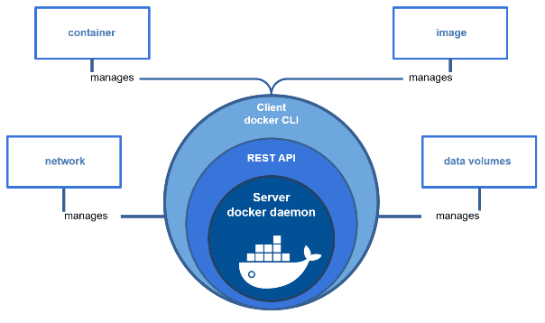
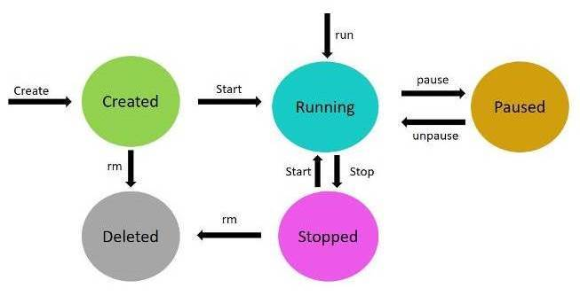
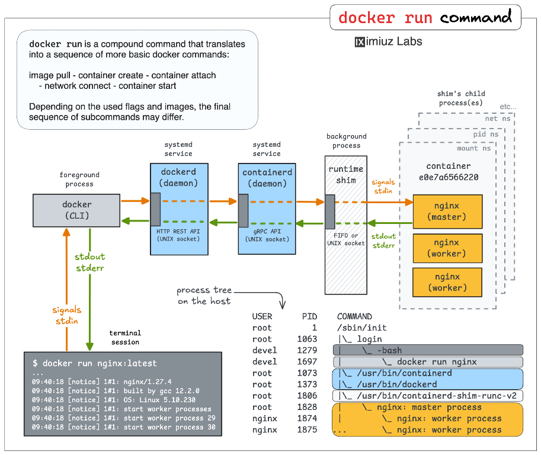
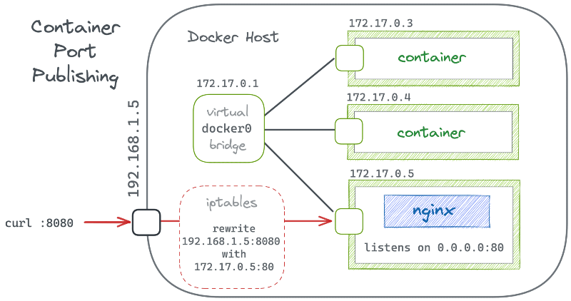

[<- До підрозділу](README.md)		[Коментувати](#feedback)

# Контейнери Docker: теоретична частина

## 1. Вступ

В останні роки програмні системи все рідше складаються з одного застосунку, який запускається на одному комп’ютері. Навіть відносно прості рішення включають базу даних, сервер прикладної логіки, вебінтерфейс, фонові сервіси, інструменти моніторингу. Класичний підхід до встановлення такого програмного забезпечення безпосередньо в операційну систему швидко приводить до проблем із залежностями, версіями бібліотек, конфліктами між різними проєктами та складністю відтворення однакового середовища на різних машинах.

Контейнери є одним із способів вирішити цю проблему. Ідея полягає в тому, що кожен сервіс постачається разом зі своїм оточенням: потрібними бібліотеками, утилітами та налаштуваннями. Це дозволяє запускати той самий застосунок однаково на ноутбуці розробника, на сервері, в хмарі та на edge-вузлі, не змінюючи сам застосунок і не «підлаштовуючи» операційну систему під кожен проєкт.

Контейнери не є одним із типів віртуальних машин і не запускають власне ядро операційної системи. Вони працюють поверх існуючого ядра, використовуючи механізми ізоляції процесів, файлових систем і мереж в контейнері. Завдяки цьому контейнери стартують швидко, споживають менше ресурсів і добре підходять для сценаріїв, де важлива масштабованість і відтворюваність середовища. У цьому відношенні вони мають перевагу над віртуальними машинами.

Контейнери вже давно використовуються у світі IT, але сьогодні вони також заходять і в світ промислової автоматизації. Поруч з класичними системами керування з PLC, DCS та SCADA/HMI з’являються edge-шлюзи, сервіси збору та агрегації даних, брокери повідомлень, бази даних часових рядів, вебінтерфейси для аналітики та інтеграції з верхніми рівнями. У такій архітектурі критично важливо мати відтворюване і контрольоване програмне середовище, яке можна однаково розгорнути на промисловому ПК, сервері підприємства або віддаленому edge-вузлі.

Контейнери дозволяють відокремити прикладні сервіси промислового інтернету речей IIoT від операційної системи обладнання. Це особливо важливо в промислових умовах, де ОС часто стандартизована, оновлюється рідко і не повинна змінюватися під кожен новий проєкт. Контейнерний підхід дає змогу розгортати нові сервіси збору даних, протокольні шлюзи або аналітичні модулі без втручання в базову конфігурацію системи та без ризику порушення роботи інших компонентів. Для IIoT характерна модульність: окремо працює сервіс збору даних з контролерів, окремо брокер повідомлень, окремо база даних і візуалізація. Контейнери природно підтримують таку декомпозицію. Кожен сервіс має чітко визначені межі відповідальності, власні залежності та життєвий цикл. Це спрощує тестування, оновлення та заміну окремих компонентів без зупинки всієї системи, що є принципово важливим для промислової експлуатації.

У цьому контексті використання контейнерів є не модною тенденцією, а інженерною необхідністю. Вони стають зв’язуючою ланкою між традиційними системами керування і сучасними IIoT-рішеннями, забезпечуючи керованість, масштабованість і передбачуваність програмних компонентів у промислових системах.

У цій лекції контейнери розглядатимуться на прикладі Docker як найбільш поширеного інструмента контейнеризації. У лекції не розглядаються команди, натомість подається уявлення про те, що таке контейнер, чим він відрізняється від образу та віртуальної машини, і як ці поняття використовуються при побудові сучасних програмних і промислових систем.

Для кращого розуміння контейнерів після прочитання цієї лекції варто виконати [Основи розгортання сервісів у Docker: практична частина](lab.md)

## 2. Базові поняття

Контейнер у базовому розумінні це ізольований прикладний процес на комп'ютері, який працює в межах однієї операційної системи, але має обмежене і контрольованим уявлення про навколишнє середовище. Він «бачить» лише власну файлову систему, власний набір процесів і власні мережеві інтерфейси, хоча фізично використовує ті самі ресурси хоста. 

Ізоляція контейнера досягається механізмами операційної системи, а не емуляцією апаратури як у віртуальних машинах. Для цього використовуються вбудовані в ОС можливості, а саме простори імен (namespaces) і обмеження ресурсів, які дозволяють відокремити процеси одного контейнера від інших. Завдяки цьому контейнер не має прямого доступу до інших процесів, файлів або мережі поза своїми межами, якщо це явно не дозволено конфігурацією. 

рис.1. Віртуальні машини та контейнери ([Джерело](https://systemadminspro.com/overview-of-container-sandbox-technologies/))

Для розуміння контейнерів важливо чітко розрізняти три рівні: програма (application), процес (process) і контейнер (container). 

- **Програма (application)** - це набір файлів і інструкцій на диску.
- **Процес (process)** це виконання програми в пам’яті з певним станом. 
- **Контейнер (container)** це процес, запущений в ізольованому середовищі з чітко визначеними межами доступу до ресурсів. Саме це поєднання ізоляції та спільного ядра ОС (shared OS kernel) є ключовою відмінністю контейнерного підходу.

З інженерної точки зору контейнер зручно сприймати як стандартну «обгортку» для запуску сервісу. Всередині контейнера завжди відомо, які бібліотеки, утиліти та конфігурації доступні, незале'жно від того, де він запущений. Це дозволяє описувати систему не через ручні інструкції з налаштування середовища, а через формалізований опис того, що і в якому вигляді має працювати. Саме з цього базового поняття далі випливають образи, життєвий цикл контейнерів, робота з даними та мережами.

## 3. Контейнер всередині

Контейнери не є окремою технологією самі по собі. Вони побудовані на поєднанні кількох можливостей операційної системи Linux, які розвивалися задовго до появи Docker. Основна ідея полягає в тому, щоб обмежити, що саме процес може бачити і скільки ресурсів він може використовувати.  

У Linux процес і потік не є принципово різними сутностями. І те, і інше є **задачами (task)** ядра, які можуть за необхідності ділити ресурси між собою. **Процес** - це задача з власним адресним простором, а потоки це задачі в межах спільного адресного простору. Саме ця модель дозволяє реалізувати контейнерну ізоляцію на рівні ядра без введення нових типів об’єктів.

Одним з базових механізмів для роботи контейнерів є **простір імен (namespace)**, який означує межі видимості для процесів. Наприклад, процеси в одному просторі імен бачать лише своє дерево процесів і не бачать процеси з інших просторів. Аналогічно працюють простори імен для мережі, монтування файлових систем, імен хоста та користувачів. Завдяки цьому процес усередині контейнера має власне уявлення про систему, хоча фізично вона спільна з хостом.

На рис.2 показана ключова ідея просторів імен в контексті мережі: контейнер не має власної мережі як окремої сутності, він має власне уявлення про мережу. Зліва показано root network namespace хоста. Це реальна мережна площина Linux-машини. Тут знаходяться фізичні або віртуальні інтерфейси хоста (наприклад, eth0), таблиці маршрутизації і правила фільтрації трафіку. Саме цей простір імен взаємодіє з реальною мережею і зовнішнім світом. Справа показано `container network namespace`. Усередині контейнера існує власний мережевий простір імен з власним інтерфейсом, маршрутами і правилами фільтрації. Для контейнера це виглядає як повноцінна, ізольована мережева система. Він бачить тільки «свій» інтерфейс, свої маршрути і свої правила, не знаючи нічого про мережу хоста. Маршрути і правила iptables існують окремо в кожному network namespace. Те, що налаштовано в контейнері, не впливає на хост, і навпаки. Це пояснює, чому команди роботи з мережею всередині контейнера не змінюють мережеву конфігурацію системи загалом. Зв’язок між цими двома просторами імен реалізується через віртуальну пару інтерфейсів. Один кінець знаходиться в контейнерному network namespace, інший у root namespace хоста. Для контейнера це виглядає як звичайна мережева карта, а для хоста як ще один віртуальний інтерфейс, підключений до bridge або іншого мережевого механізму Docker.

рис. 2. Простори імен для мереж [Джерело](https://iximiuz.com/en/series/mastering-container-networking/)

Другий фундаментальний механізм це **обмеження і облік ресурсів** (control groups, **cgroups)**. Якщо простори імен відповідають на питання «що процес бачить», то cgroups відповідають на питання «скільки ресурсів він може використати». За допомогою cgroups обмежуються процесорний час, обсяг пам’яті, дискові операції та інші ресурси. Це особливо важливо в промислових і серверних середовищах, де один сервіс не повинен впливати на стабільність усієї системи.

Окрему роль відіграє ізоляція файлової системи. Контейнер працює з власним коренем файлової системи, який зазвичай побудований як набір шарів. Базовий шар є спільним для багатьох контейнерів, а верхній шар використовується для змін конкретного контейнера. Це дозволяє ефективно зберігати образи і швидко створювати нові екземпляри без копіювання всієї файлової системи.

У підсумку контейнер це не окрема сутність у ядрі, а узгоджене використання просторів імен, обмежень ресурсів і файлової ізоляції. Саме поєднання цих механізмів дозволяє запускати ізольовані середовища з мінімальними накладними витратами і зрозумілою, передбачуваною поведінкою, що є критично важливим як для серверних, так і для промислових застосувань.

Під час запуску контейнера менеджер (наприклад Docker) запускає перший процес контейнера, який стає процесом з ідентифікатором процесу `PID 1` усередині контейнера. Це може бути вебсервер, інтерпретатор, сервіс або спеціальний init-процес. З точки зору хостової ОС це звичайний процес з власним PID, але поміщений у окремі простори імен. Всередині контейнера цей процес `PID 1` може створювати дочірні процеси так само, як і будь-який інший процес у Linux. Наприклад, вебсервер може породжувати worker-процеси, shell може запускати утиліти, а менеджер сервісів може стартувати кілька компонентів. Усі ці процеси «живуть» в одному контейнері і бачать один одного, але не бачать процеси за його межами. Ізоляція процесів досягається не забороною створювати нові процеси, а обмеженням області видимості. Контейнер має власний процесний простір імен, тому процеси всередині контейнера бачать тільки своє процесне дерево, яке починається з `PID 1`. Процеси хоста і інших контейнерів для них не існують, хоча фізично працюють на тій самій машині.

З боку хоста картина виглядає інакше. Хостова ОС бачить усі процеси всіх контейнерів як звичайні процеси, просто з іншими ідентифікаторами та просторами імен. Тобто немає «процесу всередині процесу» у технічному сенсі. Є набір процесів, ізольованих між собою за допомогою механізмів ядра.

Отже, модель роботи така: контейнер це логічна оболонка, яка об’єднує один або кілька процесів, ізолює їх від інших і накладає обмеження на ресурси. Саме тому практичне правило «один сервіс один контейнер» є рекомендацією, а не технічною вимогою. Контейнер може містити кілька процесів, але інженерно зазвичай тримають один головний сервіс для простоти керування та прогнозованої поведінки.

Пам’ять всередині контейнера - це звичайний адресний простір процесів, потоки можуть ділити цю пам’ять, але між контейнерами пам’ять не ділиться. 

Всередині контейнера є власний корінь `/` і виглядає як повноцінна файловa система. Насправді це OverlayFS  - механізм файлової системи Linux, який дозволяє об’єднати кілька каталогів у єдине дерево. Нижні шари є доступними лише для читання, а всі зміни записуються у верхній шар. Саме завдяки OverlayFS контейнер бачить повноцінну файлову систему, тоді як реально зберігаються лише відмінності від базового образу, нижні шари це read-only образи, верхній шар це зміни контейнера. Контейнер «вірить», що пише у свою файлову систему, але реально пише лише у верхній шар.

Мережа всередині контейнера це власний net namespace, власний loopback і власні IP-адреси. Реально до контейнера підключений veth-інтерфейс, друга сторона veth у bridge хоста, NAT або routing робить доступ назовні. Для контейнера це виглядає як «окрема мережева карта».

Ім’я хоста та системна ідентичність забезпечується через UTS namespace: контейнер має власне hostname, uname повертає інше ім’я. Але ядро те саме, версія ядра хоста.

Користувачі реалізовані через user namespace (якщо увімкнено): root у контейнері ≠ root на хості; UID мапиться на непривілейованого користувача. Це критично для безпеки.

## 4. Про Docker

**Docker** це інструмент контейнеризації, який дозволяє створювати, поширювати та запускати ізольовані середовища виконання на основі можливостей ядра Linux. На практиці Docker складається з кількох чітко розділених ролей.

- **Docker Engine** це фоновий сервіс, який безпосередньо взаємодіє з ядром операційної системи. Саме він створює простори імен, cgroups, налаштовує файлові системи, мережі та запускає процеси контейнерів. Уся «реальна робота» з контейнерами виконується саме тут.

- **Docker CLI** це клієнтський інструмент командного рядка. Він не створює контейнери сам по собі, а лише надсилає команди Docker Engine. З цієї причини CLI можна вважати інтерфейсом керування, а не ядром Docker.

- **Docker images** це шаблони для створення контейнерів. Образ містить файлову систему застосунку, бібліотеки та метадані, але не містить запущених процесів. Образ є статичним і доступним лише для читання.

- **Docker containers** це запущені екземпляри образів. Контейнер поєднує образ з ізольованим середовищем виконання, власними просторами імен, обмеженнями ресурсів і конкретним життєвим циклом.

Важливо розуміти, що Docker це не просто команда docker у терміналі. Це ціла екосистема, яка включає інструменти збірки образів, реєстри для їх зберігання, механізми оркестрації та керування контейнерами. У подальших розділах ми будемо працювати з окремими складовими цієї екосистеми, розуміючи, яку саме роль кожна з них виконує.

рис.3. Про Docker ([Джерело](https://becominghuman.ai/docker-containers-what-are-they-how-to-create-and-use-them-5f03c7260555))

## 5. Образи та контейнери

Образ (image) і контейнер (container) це різні сутності, хоча в практиці їх часто плутають. 

**Образ (image)** це статичний шаблон, який описує файлову систему та метадані застосунку. Він не виконується і не містить стану роботи. Образ доступний лише для читання і може використовуватися багаторазово для створення будь-якої кількості контейнерів.

**Контейнер (container)** це екземпляр зроблений з образу. Він поєднує образ з ізольованим середовищем виконання, власними просторами імен, обмеженнями ресурсів та життєвим циклом. Саме в контейнері з’являються процеси, відкриті файли, мережеві з’єднання і змінний стан.

Принципова різниця між образом та контейнером полягає у статичності та динаміці. Образ є незмінним шаблоном, який описує «що має бути запущено». Контейнер є конкретною реалізацією цього опису у виконанні. З одного і того самого образу можна одночасно запустити багато контейнерів, і кожен з них матиме власний стан, не впливаючи на інші. Відношення до цих понять як до синонімів може призвести до помилок, наприклад, очікування, що зміни всередині контейнера автоматично змінюють образ, або що видалення контейнера означає видалення образу. Тому чітке розуміння різниці між image і container є базовим для правильної роботи з Docker і контейнерною архітектурою.

У реальності, коли щось змінюється у файловій системі контейнера, ці зміни не записуються в образ. У Docker образ не є єдиною суцільною файловою системою. Він складається з набору шарів, кожен з яких містить лише відмінності від попереднього шару. Ці шари є доступними лише для читання і можуть спільно використовуватися різними образами та контейнерами. Коли запускається контейнер, Docker додає поверх шарів образу ще один, верхній шар, доступний для запису. Саме в нього потрапляють усі зміни файлової системи під час роботи контейнера: створені файли, змінені конфігурації, журнали, тимчасові дані. Базові шари образу при цьому залишаються незмінними. 

Шарова модель реалізується за допомогою механізму OverlayFS. Для контейнера всі шари виглядають як одна цілісна файлова система з коренем `/`. Насправді ж ядро поєднує кілька каталогів у єдине дерево, а запис завжди відбувається лише у верхній шар контейнера. Важливо розуміти, що цей верхній шар є службовим механізмом Docker. Він автоматично створюється при запуску контейнера, зберігається під час його зупинки і видаляється разом з контейнером. Для довготривалого зберігання даних цей шар не призначений, і саме з цієї причини для баз даних та станів застосунків використовують окремі механізми збереження даних - томи (див. ничже). 

## 6. Життєвий цикл контейнера 

Життєвий цикл контейнера описує послідовність станів, через які він проходить від моменту появи до повного видалення. Важливо розуміти цей цикл концептуально, не прив’язуючись до конкретних команд, оскільки ті самі дії можуть виконуватися як через командний рядок, так і через графічні інтерфейси керування.

- Спочатку образ завантажується з реєстру. На цьому етапі у систему потрапляє лише статичний шаблон файлової системи та метадані. Жодних процесів ще не існує, і жодні ресурси не використовуються.

- Далі з образу створюється контейнер (див. рис.4. Create). У цей момент Docker готує ізольоване середовище: створює простори імен, налаштовує обмеження ресурсів і додає верхній шар файлової системи. Контейнер уже існує як об’єкт, але ще не виконується.

- Після запуску контейнера (див. рис.5. Start) стартує головний процес. З цього моменту контейнер переходить у робочий стан, використовує процесор, пам’ять, мережу і працює так само, як звичайний сервіс у системі.

- Зупинка контейнера (див. рис.5. Start) означає завершення його процесів. Контейнер перестає виконуватися, але його стан і файловий шар зберігаються. Це дозволяє пізніше знову запустити контейнер і продовжити роботу з тим самим середовищем.

- Перезапуск контейнера (див. Restart) є комбінацією зупинки та повторного запуску. Контейнер отримує новий запуск процесів, але використовує той самий образ і той самий верхній файловий шар.

- Видалення контейнера (див. рис.5. Rm ) є завершальним етапом життєвого циклу. Після цього контейнер і його верхній файловий шар зникають, а пов’язані з ним ресурси звільняються. Образ при цьому залишається у системі і може використовуватися для створення нових контейнерів.
- Окрім зупинки контейнера, Docker підтримує паузу (див. рис.5.  pause), під час якої процеси контейнера заморожуються на рівні ядра без завершення виконання і без втрати стану.

рис.4. Автомат станів контейнеру.

На рис.5 показана як працює команда запуску контейнеру  `docker run` . Ця команда не є однією атомарною операцією, натомість складається з кількох кроків: отримання образу, створення контейнера, підключення до мережі, запуск процесів і, за потреби, приєднання до стандартних потоків введення та виведення.

- Зліва показано клієнтський бік. Docker CLI це звичайний користувацький процес, який працює у термінальній сесії. Він не запускає контейнери самостійно, а лише надсилає запити до daemon Dockerd  через API. Весь ввід, вивід і сигнали з термінала проходять через CLI.

- Далі йде Docker daemon. Це системний сервіс, який приймає команди від клієнта і керує життєвим циклом контейнерів. Саме він вирішує, чи потрібно завантажити образ, створити контейнер, підготувати мережі, файлові системи і обмеження ресурсів.

- Наступний рівень це container runtime. Docker не запускає контейнери безпосередньо. Він делегує це спеціалізованому компоненту, який відповідає за створення процесів у відповідних просторах імен, з потрібними cgroups і файловими шарами. На схемі це показано як окремий фоновий процес.

- Особливу роль відіграє `shim`. Це проміжний процес між контейнером і системою. Він потрібен для того, щоб контейнер міг продовжувати працювати незалежно від того, чи підключений до нього клієнт. Саме через `shim` організовано передавання сигналів, stdin, stdout і stderr.

Праворуч показано, що відбувається вже всередині контейнера. Контейнер має власні простори імен: PID, network, mount та інші. Усередині цього ізольованого середовища запускається головний процес (у прикладі `nginx`), який може створювати дочірні процеси. Для контейнера це виглядає як звичайна ієрархія процесів, хоча з боку хоста всі вони є звичайними процесами Linux.

Нижня частина схеми з деревом процесів особливо важлива для розуміння. Вона показує, що:

- контейнерні процеси реально існують у системі хоста;
- вони підпорядковуються звичайному планувальнику Linux;
- їх ізоляція досягається не окремою ОС, а просторами імен і cgroups.

рис.5. Як працює Docker Run  ([Джерело](https://labs.iximiuz.com/tutorials/docker-run-vs-attach-vs-exec))

## 7. Томи (Volume)

Контейнер за своєю природою є тимчасовим. Якщо контейнер видалити, разом з ним зникає його верхній файловий шар, у якому зберігався весь змінний стан. Це означає, що без додаткових механізмів усі дані застосунку будуть втрачені, навіть якщо сам образ залишився у системі.

Для розв’язання цієї проблеми в Docker використовуються томи (volumes) та прив’язані каталоги хоста (bind mounts) . Обидва механізми дозволяють винести дані за межі контейнера і зробити їх незалежними від його життєвого циклу.

**Том (volume)** це керований Docker об’єкт для збереження даних. Фізично дані зберігаються на хості, але Docker повністю керує їх створенням, підключенням і використанням. Том не прив’язаний до конкретного контейнера і зберігається доти, доки його явно не видалять. Саме цей механізм є рекомендованим для більшості сервісів.

**Прив’язаних каталог хоста (Bind mount)** це пряме підключення каталогу хоста у файлову систему контейнера. Контейнер бачить дані безпосередньо з файлової системи хоста. Такий підхід зручний для розробки і навчальних стендів, але вимагає уважного контролю шляхів і прав доступу.

Бази даних, наприклад, ніколи не працюють без volumes з інженерної точки зору. MariaDB, PostgreSQL та інші СУБД постійно змінюють свої файли: журнали транзакцій, індекси, кеші, службові метадані. Якщо ці дані зберігаються лише у записуваному шарі контейнера, вони будуть втрачені при видаленні контейнера або його перевстановленні. Volume забезпечує відокремлення життєвого циклу даних від життєвого циклу контейнера, що є базовою вимогою для будь-якого серверного або промислового застосування.

Ключова ідея проста: контейнер можна вважати замінним, а дані незамінними. Саме тому для всіх сервісів що базуються на станах використання volumes є не опцією, а необхідністю.

## 8. Мережі контейнерів

Мережі контейнерів у Docker побудовані так, щоб ізолювати сервіси між собою і водночас спростити їхню взаємодію. За замовчуванням кожен контейнер підключається до **bridge network**, яка створюється Docker автоматично. Ця мережа працює як віртуальний комутатор, до якого під’єднані контейнери, і через який вони можуть обмінюватися трафіком.

Кожен контейнер у bridge network отримує власний мережевий простір імен, власну IP-адресу і власний віртуальний мережевий інтерфейс. Для контейнера це виглядає як окрема мережева карта, хоча фізично вона з’єднана з мостом хоста. Доступ назовні зазвичай реалізується через маршрутизацію і трансляцію адрес.

Важливою особливістю є вбудований **DNS Docker**. У межах однієї користувацької мережі контейнери можуть звертатися один до одного за іменами контейнерів або сервісів. Це означає, що замість жорсткого задання IP-адрес використовуються логічні імена, що значно спрощує конфігурацію багатокомпонентних систем.

Ізоляція між мережами є принциповою. Контейнери, підключені до різних Docker-мереж, не бачать один одного і не можуть обмінюватися трафіком без явного налаштування. Це дозволяє розділяти сервіси за функціональними зонами, наприклад відокремлювати базу даних від зовнішнього доступу або розділяти внутрішні і публічні компоненти системи.

З інженерної точки зору Docker-мережі добре узгоджуються з класичними мережевими поняттями. Bridge network відповідає локальному сегменту, DNS-імена контейнерів відповідають сервісним іменам, а ізоляція між мережами нагадує поділ на окремі VLAN або підмережі. Це робить контейнерні мережі інтуїтивно зрозумілими для фахівців з мереж і автоматизації.

рис.6. Мережа контейнерів ([Джерело](https://iximiuz.com/en/posts/docker-publish-container-ports/))

Окремо варто пояснити відображення портів, оскільки воно часто плутається з самою мережею контейнерів. За замовчуванням сервіси, що працюють усередині контейнера, доступні лише всередині тієї Docker-мережі, до якої підключений контейнер. Ззовні хоста ці сервіси не видно, навіть якщо контейнер має доступ до мережі. **Відображення портів (Port Mapping)** вирішує цю проблему. Воно дозволяє пов’язати порт хоста з портом контейнера. У результаті запит, який приходить на певний порт хоста, перенаправляється у відповідний порт усередині контейнера. Для зовнішнього клієнта сервіс виглядає так, ніби він працює безпосередньо на хості.

рис.7. Відображення портів ([Джерело](https://manfredmlange.medium.com/port-mapping-with-docker-585897afda3f))

Важливо розуміти, що це не «відкриття порту контейнера», а саме мережеве перенаправлення. Контейнер продовжує працювати у власному ізольованому мережевому просторі, а Docker лише налаштовує правила маршрутизації і трансляції трафіку між хостом і контейнером.

З інженерної точки зору відображення портів дозволяє чітко розмежувати внутрішні і зовнішні інтерфейси сервісу. Наприклад, база даних може бути доступна лише іншим контейнерам у внутрішній мережі, тоді як вебінтерфейс або API спеціально відображається на порт хоста для доступу користувачів або зовнішніх систем.

Ключова ідея така: Docker-мережа визначає, хто з ким може спілкуватися всередині, а відображення портів визначає, які сервіси контейнера стають доступними ззовні хоста. Це добре узгоджується з класичними уявленнями про внутрішні сервіси, DMZ і публічні інтерфейси.

## 9. Docker Compose

Коли система складається лише з одного контейнера, керувати нею відносно просто. Але на практиці типова система майже завжди включає кілька сервісів: прикладний сервер, базу даних, брокер повідомлень, вебінтерфейс, інструменти адміністрування. Керування такими системами окремими контейнерами швидко стає незручним і помилковим.

**Docker Compose** є наступним рівнем абстракції, який дозволяє описувати цілу систему як набір взаємопов’язаних сервісів. Замість поодиноких дій з контейнерами використовується декларативний опис того, з чого складається система і як її компоненти пов’язані між собою.

Центральним елементом конфігурації є файл `docker-compose.yml`, який виступає як формалізований опис системи. У ньому не описується послідовність команд, а фіксується бажаний стан: які сервіси мають існувати, які образи вони використовують, які дані повинні зберігатися і як сервіси з’єднані мережею.

У межах Compose кожен сервіс відповідає одному логічному компоненту системи. Для сервісу означується, з якого образу він створюється, які дані використовує і з ким взаємодіє. Compose автоматично створює контейнери для кожного сервісу і керує їх життєвим циклом як частиною єдиного цілого.

Опис системи також включає мережі та томи. Мережі означують, які сервіси можуть спілкуватися між собою, а томи задають, які дані повинні зберігатися незалежно від контейнерів. Усі ці елементи описуються декларативно і відтворюються однаково на різних машинах.

Головна цінність Docker Compose полягає в тому, що система описується як конфігурація, а не як набір ручних дій. Це робить розгортання, перенесення і відновлення багатосервісних систем передбачуваним, повторюваним і зручним для навчальних, серверних та промислових сценаріїв.

Детальніше можна прочитати в [Огляд Docker Compose](dockercompose.md)

## 10. Portainer

Коли кількість контейнерів і сервісів зростає, робота виключно через командний рядок стає незручною, особливо для навчальних і демонстраційних сценаріїв. Саме тут логічно з’являється графічний рівень керування, який не замінює Docker, а доповнює його.

**Portainer** це платформа керування контейнерним середовищем Docker через веб-інтерфейс. Вона підключається до Docker Engine і надає централізований засіб спостереження та керування контейнерами, образами, мережами і томами. Portainer не є окремим середовищем виконання і не змінює принципи роботи Docker, а лише використовує його API.

Через Portainer можна оглядати поточний стан контейнерів, відстежувати їх життєвий цикл, аналізувати журнали роботи сервісів і контролювати використання томів та мереж. Усі дії, виконані через Portainer, еквівалентні відповідним діям на рівні Docker Engine. У навчальному контексті Portainer зручний тим, що дозволяє працювати з контейнерним середовищем на рівні системної структури, а не окремих команд. Це дає змогу зосередитися на розумінні архітектури системи, взаємодії сервісів і наслідків керуючих дій, що є особливо важливим у лабораторних роботах.

Для кращого розуміння контейнерів Docker, Docker Compose і Portainer варто виконати [Основи розгортання сервісів у Docker: практична частина](lab.md)

## Джерела

1. 

## Автори

Теоретичне заняття розробив [Олександр Пупена](https://github.com/pupenasan). 

## Feedback

Якщо Ви хочете залишити коментар у Вас є наступні варіанти:

- [Обговорення у WhatsApp](https://chat.whatsapp.com/BRbPAQrE1s7BwCLtNtMoqN)
- [Обговорення в Телеграм](https://t.me/+GA2smCKs5QU1MWMy)
- [Група у Фейсбуці](https://www.facebook.com/groups/asu.in.ua)

Про проект і можливість допомогти проекту написано [тут](https://asu-in-ua.github.io/atpv/)
