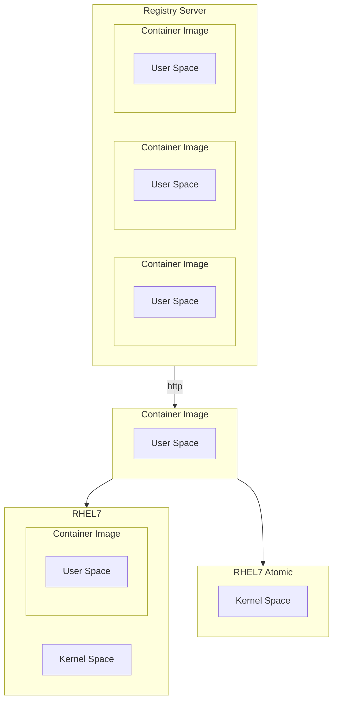

[<- До підрозділу](README.md)		[Коментувати](#feedback)

# Практичний вступ до термінології контейнерів

Це переклад статті [A Practical Introduction to Container Terminology](https://developers.redhat.com/blog/2018/02/22/container-terminology-practical-introduction#)

Ви можете подумати, що контейнери здаються досить простим поняттям, то чому мені потрібно читати про термінологію контейнерів? У моїй роботі як проповідника контейнерних технологій я стикався з неправильним використанням контейнерної термінології, через що люди спотикалися на шляху до оволодіння контейнерами. Такі терміни, як контейнери та образи, використовуються як взаємозамінні, але існують важливі концептуальні відмінності. У світі контейнерів репозиторій має інше значення, ніж ви очікували. Крім того, ландшафт для контейнерних технологій є більшим, ніж просто Docker. Без розуміння термінології може бути важко зрозуміти ключові відмінності між docker і (виберіть улюблені, CRI-O, rkt, lxc/lxd) або зрозуміти, що Open Container Initiative робить для стандартизації технології контейнерів.

## Background

Розпочати роботу з контейнерами Linux оманливо просто. Потрібно лише кілька хвилин, щоб встановити механізм контейнера, як-от докер, і запустити перші команди. За кілька хвилин ви створите свій перший образ контейнера та поділитеся ним. Далі ви починаєте знайомий процес створення архітектури контейнерного середовища, схожого на виробництво, і відчуваєте прозріння, що необхідно розуміти багато термінології та технологій за лаштунками. Гірше того, багато з наведених нижче термінів використовуються як синоніми... часто викликаючи чималу плутанину у новачків.

- Container (контейнер)

- Image (образ)
- Container Image (контейнерний образ)
- Image Layer (шар образу)
- Registry (реєстр)
- Repository (репозиторій)
- Tag (тег)
- Base Image (базовий образ)
- Platform Image (платформний образ / образ платформи)
- Layer (шар)


Розуміння термінології, викладеної в цьому технічному словнику, забезпечить вам глибше розуміння основних технологій. Це допоможе вам і вашим командам говорити однією мовою, а також дасть уявлення про те, як краще створити середовище контейнера для ваших цілей. Це глибше розуміння дасть нам змогу, як індустрії та ширшій спільноті, створювати нові архітектури та рішення. Зауважте, цей технічний словник передбачає, що читач уже має розуміння того, як запускати контейнери. Якщо вам потрібна підготовка, спробуйте почати з *[A ](http://developers.redhat.com/blog/2014/05/15/practical-introduction-to-docker-containers/)[Практичний вступ до контейнерів Docker](https://developers.redhat.com/blog/2014/05/15/practical-introduction-to-docker-containers)* у блозі розробників Red Hat.

## Containers 101

Щоб зрозуміти термінологію контейнерів, важливо точно розуміти, що саме являє собою контейнер. **Контейнер** - насправді представляє дві різні речі. Як і звичайна програма Linux, контейнери фактично мають два стани – стан спокою та стан виконання. У стані спокою контейнер є файлом (або набором файлів), які збережені на диску. Це називають контейнерним образом або контейнерним репозиторієм. Коли ви вводите команду для запуску контейнера, рушій контейнерів (Container Engine) розпаковує необхідні файли та метадані, а потім передає їх ядру Linux. Запуск контейнера дуже схожий на запуск звичайного Linux-процесу і потребує виклику API ядра Linux. Цей виклик API зазвичай ініціює додаткову ізоляцію та монтує копію файлів, що містилися у контейнерному образі. Після запуску контейнери є просто процесами Linux. Процес запуску контейнерів, а також формат образу на диску означуються та регулюються стандартами.

Існує кілька конкуруючих форматів контейнерних образів (Docker, Appc, LXD), але індустрія рухається до стандарту, що регулюється в межах Open Container Initiative — скорочено OCI (Open Containers). Сфера діяльності OCI включає специфікацію формату контейнерного образу, яка визначає формат збереження образів на диску, а також метадані, що описують, наприклад, апаратну архітектуру та операційну систему (Linux, Windows тощо). Загальнопромисловий формат контейнерного образу дає змогу екосистемі програмного забезпечення розвиватися — різні розробники, проєкти й вендори можуть створювати образи та інструменти, що є взаємодіючими. Користувачі хочуть мати сумісність інструментів для підписання, сканування, збирання, запуску, переміщення й керування контейнерними образами.

Також існує кілька конкуруючих рушіїв контейнерів (Container Engines), зокрема Docker, CRI-O, Railcar, RKT, LXC. Ці рушії беруть контейнерний образ і перетворюють його на контейнер (тобто запущений процес). Те, як це відбувається, визначається сферою діяльності OCI, яка включає специфікацію виконання контейнерів (Container Runtime Specification) і референсну реалізацію середовища виконання під назвою RunC. Ця референсна реалізація є відкритою, розробляється спільнотою та часто використовується багатьма рушіями контейнерів для взаємодії з ядром хоста під час створення контейнерів.

Інструменти, які працюють відповідно до специфікацій OCI щодо формату контейнерних образів і середовища виконання, забезпечують портативність у широкій екосистемі контейнерних платформ, рушіїв контейнерів та допоміжних інструментів у хмарних середовищах і на локальній інфраструктурі. Розуміння номенклатури, стандартів контейнерів і архітектури складових блоків контейнерів забезпечить можливість ефективної комунікації з іншими архітекторами під час побудови масштабованих і підтримуваних контейнеризованих застосунків та середовищ, які зможуть продуктивно виконувати контейнери протягом тривалого часу.


## Базова термінологія

### Container Image (контейнерний образ)

Контейнерний образ, у найпростішому означенні, — це файл, який завантажується з сервера реєстру (Registry Server) і використовується локально як точка монтування під час запуску контейнерів. У спільноті контейнерів термін “container image” використовується дуже часто, але така номенклатура може бути доволі заплутаною. Docker, RKT і навіть LXD працюють із концепцією завантаження віддалених файлів і запуску їх як контейнерів. Кожна з цих технологій по-своєму поводиться з контейнерними образами. LXD завантажує один контейнерний образ (один шар), тоді як Docker і RKT використовують OCI-образи, які можуть складатися з кількох шарів.

Технічно це значно складніше, ніж один файл на сервері реєстру. Коли люди використовують термін "container image", вони часто мають на увазі репозиторій — тобто набір з кількох шарів образу (Image Layers), а також метадані, що містять додаткову інформацію про ці шари.

Неявно в поняття контейнерного образу входить і поняття формату контейнерного образу.

### Container Image Format (формат контейнерного образу)

Історично кожний рушій контейнерів мав свій власний формат образів. LXD, RKT і Docker мали різні формати. У деяких образ складався з одного шару, в інших — з набору шарів у вигляді деревоподібної структури. Сьогодні майже всі провідні інструменти та рушії перейшли до формату, означеного Open Container Initiative (OCI). Цей формат описує шари та метадані всередині контейнерного образу. По суті, OCI-образ являє собою набір tar-файлів для кожного шару та файл `manifest.json` для зберігання метаданих.

Ініціатива Open Container Initiative (OCI), яка спочатку базувалась на форматі образів Docker V2, успішно об’єднала широку екосистему рушіїв контейнерів, хмарних постачальників та розробників інструментів (аналітика безпеки, підписування, збирання та перенесення образів). Це допомагає захистити користувачів, оскільки їхні знання та інструменти залишаються актуальними та сумісними впродовж розвитку середовища.

### Container Engine (рушій контейнерів)

Рушій контейнерів — це програмне забезпечення, яке приймає запити користувача (включно з параметрами командного рядка), завантажує образи та, з точки зору кінцевого користувача, запускає контейнер. Існує багато рушіїв контейнерів, зокрема docker, RKT, CRI-O та LXD. Також багато хмарних провайдерів, платформ як сервісу (PaaS) і контейнерних платформ мають вбудовані рушії контейнерів, що працюють з Docker або OCI-сумісними контейнерними образами. Наявність промислового стандарту формату контейнерних образів забезпечує взаємодію між усіма цими різними платформами.

Якщо подивитися глибше, більшість рушіїв контейнерів фактично не запускають контейнери самостійно — вони покладаються на OCI-сумісні середовища виконання, наприклад runc. Зазвичай рушій контейнерів відповідає за таке:

- Обробка введення користувача
- Обробка запитів через API, часто від контейнерного оркестратора
- Завантаження контейнерних образів із сервера реєстру
- Розпакування та розгортання контейнерного образу на диску за допомогою Graph Driver (блочний або файловий режим залежно від драйвера)
- Підготовка точки монтування контейнера, зазвичай на основі сховища copy-on-write (також блочного або файлового залежно від драйвера)
- Підготовка метаданих, які будуть передані середовищу виконання контейнерів для коректного запуску контейнера:
  - Використання налаштувань за замовчуванням з образу (наприклад, ArchX86)
  - Перевизначення цих параметрів на основі введення користувача (наприклад, CMD, ENTRYPOINT)
  - Використання значень за замовчуванням з контейнерного образу (наприклад, правила SECCOMP)
- Виклик середовища виконання контейнерів (Container Runtime)

Для ще глибшого розуміння див. розділ Understanding the Container Standards. Див. також Container Runtime.

### Container (контейнер)

Контейнери існують в операційних системах уже досить давно. Контейнер — це екземпляр контейнерного образу під час виконання. Контейнер є стандартним процесом Linux, який зазвичай створюється через системний виклик `clone()` замість `fork()` або `exec()`. Крім того, контейнери часто додатково ізольовані за допомогою cgroups, SELinux або AppArmor.

### Container Host (хост контейнера)

Хост контейнера — це система, яка запускає контейнеризовані процеси, що часто просто називають контейнерами. Це може бути, наприклад, RHEL Atomic Host, який працює у віртуальній машині, як екземпляр у публічній хмарі або на фізичному сервері (bare metal) у вашому дата-центрі. Після того як контейнерний образ (тобто репозиторій) буде отримано з сервера реєстру на локальний хост контейнера, вважається, що цей образ знаходиться у локальному кеші.

Визначити, які репозиторії синхронізовано з локальним кешем, можна за допомогою такої команди:

```bash
[root@rhel7 ~]# docker images -a

REPOSITORY                         TAG                     IMAGE ID                CREATED                 VIRTUAL SIZE
registry.access.redhat.com/rhel7   latest                  6883d5422f4e            3 weeks ago             201.7 MB
```

### Registry Server (сервер реєстру)

Сервер реєстру — це, по суті, спеціалізований файловий сервер, який використовується для зберігання docker-репозиторіїв. Зазвичай сервер реєстру задається як звичайне доменне ім’я в DNS і, за потреби, номер порту для підключення. Значна частина цінності екосистеми docker полягає в можливості відправляти (push) і отримувати (pull) репозиторії із серверів реєстрів.



Якщо демон docker не має локальної кешованої копії репозиторію, він автоматично завантажує її із сервера реєстру. У більшості дистрибутивів Linux демон docker налаштований на завантаження з `docker.io`, але це можна змінювати в налаштуваннях деяких дистрибутивів. Наприклад, у Red Hat Enterprise Linux налаштовано спочатку завантажувати репозиторії з `registry.access.redhat.com`, а вже потім — пробувати `docker.io` (Docker Hub).

Важливо підкреслити, що довіра до сервера реєстру є неявною. Ви маєте означити, наскільки довіряєте вмісту, який надає сервер реєстру, і чи потрібно дозволяти або блокувати певні реєстри. Крім аспектів безпеки, існують й інші питання, наприклад, доступ користувачів до ліцензованого програмного забезпечення та питання відповідності вимогам. Простота, з якою docker дозволяє користувачам завантажувати програмне забезпечення, робить критично важливим той факт, що ви довіряєте вмісту з боку постачальника.

У Red Hat Enterprise Linux стандартний реєстр docker можна налаштовувати. Конкретні сервери реєстру можна додавати або блокувати в RHEL7 та RHEL7 Atomic шляхом редагування конфігураційного файлу:

```
vi /etc/sysconfig/docker
```

In RHEL7 and RHEL 7 Atomic, Red Hat’s registry server is configured out of the box:

```
ADD_REGISTRY='--add-registry registry.access.redhat.com'
```

As a matter of security, it may be useful to block public docker repositories such as DockerHub:

```
# BLOCK_REGISTRY='--block-registry'
```

Red Hat також пропонує інтегрований сервер реєстру в складі OpenShift Container Platform, окремий промисловий сервер реєстру Quay Enterprise, а також хмарні публічні та приватні репозиторії на Quay.io.

## Оркестрація контейнерів

Зазвичай команда починає з встановлення хоста контейнерів і завантаження кількох контейнерних образів. Потім переходить до створення нових образів і відправлення їх на сервер реєстру для спільного використання в команді. Через деякий час виникає потреба об’єднати кілька контейнерів і розгорнути їх як єдине ціле. У підсумку, на певному етапі, вони хочуть включити цей модуль у конвеєр (Dev/QA/Prod) на шляху до промислової експлуатації. Це і є момент, коли приходить усвідомлення необхідності оркестрації.

Оркестратор контейнерів фактично робить дві речі:

- Динамічно розподіляє робочі навантаження контейнерів у межах кластера обчислювальних вузлів. Це часто називають розподіленими обчисленнями.
- Забезпечує стандартизований файл опису застосунку (kube yaml, docker compose тощо).

Ці дві можливості забезпечують низку переваг:

- Дозволяють планувати виконання контейнерів у складі застосунку повністю незалежно один від одного. Це корисно, якщо:
  - Потрібно використовувати великі кластери хостів контейнерів.
  - Окремі контейнери виходять з ладу (зависання процесу, нестача пам’яті).
  - Виходять з ладу хости контейнерів (диск, мережа, перезавантаження).
  - Відмовляє рушій контейнерів (пошкодження, перезапуск).
  - Потрібно масштабувати окремі контейнери вгору або вниз.
- Легко розгортати нові екземпляри одного й того ж застосунку в нових середовищах. У хмарно-нативному чи класичному середовищі причин для цього може бути багато, наприклад:
  - На ноутбуці розробника з локальним оркестратором.
  - У спільному середовищі розробки в приватному просторі імен.
  - У спільному середовищі розробки у внутрішньому публічному просторі імен для тестування та огляду.
  - У середовищі контролю якості (QA).
  - У середовищі навантажувального тестування, що динамічно створюється та видаляється в хмарі.
  - У референсному середовищі для перевірки сумісності з промисловою експлуатацією.
  - У промисловому середовищі (production).
  - У середовищі аварійного відновлення (DR).
  - У новому промисловому середовищі з оновленими хостами контейнерів, рушіями або оркестраторами.
  - У новому промисловому середовищі з тією ж версією хоста, рушія та оркестратора контейнерів, але в іншому географічному регіоні (APAC, EMEA тощо).

У спільноті та серед вендорів розробляється багато систем планування контейнерів. Історично трійкою лідерів були Swarm, Mesos і Kubernetes, але останнім часом навіть Docker і Mesosphere оголосили про підтримку Kubernetes — як і майже всі великі хмарні провайдери. Kubernetes став де-факто стандартом оркестрації контейнерів, подібно до того як Linux став стандартом операційних систем. Якщо ви розглядаєте оркестрацію контейнерів, Red Hat рекомендує наше промислове рішення OpenShift.

## Розширена термінологія

### Container Runtime (середовище виконання контейнерів)

Середовище виконання контейнерів — це нижчий рівень компонента, який зазвичай використовується в складі рушія контейнерів (Container Engine), але також може використовуватись вручну для тестування. Еталонною реалізацією стандарту середовища виконання, визначеного Open Containers Initiative (OCI), є runc. Це найбільш поширене середовище виконання контейнерів, але існують і інші OCI-сумісні runtimes, такі як crun, railcar та katacontainers. Docker, CRI-O та багато інших рушіїв контейнерів покладаються на runc.

Середовище виконання контейнерів відповідає за:

- Використання точки монтування контейнера, яку надає рушій контейнерів (або звичайний каталог при тестуванні).
- Використання метаданих контейнера, що надаються рушієм контейнерів (або вручну створеного файла config.json при тестуванні).
- Взаємодію з ядром для запуску контейнеризованих процесів (системний виклик clone).
- Налаштування cgroups.
- Налаштування політик SELinux.
- Налаштування правил AppArmor.

Трохи історії: коли рушій Docker тільки з’явився, він використовував LXC як середовище виконання контейнерів. Пізніше команда Docker розробила власну бібліотеку libcontainer для запуску контейнерів. Цю бібліотеку було написано на Go та вбудовано в початкові версії Docker. Згодом, після створення OCI, Docker передав код libcontainer та перетворив його на окрему утиліту runc. Сьогодні runc є еталонною реалізацією та використовується іншими рушіями контейнерів, такими як CRI-O. На найнижчому рівні це забезпечує можливість узгоджено запускати контейнер незалежно від рушія контейнерів. Утиліта runc є дуже мінімалістичною і очікує, що їй буде передано точку монтування (каталог) та метадані (`config.json`). Більше інформації про runc можна знайти у відповідному навчальному матеріалі.

Для ще глибшого розуміння див. Understanding the  [Understanding the Container Standards](https://docs.google.com/presentation/d/1OpsvPvA82HJjHN3Vm2oVrqca1FCfn0PAfxGZ2w_ZZgc/edit#slide=id.g2441f8cc8d_0_80). Див. також  [Container Runtime](https://developers.redhat.com/blog/2018/02/22/container-terminology-practical-introduction#h.6yt1ex5wfo55).

### Image Layer (шар образу)

Репозиторії часто називають образами або контейнерними образами, але насправді вони складаються з одного або кількох шарів. Шари образів у репозиторії пов’язані між собою у відносинах «батько — нащадок». Кожен шар образу представляє зміни відносно свого батьківського шару.

Далі ми будемо переглядати шари репозиторію на локальному хості контейнерів. Починаючи з Docker 1.7, немає вбудованих інструментів для перегляду шарів образу в локальному репозиторії (хоча інструменти для онлайн-реєстрів існують). За допомогою утиліти **Dockviz** можна швидко переглянути всі шари. Зверніть увагу, що кожен шар має тег та універсальний унікальний ідентифікатор (UUID). Наведена нижче команда поверне скорочені версії UUID, які зазвичай достатньо унікальні для роботи на одній машині. Якщо потрібен повний UUID, використовуйте опцію `--no-trunc`.

```
docker run --rm --privileged -v /var/run/docker.sock:/var/run/docker.sock nate/dockviz images -t

├─2332d8973c93 Virtual Size: 187.7 MB
 │ └─ea358092da77 Virtual Size: 187.9 MB
 │   └─a467a7c6794f Virtual Size: 187.9 MB
 │         └─ca4d7b1b9a51 Virtual Size: 187.9 MB
 │           └─4084976dd96d Virtual Size: 384.2 MB
 │             └─943128b20e28 Virtual Size: 386.7 MB
 │               └─db20cc018f56 Virtual Size: 386.7 MB
 │                 └─45b3c59b9130 Virtual Size: 398.2 MB
 │                   └─91275de1a5d7 Virtual Size: 422.8 MB
 │                     └─e7a97058d51f Virtual Size: 422.8 MB
 │                       └─d5c963edfcb2 Virtual Size: 422.8 MB
 │                         └─5cfc0ce98e02 Virtual Size: 422.8 MB
 │                           └─7728f71a4bcd Virtual Size: 422.8 MB
 │                             └─0542f67da01b Virtual Size: 422.8 MB Tags: docker.io/registry:latest
```

Зверніть увагу, що репозиторій `docker.io/registry` насправді складається з багатьох шарів образів. Ще важливіше те, що користувач потенційно може «запустити» контейнер, використовуючи будь-який із цих шарів як основу. Наступна команда є цілком коректною з формальної точки зору, хоча не гарантується, що вона була протестована або що взагалі працюватиме правильно. Зазвичай автор образу тегує (присвоює назву) конкретні шари, які рекомендовано використовувати.

```
docker run -it 45b3c59b9130 bash
```

Репозиторії будуються таким чином, оскільки щоразу, коли розробник образу створює новий образ, відмінності зберігаються у вигляді окремого шару. Існує два основні способи створення нових шарів у репозиторії. По-перше, під час ручного створення образу кожна операція commit формує новий шар. По-друге, якщо образ створюється за допомогою Dockerfile, кожна директива в цьому файлі створює окремий шар. Важливо мати можливість бачити, які саме зміни були внесені в контейнерному репозиторії між окремими шарами.

### Tag (тег)

Хоча користувач може вказати, що контейнер має монтуватися і запускатися з будь-якого шару в репозиторії, робити так зазвичай не варто. Коли розробник образу створює новий репозиторій, він, як правило, позначає найкращі для використання шари образів. Такі позначки називаються тегами і слугують засобом комунікації між розробниками контейнерних образів та їхніми споживачами щодо того, які шари рекомендовано використовувати. Зазвичай теги застосовують для позначення версій програмного забезпечення в межах репозиторію. Це лише домовленість — насправді ні OCI, ні будь-який інший стандарт не визначає, для чого саме мають використовуватися теги, і їх можна застосовувати для будь-яких цілей. Слід бути обережним із таким використанням, оскільки це може призвести до значної плутанини в командах розробки, експлуатації та архітектури, тому у разі використання тегів не лише для версій програмного забезпечення це потрібно добре задокументувати.

Існує один спеціальний тег — latest, який зазвичай вказує на шар, що містить найновішу версію програмного забезпечення в репозиторії. Цей спеціальний тег так само просто посилається на певний шар образу, як і будь-який інший тег, тому його також можна використовувати некоректно.

Щоб переглянути теги, доступні в репозиторії віддалено, виконайте таку команду (утиліта jq робить вивід значно читабельнішим):

```
curl -s registry.access.redhat.com/v1/repositories/rhel7/tags | jq
 {
 "7.0-21": "e1f5733f050b2488a17b7630cb038bfbea8b7bdfa9bdfb99e63a33117e28d02f",
 "7.0-23": "bef54b8f8a2fdd221734f1da404d4c0a7d07ee9169b1443a338ab54236c8c91a",
 "7.0-27": "8e6704f39a3d4a0c82ec7262ad683a9d1d9a281e3c1ebbb64c045b9af39b3940",
 "7.1-11": "d0a516b529ab1adda28429cae5985cab9db93bfd8d301b3a94d22299af72914b",
 "7.1-12": "275be1d3d0709a06ff1ae38d0d5402bc8f0eeac44812e5ec1df4a9e99214eb9a",
 "7.1-16": "82ad5fa11820c2889c60f7f748d67aab04400700c581843db0d1e68735327443",
 "7.1-24": "c4f590bbcbe329a77c00fea33a3a960063072041489012061ec3a134baba50d6",
 "7.1-4": "10acc31def5d6f249b548e01e8ffbaccfd61af0240c17315a7ad393d022c5ca2",
 "7.1-6": "65de4a13fc7cf28b4376e65efa31c5c3805e18da4eb01ad0c8b8801f4a10bc16",
 "7.1-9": "e3c92c6cff3543d19d0c9a24c72cd3840f8ba3ee00357f997b786e8939efef2f",
 "7.2": "6c3a84d798dc449313787502060b6d5b4694d7527d64a7c99ba199e3b2df834e",
 "7.2-2": "58958c7fafb7e1a71650bc7bdbb9f5fd634f3545b00ec7d390b2075db511327d",
 "7.2-35": "6883d5422f4ec2810e1312c0e3e5a902142e2a8185cd3a1124b459a7c38dc55b",
 "7.2-38": "6c3a84d798dc449313787502060b6d5b4694d7527d64a7c99ba199e3b2df834e",
 "latest": "6c3a84d798dc449313787502060b6d5b4694d7527d64a7c99ba199e3b2df834e"
 }
```

### Repository (репозиторій)

Під час використання команди docker у командному рядку вказується саме репозиторій, а не образ. У наведеній нижче команді `rhel7` є репозиторієм.

```
docker pull rhel7
```

Насправді ця команда автоматично розгортається до такого вигляду:

```
docker pull registry.access.redhat.com/rhel7:latest
```

Це може збивати з пантелику, і багато хто називає це образом або контейнерним образом. Фактично ж підкоманда docker images використовується для відображення локально доступних репозиторіїв. На концептуальному рівні ці репозиторії можна сприймати як контейнерні образи, але важливо розуміти, що насправді репозиторії складаються з шарів і містять метадані у файлі, який називається маніфестом (manifest.json).

```shell
docker images

REPOSITORY                                  TAG                     IMAGE ID                CREATED                 VIRTUAL SIZE
 registry.access.redhat.com/rhel7           latest                  6883d5422f4e            4 weeks ago             201.7 MB
 registry.access.redhat.com/rhel            latest                  6883d5422f4e            4 weeks ago             201.7 MB
 registry.access.redhat.com/rhel6           latest                  05c3d56ba777            4 weeks ago             166.1 MB
 registry.access.redhat.com/rhel6/rhel      latest                  05c3d56ba777            4 weeks ago             166.1 MB
 ...
```

Коли ми вказуємо репозиторій у командному рядку, рушій контейнерів виконує додаткову роботу за нас. У цьому випадку демон docker (а не клієнтська утиліта) налаштований зі списком серверів, у яких потрібно виконувати пошук. У наведеному вище прикладі демон буде шукати репозиторій “rhel7” на кожному зі сконфігурованих серверів.


У цій команді було вказано лише назву репозиторію, але за допомогою docker-клієнта також можна задати повну URL-адресу. Щоб це проілюструвати, почнемо з розбору повної URL-адреси.

Ще один формат, який часто можна побачити, виглядає так:

```shell
REGISTRY/NAMESPACE/REPOSITORY[:TAG]
```

Повна URL-адреса складається зі стандартного імені сервера, простору імен (namespace) та, за потреби, тегу. Насправді існує багато варіантів того, як можна задати URL-адресу, і в процесі роботи з екосистемою docker ви побачите, що багато складових є необов’язковими. Наступні команди є коректними і всі вони завантажують певний варіант одного й того ж репозиторію:

```shell
 docker pull registry.access.redhat.com/rhel7/rhel:latest
 docker pull registry.access.redhat.com/rhel7/rhel
 docker pull registry.access.redhat.com/rhel7
 docker pull rhel7/rhel:latest
```

### Namespace (простір імен)

Простір імен — це засіб для розділення груп репозиторіїв. У публічному DockerHub простір імен зазвичай відповідає імені користувача, який публікує образ, але також може бути назвою групи або логічною назвою.

Red Hat використовує простори імен для розділення груп репозиторіїв відповідно до продуктів, представлених на сервері Red Hat Federated Registry. Нижче наведено приклади результатів, які повертає registry.access.redhat.com. Зверніть увагу, що останній результат фактично розміщений на іншому сервері реєстру. Це пов’язано з тим, що Red Hat також працює над розміщенням репозиторіїв на серверах реєстрів своїх партнерів.

```
registry.access.redhat.com/rhel7/rhel
registry.access.redhat.com/openshift3/mongodb-24-rhel7
registry.access.redhat.com/rhscl/mongodb-26-rhel7
registry.access.redhat.com/rhscl_beta/mongodb-26-rhel7
registry-mariadbcorp.rhcloud.com/rhel7/mariadb-enterprise-server:10.0
```

Зверніть увагу, що іноді повну URL-адресу вказувати не потрібно. У такому випадку для певного простору імен існує репозиторій за замовчуванням. Якщо користувач вкаже лише простір імен fedora, на локальний сервер буде завантажено репозиторій за замовчуванням з тегом latest. Отже, виконання наведених нижче команд є по суті однаковим, при цьому кожна наступна команда є більш конкретною:

```
docker pull fedora
docker pull docker.io/fedora
docker pull docker.io/library/fedora:latest
```

### Kernel Namespace (простір імен ядра)

Простір імен ядра повністю відрізняється від простору імен, про який йдеться під час обговорення репозиторіїв і серверів реєстру. У контексті контейнерів простори імен ядра є, мабуть, найважливішою структурою даних, оскільки саме вони роблять можливими контейнери в тому вигляді, в якому ми їх знаємо сьогодні. Простори імен ядра дозволяють кожному контейнеру мати власні точки монтування, мережеві інтерфейси, ідентифікатори користувачів, ідентифікатори процесів тощо.

Коли ви вводите команду в терміналі Bash і натискаєте Enter, Bash надсилає запит до ядра на створення звичайного процесу Linux з використанням одного з варіантів системного виклику exec(). Контейнер відрізняється тим, що коли ви надсилаєте запит до рушія контейнерів, наприклад docker, демон docker звертається до ядра з проханням створити контейнеризований процес за допомогою іншого системного виклику — clone(). Системний виклик clone() є особливим, оскільки він може створювати процес із власними віртуальними точками монтування, ідентифікаторами процесів, ідентифікаторами користувачів, мережевими інтерфейсами, іменем хоста тощо.

Хоча з технічної точки зору в Linux не існує єдиної структури даних, яка безпосередньо представляє контейнер, простори імен ядра разом із системним викликом clone() є найближчим до цього механізмом.


### Graph Driver (драйвер графа)

Коли кінцевий користувач вказує тег контейнерного образу для запуску — за замовчуванням це тег latest — драйвер графа розпаковує всі залежні шари образу, необхідні для побудови даних, що відповідають вибраному тегу. Драйвер графа — це програмний компонент, який відображає потрібні шари образів з репозиторію на локальне сховище. Шари контейнерного образу можуть бути відображені у вигляді каталогу за допомогою драйверів на кшталт Overlay2 або у блочному сховищі за допомогою драйверів типу Device Mapper. Серед драйверів використовуються aufs, devicemapper, btrfs, zfs та overlayfs.

Під час запуску контейнера шари образу монтуються лише для читання в межах простору імен ядра. Шари образів із репозиторію завжди монтуються тільки для читання, але за замовчуванням додатково створюється окремий шар з механізмом copy-on-write. Це дозволяє контейнеризованому процесу записувати дані всередині контейнера. Усі зміни при записі зберігаються в шарі copy-on-write на базовому хості. Цей шар copy-on-write можна вимкнути, запустивши контейнер з опцією на кшталт --readonly.

Демон docker має власний набір драйверів графа. Крім того, існують інші бібліотеки з відкритим кодом, що реалізують драйвери графа, наприклад containers/images, які використовуються в таких інструментах, як CRI-O, Skopeo та інших рушіях контейнерів.


Визначити, який драйвер графа використовується, можна за допомогою команди `docker info`:

```
[root@rhel7 ~]# docker info

...
 Storage Driver: devicemapper
 Pool Name: docker-253:1-884266-pool
 Pool Blocksize: 65.54 kB
 Backing Filesystem: xfs
 Data file: /dev/loop0
 Metadata file: /dev/loop1
 Data Space Used: 3.037 GB
 Data Space Total: 107.4 GB
 Data Space Available: 2.56 GB
 Metadata Space Used: 2.707 MB
 Metadata Space Total: 2.147 GB
 Metadata Space Available: 2.145 GB
 Udev Sync Supported: true
 Deferred Removal Enabled: false
 Data loop file: /var/lib/docker/devicemapper/devicemapper/data
 Metadata loop file: /var/lib/docker/devicemapper/devicemapper/metadata
 Library Version: 1.02.107-RHEL7 (2015-10-14)
```

## Container Use Cases (сценарії використання контейнерів)

Формується багато типів шаблонів проєктування контейнерів. Оскільки контейнери є версією контейнерного образу під час виконання, спосіб, у який образ створюється, тісно пов’язаний зі способом його запуску.

Деякі контейнерні образи спроєктовані для запуску без привілеїв, тоді як інші є більш спеціалізованими і потребують привілеїв рівня root. Існує багато вимірів, за якими можна оцінювати шаблони, і часто користувачі стикаються з кількома шаблонами або сценаріями використання, поєднаними в одному контейнерному образі або контейнері.

У цьому розділі розглядаються деякі з поширених сценаріїв використання контейнерів.

### Application Containers (контейнери застосунків)

Контейнери застосунків є найпоширенішим типом контейнерів. Саме вони цікавлять розробників і власників застосунків. Контейнери застосунків містять код, над яким працюють розробники. Вони також можуть включати такі компоненти, як MySQL, Apache, MongoDB або Node.js.

Навколо контейнерів застосунків формується потужна екосистема. Такі проєкти, як Software Collections, надають безпечні та підтримувані контейнерні образи застосунків для використання з Red Hat Enterprise Linux. Водночас учасники спільноти Red Hat активно розвивають сучасні, передові контейнерні застосунки.

Red Hat вважає, що контейнери застосунків зазвичай не повинні вимагати спеціальних привілеїв для виконання своїх навантажень. Водночас промислові контейнерні середовища зазвичай потребують значно більшого, ніж просто непривілейовані контейнери застосунків, щоб забезпечити роботу допоміжних сервісів.

### Operating System Containers (контейнери операційної системи)

Див. також System Containers.

Контейнери операційної системи — це контейнери, які сприймаються радше як повноцінна віртуальна операційна система. Вони й надалі спільно використовують ядро хоста, але запускають повноцінну init-систему, що дозволяє без проблем виконувати кілька процесів усередині контейнера. LXC та LXD є прикладами контейнерів операційної системи, оскільки вони використовуються майже так само, як повноцінні віртуальні машини.

Також можливо наблизити поведінку контейнера операційної системи, використовуючи docker/OCI-контейнери, але для цього потрібно запускати systemd всередині контейнера. Це дозволяє кінцевому користувачу встановлювати програмне забезпечення звичним способом і поводитися з контейнером майже як з повноцінною операційною системою.

```
yum install mysql
systemctl enable mysql
```

Такий підхід спрощує міграцію наявних застосунків. Red Hat активно працює над тим, щоб зробити контейнери операційної системи зручнішими, зокрема шляхом підтримки запуску systemd усередині контейнерів та керування ними за допомогою machined. Хоча багато замовників поки що не готові до переходу на мікросервіси, вони все одно можуть отримати переваги від використання контейнерів на основі образів як моделі постачання програмного забезпечення.

### Pet Containers (контейнери типу «pet»)

Хоча Red Hat безумовно рекомендує, підтримує та популяризує використання cloud-native підходів для розробки нових застосунків, на практиці не всі наявні застосунки будуть переписані з урахуванням нових шаблонів. Багато існуючих застосунків є унікальними, а такі унікальні застосунки часто називають «pet». Контейнери, спеціально створені для роботи з такими застосунками, іноді називають контейнерами типу «pet».

Контейнери типу «pet» надають користувачам портативність і зручність стандартизованої контейнерної інфраструктури, що спирається на сервери реєстрів, контейнерні образи та стандартні хости контейнерів як інфраструктуру, але водночас забезпечують гнучкість традиційного середовища всередині контейнера. Ідея полягає в тому, щоб спростити контейнеризацію існуючих застосунків, наприклад шляхом використання systemd усередині контейнера. Мета — повторно використати наявну автоматизацію, інсталятори та інструменти, щоб легко створити контейнерний образ, який просто працює.

### Super Privileged Containers (суперпривілейовані контейнери)

Під час побудови контейнерної інфраструктури на виділених хостах контейнерів, таких як Red Hat Enterprise Linux Atomic Host, системним адміністраторам усе одно потрібно виконувати адміністративні завдання. Незалежно від того, чи використовуються розподілені системи на кшталт Kubernetes або OpenShift, чи окремі хости контейнерів, суперпривілейовані контейнери (SPC) є потужним інструментом. SPC можуть виконувати навіть такі дії, як завантаження спеціалізованих модулів ядра, наприклад за допомогою systemtap.

В інфраструктурі, побудованій для виконання контейнерів, адміністраторам майже напевно знадобляться SPC для таких завдань, як моніторинг, резервне копіювання тощо. Важливо усвідомлювати, що зазвичай існує тісніший зв’язок між SPC і ядром хоста, тому адміністраторам необхідно обирати надійний хост контейнерів і стандартизувати його використання, особливо у великих кластерних або розподілених середовищах, де усунення несправностей є складнішим. Також потрібно підібрати простір користувача всередині SPC, який буде сумісний з ядром хоста.

### Tools & Operating System Software (інструменти та системне програмне забезпечення)

Дистрибутиви Linux завжди надавали користувачам системне програмне забезпечення, таке як rsyslogd, sssd, sadc тощо. Історично ці компоненти системного програмного забезпечення встановлювалися за допомогою пакетів RPM або DEB. Однак із появою контейнерів як формату пакування стало зручно і просто встановлювати системне програмне забезпечення у вигляді контейнерних образів. Red Hat надає деякі попередньо підготовлені контейнери, зокрема для інструментів Red Hat Virtualization, rsyslog, sssd та sadc.

## Architecture of Containers (архітектура контейнерів)

У міру того як усе більше людей постачають програмне забезпечення за допомогою контейнерів, формуються нові шаблони проєктування. Інженерні команди Red Hat активно використовують і розвивають багато з цих шаблонів у спільноті. Мета цього розділу — підсвітити та визначити деякі з них.

Спосіб, у який контейнер зберігається на диску (тобто формат його образу), може суттєво впливати на те, як він запускається. Наприклад, контейнер, призначений для виконання sssd, потребує спеціальних привілеїв під час кожного запуску, інакше він не зможе виконувати свої функції. Нижче наведено короткий перелік шаблонів, які формуються в контейнерній спільноті.

### Application Images (образи застосунків)

Ці образи споживають кінцеві користувачі. Сценарії використання варіюються від баз даних і вебсерверів до прикладних систем і сервісних шин. Такі образи можуть створюватися всередині організації або постачатися замовнику незалежним виробником програмного забезпечення (ISV). Часто кінцеві користувачі аналізують і зважають на те, з яких компонентів було зібрано автономний образ. Автономні образи є найпростішими для використання, але водночас найскладнішими для проєктування, збирання та оновлення.

### Base Images (базові образи)

Базовий образ є одним із найпростіших типів образів, але водночас існує багато різних трактувань цього поняття. Іноді користувачі називають «базовим образом» корпоративну стандартну збірку або навіть образ застосунку. Технічно це не є базовим образом. Такі образи є проміжними.

Простими словами, базовий образ — це образ, який не має батьківського шару. Зазвичай базовий образ містить чисту копію операційної системи. Базові образи, як правило, включають інструменти (yum, rpm, apt-get, dnf, microdnf), необхідні для встановлення пакетів і подальшого оновлення образу. Хоча базові образи можуть створюватися вручну, на практиці вони зазвичай виробляються та публікуються проєктами з відкритим кодом (такими як Debian, Fedora або CentOS) і вендорами (наприклад, Red Hat). Походження базових образів є критично важливим з точки зору безпеки. Коротко кажучи, єдина мета базового образу — надати початкову точку для створення похідних образів. Під час використання dockerfile вибір базового образу є явним:

```
FROM registry.access.redhat.com/rhel7-atomic
```

### Builder Images (образи-збирачі)

Це спеціалізований різновид контейнерних образів, які створюють образи контейнерів застосунків як результат своєї роботи. Вони містять усе, окрім вихідного коду розробника. Образи-збирачі включають бібліотеки операційної системи, середовища виконання мов програмування, проміжне програмне забезпечення, а також інструменти source-to-image.

Під час запуску образу-збирача до нього підставляється вихідний код розробника, після чого він створює готовий до запуску дочірній контейнерний образ застосунку. Цей новостворений образ застосунку можна запускати як у середовищі розробки, так і в промисловому середовищі.

Наприклад, якщо розробник має код на PHP і хоче запустити його в контейнері, він може скористатися PHP-образом-збирачем для створення готового до виконання контейнерного образу застосунку. Розробник передає URL репозиторію GitHub, у якому зберігається код, а образ-збирач виконує всю решту роботи. Результатом роботи контейнера-збирача є контейнерний образ застосунку, який включає Red Hat Enterprise Linux, PHP зі складу Software Collections та код розробника — усе разом, у вигляді готового до запуску образу.

Образи-збирачі забезпечують потужний спосіб швидко перейти від коду до контейнера.

### Containerized Components (контейнеризовані компоненти)

Контейнер призначений для розгортання як частина більшої програмної системи, а не для самостійного використання. Цьому сприяють дві основні тенденції.

По-перше, мікросервісна архітектура стимулює використання найкращих у своєму класі компонентів, що водночас призводить до поєднання більшої кількості компонентів для побудови одного застосунку. Контейнеризовані компоненти задовольняють потребу швидшого та простішого розгортання зростаючої кількості складного програмного забезпечення. Кожен із таких компонентів може мати різні ревізії, і контейнерні образи допомагають це реалізувати. Опис застосунків за допомогою таких механізмів, як deployments у Kubernetes/OpenShift (yaml/json), Open Service Broker, OpenShift Templates та Helm Charts, дозволяє визначати застосунки на більш високому рівні абстракції.

По-друге, не всі програмні компоненти легко розгортати у вигляді контейнерів. Іноді доцільно контейнеризувати лише окремі компоненти, які простіше перенести в контейнери або які дають більшу цінність для всього проєкту. У багатосервісному застосунку деякі сервіси можуть бути розгорнуті як контейнери, тоді як інші — за традиційною методологією, наприклад через RPM-пакети або інсталяційні скрипти (див. Pet Containers). Інші компоненти можуть бути складними для контейнеризації через надто тісну зв’язаність, потребу в спеціалізованому обладнанні або необхідність доступу до низькорівневих API ядра тощо. У межах великого застосунку зазвичай є частини, які можна контейнеризувати, і частини, які цього не допускають. Контейнеризовані компоненти представляють саме ті частини, які можуть і були контейнеризовані.

Контейнеризовані компоненти призначені для виконання як частина конкретного застосунку, а не як самостійні одиниці. Важливо розуміти, що вони не спроєктовані для автономної роботи. Вони надають цінність більшому програмному комплексу, але самі по собі мають обмежену корисність.

Наприклад, під час випуску OpenShift Enterprise 3.0 більшість основного коду розгорталася за допомогою RPM-пакетів, але після інсталяції адміністратори розгортали маршрутизатор і реєстр як контейнери. Починаючи з OpenShift 3.1, до інсталятора було додано можливість розгортати компоненти master, node, openvswitch та etcd у вигляді контейнерів. Після встановлення адміністратори також могли розгорнути elasticsearch, fluentd та kibana як контейнери.

Хоча інсталятор OpenShift і надалі вносить зміни до файлової системи сервера, усі основні програмні компоненти тепер можуть встановлюватися за допомогою контейнерних образів. Визначальною ознакою контейнеризованих компонентів є те, що, наприклад, екземпляр образу etcd, вбудований в OpenShift, не повинен і не буде використовуватися для зберігання даних клієнтського застосунку, оскільки це контейнеризований компонент, призначений для роботи саме в складі OpenShift Container Platform.

У нових випусках OpenShift спостерігається тенденція до збільшення кількості контейнеризованих компонентів. Шаблон контейнеризованих компонентів стає дедалі поширенішим, і інші вендори програмного забезпечення також бачать переваги в розгортанні своїх продуктів у вигляді контейнеризованих компонентів.

### Deployer Images (образи-розгортальники)

Образ-розгортальник — це спеціалізований тип контейнера, який під час запуску розгортає або керує іншими контейнерами. Цей шаблон дозволяє реалізовувати складні сценарії розгортання, наприклад примусовий порядок запуску контейнерів або логіку першого запуску, таку як ініціалізація схем чи заповнення початкових даних.

Як приклад, шаблон «image/container type» використовується для розгортання журналювання та метрик в OpenShift. Розгортання цих компонентів за допомогою контейнера-розгортальника дозволяє інженерній команді OpenShift контролювати порядок запуску різних компонентів і гарантувати, що всі вони запускаються та працюють узгоджено.

### Intermediate Images (проміжні образи)

Проміжний образ — це будь-який контейнерний образ, який базується на базовому образі. Зазвичай базові збірки, проміжне програмне забезпечення та середовища виконання мов будуються у вигляді шарів поверх базового образу. Такі образи потім використовуються в директиві FROM іншого образу. Вони не призначені для самостійного використання, а зазвичай слугують будівельними блоками для створення автономного образу.

Поширеною практикою є ситуація, коли різні команди спеціалістів відповідають за різні шари образу. Системні адміністратори можуть відповідати за базовий шар збірки, тоді як команда, відповідальна за досвід розробників, — за шар проміжного програмного забезпечення. Проміжні образи створюються для використання іншими командами, які будують кінцеві образи, але іноді можуть запускатися і самостійно, особливо для тестування.

### Intermodal Container Images (інтермодальні контейнерні образи)

Інтермодальні контейнерні образи, за аналогією з інтермодальними вантажними контейнерами, є образами з гібридною архітектурою. Наприклад, багато образів Red Hat Software Collections можуть використовуватися двома способами. По-перше, як звичайні контейнери застосунків, у яких повністю ізольовано запускаються Ruby on Rails та сервер Apache. По-друге, вони можуть використовуватися як образи-збирачі всередині OpenShift Container Platform. У цьому випадку результатом є дочірні образи, що містять Ruby on Rails, Apache та код застосунку, на який під час фази збирання було спрямовано процес source-to-image.

Інтермодальний шаблон стає дедалі поширенішим, оскільки дозволяє розв’язувати одразу дві бізнес-задачі за допомогою одного контейнерного образу.

### System Containers (системні контейнери)

Коли системне програмне забезпечення поширюється у вигляді контейнера, воно часто потребує запуску з суперпривілеями. Щоб спростити таке розгортання і дозволити цим контейнерам запускатися ще до середовища виконання контейнерів або оркестрації, Red Hat розробила спеціальний шаблон контейнерів, який називається System Containers. Системні контейнери запускаються на ранньому етапі процесу завантаження системи і використовують команду atomic та systemd для запуску незалежно від будь-якого контейнерного runtime або оркестрації. Red Hat надає системні контейнери для багатьох компонентів програмного забезпечення, зокрема rsyslog, cockpit, etcd та flanneld. У майбутньому цей перелік буде розширюватися.

Цей шаблон проєктування спрощує для адміністраторів модульне додавання таких сервісів до Red Hat Enterprise Linux та Atomic Host.

## Висновок

Контейнери досить прості у використанні, але під час побудови промислового контейнерного середовища складність зміщується за лаштунки. Щоб мати змогу обговорювати архітектуру та способи побудови середовища, важливо мати спільну номенклатуру. Поглиблюючись у проєктування та архітектуру середовища, легко натрапити на низку підводних каменів. Нижче наведено кілька ключових моментів, які варто пам’ятати.

Люди часто використовують терміни контейнерний образ і репозиторій як взаємозамінні, а підкоманди docker не роблять чіткого розрізнення між образом і репозиторієм. Команди є доволі простими у використанні, але коли починаються архітектурні обговорення, важливо розуміти, що репозиторій насправді є центральною структурою даних.

Також досить легко неправильно зрозуміти різницю між простором імен, репозиторієм, шаром образу та тегом. Кожен із цих елементів має своє архітектурне призначення. Хоча різні вендори та користувачі застосовують їх по-різному, всі вони є інструментами в нашому інженерному наборі.


Мета цієї статті — дати вам можливість впевнено оперувати цією номенклатурою, щоб можна було створювати більш складні архітектури. Наприклад, уявіть, що вам доручили побудувати інфраструктуру, яка обмежує, залежно від ролі, до яких просторів імен, репозиторіїв, а також до яких шарів образів і тегів дозволено виконувати операції push і pull відповідно до бізнес-правил. Також варто пам’ятати, що спосіб, у який контейнерний образ зібраний, має суттєвий вплив на те, як він буде запускатися (оркеструватися, виконуватися з привілеями тощо).

Для подальшого ознайомлення перегляньте серію статей Architecting Containers:

- [Architecting Containers Part 1: Why Understanding User Space vs. Kernel Space Matters](https://rhelblog.redhat.com/2015/07/29/architecting-containers-part-1-user-space-vs-kernel-space/)
- [Architecting Containers Part 2: Why the User Space Matters](https://rhelblog.redhat.com/2015/09/17/architecting-containers-part-2-why-the-user-space-matters-2/)
- [Architecting Containers Part 3: How the User Space Affects Your Application](https://rhelblog.redhat.com/2015/11/10/architecting-containers-part-3-how-the-user-space-affects-your-application/)

Як завжди, якщо у вас є коментарі або запитання, залишайте повідомлення нижче.


## Автори

Scott McCarty (fatherlinux) - [Посилання на оригінал](https://developers.redhat.com/blog/2018/02/22/container-terminology-practical-introduction#) 					

## Feedback

Якщо Ви хочете залишити коментар у Вас є наступні варіанти:

- [Обговорення у WhatsApp](https://chat.whatsapp.com/BRbPAQrE1s7BwCLtNtMoqN)
- [Обговорення в Телеграм](https://t.me/+GA2smCKs5QU1MWMy)
- [Група у Фейсбуці](https://www.facebook.com/groups/asu.in.ua)

Про проект і можливість допомогти проекту написано [тут](https://asu-in-ua.github.io/atpv/)