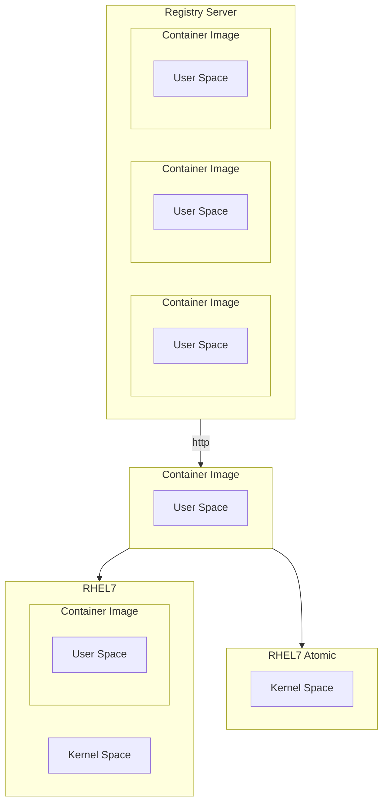

[<- До підрозділу](README.md)		[Коментувати](#feedback)

# Практичний вступ до термінології контейнерів

Це переклад статті [A Practical Introduction to Container Terminology](https://developers.redhat.com/blog/2018/02/22/container-terminology-practical-introduction#)

Переклад ще не завершений.

Ви можете подумати, що контейнери здаються досить простим поняттям, то чому мені потрібно читати про термінологію контейнерів? У моїй роботі як проповідника контейнерних технологій я стикався з неправильним використанням контейнерної термінології, через що люди спотикалися на шляху до оволодіння контейнерами. Такі терміни, як контейнери та образи, використовуються як взаємозамінні, але існують важливі концептуальні відмінності. У світі контейнерів репозиторій має інше значення, ніж ви очікували. Крім того, ландшафт для контейнерних технологій є більшим, ніж просто Docker. Без розуміння термінології може бути важко зрозуміти ключові відмінності між docker і (виберіть улюблені, CRI-O, rkt, lxc/lxd) або зрозуміти, що Open Container Initiative робить для стандартизації технології контейнерів.

## Background

Розпочати роботу з контейнерами Linux оманливо просто. Потрібно лише кілька хвилин, щоб встановити механізм контейнера, як-от докер, і запустити перші команди. За кілька хвилин ви створите свій перший образ контейнера та поділитеся ним. Далі ви починаєте знайомий процес створення архітектури контейнерного середовища, схожого на виробництво, і відчуваєте прозріння, що необхідно розуміти багато термінології та технологій за лаштунками. Гірше того, багато з наведених нижче термінів використовуються як синоніми... часто викликаючи чималу плутанину у новачків.

- Container (контейнер)

- Image (образ)
- Container Image (контейнерний образ)
- Image Layer (шар образу)
- Registry (реєстр)
- Repository (репозиторій)
- Tag (тег)
- Base Image (базовий образ)
- Platform Image (платформний образ / образ платформи)
- Layer (шар)


Розуміння термінології, викладеної в цьому технічному словнику, забезпечить вам глибше розуміння основних технологій. Це допоможе вам і вашим командам говорити однією мовою, а також дасть уявлення про те, як краще створити середовище контейнера для ваших цілей. Це глибше розуміння дасть нам змогу, як індустрії та ширшій спільноті, створювати нові архітектури та рішення. Зауважте, цей технічний словник передбачає, що читач уже має розуміння того, як запускати контейнери. Якщо вам потрібна підготовка, спробуйте почати з *[A ](http://developers.redhat.com/blog/2014/05/15/practical-introduction-to-docker-containers/)[Практичний вступ до контейнерів Docker](https://developers.redhat.com/blog/2014/05/15/practical-introduction-to-docker-containers)* у блозі розробників Red Hat.

## Containers 101

Щоб зрозуміти термінологію контейнерів, важливо точно розуміти, що саме являє собою контейнер. **Контейнер** - насправді представляє дві різні речі. Як і звичайна програма Linux, контейнери фактично мають два стани – стан спокою та стан виконання. У стані спокою контейнер є файлом (або набором файлів), які збережені на диску. Це називають контейнерним образом або контейнерним репозиторієм. Коли ви вводите команду для запуску контейнера, рушій контейнерів (Container Engine) розпаковує необхідні файли та метадані, а потім передає їх ядру Linux. Запуск контейнера дуже схожий на запуск звичайного Linux-процесу і потребує виклику API ядра Linux. Цей виклик API зазвичай ініціює додаткову ізоляцію та монтує копію файлів, що містилися у контейнерному образі. Після запуску контейнери є просто процесами Linux. Процес запуску контейнерів, а також формат образу на диску означуються та регулюються стандартами.

Існує кілька конкуруючих форматів контейнерних образів (Docker, Appc, LXD), але індустрія рухається до стандарту, що регулюється в межах Open Container Initiative — скорочено OCI (Open Containers). Сфера діяльності OCI включає специфікацію формату контейнерного образу, яка визначає формат збереження образів на диску, а також метадані, що описують, наприклад, апаратну архітектуру та операційну систему (Linux, Windows тощо). Загальнопромисловий формат контейнерного образу дає змогу екосистемі програмного забезпечення розвиватися — різні розробники, проєкти й вендори можуть створювати образи та інструменти, що є взаємодіючими. Користувачі хочуть мати сумісність інструментів для підписання, сканування, збирання, запуску, переміщення й керування контейнерними образами.

Також існує кілька конкуруючих рушіїв контейнерів (Container Engines), зокрема Docker, CRI-O, Railcar, RKT, LXC. Ці рушії беруть контейнерний образ і перетворюють його на контейнер (тобто запущений процес). Те, як це відбувається, визначається сферою діяльності OCI, яка включає специфікацію виконання контейнерів (Container Runtime Specification) і референсну реалізацію середовища виконання під назвою RunC. Ця референсна реалізація є відкритою, розробляється спільнотою та часто використовується багатьма рушіями контейнерів для взаємодії з ядром хоста під час створення контейнерів.

Інструменти, які працюють відповідно до специфікацій OCI щодо формату контейнерних образів і середовища виконання, забезпечують портативність у широкій екосистемі контейнерних платформ, рушіїв контейнерів та допоміжних інструментів у хмарних середовищах і на локальній інфраструктурі. Розуміння номенклатури, стандартів контейнерів і архітектури складових блоків контейнерів забезпечить можливість ефективної комунікації з іншими архітекторами під час побудови масштабованих і підтримуваних контейнеризованих застосунків та середовищ, які зможуть продуктивно виконувати контейнери протягом тривалого часу.


## Базова термінологія

### Container Image (контейнерний образ)

Контейнерний образ, у найпростішому означенні, — це файл, який завантажується з сервера реєстру (Registry Server) і використовується локально як точка монтування під час запуску контейнерів. У спільноті контейнерів термін “container image” використовується дуже часто, але така номенклатура може бути доволі заплутаною. Docker, RKT і навіть LXD працюють із концепцією завантаження віддалених файлів і запуску їх як контейнерів. Кожна з цих технологій по-своєму поводиться з контейнерними образами. LXD завантажує один контейнерний образ (один шар), тоді як Docker і RKT використовують OCI-образи, які можуть складатися з кількох шарів.

Технічно це значно складніше, ніж один файл на сервері реєстру. Коли люди використовують термін "container image", вони часто мають на увазі репозиторій — тобто набір з кількох шарів образу (Image Layers), а також метадані, що містять додаткову інформацію про ці шари.

Неявно в поняття контейнерного образу входить і поняття формату контейнерного образу.

### Container Image Format (формат контейнерного образу)

Історично кожний рушій контейнерів мав свій власний формат образів. LXD, RKT і Docker мали різні формати. У деяких образ складався з одного шару, в інших — з набору шарів у вигляді деревоподібної структури. Сьогодні майже всі провідні інструменти та рушії перейшли до формату, означеного Open Container Initiative (OCI). Цей формат описує шари та метадані всередині контейнерного образу. По суті, OCI-образ являє собою набір tar-файлів для кожного шару та файл `manifest.json` для зберігання метаданих.

Ініціатива Open Container Initiative (OCI), яка спочатку базувалась на форматі образів Docker V2, успішно об’єднала широку екосистему рушіїв контейнерів, хмарних постачальників та розробників інструментів (аналітика безпеки, підписування, збирання та перенесення образів). Це допомагає захистити користувачів, оскільки їхні знання та інструменти залишаються актуальними та сумісними впродовж розвитку середовища.

### Container Engine (рушій контейнерів)

Рушій контейнерів — це програмне забезпечення, яке приймає запити користувача (включно з параметрами командного рядка), завантажує образи та, з точки зору кінцевого користувача, запускає контейнер. Існує багато рушіїв контейнерів, зокрема docker, RKT, CRI-O та LXD. Також багато хмарних провайдерів, платформ як сервісу (PaaS) і контейнерних платформ мають вбудовані рушії контейнерів, що працюють з Docker або OCI-сумісними контейнерними образами. Наявність промислового стандарту формату контейнерних образів забезпечує взаємодію між усіма цими різними платформами.

Якщо подивитися глибше, більшість рушіїв контейнерів фактично не запускають контейнери самостійно — вони покладаються на OCI-сумісні середовища виконання, наприклад runc. Зазвичай рушій контейнерів відповідає за таке:

- Обробка введення користувача
- Обробка запитів через API, часто від контейнерного оркестратора
- Завантаження контейнерних образів із сервера реєстру
- Розпакування та розгортання контейнерного образу на диску за допомогою Graph Driver (блочний або файловий режим залежно від драйвера)
- Підготовка точки монтування контейнера, зазвичай на основі сховища copy-on-write (також блочного або файлового залежно від драйвера)
- Підготовка метаданих, які будуть передані середовищу виконання контейнерів для коректного запуску контейнера:
  - Використання налаштувань за замовчуванням з образу (наприклад, ArchX86)
  - Перевизначення цих параметрів на основі введення користувача (наприклад, CMD, ENTRYPOINT)
  - Використання значень за замовчуванням з контейнерного образу (наприклад, правила SECCOMP)
- Виклик середовища виконання контейнерів (Container Runtime)

Для ще глибшого розуміння див. розділ Understanding the Container Standards. Див. також Container Runtime.

### Container (контейнер)

Контейнери існують в операційних системах уже досить давно. Контейнер — це екземпляр контейнерного образу під час виконання. Контейнер є стандартним процесом Linux, який зазвичай створюється через системний виклик `clone()` замість `fork()` або `exec()`. Крім того, контейнери часто додатково ізольовані за допомогою cgroups, SELinux або AppArmor.

### Container Host (хост контейнера)

Хост контейнера — це система, яка запускає контейнеризовані процеси, що часто просто називають контейнерами. Це може бути, наприклад, RHEL Atomic Host, який працює у віртуальній машині, як екземпляр у публічній хмарі або на фізичному сервері (bare metal) у вашому дата-центрі. Після того як контейнерний образ (тобто репозиторій) буде отримано з сервера реєстру на локальний хост контейнера, вважається, що цей образ знаходиться у локальному кеші.

Визначити, які репозиторії синхронізовано з локальним кешем, можна за допомогою такої команди:

```bash
[root@rhel7 ~]# docker images -a

REPOSITORY                         TAG                     IMAGE ID                CREATED                 VIRTUAL SIZE
registry.access.redhat.com/rhel7   latest                  6883d5422f4e            3 weeks ago             201.7 MB
```

### Registry Server (сервер реєстру)

Сервер реєстру — це, по суті, спеціалізований файловий сервер, який використовується для зберігання docker-репозиторіїв. Зазвичай сервер реєстру задається як звичайне доменне ім’я в DNS і, за потреби, номер порту для підключення. Значна частина цінності екосистеми docker полягає в можливості відправляти (push) і отримувати (pull) репозиторії із серверів реєстрів.



Якщо демон docker не має локальної кешованої копії репозиторію, він автоматично завантажує її із сервера реєстру. У більшості дистрибутивів Linux демон docker налаштований на завантаження з `docker.io`, але це можна змінювати в налаштуваннях деяких дистрибутивів. Наприклад, у Red Hat Enterprise Linux налаштовано спочатку завантажувати репозиторії з `registry.access.redhat.com`, а вже потім — пробувати `docker.io` (Docker Hub).

Важливо підкреслити, що довіра до сервера реєстру є неявною. Ви маєте означити, наскільки довіряєте вмісту, який надає сервер реєстру, і чи потрібно дозволяти або блокувати певні реєстри. Крім аспектів безпеки, існують й інші питання, наприклад, доступ користувачів до ліцензованого програмного забезпечення та питання відповідності вимогам. Простота, з якою docker дозволяє користувачам завантажувати програмне забезпечення, робить критично важливим той факт, що ви довіряєте вмісту з боку постачальника.

У Red Hat Enterprise Linux стандартний реєстр docker можна налаштовувати. Конкретні сервери реєстру можна додавати або блокувати в RHEL7 та RHEL7 Atomic шляхом редагування конфігураційного файлу:

```
vi /etc/sysconfig/docker
```

In RHEL7 and RHEL 7 Atomic, Red Hat’s registry server is configured out of the box:

```
ADD_REGISTRY='--add-registry registry.access.redhat.com'
```

As a matter of security, it may be useful to block public docker repositories such as DockerHub:

```
# BLOCK_REGISTRY='--block-registry'
```

Red Hat також пропонує інтегрований сервер реєстру в складі OpenShift Container Platform, окремий промисловий сервер реєстру Quay Enterprise, а також хмарні публічні та приватні репозиторії на Quay.io.

## Оркестрація контейнерів

Зазвичай команда починає з встановлення хоста контейнерів і завантаження кількох контейнерних образів. Потім переходить до створення нових образів і відправлення їх на сервер реєстру для спільного використання в команді. Через деякий час виникає потреба об’єднати кілька контейнерів і розгорнути їх як єдине ціле. У підсумку, на певному етапі, вони хочуть включити цей модуль у конвеєр (Dev/QA/Prod) на шляху до промислової експлуатації. Це і є момент, коли приходить усвідомлення необхідності оркестрації.

Оркестратор контейнерів фактично робить дві речі:

- Динамічно розподіляє робочі навантаження контейнерів у межах кластера обчислювальних вузлів. Це часто називають розподіленими обчисленнями.
- Забезпечує стандартизований файл опису застосунку (kube yaml, docker compose тощо).

Ці дві можливості забезпечують низку переваг:

- Дозволяють планувати виконання контейнерів у складі застосунку повністю незалежно один від одного. Це корисно, якщо:
  - Потрібно використовувати великі кластери хостів контейнерів.
  - Окремі контейнери виходять з ладу (зависання процесу, нестача пам’яті).
  - Виходять з ладу хости контейнерів (диск, мережа, перезавантаження).
  - Відмовляє рушій контейнерів (пошкодження, перезапуск).
  - Потрібно масштабувати окремі контейнери вгору або вниз.
- Легко розгортати нові екземпляри одного й того ж застосунку в нових середовищах. У хмарно-нативному чи класичному середовищі причин для цього може бути багато, наприклад:
  - На ноутбуці розробника з локальним оркестратором.
  - У спільному середовищі розробки в приватному просторі імен.
  - У спільному середовищі розробки у внутрішньому публічному просторі імен для тестування та огляду.
  - У середовищі контролю якості (QA).
  - У середовищі навантажувального тестування, що динамічно створюється та видаляється в хмарі.
  - У референсному середовищі для перевірки сумісності з промисловою експлуатацією.
  - У промисловому середовищі (production).
  - У середовищі аварійного відновлення (DR).
  - У новому промисловому середовищі з оновленими хостами контейнерів, рушіями або оркестраторами.
  - У новому промисловому середовищі з тією ж версією хоста, рушія та оркестратора контейнерів, але в іншому географічному регіоні (APAC, EMEA тощо).

У спільноті та серед вендорів розробляється багато систем планування контейнерів. Історично трійкою лідерів були Swarm, Mesos і Kubernetes, але останнім часом навіть Docker і Mesosphere оголосили про підтримку Kubernetes — як і майже всі великі хмарні провайдери. Kubernetes став де-факто стандартом оркестрації контейнерів, подібно до того як Linux став стандартом операційних систем. Якщо ви розглядаєте оркестрацію контейнерів, Red Hat рекомендує наше промислове рішення OpenShift.

## Розширена термінологія

### Container Runtime (середовище виконання контейнерів)

Середовище виконання контейнерів — це нижчий рівень компонента, який зазвичай використовується в складі рушія контейнерів (Container Engine), але також може використовуватись вручну для тестування. Еталонною реалізацією стандарту середовища виконання, визначеного Open Containers Initiative (OCI), є runc. Це найбільш поширене середовище виконання контейнерів, але існують і інші OCI-сумісні runtimes, такі як crun, railcar та katacontainers. Docker, CRI-O та багато інших рушіїв контейнерів покладаються на runc.

Середовище виконання контейнерів відповідає за:

- Використання точки монтування контейнера, яку надає рушій контейнерів (або звичайний каталог при тестуванні).
- Використання метаданих контейнера, що надаються рушієм контейнерів (або вручну створеного файла config.json при тестуванні).
- Взаємодію з ядром для запуску контейнеризованих процесів (системний виклик clone).
- Налаштування cgroups.
- Налаштування політик SELinux.
- Налаштування правил AppArmor.

Трохи історії: коли рушій Docker тільки з’явився, він використовував LXC як середовище виконання контейнерів. Пізніше команда Docker розробила власну бібліотеку libcontainer для запуску контейнерів. Цю бібліотеку було написано на Go та вбудовано в початкові версії Docker. Згодом, після створення OCI, Docker передав код libcontainer та перетворив його на окрему утиліту runc. Сьогодні runc є еталонною реалізацією та використовується іншими рушіями контейнерів, такими як CRI-O. На найнижчому рівні це забезпечує можливість узгоджено запускати контейнер незалежно від рушія контейнерів. Утиліта runc є дуже мінімалістичною і очікує, що їй буде передано точку монтування (каталог) та метадані (`config.json`). Більше інформації про runc можна знайти у відповідному навчальному матеріалі.

Для ще глибшого розуміння див. Understanding the  [Understanding the Container Standards](https://docs.google.com/presentation/d/1OpsvPvA82HJjHN3Vm2oVrqca1FCfn0PAfxGZ2w_ZZgc/edit#slide=id.g2441f8cc8d_0_80). Див. також  [Container Runtime](https://developers.redhat.com/blog/2018/02/22/container-terminology-practical-introduction#h.6yt1ex5wfo55).

### Image Layer (шар образу)

Репозиторії часто називають образами або контейнерними образами, але насправді вони складаються з одного або кількох шарів. Шари образів у репозиторії пов’язані між собою у відносинах «батько — нащадок». Кожен шар образу представляє зміни відносно свого батьківського шару.

Далі ми будемо переглядати шари репозиторію на локальному хості контейнерів. Починаючи з Docker 1.7, немає вбудованих інструментів для перегляду шарів образу в локальному репозиторії (хоча інструменти для онлайн-реєстрів існують). За допомогою утиліти **Dockviz** можна швидко переглянути всі шари. Зверніть увагу, що кожен шар має тег та універсальний унікальний ідентифікатор (UUID). Наведена нижче команда поверне скорочені версії UUID, які зазвичай достатньо унікальні для роботи на одній машині. Якщо потрібен повний UUID, використовуйте опцію `--no-trunc`.

```
docker run --rm --privileged -v /var/run/docker.sock:/var/run/docker.sock nate/dockviz images -t

├─2332d8973c93 Virtual Size: 187.7 MB
 │ └─ea358092da77 Virtual Size: 187.9 MB
 │   └─a467a7c6794f Virtual Size: 187.9 MB
 │         └─ca4d7b1b9a51 Virtual Size: 187.9 MB
 │           └─4084976dd96d Virtual Size: 384.2 MB
 │             └─943128b20e28 Virtual Size: 386.7 MB
 │               └─db20cc018f56 Virtual Size: 386.7 MB
 │                 └─45b3c59b9130 Virtual Size: 398.2 MB
 │                   └─91275de1a5d7 Virtual Size: 422.8 MB
 │                     └─e7a97058d51f Virtual Size: 422.8 MB
 │                       └─d5c963edfcb2 Virtual Size: 422.8 MB
 │                         └─5cfc0ce98e02 Virtual Size: 422.8 MB
 │                           └─7728f71a4bcd Virtual Size: 422.8 MB
 │                             └─0542f67da01b Virtual Size: 422.8 MB Tags: docker.io/registry:latest
```

Зверніть увагу, що репозиторій `docker.io/registry` насправді складається з багатьох шарів образів. Ще важливіше те, що користувач потенційно може «запустити» контейнер, використовуючи будь-який із цих шарів як основу. Наступна команда є цілком коректною з формальної точки зору, хоча не гарантується, що вона була протестована або що взагалі працюватиме правильно. Зазвичай автор образу тегує (присвоює назву) конкретні шари, які рекомендовано використовувати.

```
docker run -it 45b3c59b9130 bash
```

Репозиторії будуються таким чином, оскільки щоразу, коли розробник образу створює новий образ, відмінності зберігаються у вигляді окремого шару. Існує два основні способи створення нових шарів у репозиторії. По-перше, під час ручного створення образу кожна операція commit формує новий шар. По-друге, якщо образ створюється за допомогою Dockerfile, кожна директива в цьому файлі створює окремий шар. Важливо мати можливість бачити, які саме зміни були внесені в контейнерному репозиторії між окремими шарами.

### Tag (тег)

Хоча користувач може вказати, що контейнер має монтуватися і запускатися з будь-якого шару в репозиторії, робити так зазвичай не варто. Коли розробник образу створює новий репозиторій, він, як правило, позначає найкращі для використання шари образів. Такі позначки називаються тегами і слугують засобом комунікації між розробниками контейнерних образів та їхніми споживачами щодо того, які шари рекомендовано використовувати. Зазвичай теги застосовують для позначення версій програмного забезпечення в межах репозиторію. Це лише домовленість — насправді ні OCI, ні будь-який інший стандарт не визначає, для чого саме мають використовуватися теги, і їх можна застосовувати для будь-яких цілей. Слід бути обережним із таким використанням, оскільки це може призвести до значної плутанини в командах розробки, експлуатації та архітектури, тому у разі використання тегів не лише для версій програмного забезпечення це потрібно добре задокументувати.

Існує один спеціальний тег — latest, який зазвичай вказує на шар, що містить найновішу версію програмного забезпечення в репозиторії. Цей спеціальний тег так само просто посилається на певний шар образу, як і будь-який інший тег, тому його також можна використовувати некоректно.

Щоб переглянути теги, доступні в репозиторії віддалено, виконайте таку команду (утиліта jq робить вивід значно читабельнішим):

```
curl -s registry.access.redhat.com/v1/repositories/rhel7/tags | jq
 {
 "7.0-21": "e1f5733f050b2488a17b7630cb038bfbea8b7bdfa9bdfb99e63a33117e28d02f",
 "7.0-23": "bef54b8f8a2fdd221734f1da404d4c0a7d07ee9169b1443a338ab54236c8c91a",
 "7.0-27": "8e6704f39a3d4a0c82ec7262ad683a9d1d9a281e3c1ebbb64c045b9af39b3940",
 "7.1-11": "d0a516b529ab1adda28429cae5985cab9db93bfd8d301b3a94d22299af72914b",
 "7.1-12": "275be1d3d0709a06ff1ae38d0d5402bc8f0eeac44812e5ec1df4a9e99214eb9a",
 "7.1-16": "82ad5fa11820c2889c60f7f748d67aab04400700c581843db0d1e68735327443",
 "7.1-24": "c4f590bbcbe329a77c00fea33a3a960063072041489012061ec3a134baba50d6",
 "7.1-4": "10acc31def5d6f249b548e01e8ffbaccfd61af0240c17315a7ad393d022c5ca2",
 "7.1-6": "65de4a13fc7cf28b4376e65efa31c5c3805e18da4eb01ad0c8b8801f4a10bc16",
 "7.1-9": "e3c92c6cff3543d19d0c9a24c72cd3840f8ba3ee00357f997b786e8939efef2f",
 "7.2": "6c3a84d798dc449313787502060b6d5b4694d7527d64a7c99ba199e3b2df834e",
 "7.2-2": "58958c7fafb7e1a71650bc7bdbb9f5fd634f3545b00ec7d390b2075db511327d",
 "7.2-35": "6883d5422f4ec2810e1312c0e3e5a902142e2a8185cd3a1124b459a7c38dc55b",
 "7.2-38": "6c3a84d798dc449313787502060b6d5b4694d7527d64a7c99ba199e3b2df834e",
 "latest": "6c3a84d798dc449313787502060b6d5b4694d7527d64a7c99ba199e3b2df834e"
 }
```

### Repository (репозиторій)

Під час використання команди docker у командному рядку вказується саме репозиторій, а не образ. У наведеній нижче команді `rhel7` є репозиторієм.

```
docker pull rhel7
```

Насправді ця команда автоматично розгортається до такого вигляду:

```
docker pull registry.access.redhat.com/rhel7:latest
```

Це може збивати з пантелику, і багато хто називає це образом або контейнерним образом. Фактично ж підкоманда docker images використовується для відображення локально доступних репозиторіїв. На концептуальному рівні ці репозиторії можна сприймати як контейнерні образи, але важливо розуміти, що насправді репозиторії складаються з шарів і містять метадані у файлі, який називається маніфестом (manifest.json).

```shell
docker images

REPOSITORY                                  TAG                     IMAGE ID                CREATED                 VIRTUAL SIZE
 registry.access.redhat.com/rhel7           latest                  6883d5422f4e            4 weeks ago             201.7 MB
 registry.access.redhat.com/rhel            latest                  6883d5422f4e            4 weeks ago             201.7 MB
 registry.access.redhat.com/rhel6           latest                  05c3d56ba777            4 weeks ago             166.1 MB
 registry.access.redhat.com/rhel6/rhel      latest                  05c3d56ba777            4 weeks ago             166.1 MB
 ...
```

Коли ми вказуємо репозиторій у командному рядку, рушій контейнерів виконує додаткову роботу за нас. У цьому випадку демон docker (а не клієнтська утиліта) налаштований зі списком серверів, у яких потрібно виконувати пошук. У наведеному вище прикладі демон буде шукати репозиторій “rhel7” на кожному зі сконфігурованих серверів.


У цій команді було вказано лише назву репозиторію, але за допомогою docker-клієнта також можна задати повну URL-адресу. Щоб це проілюструвати, почнемо з розбору повної URL-адреси.

Ще один формат, який часто можна побачити, виглядає так:

```shell
REGISTRY/NAMESPACE/REPOSITORY[:TAG]
```

Повна URL-адреса складається зі стандартного імені сервера, простору імен (namespace) та, за потреби, тегу. Насправді існує багато варіантів того, як можна задати URL-адресу, і в процесі роботи з екосистемою docker ви побачите, що багато складових є необов’язковими. Наступні команди є коректними і всі вони завантажують певний варіант одного й того ж репозиторію:

```shell
 docker pull registry.access.redhat.com/rhel7/rhel:latest
 docker pull registry.access.redhat.com/rhel7/rhel
 docker pull registry.access.redhat.com/rhel7
 docker pull rhel7/rhel:latest
```


### Namespace

A namespace is a tool for separating groups of repositories. On the public [DockerHub](https://hub.docker.com/), the namespace is typically the username of the person sharing the image, but can also be a group name, or a logical name.

Red Hat uses the namespace to separate groups of repositories based on products listed on the [Red Hat Federated Registry](https://www.redhat.com/en/about/press-releases/red-hat-announces-pathway-enterprise-ready-linux-containers) server. Here are some example results returned by registry.access.redhat.com.  Notice, the last result is actually listed on another registry server.  This is because Red Hat works to also list repositories on our partner’s registry servers:

```
registry.access.redhat.com/rhel7/rhel
registry.access.redhat.com/openshift3/mongodb-24-rhel7
registry.access.redhat.com/rhscl/mongodb-26-rhel7
registry.access.redhat.com/rhscl_beta/mongodb-26-rhel7
registry-mariadbcorp.rhcloud.com/rhel7/mariadb-enterprise-server:10.0
```

Notice, that sometimes the full URL  does not need to be specified. In this case, there is a default  repository for a given namespace. If a user only specifies the fedora  namespace, the latest tag from the default repository will be pulled to  the local server. So, running the following commands is essentially the  same, each one more specific:

```
docker pull fedora
docker pull docker.io/fedora
docker pull docker.io/library/fedora:latest
```

### Kernel Namespace

A [kernel namespace](https://en.wikipedia.org/wiki/Linux_namespaces) is completely different than the namespace we are referring to when discussing [Repositories](https://developers.redhat.com/blog/2018/02/22/container-terminology-practical-introduction#h.20722ydfjdj8) and [Registry Servers](https://developers.redhat.com/blog/2018/02/22/container-terminology-practical-introduction#h.4cxnedx7tmvq). When discussing containers, Kernel namespaces are perhaps the most  important data structure, because they enable containers as we know them today. Kernel namespaces enable each container to have it's own mount  points, network interfaces, user identifiers, process identifiers, etc.

When you type a command in a Bash terminal and hit enter, Bash makes a request to the kernel to create a normal Linux process using a version  of the [exec()](http://man7.org/linux/man-pages/man3/exec.3.html) system call. A container is special because when you send a request to a container engine like docker, the docker daemon makes a request to the  kernel to create a containerized process using a different system call  called [clone()](http://man7.org/linux/man-pages/man2/clone.2.html). This [clone()](http://man7.org/linux/man-pages/man2/clone.2.html) system call is special because it can create a process with its own  virtual mount points, process ids, user ids, network interfaces,  hostname, etc

While, technically, there is no single data structure in Linux that represents a container, kernel namespaces and the [clone()](http://man7.org/linux/man-pages/man2/clone.2.html) system call are as close as it comes.


### Graph Driver

When the end user specifies the [Tag](https://developers.redhat.com/blog/2018/02/22/container-terminology-practical-introduction#h.mc246mlp25y6) of a container image to run - by default this is the latest [Tag](https://developers.redhat.com/blog/2018/02/22/container-terminology-practical-introduction#h.mc246mlp25y6) - the graph driver unpacks all of the dependent [Image Layers](https://developers.redhat.com/blog/2018/02/22/container-terminology-practical-introduction#h.epuvi2fkxbx2) necessary to construct the data in the selected [Tag](https://developers.redhat.com/blog/2018/02/22/container-terminology-practical-introduction#h.mc246mlp25y6). The graph driver is the piece of software that maps the necessary image layers in the [Repository](https://developers.redhat.com/blog/2018/02/22/container-terminology-practical-introduction#h.20722ydfjdj8) to a piece of local storage. The container image layers can be mapped  to a directory using a driver like Overlay2 or in block storage using a  driver like Device Mapper. Drivers include: aufs, devicemapper, btrfs,  zfs, and overlayfs.

When the container is started, the image layers are mounted read-only with a kernel namespace. The [Image Layers](https://developers.redhat.com/blog/2018/02/22/container-terminology-practical-introduction#h.epuvi2fkxbx2) from the [Repository](https://developers.redhat.com/blog/2018/02/22/container-terminology-practical-introduction#h.20722ydfjdj8) are *always* mounted read only but by default, a separate copy-on-write layer is  also set up. This allows the containerized process to write data within  the container. When data is written, it is stored in the copy-on-write  layer, on the underlying host. This copy-on-write layer can be disabled  by running the container with an option such as *--readonly*.

The docker daemon has it's own set of Graph Drivers and there are  other open source libraries which provide Graph Drivers such as [containers/images](https://github.com/containers/storage) which is used in tools like [CRI-O](https://github.com/kubernetes-incubator/cri-o), [Skopeo](https://github.com/projectatomic/skopeo) and other container engines.


Determining which graph driver you are using can be done with the docker info command:

```
[root@rhel7 ~]# docker info

...
 Storage Driver: devicemapper
 Pool Name: docker-253:1-884266-pool
 Pool Blocksize: 65.54 kB
 Backing Filesystem: xfs
 Data file: /dev/loop0
 Metadata file: /dev/loop1
 Data Space Used: 3.037 GB
 Data Space Total: 107.4 GB
 Data Space Available: 2.56 GB
 Metadata Space Used: 2.707 MB
 Metadata Space Total: 2.147 GB
 Metadata Space Available: 2.145 GB
 Udev Sync Supported: true
 Deferred Removal Enabled: false
 Data loop file: /var/lib/docker/devicemapper/devicemapper/data
 Metadata loop file: /var/lib/docker/devicemapper/devicemapper/metadata
 Library Version: 1.02.107-RHEL7 (2015-10-14)
```

## Container Use Cases

There are many types of [Container](https://www.google.com/url?q=https://rhelblog.wordpress.com/wp-admin/post.php?post%3D2813%26action%3Dedit%23h.j2uq93kgxe0e&sa=D&ust=1506025300441000&usg=AFQjCNHBBfZQGCIs8mcL8VJeRcEtMR9Vmg) design patterns forming. Since containers are the run time version of a  container image, the way it is built is tightly coupled to how it is  run.

Some [Container Images](https://www.google.com/url?q=https://rhelblog.wordpress.com/wp-admin/post.php?post%3D2813%26action%3Dedit%23h.dqlu6589ootw&sa=D&ust=1506025300441000&usg=AFQjCNHiJUkk9qUkWjXlxF_G4GbENDavtA) are designed to be run without privilege, while others are more specialized and require root-like privileges. There are many dimensions in which patterns can be evaluated and often users  will see multiple patterns or use cases tackled together in one  container image/container.

This section will delve into some of the common use cases that users are tackling with containers.

### Application Containers

Application containers are the most  popular form of container. These are what developers and application  owner's care about. Application containers contain the code that  developers work on. They also include things like MySQL, Apache,  MongoDB, and or Node.js.

There is a great ecosystem of application containers forming. Projects like Software  Collections are providing secure and supportable applications container  images for use with Red Hat Enterprise Linux. At the same time, Red Hat  community members are driving some great cutting edge applications  containers.

Red Hat believes that Application  Containers should not typically require special privileges to run their  workloads. That said, production container environments typically  require much more than just non-privileged application containers to  provide other supporting services.

### Operating System Containers

See also [System Containers](http://h.ufrqcl5t9y2i)

Operating System Containers are  containers which are treated more like a full virtual operating system.  Operating System Containers still share a host kernel, but run a full  init system which allows them to easily run multiple processes. LXC and  LXD are examples of Operating System Containers because they are treated much like a full virtual machine.

It is also possible to approximate an  Operating System Container with docker/OCI based containers, but  requires running systemd inside the container. This allows an end user  to install software like they normally would and treat the container  much more like a full operating system.

```
yum install mysql
systemctl enable mysql
```

This makes it easier to migrate existing  applications. Red Hat is working hard to make Operating System  Containers easier by enabling systemd to run inside a container and by  enabling management with machined. While many customers aren't (yet)  ready to adopt micro-services, they can still gain benefits from  adopting image based containers as a software delivery model.

### Pet Containers

While Red Hat certainly recommends, supports and evangelizes the use [cloud native patterns](https://www.redhat.com/en/explore/cloud-native-apps) for new application development, in reality not all existing applications  will be rewritten to take advantage of new patterns. Many existing  applications are one of a kind, and one of kind applications are often  referred to as [Pets](https://rhelblog.redhat.com/2016/02/08/container-tidbits-does-the-pets-vs-cattle-analogy-still-apply/). Containers built specifically to handle these pet applications are sometimes referred to as [Pet Containers](https://rhelblog.redhat.com/2016/09/01/in-defense-of-the-pet-container-part-3-puppies-kittens-and-containers/) 

Pet containers provide users with the  portability and convenience of a standardized container infrastructure  relying on registry servers, container images, and standard container  hosts for infrastructure, but provide the flexibility of a traditional  environment within the container. The idea is to make things easier to  containerize existing applications, such as using systemd in a  container. The goal is to reuse existing automation, installers, and  tools to easily create a container image that just runs.

### Super Privileged Containers

When building container infrastructure on dedicated container hosts such as Red Hat Enterprise Linux Atomic Host, systems administrators still need to perform administrative tasks.  Whether used with distributed systems, such as Kubernetes or OpenShift  or standalone container hosts,[ Super Privileged Containers (SPC)](https://www.google.com/url?q=https://developers.redhat.com/blog/2014/11/06/introducing-a-super-privileged-container-concept/&sa=D&ust=1506025300448000&usg=AFQjCNECN4PUbIfhkUKQLqnQZvYQQCwMPQ) are a powerful tool. SPCs can even do things like load specialized kernel modules, such as with systemtap.

In an infrastructure that is built to run containers, administrators will most likely need SPCs to do things like monitoring, backups, etc. It's important to realize that there is  typically a tighter coupling between SPCs and the host kernel, so  administrators need to choose a rock solid container host and  standardize on it, especially in a large clustered/distributed  environment where things are more difficult to troubleshoot. They then  need to select a user space in the SPC that is compatible with the host  kernel.

### Tools & Operating System Software

Linux distributions have always provided users with system software such as Rsyslogd, SSSD, sadc, etc.  Historically, these pieces of system software were installed through RPM or DEB packages. But with the advent of containers as a packaging  format, it has become both convenient and easy to install system  software through containers images. Red Hat provides some pre-packaged  containers for things like the Red Hat Virtualization tools, rsyslog,  sssd, and sadc.


## Architecture of Containers

New design patterns are forming as more and more people deliver software with containers.  Red  Hat engineering is leveraging and driving many of these patterns in the  community. The goal of this section is to help highlight and define some of these patterns.

The way a container is saved on disk  (i.e. its image format) can have a dramatic affect on how it is run. For example, a container which is designed to run sssd needs to have  special privileges whenever it's run, or it can't do its job. The  following is a short list of patterns that are forming in the container  community:

### Application Images

These images are what end users consume.  Use cases range from databases and web servers, to applications and  services buses. These can be built in house or delivered to a customer  from an ISV. Often end users will investigate and care about what bits  were used to create a standalone image. Standalone images are the  easiest kind of image to consume, but the hardest to design, build, and  patch.

### Base Images

A base image is one of the simplest types of images, but you will find a lot of definitions. Sometimes users will refer to corporate standard build, or even an application image as the  “base image.”  Technically this is not a base image. These are  Intermediate images.

Simply put, a base image is an image  that has no parent layer. Typically, a base image contains a fresh copy  of an operating system. Base images normally include the tools (yum,  rpm, apt-get, dnf, [microdnf](https://www.google.com/url?q=https://github.com/rpm-software-management/microdnf&sa=D&ust=1506025300450000&usg=AFQjCNHSjUmJW3vk82k_66ZcVoTOI_oA_g)) necessary to install packages / make updates to the image over time.  While base images can be “hand crafted”, in practice they are typically  produced and published by open source projects (like Debian, Fedora or  CentOS) and vendors (like Red Hat). The provenance of base images is  critical for security. In short, the sole purpose of a base image is to  provide a starting place for creating your derivative images. When using a dockerfile, the choice of which base image you are using is explicit:

```
FROM registry.access.redhat.com/rhel7-atomic
```

### Builder Images

These are a specialized form of  container image which produce application container images as offspring. They include everything but a developer's source code. Builder images  include operating system libraries, language runtimes, middleware, and  the[ source-to-image](https://www.google.com/url?q=https://github.com/openshift/source-to-image&sa=D&ust=1506025300451000&usg=AFQjCNHEJPtVf9RKO6KHAnnPxywSrHWZeg) tooling.

When a builder image is run, it injects  the developers source code and produces a ready-to-run offspring  application container image. This newly created application container  image can then be run in development or production.

For example, if a developer has PHP code  and they want to run it in a container, they can use a PHP builder image to produce a ready to run application container image. The developer  passes the GitHub URL where the code is stored and the builder image  does the rest of the work for them. The output of a Builder container is an Application container image which includes Red Hat Enterprise Linux, PHP from Software Collections, and the developer’s code, all together,  ready to run.

Builder images provide a powerful way to go from code to container quickly and easily, building off of trusted components.

### Containerized  Components

A container is meant to be deployed as part of a larger software system, not on its own. Two major trends are driving this.

First, microservices are driving the use  of best of breed components - this is also driving the use of more  components combined together to build a single application.  Containerized components are meeting the need to deploy an expanding  quantity of complex software more quickly and easily. Each of these  components can have different revisions, and container images help  enable this. Application definitions such as Kubernetes/OpenShift [deployments yaml/json](https://kubernetes.io/docs/concepts/workloads/controllers/deployment/), [open service broker](https://www.openservicebrokerapi.org/), [OpenShift Templates](https://docs.openshift.org/latest/dev_guide/templates.html), and [Helm Charts](https://helm.sh/) are all making it possible to define applications at a higher level.

Second, not all pieces of software are easy to deploy as containers. Sometimes, it makes sense to containerize only certain components which are easier to move to containers or provide more value to the  overall project. With multi-service application, some services may be  deployed as containers, while others may be deployed through traditional a traditional methodology such as an RPM or installer script - see [Pet Containers](http://h.def2e0bag2rr). But, other components might be difficult to put into containers because they are too tightly coupled to break up, need access to special  hardware, or perhaps requires lower level kernel APIs, etc. Within a  larger application there will likely be parts of the application that  can be containerized, and parts that can't. Containerized components  represent the parts that can and are containerized. Containerized  components are intended to be ran as part of a specific application, not standalone. It’s important to understand that  containerized components are not designed to function on their own.  They provide value to a larger piece of software, but provide very  little value on their own.

For example, when OpenShift Enterprise  3.0 was released, most of the core code was deployed using RPMs, but  after installation administrators deployed the router and registry as  containers. With the release of OpenShift 3.1 an option was added to the installer to deploy the master, node, openvswitch and etcd components  as containers - after installation, administrators were given the option to deploy elasticsearch, fluentd, and kibana as containers.

While the OpenShift installer still makes modifications to a server’s file system, all of the major  software components can now be installed using container images. What  makes these containerized components is that, for example, an instance  of the etcd image built into OpenShift should and would never be used to store data for your customer facing application code, because it is a  containerized component designed to be run as part of OpenShift  Container Platform.

With the latest releases of OpenShift,  there is a trend towards more and more containerized components. The  containerized component pattern is becoming more and more common and  other software vendors are seeing an advantage to deploying as  containerized components.

### Deployer Images

A deployer image is a specialized kind of container which, when run, deploys or manages other containers. This  pattern enables sophisticated deployment techniques such as mandating  the start order of containers, or first run logic such as populating  schema or data.

As an example, the “image/container type” pattern is used to deploy the logging and metrics in OpenShift. Deploying these  components with a deployer container allows the OpenShift engineering  team to control start order of the different components and make sure  they are all up and running together.

### Intermediate Images

An Intermediate image is any container  image that relies on a base image. Typically, core builds, middleware  and language runtimes are built as layers on “top of” a base image.  These images are then referenced in the FROM directive of another image. These images are not used on their own, they are typically used as a  building block to build a standalone image.

It is common to have different teams of  specialists own different layers of an image. Systems administrators may own the core build layer, while “developer experience” may own the  middleware layer. Intermediate Images are built to be consumed by other  teams building images, but can sometimes be run standalone too,  especially for testing.

### Intermodal Container Images

Intermodal container images, analogous to [intermodal shipping containers](http://www.worldshipping.org/about-the-industry/history-of-containerization/the-birth-of-intermodalism), are images that have hybrid architectures. For example, many Red Hat Software Collections images can be used in two ways. First, they can be used as simple Application Containers running a fully contained Ruby on Rails and Apache server. Second, they can be used as Builder Images inside of OpenShift Container  Platform. In this case, the output child images which contain Ruby on  Rails, Apache, and the application code which the [source to image](https://www.google.com/url?q=https://github.com/openshift/source-to-image&sa=D&ust=1506025300456000&usg=AFQjCNH6mW7P-0kgsW6TQjIc6fJZXlPY1Q) process was pointed towards during the build phase.

The [intermodal](http://www.worldshipping.org/about-the-industry/history-of-containerization/the-birth-of-intermodalism) pattern is becoming more and more common to solve two business problems with one container image.

### System Containers

When system software is distributed as a container, it often needs to run super privileged. To make this  deployment easier, and to allow these containers to start before the  container runtime or [orchestration](https://developers.redhat.com/blog/2018/02/22/container-terminology-practical-introduction#h.6yt1ex5wfo66), Red Hat developed a special container pattern called [System Containers](https://www.google.com/url?q=https://access.redhat.com/documentation/en-us/red_hat_enterprise_linux_atomic_host/7/html/managing_containers/running_system_containers&sa=D&ust=1506025300457000&usg=AFQjCNFdTAbrZJF0RVxRSjhXa_pJD-I4ZA). System Containers start early in the boot process and rely on the  atomic command and systemd to be started independent of any container  runtime or [orchestration](https://developers.redhat.com/blog/2018/02/22/container-terminology-practical-introduction#h.6yt1ex5wfo66). Red Hat provides System Containers for many pieces of software  including rsyslog, cockpit, etcd, and flanneld. In the future, Red Hat  will expand the list.

This design pattern will make it easier  for administrators to add these services to Red Hat Enterprise Linux and Atomic Host in a modular way.


## Conclusion

Containers are quite easy to consume, but when building a  production container environment, it shifts the complexity behind the  scenes. To be able to discuss architectures, and how you will build your environment, it's important to have shared nomenclature. There are a  lot of pitfalls as you dig deeper into building and architecting your  environment. We leave you with a couple of critical ones to remember.

People often use the words container  image and repository interchangeably and the docker sub-commands don’t  make a distinction between an image and a repository. The commands are  quite easy to use, but once architecture discussions start, it’s  important to understand that a repository is really the central data  structure.

It’s also quite easy to misunderstand the difference between a namespace, repository, image layer, and tag.  Each of these has an architectural purpose. While different vendors, and users are using them for different purposes, they are tools in our  toolbox.


The goal of this article is to leave  you with the ability to command this nomenclature so that more  sophisticated architectures can be created. For example, imagine that  you have just been charged with building an infrastructure that limits,  based on role, which namespaces, repositories, and even which image  layers and tags can be pushed and pulled based on business rules.  Finally, remember that how a container image is built will have profound effect on how it is to be run ([orchestrated](https://developers.redhat.com/blog/2018/02/22/container-terminology-practical-introduction#h.6yt1ex5wfo66), privileged, etc). 

For further reading, check out the Architecting Containers series:

- [Architecting Containers Part 1: Why Understanding User Space vs. Kernel Space Matters](https://rhelblog.redhat.com/2015/07/29/architecting-containers-part-1-user-space-vs-kernel-space/)
- [Architecting Containers Part 2: Why the User Space Matters](https://rhelblog.redhat.com/2015/09/17/architecting-containers-part-2-why-the-user-space-matters-2/)
- [Architecting Containers Part 3: How the User Space Affects Your Application](https://rhelblog.redhat.com/2015/11/10/architecting-containers-part-3-how-the-user-space-affects-your-application/)

As always, if you have comments or questions, please leave a message below.


## Автори

Scott McCarty (fatherlinux) - [Посилання на оригінал](https://developers.redhat.com/blog/2018/02/22/container-terminology-practical-introduction#) 					

## Feedback

Якщо Ви хочете залишити коментар у Вас є наступні варіанти:

- [Обговорення у WhatsApp](https://chat.whatsapp.com/BRbPAQrE1s7BwCLtNtMoqN)
- [Обговорення в Телеграм](https://t.me/+GA2smCKs5QU1MWMy)
- [Група у Фейсбуці](https://www.facebook.com/groups/asu.in.ua)

Про проект і можливість допомогти проекту написано [тут](https://asu-in-ua.github.io/atpv/)