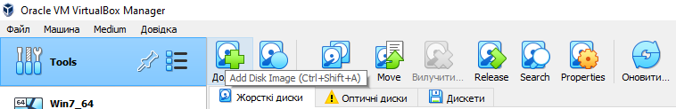
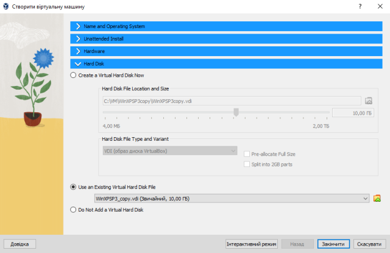

[<- До підрозділу](README.md)

# Початок роботи з Virtual Box

**Тривалість**: 0.5 - 1 акад. година.

**Мета:** Навчитися встановлювати Virtual Box та налаштовувати віртуальну машину Windows XP.

## Лабораторна установка.

**Необхідне апаратне забезпечення.** Для проведення лабораторних робіт необхідно мати комп’ютер з наступною мінімальною апаратною конфігурацією:

- CPU Intel/AMD 1 ГГц / RAM 2 ГБ / HDD 10 ГБ (вільних)  

**Необхідне програмне забезпечення.** 

1. На комп’ютері повинна бути встановлена одна з операційних систем, підтримуваних віртуальною машиною Virtual Box (https://www.virtualbox.org/wiki/Downloads):

   - Windows 

   - Mac OS X

   - Linux

   - Solaris

2) Безкоштовне програмне середовище віртуалізації Virtual Box https://www.virtualbox.org/wiki/Downloads 
3) Образ віртуальної машини з Windows XP SP3 та образ встановлювального диску
4) Інтернет-браузер та доступ до Інтернет. 

**Загальна постановка задачі**. Цілі роботи: 

1) підготовити віртуальне робоче місце для проведення різних лабораторних робіт

2) навчитися користуватися мінімальними можливостями середовищ віртуалізації на прикладі Virtual Box 

## Послідовність виконання роботи

### 1. Встановлення середовища віртуалізації VirtualBox

Увага, для адекватної роботи віртуальних машин необхідно активувати підтримку віртуалізації. 

- [ ] Перевірте чи в BIOS вашого ПК виставлена опція підтримки віртуалізації, якщо ні - активуйте її. 
- [ ] Завантажте VirtualBox з https://www.virtualbox.org/wiki/Downloads  програму відповідно до вашої операційної системи (рис.1.1)

- [ ] Запустити процес установки (рис.1.2)

рис.1

- [ ] Для налаштування середовища Virtual Box, необхідно зайти в меню File->Preferences… 

### 2. Встановлення готового образу віртуальної машини через імпорт

У даному прикладі встановлюється образ віртуальної машини через імпорт існуючої. Цей підхід базується на можливості перенесення усіх образів дисків та налаштувань віртуальної машини з одного середовища в інше. Якщо Ви не плануєте використовувати даний підхід, можете перейти до іншого пункту.      

- [ ] Завантажте образ віртуальної машини для віртуального робочого місця; Ви можете отримати репозиторій з одного з наведених нижче місць розташувань
  - [підготовлена віртуальна машина Windows XP з репозиторію курсу CMSC 449/691 Malware Analysis](https://redirect.cs.umbc.edu/courses/undergraduate/CMSC491malware/WindowsXP_Malware.ova) (Логін: Student, Пароль: infected)
  - 

- [ ] Запустіть на виконання VirtualBox. У вікні налаштування вибрати "Файл/імпортувати віртуальну машину" (рис.2) і вкажіть до образу віртуальної машини: папка «Дистанційна Пром мереж» файл FieldBus.ova

Рис.2

- [ ] Налаштуйте (конфігурувати) віртуальну машину з наступними параметрами (рис.1.5):

1.  Кількість оперативної пам’яті (>=1024 Мб);

2.  Місце збереження файлів віртуальної машини (вибрати самостійно)

- [ ] Після визначення параметрів конфігурування вибрати команду «Закінчити».

Рис.3

- [ ] Протягом певного часту машина буде імпортуватися про що свідчитиме вікно статусу, після закінчення імпорту віртуальна машина буде готова до експлуатації. 
- [ ] Відкрийте налаштування віртуальної машини через її контекстне меню, або через відповідний пункт головного меню

Рис.4

- [ ] Поступово передивіться усі налаштування, користуючись теоретичної частиною дізнайтеся про налаштування кожної з них
- [ ] У розділі пам'ять знайдіть розташування файлу образу диску, відкрийте папку його розміщення і подивіться на його розмір; не закривайте провідник, ця папка ще потрібна буде для наступних пунктів   
- [ ] Запустіть віртуальну машину. Для запуску віртуальної машини, вона вибирається зі списку і викликається команда «Запустити». 
- [ ] Якщо віртуальна машина запустилася, завершіть роботу. Якщо ні, спробуйте інший образ імпорту. 
- [ ] Якщо Ви не плануєте надалі використовувати цю віртуальну машину, видаліть її разом з усіма файлами:
  - у контекстному меню машини, або через однойменний пункт меню (при виділеній машині) виберіть пункт вилучити
  
  - у діалоговому вікні виберіть "Вилучити всі файли"
  
  - проконтролюйте, що образи дисків та файл налаштування були видалені  

### 3. Створення віртуальної машини через встановлення ОС власноруч

У даному пункті створюється віртуальна машина власноруч, та встановлюється на ньому необхідна ОС та налаштування. Якщо Ви не плануєте використовувати даний підхід можете перейти до наступного пункту. 

- [ ] Завантажте образ встановлювального диску ОС 

Надалі передбачається що це буде образ Windows XP SP3, який можна завантажити з одного з наведених нижче посилань:

- [Windows XP Original 32/64bit MSDN ISO Files SP0, SP1, SP2, SP3 - (English, German, Russian, Turkish) з https://archive.org](https://archive.org/download/windows-xp-all-sp-msdn-iso-files-en-de-ru-tr-x86-x64/en_windows_xp_professional_with_service_pack_3_x86_cd_vl_x14-73974.iso) (ключ встановлення V2C47-MK7JD-3R89F-D2KXW-VPK3J)

Однак Ви можете скористатися іншими образами, враховуючи що необхідно буде змінювати деякі налаштування.

- [ ] Через пункт `Машина -> Створити` створіть нову віртуальну машину з наступними налаштуваннями:
  - назва: WinXPSP3
  - folder: залиште за замовченням або змініть на своє розташування
  - Тип: Microsoft Windows
  - Версія: Widows XP (32 bit)
  - усі інші налаштування залиште за замовченням, вони будуть змінені через налаштування
  - натисніть "Закінчити" 

Рис.5

- [ ] Відкрийте налаштування віртуальної машини, змініть там наступні налаштування

  - У пункті `Система -> Материнська плата` :

    - для Основна пам'яті виберіть розмір `1024 Мб`, це встановить оперативної пам'яті, який виділяється для гостьової ОС
    - для Порядку завантаження за допомогою кнопки вверх, зробіть щоб спочатку система намагалася завантажитися з жорсткого диску, перед оптичним дсиком

    

     Рис.6 

  - У пункті `Пам'ять` для оптичного диску виберіть образ встановлювального диску, після чого файл образу буду відображатися в інформації 

    

     Рис.7

  - У пункті `Пам'ять` зверніть увагу на образ жорсткого диску, за замовченням він фізично динамічно змінює розмір, і має максимальний розмір 10 Гб.

  - Натисніть `Ok` для запису змін   

- [ ] Запустіть віртуальну машину. Автоматично запуститься інсталятор з образу оптичного диску. 
- [ ] Встановіть гостьову ОС, аналогічно якби Ви це робили на реальному ПК. У даному пункті передбачається що Ви вмієте встановлювати ОС.

Рис.8

- [ ] Після встановлення і усіпшного запуску віртуальної машини вважається що даний пункт виконано. 

**Варто зауважити, що надалі в занятті передбачається що використовується саме цей екземпляр віртуальної машини!**

### 4. Створення віртуальної машини через підключення образу диску

У даному пункті передбачається що у Вас є файл образу диску з встановленою ОС і Ви хочете підключити його до власної віртуальної машини. Спочатку треба зареєструвати образ диску в переліку образів Virtual Box, після чого створити машину і підключити туди образ.

Варто зауважити, що якщо потрібно використовувати існуючий образ, що зареєстрований у конкретному середовищі Vrtual Box, треба скопіювати образ через глобальні налаштування, щоб копія отримала новий ідентифікатор, інакше просте копіювання образів при підключенні буде видавати помилку.      

- [ ] Завантажте файл образу диску з встановленою ОС якщо Ви не робили попередній пункт 3 

Надалі передбачається що це буде образ Windows XP SP3, який був зроблений в попередньому пункті, його також можна завантажити за посиланням:

- [Образ диску зі встановленим Windows XP SP3](https://drive.google.com/file/d/1g4A0akrGTqqA-HueoLuoCL_EAvm572La/view?usp=sharing) 

Однак Ви можете скористатися іншими образами, враховуючи що необхідно буде змінювати деякі налаштування.

- [ ] Якщо Ви не робили попередній пункт (3) перемістіть звантажений файл образу в місце, яке передбачається для збереження образів
- [ ] Перейдіть в глобальні налаштування Virtual Box у меню видеріть `Media` 
- [ ] Якщо Ви завантажили образ з мережі використайте пункт "Додати" щоб додати образ диску в перелік образів

Рис.9

- [ ] Якщо Ви робили попередній пункт (3), виберіть потрібний образ  `WinXPSP3.vdi` в переліку та натисніть   `Скопіювати`:
- виберіть VDI, натисніть Next

Рис.10

- у налаштуваннях диску вкажіть розташування, де буде зберігатися копія образу, а розмір залиште за замовченням

Рис.11

- [ ] Через пункт `Машина -> Створити` створіть нову віртуальну машину з наступними налаштуваннями:
  - назва: WinXPSP3copy
  - folder: залиште за замовченням або змініть на своє розташування
  - Тип: Microsoft Windows
  - Версія: Widows XP (32 bit)
  - У розділі Hardware виставте пам'ять 1024 Мб
  - У розділі Hard Disk виберіть скопійований або зареєстрований образ (рис.12)

- натисніть "Закінчити" 

Рис.12

- [ ] Запустіть віртуальну машину. 

- [ ] Якщо Ви не плануєте надалі використовувати цю віртуальну машину, видаліть її разом з усіма файлами, однак варто зауважити, що надалі в занятті передбачається що використовується орбаз віртуальної машини з цього або попереднього (3) пункту. Для видалення віртуальної машини:

  - у контекстному меню машини, або через однойменний пункт меню (при виділеній машині) виберіть пункт вилучити

  - у діалоговому вікні виберіть "Вилучити всі файли"

  - проконтролюйте, що образи дисків та файл налаштування були видалені  

### 5. Встановлення та налаштування гостьових доповнень

У даному пункті необхідно встановити гостьові доповнення. Після встановлення гостьових доповнень стануть доступними додаткові можливості роботи з віртуальною машиною, такі як налаштування розширення екрану, додавання спільних папок і т.п. 

- [ ] Вилучіть диск з віртуального носія оптичного приводу віртуальної машини, якщо він там є і натисніть `Ок`. Це потрібно для того, щоб цей носій надалі використовувався для гостьового доповнення. 

Рис.13

- [ ] Запустіть віртуальну машину. Для запуску віртуальної машини, вона вибирається зі списку і викликається команда «Запустити».
- [ ] У меню віртуальної машини у пункті `Пристрої` виберіть `Встановити гостьові доповнення`

Рис.14

- [ ] Залиште всі пункти меню за замовченням і погодьтеся зі встановленням. 
- [ ] Встановлення може зайняти кілька хвилин. Після завершення встановлення усіх гостьових доповнень система запропонує перезавантажити віртуальну машину, натисніть `Finish` щоб машина перезавантажилася. 

- [ ] Після перезапуску переведіть вікно віртуальної машини у повноекранний режим за допомогою комбінації клавіш `Правий Ctrl + F`

Швидкі клавіші для роботи з віртуальною машиною для хостової ОС Windows

| Комбінація клавіш | Призначення                                                  |
| ----------------- | ------------------------------------------------------------ |
| Правий Ctrl + F   | Переключення вікна віртуальної машини між повноекранним та віконним режимом |
| Правий Ctrl + С   | Перехід вікна віртуальної машини в режим масштабування       |
| Правий Ctrl + Н   | Завершити роботу віртуальної машини                          |
| Правий Ctrl + Del | Відіслати віртуальній машині команду Ctrl + Alt + Del        |
| Правий Ctrl + E   | Зробити знімок екрана віртуальної машини                     |

- [ ] Зверніть увагу, що меню віртуальної машини тепер спливне, і знаходиться внизу або згори вінка гостьової ОС.
- [ ] Переведіть вікно віртуальної машини у віконний режим 

### 6. Додавання спільної папки

У даному пункті необхідно добавити спільну папку для можливості обміну файлами між віртуальною машиною та хостовою ОС.  

- [ ] Вимкніть віртуальну машину, якщо вона увімкнена.
- [ ] Зайдіть в налаштування віртуальної машини. У вкладці `Спільні теки` натисніть кнопку додавання нових папок. 
- [ ] Виберіть папку яка буде використовуватися для обміну між хостовою та гостьовою ОС та натисніть `Ок`

Рис.15

- [ ] Запустіть віртуальну машину. Перевірте що папка доступна як зовнішній диск. Спробуйте перекопіювати якісь файли з гостьової ОС на хостову.

Даний образ віртуальної машини використовується в інших модулях посібника "Автоматизації технологічних процесів та виробництв" 

Практичне заняття розробив [Олександр Пупена](https://github.com/pupenasan). 
