[<- До підрозділу](README.md)		[Коментувати](#feedback)

# Встановлення ВМ з Debian: практичне заняття

**Тривалість**: 30 хв 

**Мета:** Навчитися встановлювати та налаштовувати віртуальну машину з Debian.

## Лабораторна установка.

**Необхідне апаратне забезпечення.** Для проведення лабораторних робіт необхідно мати комп’ютер з наступною мінімальною апаратною конфігурацією:

- CPU Intel/AMD 1 ГГц / RAM 2 ГБ / HDD 10 ГБ (вільних)  

**Необхідне програмне забезпечення.** 

1. Інтернет-браузер та доступ до Інтернет. 

**Загальна постановка задачі**. 

Цілі роботи: 

1) підготовити віртуальне робоче місце для проведення різних лабораторних робіт з використанням Linux (Debian) 

## Послідовність виконання роботи

## 1. Встановлення Virtual Box

- [ ] Якщо на ПК не встановлений Virtual Box, необхідно встановити його. Для цього можна скористатися рекомендаціями, які наведені в прикладі [за посиланням](lab.md)

Нижче описані два варіанти встановлення Debian: 

- через завантаження готового образу, готовий образ але не самий свіжий 
- або через встановлення з дистрибутиву, остання версія і встановлюється з кастомними налаштуваннями

## 2. Варіант 1. Створення віртуальної машини через підключення образу (Debian 11)

У даному пункті створюється віртуальна машина Debian.  

- [ ] Завантажте образ диску з встановленим Debian https://www.osboxes.org/debian/#debian-11-vbox. Надалі передбачається що завантажена серверна ліцензія. На вкладці `Info` вказана інформація про образ


```
Username: osboxes
Password: osboxes.org
Root Account Password: osboxes.org
Guest Tools: Installed
```

- [ ] Розпакуйте образ в місце, де знаходяться інші образи віртуальних машин на Вашому ПК. Перейменуйте назву файлу так, щоб вона не містила пробіли і дужки, наприклад `Debian11Server64bit` 
- [ ] Перейдіть в глобальні налаштування Virtual Box у меню видеріть `Media`. Використайте пункт "Додати" щоб додати образ диску в перелік образів.
- [ ] Через пункт `Машина -> Створити` створіть нову віртуальну машину з наступними налаштуваннями:
- назва: `Debian11Server64bit`
- folder: залиште за замовченням або змініть на своє розташування
- Тип: Linux
- Версія: Debian 11 (64 bit)
- У налаштуваннях Hard Disk підключіть завантажений образ 

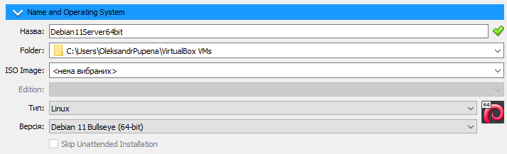

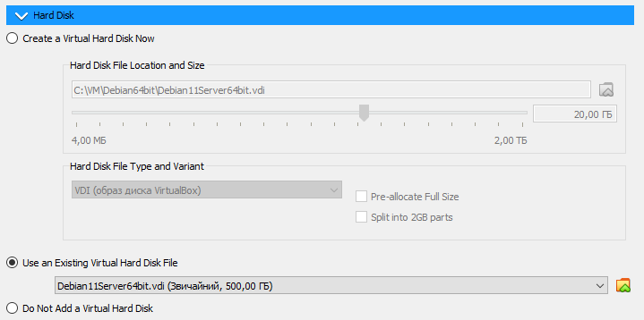

рис.1.1

- натисніть "Закінчити" 

- [ ] Запустіть віртуальну машину. Використовуючи наведену вище інформацію, залогуйтеся в системі.

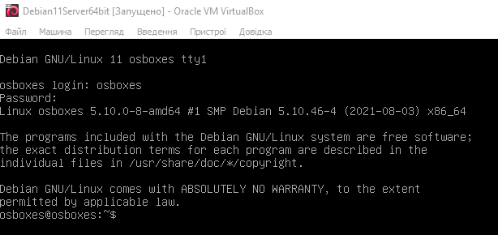

рис.1.2.

- [ ] Виконайте команду `ping 8.8.8.8` щоб переконатися, що є зв'язок гостьової ОС з Інтернетом, після чого натисніть комбінацію `CTRL+C` щоб перервати роботу команди. 

## 2. Варіант 2. Створення віртуальної машини шляхом встановлення з дистрибутиву Debian 13

### 2.1. Налаштування віртуальної машини для встановлення ОС Debian 13

- [ ] Завантажте образ дистрибутива Debian [за цим посиланням ](https://www.debian.org/download). на момент написання даного практичного заняття актуальним є  Debian 13 (*trixie*).
- [ ] У VirtualBox створіть нову віртуальну машину, дайте їй ім'я, наприклад `debian132` , а в налаштуваннях ISO Image вкажіть розміщення образу, виставте опцію `Skip Unattended Installation` (рис.2.1)  

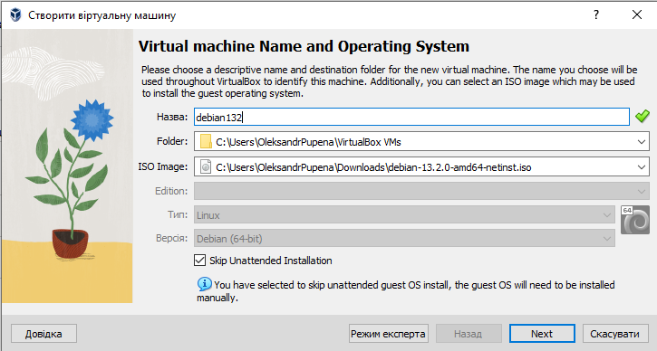

рис.2.1.

- [ ] На наступній сторінці виставте 4 Гб ОЗП та 2 CPU

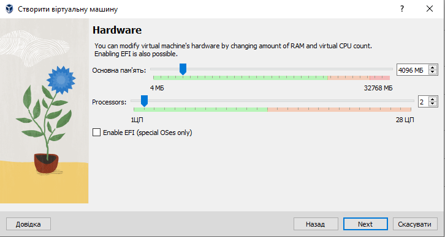

рис.2.2.

- [ ] Виділіть необхідну кількість дискової пам'яті для майбутнього використання (рис.2.3)

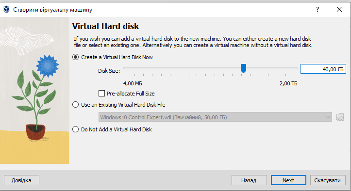

рис.2.3. 

- [ ] У наступному вікні ознайомтеся з налаштуваннями і натисніть `Закінчити` (рис.2.4)

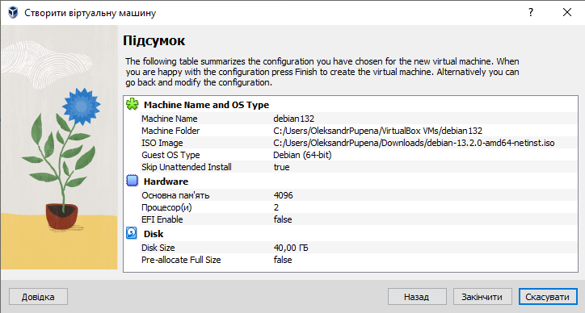

рис.2.4 

### 2.2. Встановлення ОС Debian 13 на віртуальну машину

- [ ] Запустіть віртуальну машину
- [ ] У меню вибору способу інсталяції виберіть `Graphical install` 

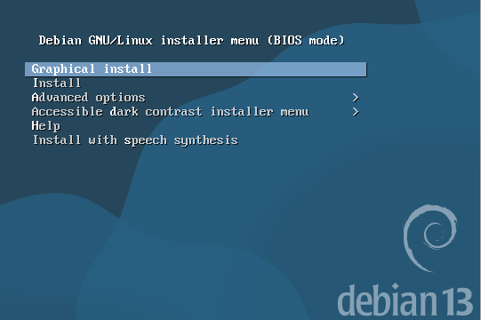

рис.2.5.

- [ ] Виберіть мову, у даному прикладу буде вибрана англійська (рис.2.6)

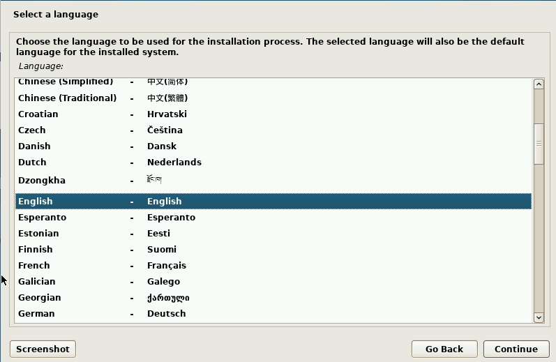

рис.2.6.

- [ ] У наступних вікнах виберіть локацію і локаль
- [ ] Виберіть клавіатуру

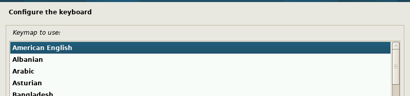

рис.2.7.

- [ ] Дочекайтеся коли з'явиться налаштування мережного імені, впишіть мі'я  

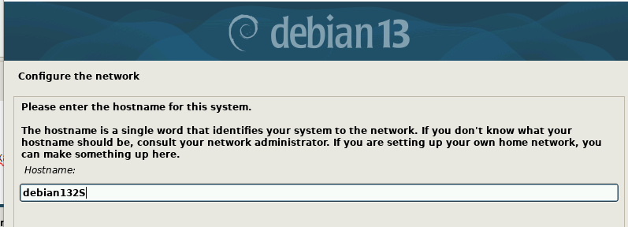

рис.2.8.

- [ ] У вікні доменного імені можете залишити поле порожнім
- [ ] У наступному вікні не задавайте пароль для root

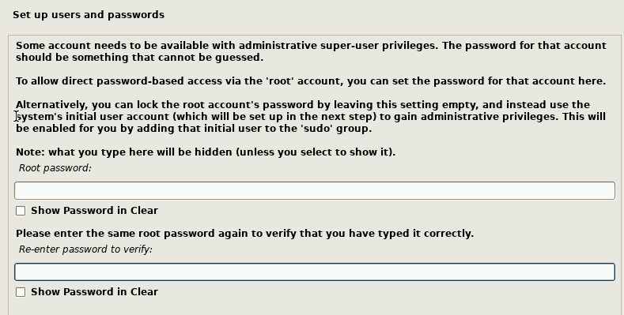

рис.2.9.

- [ ] У наступному вікні необхідно ввести повне ім'я користувача

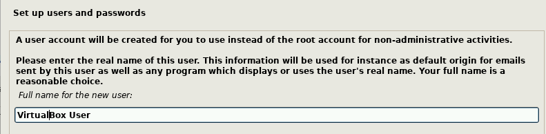

рис.2.10

- [ ] У наступному вікні необхідно ввести логін користувача

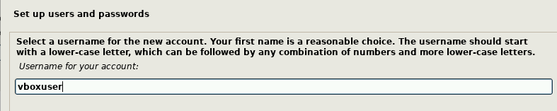

рис.2.11

- [ ] У наступному вікні необхідно ввести пароль користувача, для тестової машини для практичних занять можете ввести нескладний пароль

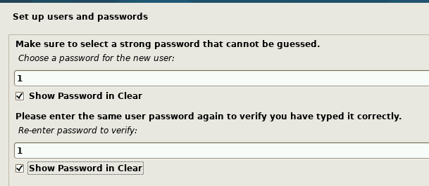

рис.2.12

- [ ] Наступні пункти залиште без змін

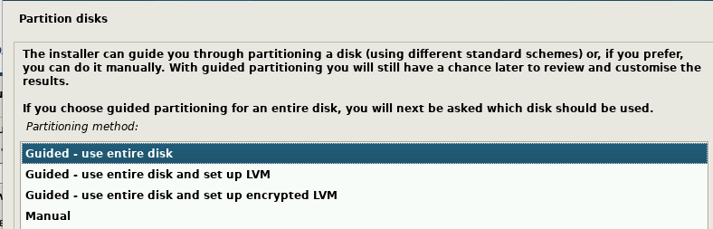

рис.2.13

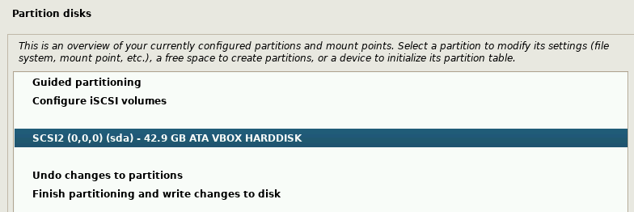

рис.2.14.

- [ ] У наступному пункті виберіть `Yes`

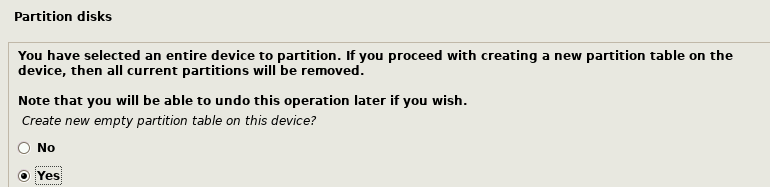

рис.2.15. 

- [ ] У наступному пункті виберіть `pri/log` і натисніть `Continue`


рис.2.16. 

- [ ] У наступному пункті виберіть `Automatically ...` і натисніть `Continue`

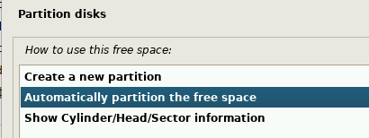

рис.2.17.

- [ ] У наступному пункті залиште `All files ...` і натисніть `Continue`

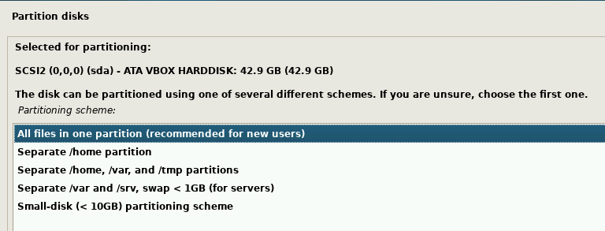

рис.2.18.

- [ ] У наступному пункті натисніть `Continue`

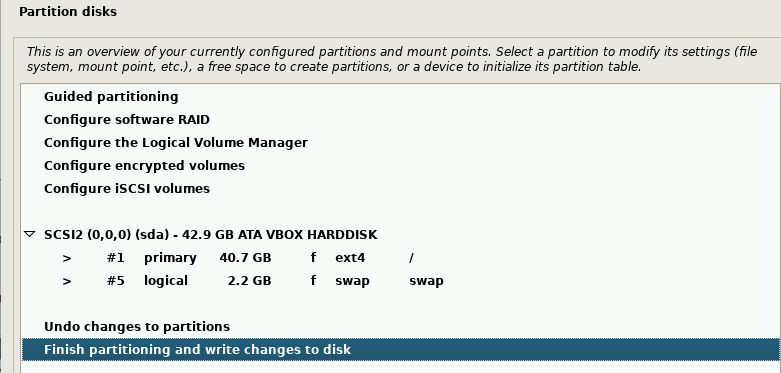

рис.2.19.

- [ ] У наступному пункті виберіть `Yes` і натисніть `Continue`

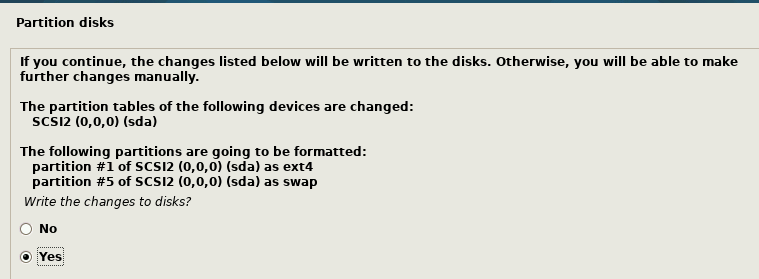

рис.2.20.

- [ ] У наступному пункті залиште `No` і натисніть `Continue`

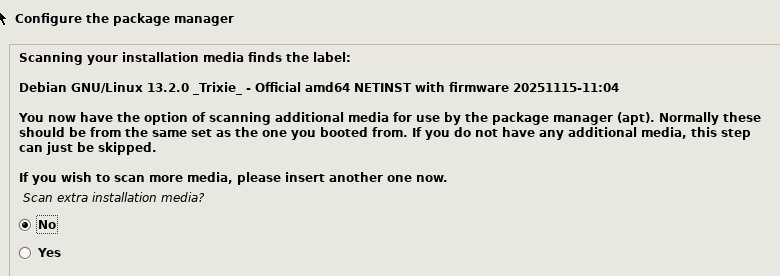

рис.2.21.

- [ ] У наступному пункті виберіть `Ukraine` і натисніть `Continue`

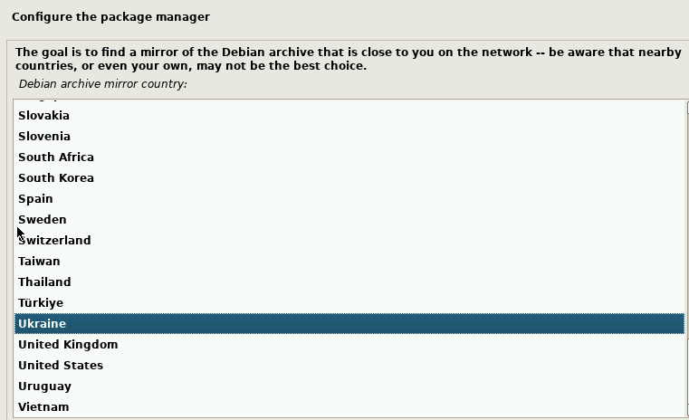

рис.2.22.

- [ ] У наступному пункті залиште за замовченням і натисніть `Continue`

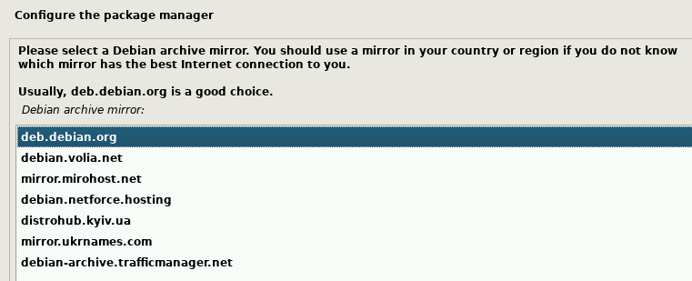

рис.2.23.

- [ ] У наступному пункті залиште поле порожнім і натисніть `Continue`

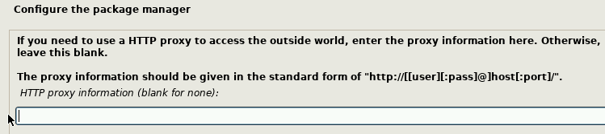

рис.2.24.

- [ ] У наступному пункті залиште `No` і натисніть `Continue`

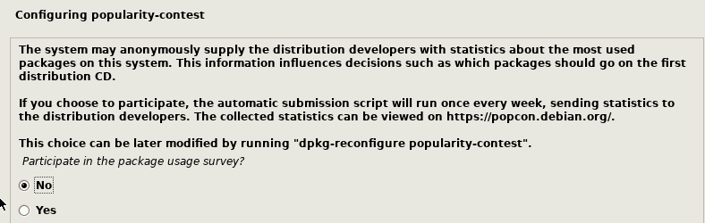

рис.2.25.

- [ ] У наступному пункті виберіть опції `SSH Server` і `standart system utilities` , інші приберіть і натисніть `Continue`

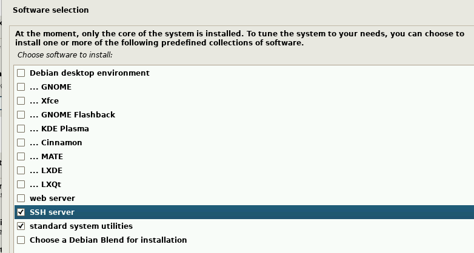

рис.2.26.

- [ ] У наступному пункті залиште `Yes`  і натисніть `Continue`

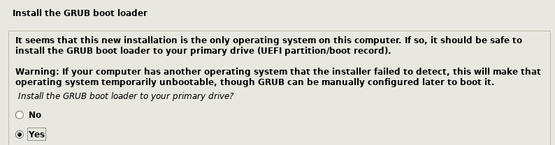

рис.2.27.

- [ ] У наступному пункті виберіть `/dev/sda`  і натисніть `Continue`

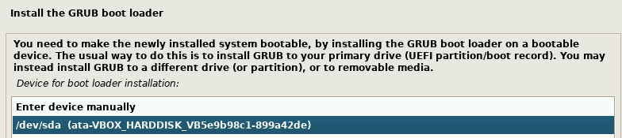

рис.2.28.

- [ ] Після цього з'явиться вікно про завершення інсталяції, після чого натисніть кнопку для перезавантаження. 

- [ ] Запустіть віртуальну машину. Використовуючи наведену вище інформацію, залогуйтеся в системі.

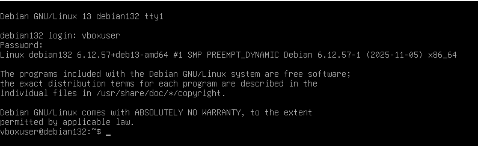

рис.2.29.

- [ ] Виконайте команду `ping 8.8.8.8` щоб переконатися, що є зв'язок гостьової ОС з Інтернетом, після чого натисніть комбінацію `CTRL+C` щоб перервати роботу команди. 

## 3. Налаштування доступу з мережі та хоста

### 3.1. Налаштування та перевірка зв'язку

- [ ] Встановіть на VM Debian Samba

```
sudo apt update 
sudo apt install samba
```

- [ ] Налаштуйте віртуальну мережі на зв'язок типу "міст" ("проміжний адаптер") з мережною картою хостової машини, що має доступ до Інтернету напряму а не через NAT хостової машини (рис.2).

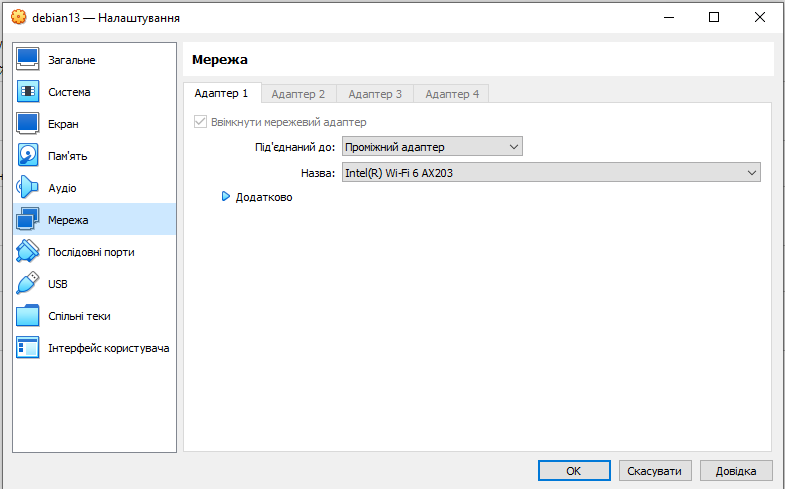

рис.2. Приклад налаштування мережної карти VM Debian

- [ ] Дізнайтеся IP адресу VM Debian, наприклад

```
ip -4 a 
```

- [ ] Перевірте доступність віртуальної машин з хостової, з командного рядку, вказавши потрібний IP

```
ping 192.168.1.103
```

- [ ] Перевірте доступність по імені VM Debian, наприклад

```
ping debian132
```

### 3.2. Доступ з PuTTY

- [ ] Завантажте Putty на VM Windows [посиланням](https://www.chiark.greenend.org.uk/~sgtatham/putty/latest.html) . Ця утиліта дає можливість підключатися до різноманітних пристроїв в термінальному режимі.
- [ ] Запустіть `Putty`. У полі `Host Name`  впишіть IP адресу або ім'я VM Debian. У полі `Saved Session` впишіть назву підключення, наприклад `Debian`, через яке Ви зможете підключатися пізніше, зробивши вибір, і натисніть `Save`. Після цього натисніть `Open` щоб відкрити сессію.   

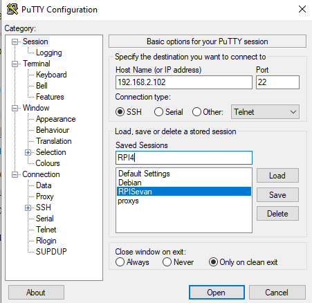

рис.3.

- [ ] Перший раз при підключенні, Putty зробить попередження, натисніть `Accept` щоб погодитися.

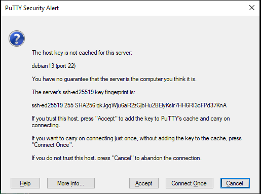

рис.4.

Це стандартне вікно PuTTY Security Alert, яке з’являється при першому підключенні до нового SSH-сервера. Тут повідомляється таке:

- `The host key is not cached for this server` - ключ цього сервера (`debian13`, порт 22) ще не збережений у кеші PuTTY. Тобто програма не знає, чи справді це та сама машина, до якої ви хочете підключитися.
- `You have no guarantee that the server is the computer you think it is` - попередження, що немає гарантії автентичності сервера (бо ключ бачиться вперше).
- Далі показано `fingerprint ключа сервера` (відбиток ключа SSH, у цьому випадку `ssh-ed25519 255 SHA256:...`). Це унікальний ідентифікатор ключа SSH сервера.

Є кілька варіантів дій:

- `Accept` — прийняти ключ і зберегти його у кеш PuTTY. Надалі при підключенні PuTTY перевірятиме, що сервер дає той самий ключ.
- `Connect Once` — підключитися тільки цього разу, не зберігаючи ключ. Наступного разу таке вікно з’явиться знову.
- `Cancel` — скасувати підключення.
- [ ] Натисніть `Accept`. Відкриється вікно терміналу, введіть користувача та пароль. Зверніть увагу, що при введенні паролю, він не відображається (навіть зірочками). 

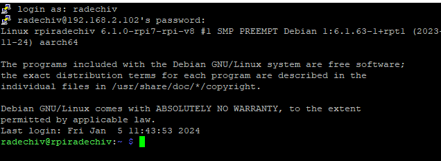

рис.5.

Термінал працює з використанням захищеного протоколу `ssh`, який був активований при створенні образу. Доступ по SSH можна відключити в будь який момент. При підключенні до реального пристрою з Linux, Putty дає можливість працювати в командному режимі з Windows. 

### 3.3. Доступ з WinSCP

- [ ] Звантажте та встановіть на VM Windows 10 WinSCP https://sourceforge.net/projects/winscp/ . Цей застосунок дає можливість підключатися до файлової системи ОС Linux через SSH та інші способи комунікації та працювати з нею через табличне представлення
- [ ] Запустіть WinSCP на виконання. У полі `Вузол`  впишіть IP адресу або ім'я пристрою VM Debian. У полях `login`  і `пароль` впишіть відповідно ім'я користувача і пароль, а збережіть налаштування за допомогою кнопки `зберегти`, щоб потім Ви змогли підключатися пізніше, зробивши вибір. Після цього натисніть `Login` щоб відкрити сесію.   

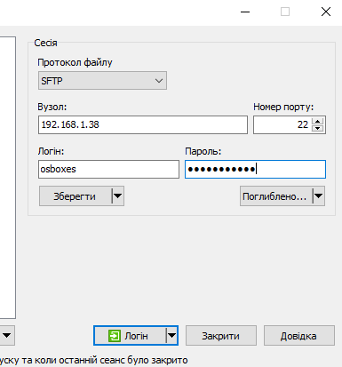

рис.6.

- [ ] Перший раз при підключенні як і випадку з Putty, вийде попередження, натисніть `Accept` щоб погодитися. Відкриється навігатор, в якому перейдіть на верхній рівень в кореневу директорію.

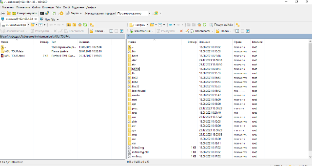

рис.7.

Тепер можна отримувати та записувати файли через табличне представлення.  

## Джерела

1. 


## Автори

Практичне заняття розробив [Олександр Пупена](https://github.com/pupenasan). 

Подяка учасникам спільноти, які надали схеми та коментарі для прикладів.

## Feedback

Якщо Ви хочете залишити коментар у Вас є наступні варіанти:

- [Обговорення у WhatsApp](https://chat.whatsapp.com/BRbPAQrE1s7BwCLtNtMoqN)
- [Обговорення в Телеграм](https://t.me/+GA2smCKs5QU1MWMy)
- [Група у Фейсбуці](https://www.facebook.com/groups/asu.in.ua)

Про проект і можливість допомогти проекту написано [тут](https://asu-in-ua.github.io/atpv/)
