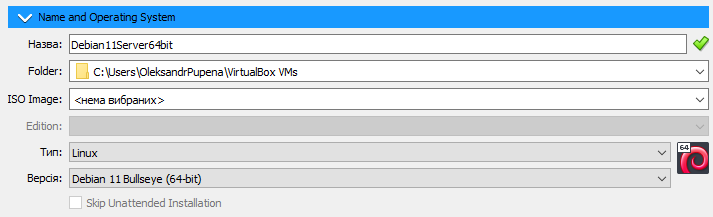

[<- До підрозділу](README.md)

# Встановлення ВМ з Linux (Debian)

**Тривалість**: 30 хв 

**Мета:** Навчитися встановлювати та налаштовувати віртуальну машину з Raspberry Pi OS Desktop.

## Лабораторна установка.

**Необхідне апаратне забезпечення.** Для проведення лабораторних робіт необхідно мати комп’ютер з наступною мінімальною апаратною конфігурацією:

- CPU Intel/AMD 1 ГГц / RAM 2 ГБ / HDD 10 ГБ (вільних)  

**Необхідне програмне забезпечення.** 

1. На комп’ютері повинен бути встановлений Virtual Box (https://www.virtualbox.org).

2) Інтернет-браузер та доступ до Інтернет. 

**Загальна постановка задачі**. 

Цілі роботи: 

1) підготовити віртуальне робоче місце для проведення різних лабораторних робіт з використанням Linux (Debian) 

## Послідовність виконання роботи

- [ ] Якщо на ПК не встановлений Virtual Box, необхідно встановити його. Для цього можна скористатися рекомендаціями, які наведені в прикладі [за посиланням](lab.md)


### 1. Створення віртуальної машини через підключення образу

У даному пункті створюється віртуальна машина Debian.  

- [ ] Завантажте образ диску з встановленим Debian https://www.osboxes.org/debian/#debian-11-vbox. Надалі передбачається що завантажена серверна ліцензія. На вкладці `Info` вказана інформація про образ


```
Username: osboxes
Password: osboxes.org
Root Account Password: osboxes.org
Guest Tools: Installed
```

- [ ] Розпакуйте образ в місце, де знаходяться інші образи віртуальних машин на Вашому ПК. Перейменуйте назву файлу так, щоб вона не містила пробіли і дужки, наприклад `Debian11Server64bit` 
- [ ] Перейдіть в глобальні налаштування Virtual Box у меню видеріть `Media`. Використайте пункт "Додати" щоб додати образ диску в перелік образів.
- [ ] Через пункт `Машина -> Створити` створіть нову віртуальну машину з наступними налаштуваннями:
- назва: `Debian11Server64bit`
- folder: залиште за замовченням або змініть на своє розташування
- Тип: Linux
- Версія: Debian 11 (64 bit)
- У налаштуваннях Hard Disk підключіть завантажений образ 




- натисніть "Закінчити" 

- [ ] Запустіть віртуальну машину. Використовуючи наведену вище інформацію, залогуйтеся в системі.


- [ ] Виконайте команду `ping 8.8.8.8` щоб переконатися, що є зв'язок гостьової ОС з Інтернетом, після чого натисніть комбінацію `CTRL+C` щоб перервати роботу команди. 

Практичне заняття розробив [Олександр Пупена](https://github.com/pupenasan) 
