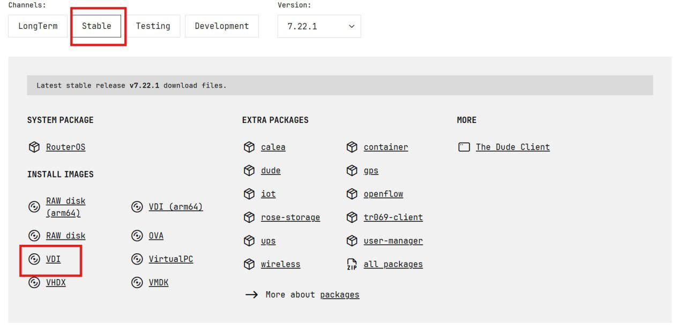
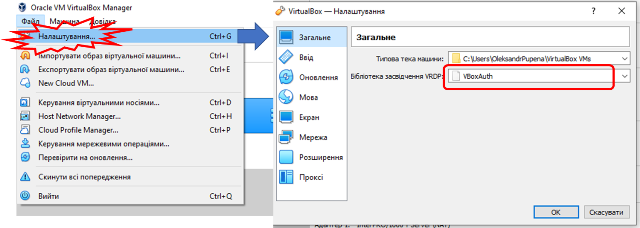
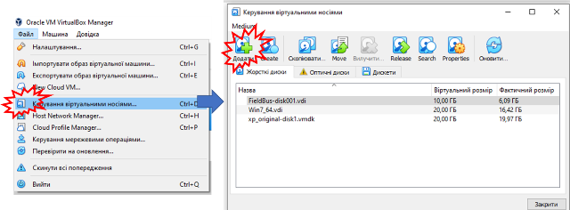
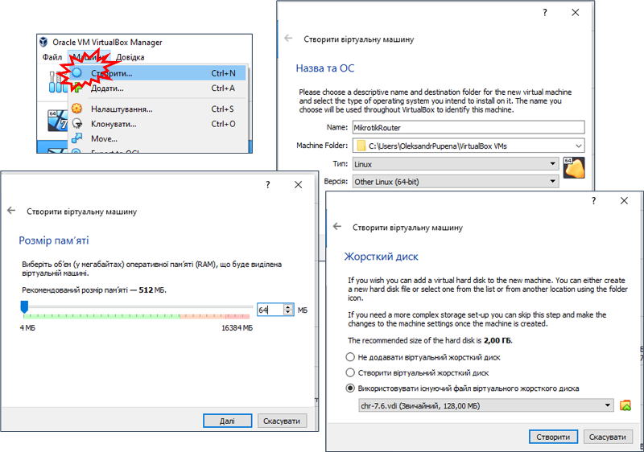
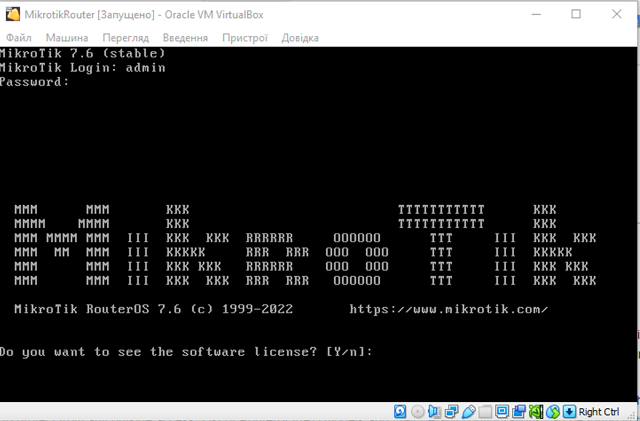
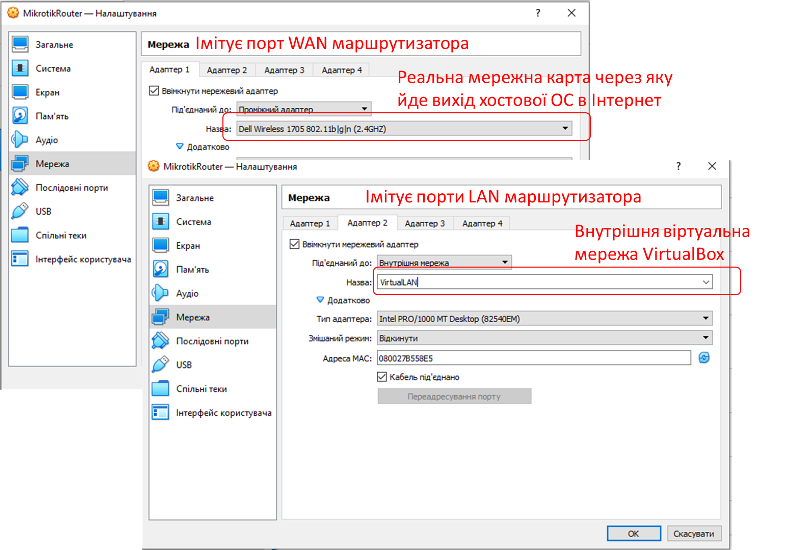
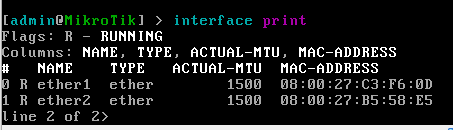
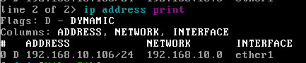
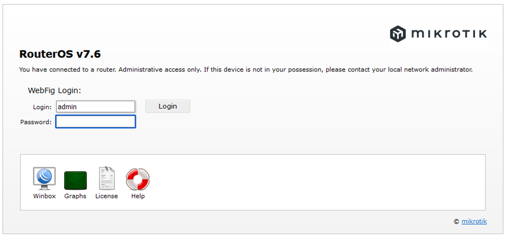

[<- До підрозділу](README.md)		[Коментувати](#feedback)

# Встановлення віртуальної машини для маршрутизатору Mikrotik

**Тривалість**: 0.5 акад. годин.

**Мета:** Навчитися встановлювати та налаштувувати віртуальну машину з ОС Mikrotik. 

### 1. Завантаження та добавлення в список образу віртуальної машини Mikrotik

- [ ] Завантажте образ віртуальної машини `*.vdi` за посиланням: <https://mikrotik.com/download/chr>, вибирайте стабільну версію з переліку `Cloud Hosted Router (CHR)` VDI Image. 

рис.1.

- [ ] Запустіть Virtual Box. Дізнайтеся про розміщення образів дисків віртуальних машин (рис.Д2). Розархівуйте файл в папку, де знаходяться образи дисків віртуаульних машин VirtualBox Manager. Це не обов'язково, але в цьому випадку усі образи будуть знаходитися в тому ж місці. 

рис.2.

- [ ] Додайте образ диску до списку віртуальних носіїв 

рис.3.

### 2. Встановлення та перший запуск віртуальної машини Mikrotik

- [ ] У VirtualBox Manager створіть нову віртуальну машину з наступними налаштуваннями:
- тип - Linux
- версія - Other Linux (64 bit)
- Розмір пам'яті - 64 Мб
- 1 ядро
- Використовувати існуючий файл віртуального жорсткого диску - вказати завантажений образ

рис.4.

- [ ] Запустіть віртуальну машину. Дочекайтеся коли буде запрошення на введення паролю. Введіть користувача `admin` а при запиті пароль натисніть `Enter` (без паролю).

рис.5.

- [ ] На запрошення передивитися ліцензію натисніть `n`
- [ ] Введіть свій новий пароль при запрошенні паролю, наприклад `1`.  
- [ ] Вимкніть віртуальну машину.

### 3. Добавлення мережних карт та їх налаштування через консоль

- [ ] У VirtualBox Manager налаштуйте існуючу мережну карту та добавте нову.
- Адаптер 1: буде виступати в якості порта WAN (наприклад для виходу в Internet) віртуального машрутизатора; тут треба вказати ту мережну карту вашої хостової ОС, що використовується для виходу в реальну мережу.   
- Адаптер 2: буде виступати в якості портів LAN, до яких будуть підключатися інші віртуальні машини; тут треба виставити прив'язку до внутрішньої віртуальної мережі, яку назвіть `VirtualLan`  

рис.6.

- [ ] Запустіть віртуальну машину. Введіть користувача та пароль
- [ ]  Виведіть список мережних карт за допомогою команди `interface print` . Повинно бути дві мережні карти.

рис.7.

- [ ] Виведіть IP адресу, яка надана віртуальній мережі WAN через команду `ip address print`

рис.Д8.

**Увага! У лабораторній роботі передбачається що IP-адреси видаються в реальній мережі динамічно. Якщо це не так скористуйтеся командою `ip address add address=192.168.10.1/24 interface=ether1`  для добавлення реальної адреси IP, де замість `192.168.10.1` буде необхідна статична адреса** 

- [ ] На хостовій ОС відкрийте браузер і введіть виведену адресу. Ви повинні попасти у веб-консоль налаштування ОС маршрутизатору.

рис.9.

Документація по ОС Mikrotik доступна за посиланням <https://wiki.mikrotik.com/wiki/Manual:TOC> 

## Автори

Практичне заняття розробив [Олександр Пупена](https://github.com/pupenasan). 

## Feedback

Якщо Ви хочете залишити коментар у Вас є наступні варіанти:

- [Обговорення у WhatsApp](https://chat.whatsapp.com/BRbPAQrE1s7BwCLtNtMoqN)
- [Обговорення в Телеграм](https://t.me/+GA2smCKs5QU1MWMy)
- [Група у Фейсбуці](https://www.facebook.com/groups/asu.in.ua)

Про проект і можливість допомогти проекту написано [тут](https://asu-in-ua.github.io/atpv/)
