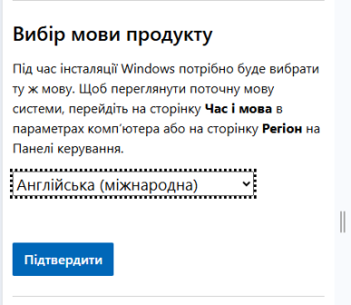
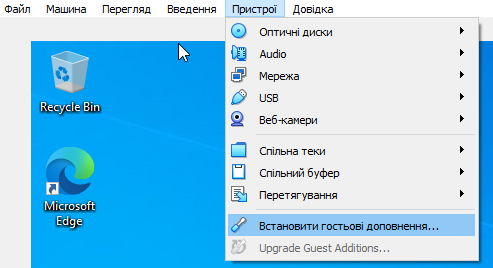
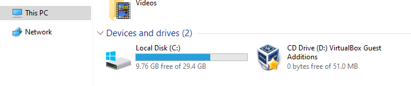
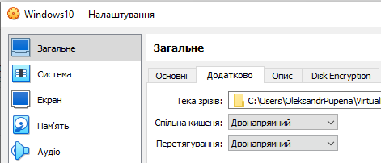

[<- До підрозділу](README.md)

# Встановлення та налаштування ВМ з Windows 10

**Тривалість**: 1 год 

**Мета:** Навчитися встановлювати та налаштовувати віртуальну машину з Windows 10

## Лабораторна установка.

**Необхідне апаратне забезпечення.** Для проведення лабораторних робіт необхідно мати комп’ютер з наступною мінімальною апаратною конфігурацією:

- CPU Intel/AMD 2 ГГц / RAM 16 ГБ / Диск 20 ГБ (вільних)  

**Необхідне програмне забезпечення.** 

1. На комп’ютері повинен бути встановлений Virtual Box (https://www.virtualbox.org).

2) Інтернет-браузер та доступ до Інтернет. 

**Загальна постановка задачі**. 

Цілі роботи: 

1) Підготовити віртуальне робоче місце для проведення різних лабораторних робіт з використанням Window 10 

## Послідовність виконання роботи

### 1. Встановлення Virtual Box та перевірка віртуалізації

- [ ] Ознайомтеся з основними теоретичними відомостями з теоретичного заняття [Основи віртуалізації з використанням Virtual Box](teor.md)
- [ ] Завантажте VirtualBox з https://www.virtualbox.org/wiki/Downloads відповідно до вашої операційної системи (рис.1а).


рис.1а.

- [ ] Запустіть процес установки (рис.1б)


рис.1б.

- [ ] Перевірте що увімкнена віртуалізація. Для цього запустіть диспетчер завдань (CTRL+ALT+DEL), на вкладці `Продуктивність` має бути `Віуртуалізація увімкнута` (рис.1в).


рис.1в. Перевірка увімкненої віртуалізації за допомогою диспетчера задач

- [ ] Якщо віртуалізація вимкнена то для продовження виконання практичної роботи необхідно увімкнути віртуалізацію у налаштуваннях Bios. Спосіб як це зробити відрізняється від типу PC, тому виходить за рамки даної роботи. Зазвичай вони знаходяться в розділах `Advanced → CPU Configuration` або `Security` з подібними налаштуваннями:    

  - для Intel це може бути  параметри
    - `Intel Virtualization Technology (VT-x)`
    - `Intel VT-d` (для пристроїв, не завжди треба).

  - для AMD
    - `SVM Mode`
    - іноді `AMD-V`.

### 2. Завантаження образу ОС Windows 10

Для наступного виконання практичних  робіт у вас повинен бути образ інсталяції ОС Windows. Якщо його немає на локальному ПК, можна завантажити його з сайту Microsoft.  Знайти пряме посилання на образ ISO Windows 10 можна на сайті Microsoft. Але це може бути ускладнено, якщо ви заходите з Windows-пристрою, бо сайт перенаправляє вас на завантаження через `Media Creation Tool`. Один із способів обійти це - зробити завантаження через зміну `User-Agent` у браузері. Microsoft зазвичай дозволяє пряме завантаження ISO, якщо сайт "думає", що ви заходите з іншої ОС (не Windows). Тому для завантаження образу з сайту Microsoft виконайте наступну послідовність:

- [ ] Відкрийте сторінку завантаження Windows 10: <https://www.microsoft.com/uk-ua/software-download/windows10>
- [ ] У вашому браузері натисніть `F12` (або `Ctrl+Shift+I`) - відкриється `Developer Tools` 
- [ ] Активуйте емуляцію мобільного пристрою (наприклад, Chrome на Android або іншу ОС), у браузері Chrome та Firefox це виглядає як на рис.2,  

 

рис.2. Активація емуляція мобільного пристрою

- [ ] Перезавантажте сторінку (`F5`) — має з’явитися форма для вибору редакції, мови та архітектури з кнопками для прямого завантаження ISO. 
- Виберіть випуск і натисніть "Підвтердити" (рис.3)
- Після того виберіть мову продукту і натисніть "Підвтердити" (рис.4)


рис.3. 



рис.4. 

- [ ] У розділі завантаження виберіть 64-розрядну версію ОС. Після чого почнеться завантаження.


рис.5.

### 3. Створення віртуальної машини

У даному пункті створюється віртуальна машина власноруч, та встановлюється на ньому ОС Windows 10 та налаштування.

- [ ] Запустіть Virtual Box. Через пункт `Машина -> Створити` запусіть помічник по створенню нової віртуальної машини (**ВМ**): 
- Вкажіть унікальну для Вашої Virtual Box назву ВМ, наприклад `Windows10`
- Виберіть ISO Image, завантажений в п.2 
- Виставте опцію `Skip Unattened Instalation` для того щоб самому встановлювати ОС Windows. Якщо Ви залишите цю опцію вимкненою, VirtualBox спробує встановити Windows майже без вашої участі (сам введе стандартні параметри: мова, часовий пояс, ім’я користувача тощо), цей варіант можливий тільки якщо у Вас є ключ ліцензії. Якщо ж у Вас немає ключа ліцензії, Ви зможете поставити Windows в режимі 30 дневного пробного використання, вибір такої опції можливий лише за інтерактивного встановлення. 


рис.6. Початкові налаштування майстра встановлення

- [ ] Вкажіть пам'ять та кількість процесорів, які виділяються для ВМ. Ці параметри можна буде змінити пізніше.


рис.7. Налаштування обчислювальних ресурсів

- [ ] Вкажіть розмір дискового простору для ВМ, усі інші параметри залиште за замовченням (рис.8). Пояснимо параметри:

- `Create a Virtual Hard Disk Now` (створити віртуальний диск зараз) cтворює новий файл (наприклад, `.vdi`), у якому буде розміщена вся система. При цьому:
  - `Disk Size` (розмір диска) - це максимальний розмір майбутнього віртуального диска. У прикладі на рис.8 виставлено 31,03 ГБ. Windows 10 мінімально потребує ~20 ГБ, але для комфортної роботи краще ставити 40–60 ГБ. Якщо плануєте ставити додаткові програми можна дати більше. Цей розмір можна буде змінювати і після використання ВМ, однак через консольну утиліту конфігурування VirtualBox.
  - `Pre-allocate Full Size` (виділити весь обсяг одразу). Якщо ця опція не увімкнена (за замовчуванням) диск буде динамічним, тому файл займає на вашому реальному диску лише стільки місця, скільки реально використано всередині VM. Наприклад, Windows + кілька програм = 15 ГБ, навіть якщо ліміт 50 ГБ. Якщо опція `увімкнена`, то файл відразу займе увесь вказаний обсяг (наприклад, 50 ГБ). Це може трохи пришвидшити роботу, але з’їсть місце на хості. 
- `Use an Existing Virtual Hard Disk File` (використати наявний файл диска) вибирається в тому випадку, якщо у вас вже є готовий `.vdi`, `.vhd` або `.vmdk` , наприклад, клон іншої VM, який можна підключити до віртуальної машини. Це віртуалізація випадку підключення реального існуючого диску до реальної машини. 
- `Do Not Add a Virtual Hard Disk` (не створювати диск) використовується рідко. Система тоді буде без вбудованого HDD. Можна завантажитися тільки з ISO, LiveCD або додати диск пізніше. Для Windows цей варіант не підходить.


рис.8. Налаштування віртуального диску.

- [ ] Далі у вікні підсумку відображатимуться усі вибрані налаштування (рис.9). Натискання кнопки "Закінчити приведе до створення ВМ"


рис.9.

- [ ] Відкрийте налаштування створеної ВМ , вибравши відповідний пункт контекстного меню. Поступово переходячи між різними закладками подивіться наступні налаштування:
- Загальне (усі вкладки)
- Система (усі вкладки)
- Пам'ять. 

- [ ] У налаштуваннях пам'яті (постійної) зверніть увагу на те, що в системі за замовченням два пристрої постійної пам'ятї (рис.10):
- віртуальний диск ВМ (`Windows10.vdi`)
- віртуальний оптичний привід CD/DVD, у який встановлено образ інсталятора ОС.     


рис.10. Налаштування енергонезалежної пам'яті.

- [ ] У налаштуваннях системи, зверніть увагу на порядок завантаження ОС (рис.11). Для ВМ це аналогічно налаштуванням BIOS для реального PC.  


рис.11. Щодо порядку завантаження ОС.

За таких налаштувань, враховуючи що у віртуальний привод оптичного диску "вставлено" образ дистрибутива Windows, він буде запускатися автоматично при запуску ВМ. 

### 4. Встановлення Windows 10 на ВМ

- [ ] Виділіть новостворену ВМ в списку і натисніть `Запустити`. Враховуючи що у віртуальний привод оптичного диску "вставлено" образ дистрибутива Windows, він буде запускатися автоматично при запуску ВМ. 

- [ ] При інсталяції виберіть мову та клавіатуру, далі `Next` , у наступному вікні `Install now`


рис.12.


рис.13.

- [ ] У вікні активації Windows (рис.14) виберіть `I dont have a product key`, оскільки ми встановлюємо Windows для пробного використання.


рис.14.

- [ ] Далі виберіть варіант ОС (рис.15), для професіонального використання варто вибрати Windows 10 PRO. 


рис.15. 

- [ ] У наступному вікні виберіть `Custom`, що передбачає нову інсталяцію а не оновлення існуючої (рис.16).


рис.16. 

- [ ] У вікні вибору місця інсталяції виберіть `Next` та запустіть процес інсталяції. 


рис.17.


рис.18.

- [ ] Виберіть регіональні налаштування, підтвердіть вибір стандартної клавіатури (рис.19-20) 


рис.19.


рис.20


рис.21.

- [ ] У вікні вибору типу використання виберіть `Set up for personal use`


рис.22.

- [ ] У вікні способу автентифікації виберіть `Offline Accaunt` внизу ліворуч (рис.23)


рис.23.

- [ ] У наступному вікні виберіть `Limited experience`


рис.24.

- [ ] Вкажіть назву користувача, наприклад `vbpxuser`


рис.25.

- [ ] У наступному вікні вкажіть пароль, для цілей навчання можна вказати простий пароль, наприклад `1`


рис.26

- [ ]  Далі необхідно вибрати три питання і вказати на них відповідь 


рис. 27.

- [ ] У наступному вікні виберіть `Not Now`


рис.28.

- [ ] У вікні налаштування приватності  віртуальної машини для тестування найрозумніше вимкнути все (рис.29). Так система буде менше «стукати» у Microsoft і працюватиме трохи легше. 


рис.29. 

- [ ] У наступному вікні також виберіть `Skip`


рис.30.

- [ ] Після встановлення та першого запуску Windows на ВМ, через меню "Пуск" завершіть роботу ВМ.
- [ ] У налаштуваннях створеної ВМ, вилучіть образ диску з віртуального носія CD/DVD (рис.31). 


рис.31. 

### 5. Налаштування ВМ для кращої роботи

Після встановлення Windows у VirtualBox варто зробити кілька базових речей, щоб працювати комфортно:

1. Встановити гостьові доповнення на гостьову ОС.
2. Увімкнути спільний буфер обміну для можливості копіпасту між хостовою на гостьовою ОС.
3. Налаштувати спільну папку між хостом і ВМ для швидкого обміну файлами.

Guest Additions (гостьові доповнення) у VirtualBox - це спеціальний набір драйверів і утиліт, які встановлюються всередині гостьової операційної системи. Вони забезпечують коректну інтеграцію віртуальної машини з хостом. Після їх встановлення ви отримаєте:

- автоматичне підлаштування роздільної здатності вікна ВМ;
- підтримку спільного буфера обміну та drag-and-drop між хостом і гостьовою системою;
- доступ до спільних папок для обміну файлами;
- покращену графічну продуктивність і роботу миші.

- [ ] Запустіть ВМ. 
- [ ] Через меню пристроїв ВМ "Встановити гостьові доповнення ..." встановіть у віртуальний привод образ CD/DVD з гостьовими доповненнями (рис.32)



рис.32.

- [ ] Після цього у гостьовій ОС, в провіднику з'явиться відповідний диск (рис.33).  Подвійним кліком запустіть інсталяцію гостьових доповнень на гостьовій ОС. Усі налаштування залишайте за замовченням. Після встановлення інсталятор запропонує перезавантажити ОС, підтвердіть цю дію. 



рис.33. 

- [ ] Після перезавантаження ВМ натисність `CTRL + F`  для переходу в повномасштабний режим. Зверніть увагу що у повномасштабному режимі меню керування ВМ знаходиться внизу екрану (може бути інше крайнє положення) і показується при наближенні мишки. 
- [ ] Натисніть ще раз `CTRL + F`  для переходу у віконний режим. Запам'ятайте цю комбінацію, вона використовується досить часто при роботі.  
- [ ] Завершіть роботу ВМ через відповідне меню гостьової ОС.
- [ ] У налаштуваннях ВМ у `Загальне -> Додатково` встановіть `Спільна кишеня = Двонаправлений` для можливістю копіювання через буфер обміну те саме зробіть для `Перетягування`. 




рис.34.

- [ ] У налаштуваннях ВМ у `Спільні теки` додайте теку (папку) з хостової ОС, яка буде використовуватися для доступу з гостьової ОС (рис.34). Виставте опцію `Автоматичне монтування` для того, щоб вона автоматично з'являлася в гостьовій ОС при завантаженні.    


рис.35.

- [ ] Запустіть віртуальну машину, зареєструйтеся. Перевірте роботу буферу обміну, скопіювавши текст з хостової ОС в блокнот гостьової та навпаки.
- [ ] Зайдіть в браузер гостьової ОС. Ви повинні побачити підключену теку як мережний диск (рис.36) через який можна робити обмін файлами.


рис.36.

### 6. Створення клону диску ВМ

У VirtualBox є два схожих, але різних механізми — клонування віртуальної машини і клонування образів дисків.

- Клонування ВМ створює повну або зв’язану копію існуючої віртуальної машини разом з усіма її налаштуваннями (ОС, станом системи, обладнанням). Це зручно для швидкого дублювання готового середовища.
- Клонування образів дисків (VDI, VHD, VMDK) робить копію лише віртуального жорсткого диска без конфігурації самої машини. Такий диск можна під’єднати до іншої ВМ або використати як основу для нових установок.

Перший спосіб — для створення “ще однієї такої самої машини”, другий — для повторного використання саме вмісту диска. Нижче ми розглянемо та попрактикуємося у клонуванню жорсткого диску.  

Просто скопіювати файл віртуального диска (наприклад, `.vdi` чи `.vmdk`) зазвичай недостатньо, бо в ньому зберігається унікальний ідентифікатор (UUID). Це приводить до певних проблем:

1. Конфлікти в VirtualBox. Якщо під’єднати два диски з однаковим UUID, VirtualBox «плутається» і може відмовитися запускати ВМ або некоректно їх відображати.
2. Зв’язки з іншими файлами. У ВМ є конфігураційні файли (`.vbox`, снапшоти), які посилаються на конкретний UUID диска. Просте копіювання не оновлює ці посилання.
3. Снапшоти та інкрементальні зміни.  Якщо були снапшоти, пряме копіювання може зруйнувати ланцюжок “базовий диск → диференційні файли”.

При клонуванні VirtualBox автоматично створює новий унікальний ідентифікатор UUID для копії, правильно переносить усі метадані та забезпечує сумісність із снапшотами. 

При клонуванні VirtualBox дозволяє обрати тип копії: повна або зв’язана :

- Повне клонування (Full Clone). Створюється повна незалежна копія віртуальної машини з усіма її дисками та файлами. Така ВМ не пов’язана з оригіналом і може існувати окремо. Підходить, якщо хочете зробити другу повноцінну систему.
- Зв’язане клонування (Linked Clone). Створюється легка копія, яка посилається на базовий диск оригіналу і зберігає лише зміни у своєму файлі. Це економить місце і робить клонування дуже швидким, але нова ВМ залежить від початкової. Якщо видалити або пошкодити оригінал, зв’язане клонування працювати не буде.

- [ ] Вимкніть ВМ, якщо вона увімкнена. 
- [ ] У VirtualBox перейдіть на групу `Tools` виберіть образ `Winodows10.vdi` і в контекстному меню вибрати `Скопіювати` (рис.37).


рис.37

- [ ] Наступні налаштування залиште за замовченням (рис.38-40). Після натискання `Закінчити` (рис.40) запуститься процес клонування.


рис.38

 

рис.39


рис.40

- [ ] По завершенню процесу клонування у списку образів VM з'явиться образ `Windows10_copy` . Використовуючи вікно Information властивостей образів порівняйте їх UUID, вони відрізняються. 


рис.41. 

### 7. Створення ВМ на базі клонованого диску

У цьому пункті треба створити нову ВМ з назвою `Windows10_2` на базі клонованого диску. Цей варіант має практичне використання у тому випадку, коли Ви хочете мати кілька ВМ для різного набору ПЗ але з тією самою встановленою та налаштованою гостьовою ОС. Інший практичний кейс - це передача образу на іншу хостову систему, хоча це можна робити і через клонування всієї ВМ.  

- [ ] Виберіть пункт  `Машина -> Створити` , впишіть назву але не вказуйте ISO Image, після чого натисніть `Next` 


рис.42. 

- [ ] У вікні налаштування апаратного забезпечення виставте такі саме налаштування як і для ВМ `Windows10`(43)


рис.43.

- [ ] У вікні налаштування віртуального диску виберіть існуючий образ. Для цього треба натиснути відповідну піктограму 


рис.44.

- [ ] У вікні підсумку натисність `Закінчити` 


рис.45.

- [ ] Запустіть нову віртуальну машину. Залогуйтеся і завершіть її роботу.

Тепер у Вас в системі дві однакові віртуальні машини, на які можна встановлювати свої набори програмних засобів. 

### 8. Знайомство з файлами ВМ

У даному пункті необхідно ознайомитися з типами файлів ВМ. Це корисно коли необхідно вручну копіювати образи або аналізувати зміст журналу.

- [ ] У `Virtual Box` зайдіть в меню `Файл -> Налаштування`. У розділі `Загальне` (рис.46) визначте типове розміщення файлів Virtual Box.


рис.46.

- [ ] У браузері хостової ОС перейдіть за вказаної папки і знайдіть розташування файлів налаштування створених віртуальних машин та дисків. Враховуючи що ми залишали налаштування за замовченням, усі файли для віртуальної машини `Windows10` знаходяться у відповідній папці (рис.47).  


рис.47

- Папка `Logs` містить журнали роботи ВМ. Тут VirtualBox зберігає інформацію про запуски, помилки, апаратні параметри, що корисно для діагностики, якщо ВМ не стартує або виникають збої.

- `Windows10.vdi` - це основний віртуальний диск машини у форматі VDI (Virtual Disk Image). Це файл, який імітує HDD всередині ВМ. Тут знаходиться сама Windows, програми, файли.
- `Windows10_copy.vdi` - зроблений клон віртуального диска з п.6. Враховуючи що розміщення не при клонуванні не змінювалося, копія диску знаходиться саме тут.
- `Windows10.vbox` - конфігураційний файл ВМ у форматі XML. Містить налаштування машини: обсяг RAM, кількість CPU, підключені диски, мережу тощо. При запуску саме він означує, як VirtualBox збере апаратну модель для вашої ОС.
- `Windows10.vbox-prev` - резервна копія конфігураційного файлу `.vbox`. Створюється автоматично VirtualBox перед збереженням змін у конфігурації. Використовується для відновлення, якщо основний `.vbox` пошкодиться.

- [ ] Перейдіть до папки `Windows10_2` , як видно там знаходяться відповідні файли для ВМ `Windows10_2` за винятком образу диску (рис.48).  


рис.48

### 9. Повне видалення віртуальної машини

У даному пункті необхідно видалити віртуальну машину `Windows10_2` та всі пов'язані з нею файли. 

- [ ] У контексті ВМ `Windows10_2`  виберіть пункт `Вилучити` (рис.49).


рис.49.

- [ ] У вікні вибору способу видалення виберіть `Вилучити всі файли`


рис.50

- [ ] Перевірте чи вилучилися відповідні файли з каталогів, проаналізованих в п.8.

### 10. Робота з мережними картами 

Для виконання даного пункту, ваша хостова ОС має бути підключена до мережі Інтернет.

- [ ] Запустіть віртуальну машину `Windows10` та залогіньтеся в гостьовій ОС 
- [ ] Запустіть браузер Edge, перший раз він запропонує синхронізацію даних (рис.51), натомість виберіть пункт  `Start without your data`


рис.51. 

- [ ] У вікні синхронізації з Google виберіть `Contnue without google data` а потім `Confirm ...`
- [ ] Спробуйте відкрити якусь сторінку в Інтернеті, перевірте що все працює.
- [ ] Подивіться на налаштування мережних карт у ВМ (рис.52).


рис.52.

За замовченням на віртуальну машину встановлюється одна мережна карта в режимі NAT (Network Address Translation). Це означає що ВМ має доступ до Інтернету через хостову ОС в режимі, коли зовнішні мережні пристрої не можуть безпосередньо підключитися до цієї ВМ. Це приблизно те саме, якби хостова ОС виступала для гостьової в якості маршрутизатора з включеною опцією NAT (за замовченням). Для кращого розуміння NAT варто вивчити модулі з розділу [Основи комп'ютерних мереж](../../nets/README.md) . Такий режим добре підходить для простого користування, коли до ВМ не потрібно підключатися ззовні.

- [ ] На гостьовій через провідник зайдіть на мережну карту. За замовченням в ПК відключено видимість ВМ з мережі. З використанням відповідного контекстного меню з повідомлення включіть виявлення ВМ в мережі (рис.53). Далі у вікні вибору режиму приватності виберіть `Yes, turn on ...`(рис.54).


рис.53


рис.54.

- [ ] На гостьовій ОС подивіться на стан драйвера IP мережної карти (рис.55). Як видно, карта отримала IP з підмережі 10.0.0.0. 


рис.55.

- [ ] Спробуйте зробити ping даної карти з хостової машини, запустивши командний рядок, у випадку з даними з рис.55 це матиме такий вигляд

```
ping 10.0.2.15
```

Пінгування не повинно дати результатів, так як віртуальна машина знаходиться за NAT по відношенню до хостової, і хостова машина так як і інші пристрої в мережі не будуть бачити віртуальну машину. 

Як ВМ повинна з'явитися як мережний пристрій в якійсь з мереж, до яких підключена хостова ОС, необхідно обрати режим моста.

- [ ] Не виключаючи ВМ, у налаштуваннях карти виберіть режим `Проміжний адаптер` (`Bridged Adapter`) а в назві мережної карти виберіть ту, яка наразі має доступ до Інтернет (рис.56) та натисніть `Ok`


рис.56.

Через певний час мережна карта ВМ перезавантажиться з новими налаштуваннями.

- [ ] На гостьовій ОС подивіться на стан драйвера IP мережної карти (рис.55). Тепер адаптер отримав нову IP адресу з маршрутизатора мережі, у випадку з рис.55 це `192.168.1.145` . Зверніть увагу, що це при умові що в маршуртизаторі увімкнутий DHCP, який видає динамічно IP адреси. 


рис.57.

- [ ] Спробуйте зробити ping даної карти з хостової машини, запустивши командний рядок, у випадку з даними з рис.57 це матиме такий вигляд

```
ping 192.168.1.145
```

Пінгування повинно пройти успішно, що свідчить про те, що мережна карта ВМ так само "підключена" до мережі як і рідна карта.

Про інші режими роботи мережі можна ознайомитися в теоретичному занятті [Основи віртуалізації з використанням Virtual Box](teor.md)

### 11. Прокидування USB-пристроїв на віртуальну машину

- [ ] Вставте флеш накопичувач в USB. Він за замовченням з'явиться як пристрій на хостовій ОС 

- [ ] У ВМ у розділі `Пристрої -> USB` знайдіть потрібний пристрій і натисніть на ньому щоб він прокинувся в хостову ОС. проконтролюйте що USB накопичувач видимий в провіднику гостьової ОС.


рис.58.


Практичне заняття розробив [Олександр Пупена](https://github.com/pupenasan) 

Якщо Ви хочете залишити коментар у Вас є наступні варіанти:

- [Обговорення у WhatsApp](https://chat.whatsapp.com/BRbPAQrE1s7BwCLtNtMoqN)
- [Обговорення в Телеграм](https://t.me/+GA2smCKs5QU1MWMy)
- [Група у Фейсбуці](https://www.facebook.com/groups/asu.in.ua)

Про проект і можливість допомогти проекту написано [тут](https://asu-in-ua.github.io/atpv/)
