[<- Back to section](README_en.md)

# Installing and Configuring a Virtual Machine with Windows 10

**Duration**: 1 hour  

**Objective:** Learn how to install and configure a virtual machine with Windows 10  

## Laboratory Setup

**Required hardware.** For completing this lab you need a computer with at least the following hardware configuration:  

- Intel/AMD CPU 2 GHz / RAM 16 GB / Disk 20 GB (free space)  

**Required software.**  

1. VirtualBox must be installed on your computer (https://www.virtualbox.org).  
2. An internet browser with internet access.  

**General task.**  

Goal of the exercise:  

1. Prepare a virtual workstation for various lab activities using Windows 10.  

## Steps to Perform 

Execution of steps 1–5 is shown in [the YouTube channel video](https://youtu.be/5CyiDO4pc10).

### 1. Install VirtualBox and Check Virtualization Support  

- [ ] Review theoretical material: [Basics of virtualization with VirtualBox](teor_en.md)  
- [ ] Download VirtualBox from <https://www.virtualbox.org/wiki/Downloads> according to your operating system (Fig.1a).  

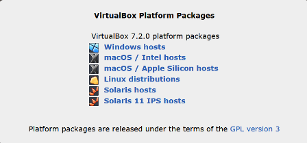

Fig.1a

- [ ] Run the installer (Fig.1b).  


Fig.1b

- [ ] Verify that virtualization is enabled. Open Task Manager (`CTRL+ALT+DEL`), in the `Performance` tab check that `Virtualization: Enabled` is displayed (Fig.1c).  

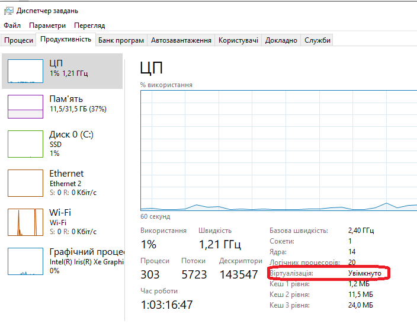

Fig.1c

- [ ] If virtualization is disabled, enable it in the BIOS/UEFI settings. The procedure differs depending on the PC, but usually under `Advanced → CPU Configuration` or `Security`.  

  - For Intel processors:  
    - `Intel Virtualization Technology (VT-x)`  
    - `Intel VT-d` (for devices, not always required).  
  - For AMD processors:  
    - `SVM Mode`  
    - sometimes `AMD-V`.  


### 2. Downloading the Windows 10 Installation Image  

For this lab you need a Windows 10 installation ISO. If you don’t have it locally, download it from Microsoft. Sometimes the Microsoft website redirects Windows users to `Media Creation Tool` instead of direct ISO links. One workaround is to change the browser `User-Agent` to mimic a non-Windows device.  

Steps:  

- [ ] Go to <https://www.microsoft.com/software-download/windows10>  
- [ ] Open Developer Tools (`F12` or `Ctrl+Shift+I`).  
- [ ] Enable mobile device emulation (e.g., Chrome on Android).  

 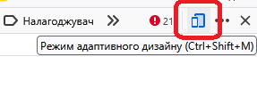

- [ ] Refresh the page (`F5`). You should now see options to select edition, language, and architecture with direct ISO download buttons.  
- [ ] Choose the edition → Confirm (Fig.3).  

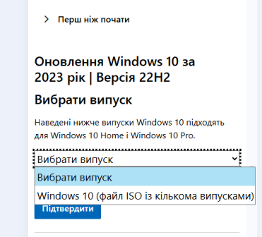

Fig.3

- [ ] Choose product language → Confirm (Fig.4).  


Fig.4

- [ ] Select the 64-bit version. Download will start (Fig.5).  


Fig.5

### 3. Creating a Virtual Machine  

- [ ] Start VirtualBox → `Machine → New` wizard.  
- [ ] Enter a unique VM name, e.g., `Windows10`.  
- [ ] Select the ISO image downloaded in step 2.  
- [ ] Enable `Skip Unattended Installation` to install manually. This allows trial mode installation if you don’t have a license key.  

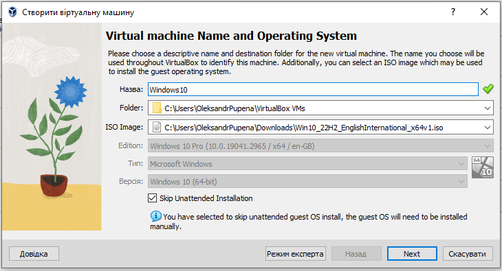

- [ ] Allocate memory and CPUs.  

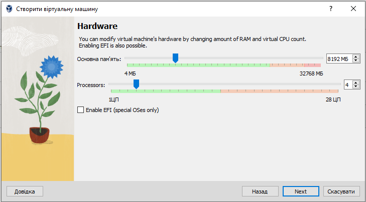


Fig.7. Configuring computing resources

-  Specify the size of the disk space for the VM, leave all other parameters at their default values (Fig.8). Explanation of parameters:
- `Create a Virtual Hard Disk Now` creates a new file (e.g., `.vdi`) in which the entire system will be stored.
  - `Disk Size` is the maximum size of the future virtual disk. In the example in Fig.8 it is set to 31.03 GB. Windows 10 requires at least ~20 GB, but for comfortable use it is better to allocate 40–60 GB. If you plan to install additional software, you can give more. This size can also be changed later, but only via the VirtualBox command-line utility.
  - `Pre-allocate Full Size`. If this option is not enabled (default), the disk will be dynamic, meaning the file on your host system will take up only as much space as is actually used inside the VM. For example, Windows + several programs = 15 GB, even if the limit is 50 GB. If the option is enabled, the file immediately occupies the entire specified size (e.g., 50 GB). This may slightly improve performance but consumes host disk space.
- `Use an Existing Virtual Hard Disk File` is chosen if you already have a prepared `.vdi`, `.vhd`, or `.vmdk` file, for example, a clone of another VM that you can attach. This corresponds to virtualization of an existing physical disk into a VM.
- `Do Not Add a Virtual Hard Disk` is rarely used. The system will then have no built-in HDD. You can boot only from ISO, LiveCD, or add a disk later. For Windows this option is not suitable.

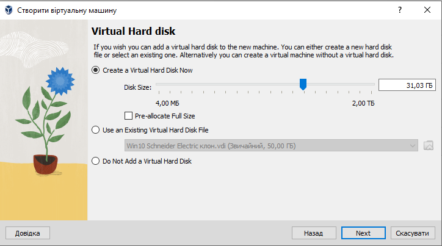

Fig.8. Virtual disk settings.

-  In the summary window, all selected settings will be displayed (Fig.9). Clicking "Finish" will create the VM.

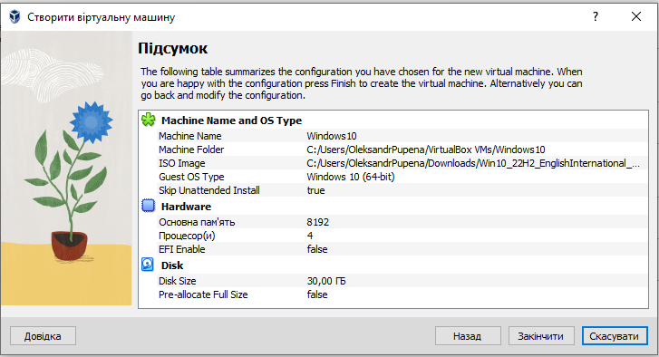

Fig.9.

-  Open the settings of the created VM using the context menu. Review the following tabs:
  - General (all tabs)
  - System (all tabs)
  - Storage.
-  In the storage settings, note that by default there are two persistent storage devices (Fig.10):
  - the VM’s virtual disk (`Windows10.vdi`)
  - the virtual CD/DVD optical drive containing the OS installer image.

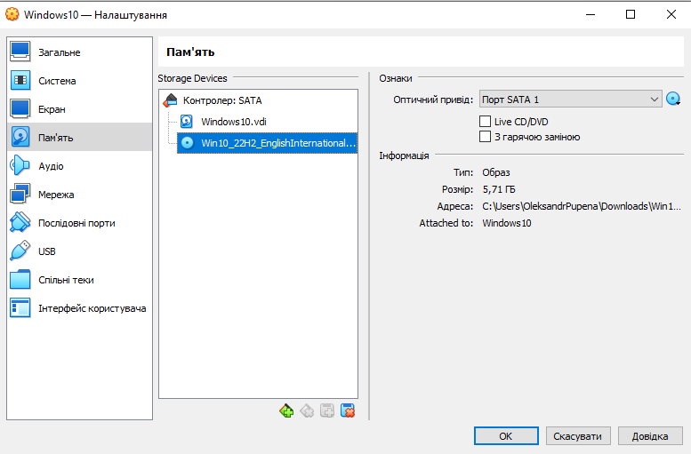

Fig.10. Non-volatile storage settings.

-  In the system settings, pay attention to the boot order (Fig.11). For the VM this is equivalent to BIOS boot settings on a real PC.


Fig.11. About the OS boot order.

With such settings, since the Windows installation ISO is "inserted" into the virtual optical drive, it will boot automatically when the VM starts.

### 4. Installing Windows 10 on the VM

-  Select the newly created VM in the list and click `Start`. Since the Windows installation ISO is "inserted" into the virtual optical drive, it will boot automatically when the VM starts.
-  During installation, choose the language and keyboard, then click `Next`, and in the following window select `Install now`.


Fig.12.

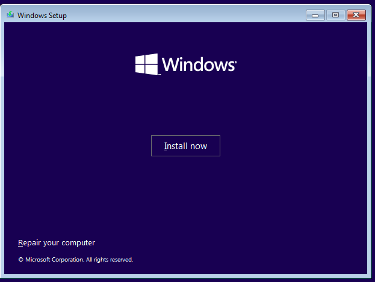

Fig.13.

-  In the Windows activation window (Fig.14), choose `I don’t have a product key`, since we are installing Windows for trial use.


Fig.14.

-  Next, select the edition of the OS (Fig.15). For professional use, it is recommended to choose Windows 10 PRO.


Fig.15.

-  In the next window, select `Custom`, which indicates a clean installation rather than upgrading an existing one (Fig.16).

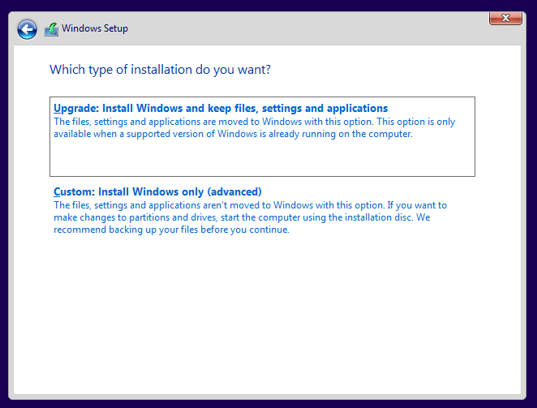

Fig.16.

-  In the partition selection window, click `Next` to start the installation process.


Fig.17.


Fig.18.

-  Choose regional settings and confirm the standard keyboard layout (Fig.19–20).


Fig.19.


Fig.20.

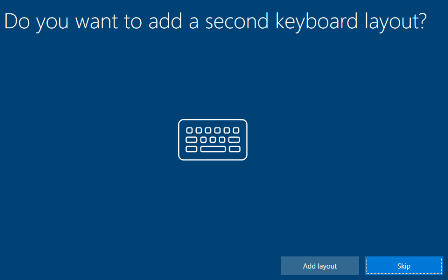

Fig.21.

-  In the usage type window, select `Set up for personal use`.


Fig.22.

-  In the authentication method window, select `Offline Account` at the bottom left (Fig.23).

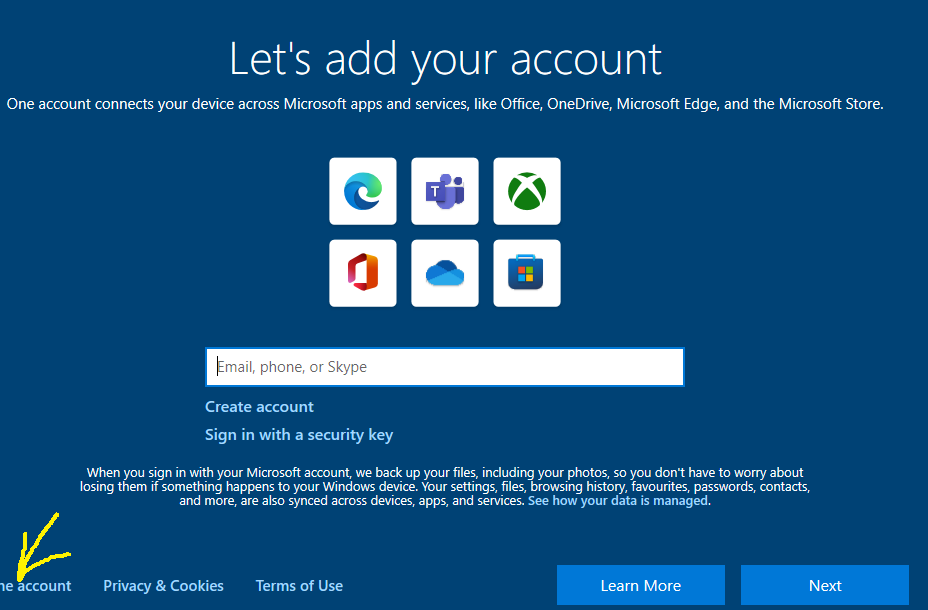

Fig.23.

-  In the next window, select `Limited experience`.

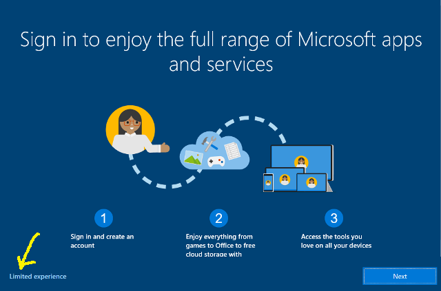

Fig.24.

-  Enter a username, for example `vbpxuser`.

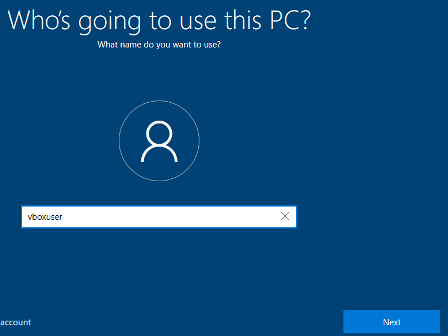

Fig.25.

-  In the next window, enter a password. For training purposes, you may use a simple password, e.g., `1`.

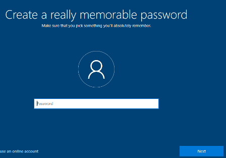

Fig.26.

-  Next, you need to choose three security questions and provide answers.

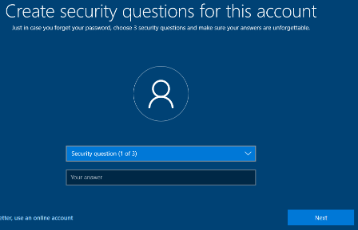

Fig.27.

-  In the following window, choose `Not Now`.

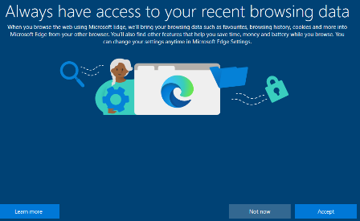

Fig.28.

-  In the privacy settings window, for testing purposes it is best to disable everything (Fig.29). This way the system will contact Microsoft less and run slightly faster.


Fig.29.

-  In the next window, also choose `Skip`.


Fig.30.

-  After installation and the first boot of Windows in the VM, shut down the VM from the "Start" menu.
-  In the VM settings, remove the installation ISO from the virtual CD/DVD drive (Fig.31).


Fig.31.

### 5. Configuring the VM for Better Performance

After installing Windows in VirtualBox, it is recommended to do a few basic things for a more comfortable experience:

1. Install Guest Additions in the guest OS.
2. Enable the shared clipboard to allow copy-paste between the host and guest OS.
3. Configure a shared folder between the host and the VM for quick file exchange.

**Guest Additions** in VirtualBox are a special set of drivers and utilities installed inside the guest operating system. They ensure proper integration of the virtual machine with the host. After installation, you will get:

- automatic adjustment of the VM window resolution;
- support for shared clipboard and drag-and-drop between host and guest;
- access to shared folders for file exchange;
- improved graphics performance and mouse integration.
-  Start the VM.
-  From the VM menu, select "Insert Guest Additions CD image…" to mount the Guest Additions ISO into the virtual CD/DVD drive (Fig.32).


Fig.32.

-  In the guest OS, a new drive will appear in the file explorer (Fig.33). Double-click it to launch the Guest Additions installer. Leave all settings as default. When prompted, allow the OS to reboot.


Fig.33.

-  After rebooting the VM, press `CTRL + F` to switch to fullscreen mode. Note that in fullscreen mode, the VM control menu is located at the bottom of the screen (or another edge) and appears when the mouse pointer approaches it.
-  Press `CTRL + F` again to return to windowed mode. Remember this shortcut, as it is used often.
-  Shut down the VM via the guest OS menu.
-  In the VM settings under `General -> Advanced`, set `Shared Clipboard = Bidirectional` to enable copy-paste through the clipboard, and do the same for `Drag and Drop`.


Fig.34.

-  In the VM settings under `Shared Folders`, add a folder from the host OS that will be accessible from the guest OS (Fig.35). Enable the `Auto-mount` option so that it appears automatically in the guest OS at startup.

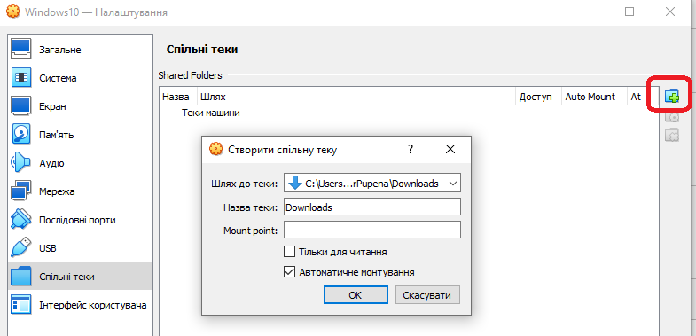

Fig.35.

-  Start the VM and log in. Test the clipboard by copying text from the host OS to Notepad in the guest OS and vice versa.
-  Open the browser in the guest OS. You should see the shared folder as a network drive (Fig.36), which can be used for file exchange.


Fig.36.

### 6. Creating a Clone of the VM Disk

In VirtualBox, there are two similar but different mechanisms — cloning a virtual machine and cloning disk images.

- **VM cloning** creates a full or linked copy of an existing virtual machine together with all its settings (OS, system state, hardware). This is useful for quickly duplicating a ready-to-use environment.
- **Disk image cloning** (VDI, VHD, VMDK) creates a copy of only the virtual hard disk without the VM configuration. Such a disk can be attached to another VM or used as a base for new installations.

The first method is for creating "another identical machine," while the second is for reusing the disk contents only. Below we will look at and practice disk cloning.

Simply copying a virtual disk file (e.g., `.vdi` or `.vmdk`) is usually not enough, since it contains a unique identifier (UUID). This causes certain problems:

1. **Conflicts in VirtualBox.** If you attach two disks with the same UUID, VirtualBox will get “confused” and may refuse to start the VM or display them incorrectly.
2. **Links to other files.** A VM has configuration files (`.vbox`, snapshots) that refer to a specific disk UUID. Simple copying does not update these references.
3. **Snapshots and incremental changes.** If snapshots exist, direct copying can break the chain “base disk → differential files.”

When cloning, VirtualBox automatically generates a new unique UUID for the copy, correctly transfers metadata, and ensures snapshot compatibility.

When cloning, VirtualBox allows you to choose the type of copy: full or linked:

- **Full Clone.** Creates a complete independent copy of the virtual machine with all its disks and files. Such a VM is not linked to the original and can exist separately. Suitable if you want a second fully functional system.
- **Linked Clone.** Creates a lightweight copy that references the base disk of the original and stores only changes in its own file. This saves space and makes cloning very fast, but the new VM depends on the original. If the original is deleted or damaged, the linked clone will not work.
-  Shut down the VM if it is running.
-  In VirtualBox, go to the `Tools` section, select the `Windows10.vdi` image, and in the context menu choose `Copy` (Fig.37).


Fig.37

-  Leave the following settings as default (Fig.38–40). After clicking `Finish` (Fig.40), the cloning process will begin.

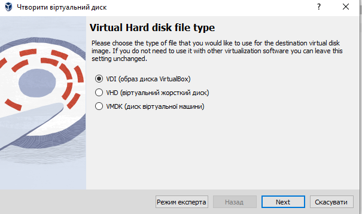

Fig.38


Fig.39

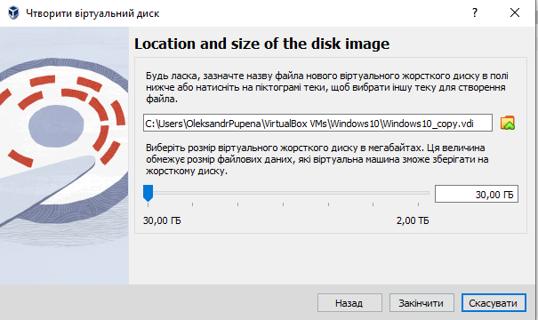

Fig.40

-  After cloning is complete, a `Windows10_copy` image will appear in the VM image list. Using the Information window in the image properties, compare their UUIDs — they are different.


Fig.41.

### 7. Creating a VM Based on a Cloned Disk

In this step, you need to create a new VM named `Windows10_2` using the cloned disk. This approach is useful when you want to have multiple VMs with different sets of software but with the same installed and configured guest OS. Another practical case is transferring the disk image to another host system, although this can also be done by cloning the entire VM.

-  Select `Machine -> New`, enter the name but do not specify an ISO image, then click `Next`.


Fig.42.

-  In the hardware configuration window, set the same parameters as for the `Windows10` VM (Fig.43).


Fig.43.

-  In the virtual disk setup window, select an existing disk. To do this, click the corresponding icon.

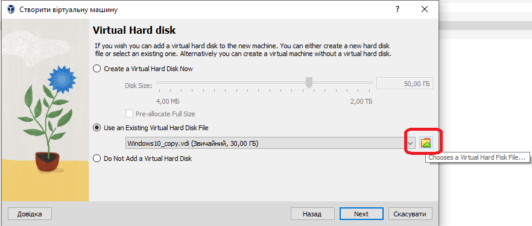

Fig.44.

-  In the summary window, click `Finish`.

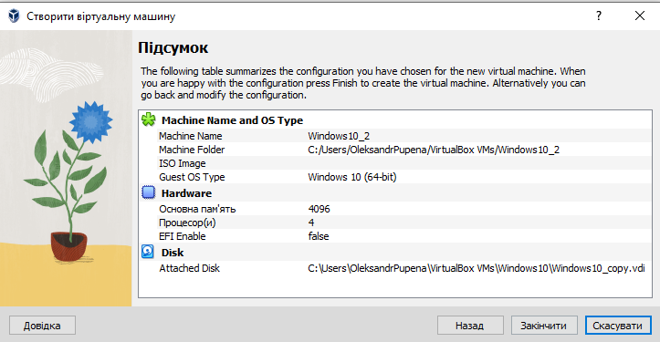

Fig.45.

-  Start the new virtual machine, log in, and then shut it down.

Now your system has two identical virtual machines on which you can install different sets of software tools.

### 8. Exploring VM Files

In this step, you need to get familiar with the types of VM files. This is useful when you need to manually copy images or analyze log contents.

-  In `VirtualBox`, go to the `File -> Preferences` menu. In the `General` section (Fig.46), check the default location of VirtualBox files.

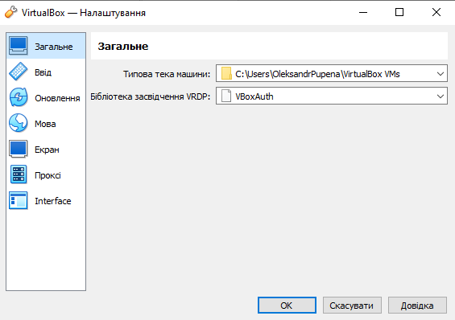

Fig.46.

-  In the host OS file explorer, navigate to the specified folder and find the configuration and disk files of the created virtual machines. Since we left the default settings, all files for the `Windows10` virtual machine are located in the corresponding folder (Fig.47).

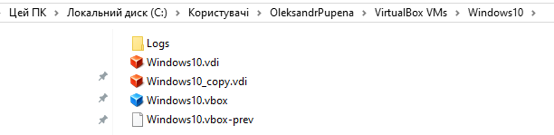

Fig.47.

- The `Logs` folder contains the VM logs. VirtualBox stores information about starts, errors, and hardware parameters here. This is useful for diagnostics if the VM does not start or encounters failures.
- `Windows10.vdi` – the main virtual disk of the machine in VDI (Virtual Disk Image) format. This file emulates the HDD inside the VM. It contains Windows itself, programs, and files.
- `Windows10_copy.vdi` – the cloned virtual disk from step 6. Since the storage location was not changed during cloning, the disk copy is located here as well.
- `Windows10.vbox` – the VM configuration file in XML format. It contains the machine settings: RAM size, CPU count, connected disks, network, etc. At startup, this file defines how VirtualBox builds the hardware model for your OS.
- `Windows10.vbox-prev` – a backup copy of the `.vbox` configuration file. It is created automatically by VirtualBox before saving changes in the configuration. Used for recovery if the main `.vbox` becomes corrupted.
-  Navigate to the `Windows10_2` folder. As you can see, it contains the corresponding files for the `Windows10_2` VM, except for the disk image (Fig.48).

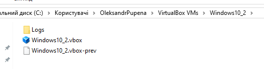

Fig.48

### 10. Working with Network Adapters

To complete this step, your host OS must be connected to the Internet.

-  Start the `Windows10` virtual machine and log in to the guest OS.
-  Launch the Edge browser. On the first start, it will suggest synchronizing data (Fig.51). Instead, choose `Start without your data`.

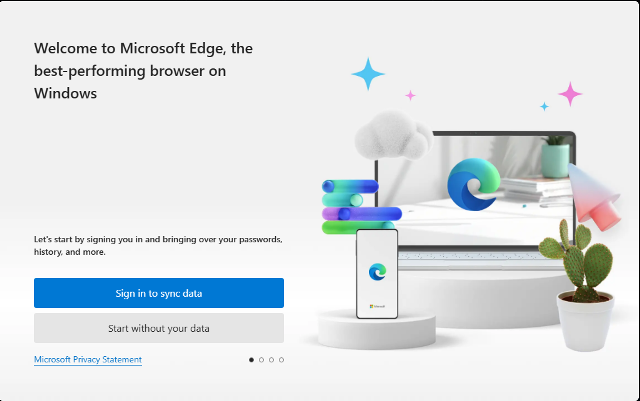

Fig.51.

-  In the Google sync window, select `Continue without Google data` and then `Confirm ...`.
-  Try to open a webpage on the Internet to verify that everything works.
-  Check the VM’s network adapter settings (Fig.52).


Fig.52.

By default, a VM is assigned one network adapter in **NAT (Network Address Translation)** mode. This means the VM has Internet access through the host OS, while external network devices cannot connect directly to the VM. It is similar to the host OS acting as a router for the guest OS with NAT enabled. For a better understanding of NAT, see the module Basics of Computer Networks. This mode is suitable when the VM does not need to be accessible from outside.

-  In the guest OS, open File Explorer and go to the network adapter. By default, VM visibility in the network is disabled. Using the context menu notification, enable network discovery for the VM (Fig.53). Then in the privacy mode selection window, choose `Yes, turn on ...` (Fig.54).


Fig.53.

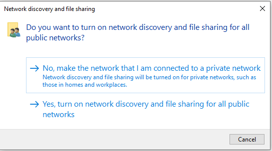

Fig.54.

-  In the guest OS, check the IP status of the network adapter (Fig.55). As shown, the adapter received an IP from the 10.0.0.0 subnet.

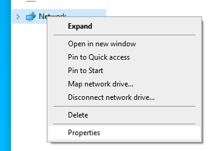   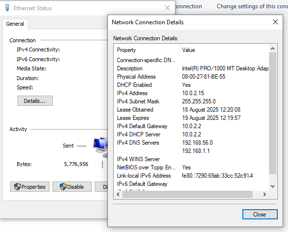

Fig.55.

-  Try pinging this adapter from the host machine using the command prompt. Based on the data in Fig.55, it would look like this:

```
ping 10.0.2.15
```

The ping should fail, since the VM is behind NAT relative to the host, and the host machine (as well as other devices in the network) cannot see the VM.

If you want the VM to appear as a network device in the same network as the host OS, you need to select **Bridged Adapter** mode.

-  Without shutting down the VM, in the adapter settings choose `Bridged Adapter`, and in the network card name select the one that currently has Internet access (Fig.56), then click `OK`.

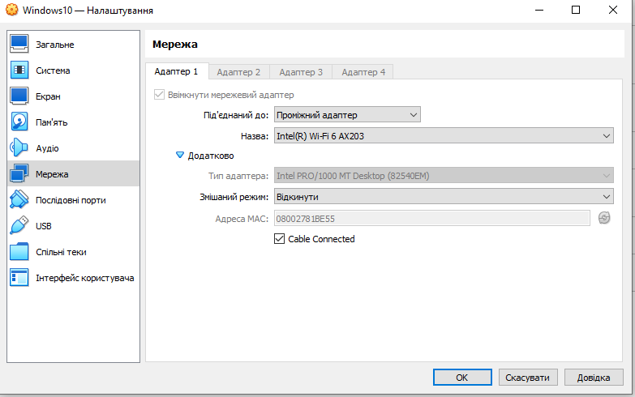

Fig.56.

After a short time, the VM’s network adapter will restart with new settings.

-  In the guest OS, check the IP status of the network adapter again (Fig.55). Now the adapter has received a new IP address from the network router, in this case `192.168.1.145` (Fig.57). Note that this assumes DHCP is enabled on the router to dynamically assign IP addresses.


Fig.57.

-  Try pinging this adapter from the host machine using the command prompt. Based on the data in Fig.57, it would look like this:

```
ping 192.168.1.145
```

The ping should succeed, which means that the VM’s network card is now “connected” to the network just like a physical one.

For more information about other network modes, see the theoretical lesson [Basics of Virtualization with VirtualBox](teor_en.md).

### 11. Passing Through USB Devices to the Virtual Machine

-  Insert a USB flash drive. By default, it will appear as a device on the host OS.
-  In the VM, go to `Devices -> USB`, find the required device, and click on it to attach it to the guest OS. Verify that the USB drive is visible in the guest OS file explorer.

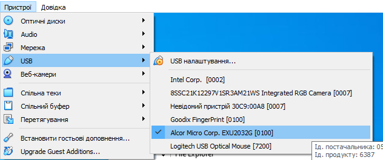

Fig.58.


Practical exercise developed by [Oleksandr Pupena](https://github.com/pupenasan)  

For feedback and discussion:  

- [WhatsApp group](https://chat.whatsapp.com/BRbPAQrE1s7BwCLtNtMoqN)  
- [Telegram group](https://t.me/+GA2smCKs5QU1MWMy)  
- [Facebook group](https://www.facebook.com/groups/asu.in.ua)  

More about the project and how to support: [here](https://asu-in-ua.github.io/atpv/)  
