[<- До підрозділу](README.md)		[Коментувати](#feedback)

# Встановлення та налаштування ВМ з Windows 11

**Тривалість**: 1 год 

**Мета:** Навчитися встановлювати та налаштовувати віртуальну машину з Windows 10

## Лабораторна установка.

**Необхідне апаратне забезпечення.** Для проведення лабораторних робіт необхідно мати комп’ютер з наступною мінімальною апаратною конфігурацією:

- CPU Intel/AMD 2 ГГц / RAM 16 ГБ / Диск 20 ГБ (вільних)  

**Необхідне програмне забезпечення.** 

1) На комп’ютері повинен бути встановлений Virtual Box (https://www.virtualbox.org).

2) Інтернет-браузер та доступ до Інтернет. 

**Загальна постановка задачі**. 

Цілі роботи: 

1) Підготовити віртуальне робоче місце для проведення різних лабораторних робіт з використанням Windows 10 

## Послідовність виконання роботи

### 1. Встановлення Virtual Box та перевірка віртуалізації

- [ ] Ознайомтеся з основними теоретичними відомостями з теоретичного заняття [Основи віртуалізації з використанням Virtual Box](teor.md)
- [ ] Завантажте VirtualBox з https://www.virtualbox.org/wiki/Downloads відповідно до вашої операційної системи (рис.1а).

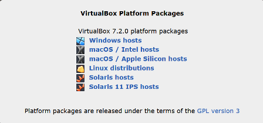

рис.1а.

- [ ] Запустіть процес установки (рис.1б)


рис.1б.

- [ ] Перевірте що увімкнена віртуалізація. Для цього запустіть диспетчер завдань (CTRL+ALT+DEL), на вкладці `Продуктивність` має бути `Віуртуалізація увімкнута` (рис.1в).

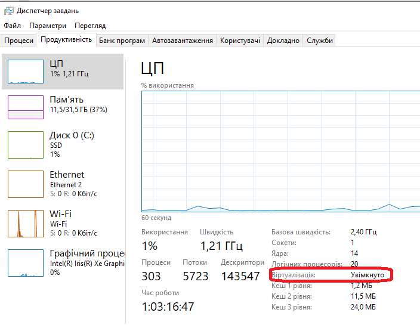

рис.1в. Перевірка увімкненої віртуалізації за допомогою диспетчера задач

- [ ] Якщо віртуалізація вимкнена то для продовження виконання практичної роботи необхідно увімкнути віртуалізацію у налаштуваннях Bios. Спосіб як це зробити відрізняється від типу PC, тому виходить за рамки даної роботи. Зазвичай вони знаходяться в розділах `Advanced → CPU Configuration` або `Security` з подібними налаштуваннями:    

  - для Intel це може бути  параметри
    - `Intel Virtualization Technology (VT-x)`
    - `Intel VT-d` (для пристроїв, не завжди треба).

  - для AMD
    - `SVM Mode`
    - іноді `AMD-V`.

### 2. Завантаження образу ОС Windows 11

Для наступного виконання практичних  робіт у вас повинен бути образ інсталяції ОС Windows. Якщо його немає на локальному ПК, можна завантажити його з сайту Microsoft.  Знайти пряме посилання на образ ISO Windows 10 можна на [сайті Microsoft](https://www.microsoft.com/uk-ua/software-download/windows11). Але це може бути ускладнено, якщо ви заходите з Windows-пристрою, бо сайт перенаправляє вас на завантаження через `Media Creation Tool`. Один із способів обійти це - зробити завантаження через зміну `User-Agent` у браузері. Microsoft зазвичай дозволяє пряме завантаження ISO, якщо сайт "думає", що ви заходите з іншої ОС (не Windows). Тому для завантаження образу з сайту Microsoft виконайте наступну послідовність:

- [ ] Відкрийте сторінку завантаження Windows 11: <https://www.microsoft.com/uk-ua/software-download/windows11>
- [ ] Якщо у Вас Windows 11, і немає можливості завантаження, у вашому браузері натисніть `F12` (або `Ctrl+Shift+I`) - відкриється `Developer Tools` 
- [ ] Активуйте емуляцію мобільного пристрою (наприклад, Chrome на Android або іншу ОС), у браузері Chrome та Firefox це виглядає як на рис.2,  

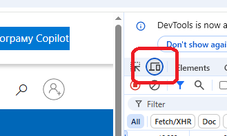 

рис.2. Активація емуляція мобільного пристрою

- [ ] Перезавантажте сторінку (`F5`) — має з’явитися форма для вибору редакції, мови та архітектури з кнопками для прямого завантаження ISO. 
- Виберіть випуск і натисніть "Підвтердити" (рис.3)
- Після того виберіть мову продукту і натисніть "Підвтердити" (рис.4)

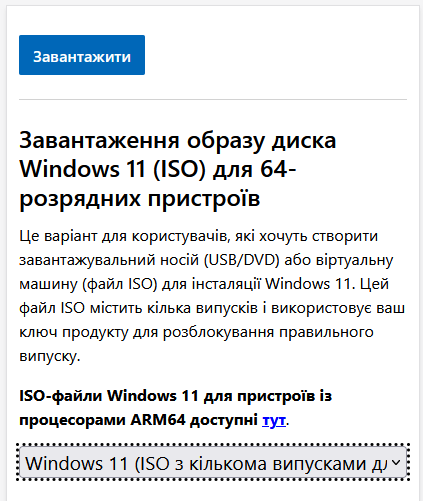

рис.3. 

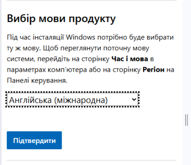

рис.4. 

- [ ] У розділі завантаження виберіть 64-розрядна система Завантажити. Після чого почнеться завантаження.


рис.5.

### 3. Створення віртуальної машини

У даному пункті створюється віртуальна машина власноруч, та встановлюється на ньому ОС Windows 11 та налаштування.

- [ ] Запустіть Virtual Box. Через пункт `Машина -> Створити` запусіть помічник по створенню нової віртуальної машини (**ВМ**): 
- Вкажіть унікальну для Вашої Virtual Box назву ВМ, наприклад `Windows11`
- Виберіть ISO Image, завантажений в п.2 
- Виставте опцію `Skip Unattened Instalation` для того щоб самому встановлювати ОС Windows. Якщо Ви залишите цю опцію вимкненою, VirtualBox спробує встановити Windows майже без вашої участі (сам введе стандартні параметри: мова, часовий пояс, ім’я користувача тощо), цей варіант можливий тільки якщо у Вас є ключ ліцензії. Якщо ж у Вас немає ключа ліцензії, Ви зможете поставити Windows в режимі 30 дневного пробного використання, вибір такої опції можливий лише за інтерактивного встановлення. 

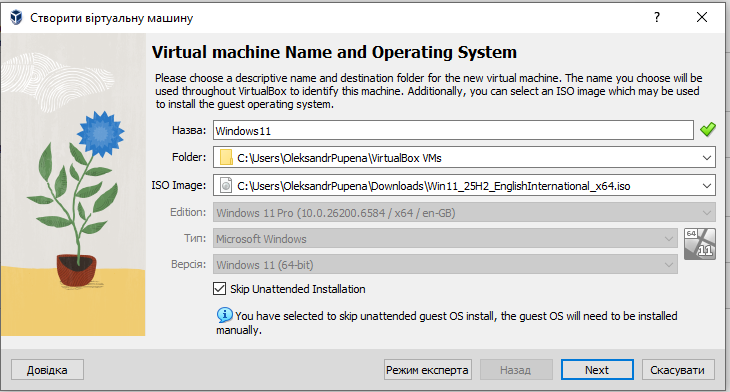

рис.6. Початкові налаштування майстра встановлення

- [ ] Вкажіть пам'ять та кількість процесорів, які виділяються для ВМ. Ці параметри можна буде змінити пізніше.

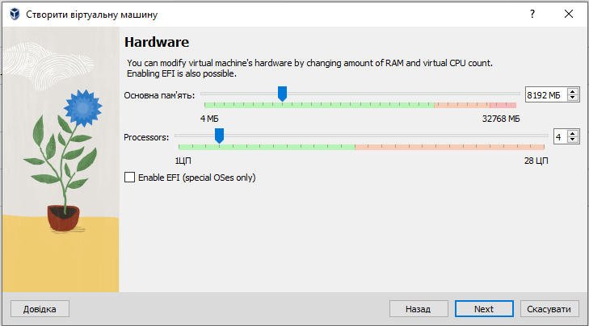

рис.7. Налаштування обчислювальних ресурсів

- [ ] Вкажіть розмір дискового простору для ВМ, усі інші параметри залиште за замовченням (рис.8). Пояснимо параметри:

- `Create a Virtual Hard Disk Now` (створити віртуальний диск зараз) cтворює новий файл (наприклад, `.vdi`), у якому буде розміщена вся система. При цьому:
  - `Disk Size` (розмір диска) - це максимальний розмір майбутнього віртуального диска. У прикладі на рис.8 виставлено 80,0 ГБ. 
  - `Pre-allocate Full Size` (виділити весь обсяг одразу). Якщо ця опція не увімкнена (за замовчуванням) диск буде динамічним, тому файл займає на вашому реальному диску лише стільки місця, скільки реально використано всередині VM. Наприклад, Windows + кілька програм = 15 ГБ, навіть якщо ліміт 80 ГБ. Якщо опція `увімкнена`, то файл відразу займе увесь вказаний обсяг (наприклад, 80 ГБ). Це може трохи пришвидшити роботу, але з’їсть місце на хості. 
- `Use an Existing Virtual Hard Disk File` (використати наявний файл диска) вибирається в тому випадку, якщо у вас вже є готовий `.vdi`, `.vhd` або `.vmdk` , наприклад, клон іншої VM, який можна підключити до віртуальної машини. Це віртуалізація випадку підключення реального існуючого диску до реальної машини. 
- `Do Not Add a Virtual Hard Disk` (не створювати диск) використовується рідко. Система тоді буде без вбудованого HDD. Можна завантажитися тільки з ISO, LiveCD або додати диск пізніше. Для Windows цей варіант не підходить.

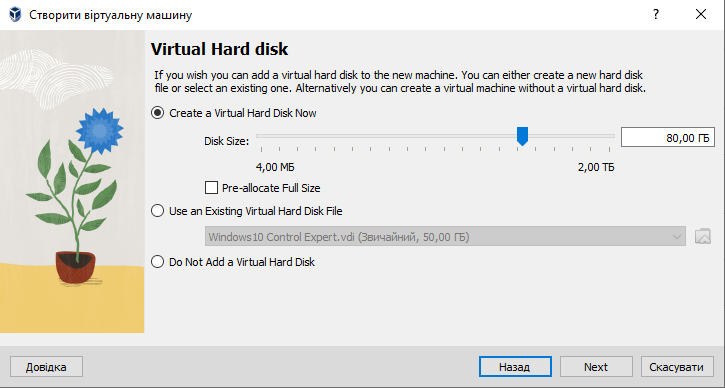

рис.8. Налаштування віртуального диску.

- [ ] Далі у вікні підсумку відображатимуться усі вибрані налаштування (рис.9). Натискання кнопки "Закінчити приведе до створення ВМ"

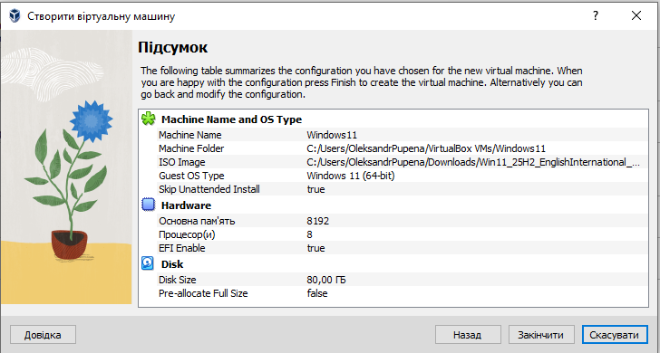

рис.9.

- [ ] Відкрийте налаштування створеної ВМ , вибравши відповідний пункт контекстного меню. Поступово переходячи між різними закладками подивіться наступні налаштування:
- Загальне (усі вкладки)
- Система (усі вкладки)
- Пам'ять. 

- [ ] У налаштуваннях пам'яті (постійної) зверніть увагу на те, що в системі за замовченням два пристрої постійної пам'ятї (рис.10):
- віртуальний диск ВМ (`Windows11.vdi`)
- віртуальний оптичний привід CD/DVD, у який встановлено образ інсталятора ОС.     

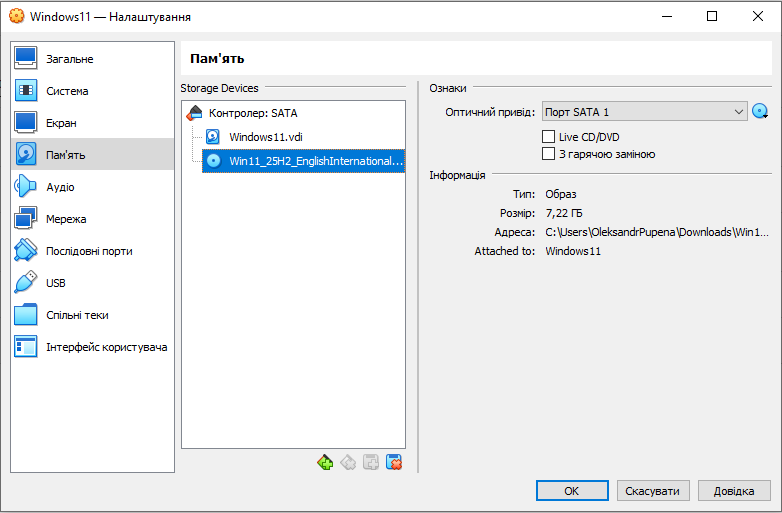

рис.10. Налаштування енергонезалежної пам'яті.

- [ ] У налаштуваннях системи, зверніть увагу на порядок завантаження ОС (рис.11). Для ВМ це аналогічно налаштуванням BIOS для реального PC.  

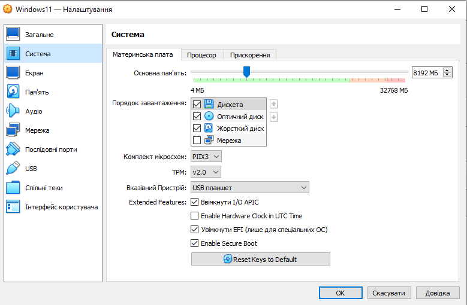

рис.11. Щодо порядку завантаження ОС.

За таких налаштувань, враховуючи що у віртуальний привод оптичного диску "вставлено" образ дистрибутива Windows, він буде запускатися автоматично при запуску ВМ. 

### 4. Встановлення Windows 11 на ВМ

- [ ] Виділіть новостворену ВМ в списку і натисніть `Запустити`. 

- [ ] Натисніть будь яку кнопку після запиту для запуску встановлення ОС. 

- [ ] При інсталяції виберіть мову та клавіатуру, далі `Next` , у наступному вікні виберіть мову клавіатури.

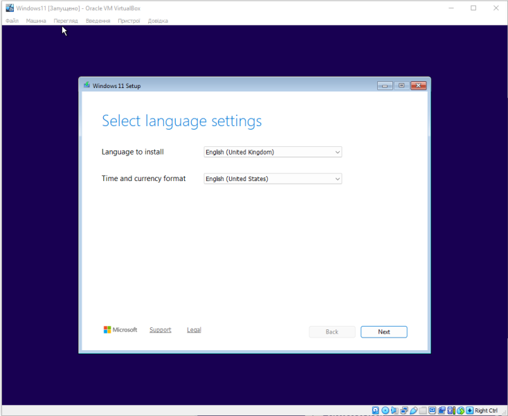

рис.12.

- [ ] Виберіть `Install Windows 11` та опцію прийняття видалення файли та програми.

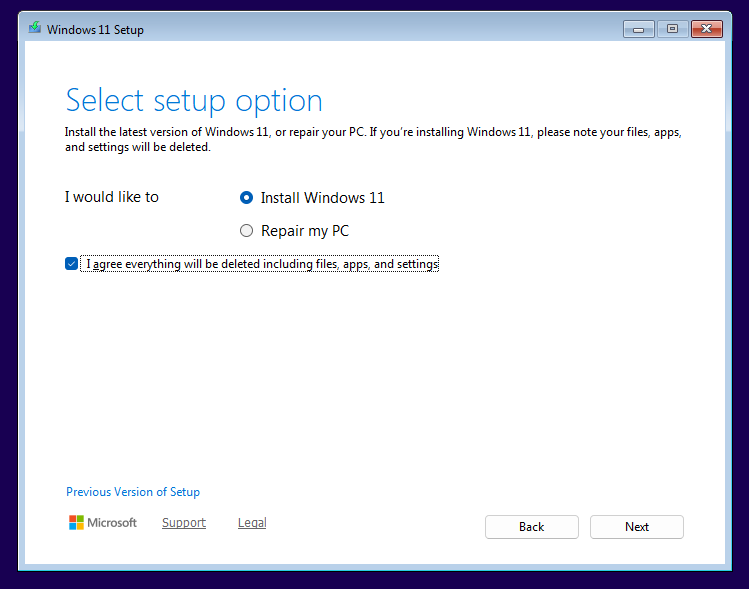

рис.13.

- [ ] У вікні активації Windows (рис.14) виберіть `I dont have a product key`, оскільки ми встановлюємо Windows для пробного використання.

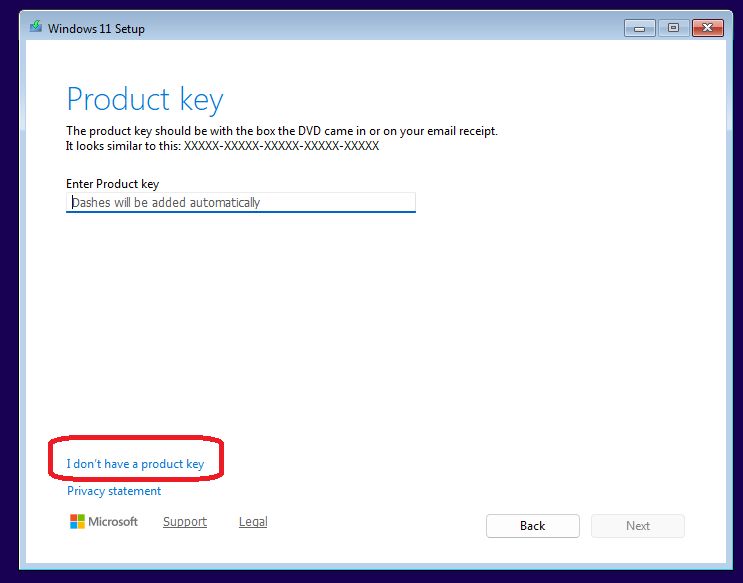


рис.14.

- [ ] Далі виберіть варіант ОС (рис.15), для професіонального використання варто вибрати Windows 10 PRO. 

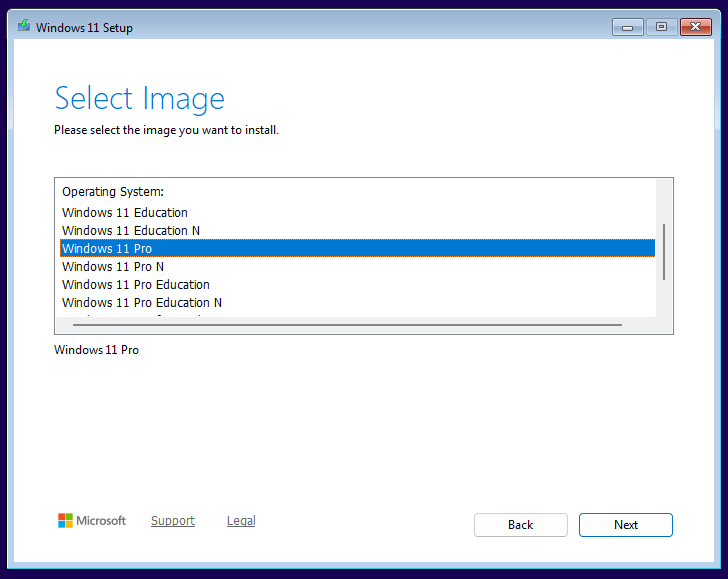

рис.15. 

- [ ] У наступному вікні з ліцензією виберіть `Accept`, 

- [ ] У вікні вибору місця інсталяції виберіть `Next` та запустіть процес інсталяції. 

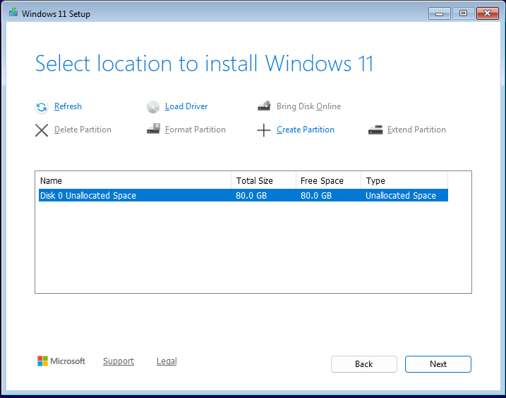

рис.16.

- [ ] У наступному вікні `Ready to install` натисніть `Install`

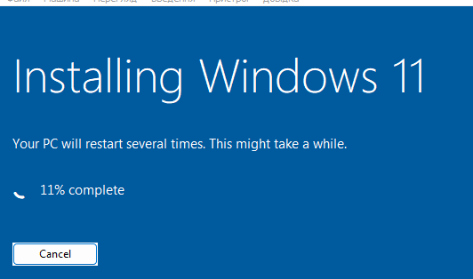

рис.18.

- [ ] Дочекайтеся поки будуть встановлені усі потрібні файли. Якщо після цього будуть з'являтися повідомлення про невдале встановлення тисніть `Try Again`

- [ ] Виберіть регіональні налаштування, підтвердіть вибір стандартної клавіатури (рис.19-20) 


рис.19.


рис.20. 

- [ ] Наступну клавіатуру можна не добавляти.
- [ ] Дочекайтеся доки інсталятор оновить ОС.
- [ ] Назвіть віртуальний комп'ютер

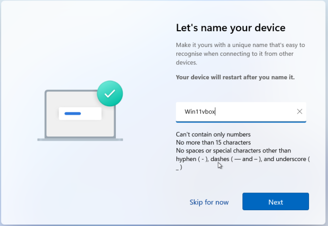

рис.21.

- [ ] У вікні вибору типу використання виберіть `Set up for personal use` і натисніть Next

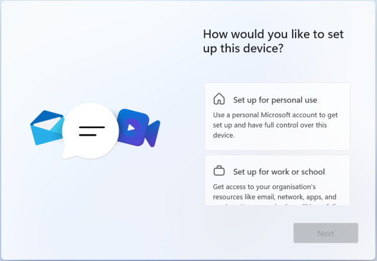

рис.22.

- [ ] Дочекайтеся доки інсталятор оновить ОС. Зачекайте, це досить тривалий процес і може зайняти кілька десятків хвилин.

- [ ] У вікні з запрошенням реєстрації натисніть `Sign in`

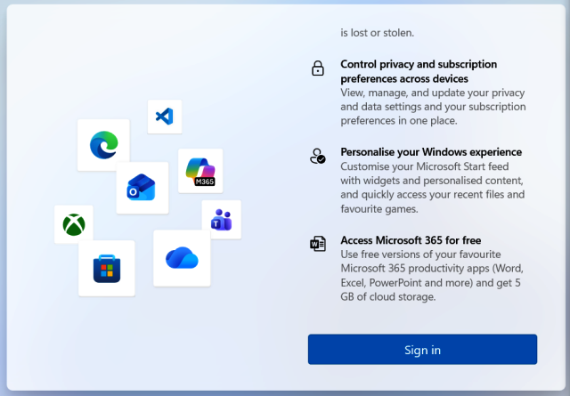

рис.23.

- [ ] У вікні реєстрації Ви можете зайти в існуючий акаунт Microsoft або створити новий, або перейти до наступного пункту, описаного нижче: 

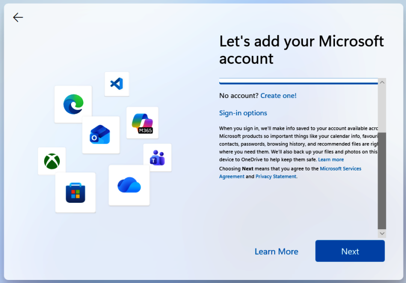

рис.24.

- [ ] Якщо Ви не хочете  створювати акаунт зробіть наступні дії, які описані нижче

- Відключіть Інтернет від віртуальної машини (рис.25)
- натисніть `Shift + F10` – відкриється командний рядок.
- введіть наступні команди одна за одною (рис.26)

```
cd OOBE
BYPASSNRO
```

- дочекайтеся коли перезавантажиться віртуальна машина
- пройдіть усі процедури аж до вікна

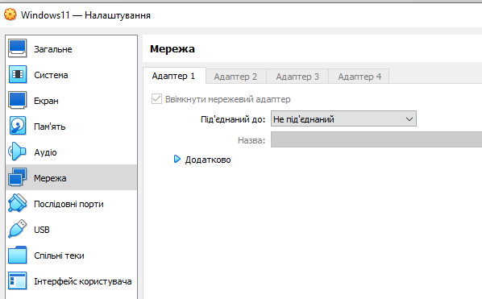

рис.25. 

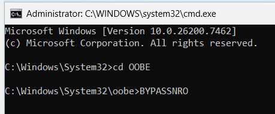

рис.26. 

- у наступному вікні вкажіть пароль, для цілей навчання можна вказати простий пароль, наприклад `1` (рис.27)
- далі пароль і підтвердження паролю

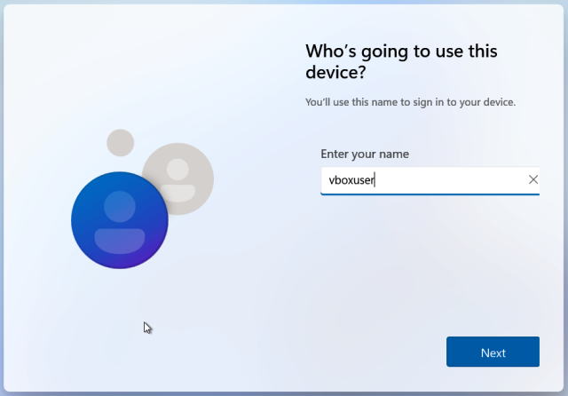

рис.27

- [ ]  Далі необхідно вибрати три питання і вказати на них відповідь 

- [ ] У вікні налаштування приватності  віртуальної машини для тестування найрозумніше вимкнути все (рис.28). Так система буде менше «стукати» у Microsoft і працюватиме трохи легше. 

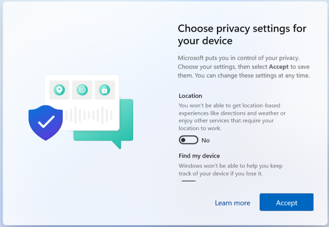

рис.28. 

- [ ] Дочекайтеся поки система зробить перші налаштування.

- [ ] Після встановлення та першого запуску Windows на ВМ, через меню "Пуск" завершіть роботу ВМ.

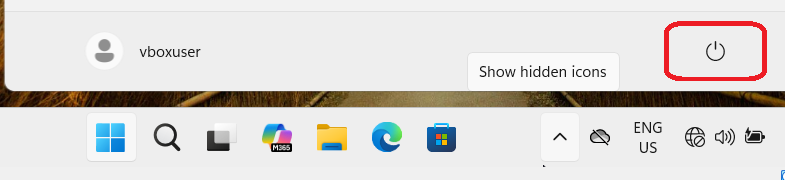

рис.29.

- [ ] У налаштуваннях створеної ВМ, вилучіть образ диску з віртуального носія CD/DVD (рис.30). 

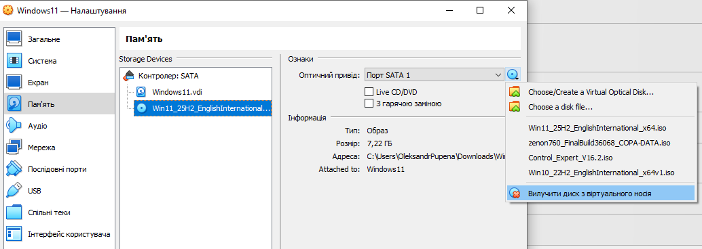

рис.30. 

- [ ] Активуйте мереж через NAT (рис.31)

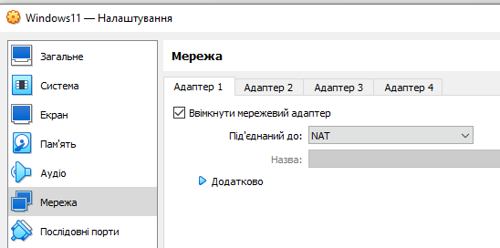

рис.31

### 5. Налаштування ВМ для кращої роботи

Після встановлення Windows у VirtualBox варто зробити кілька базових речей, щоб працювати комфортно:

1. Встановити гостьові доповнення на гостьову ОС.
2. Увімкнути спільний буфер обміну для можливості копіпасту між хостовою на гостьовою ОС.
3. Налаштувати спільну папку між хостом і ВМ для швидкого обміну файлами.

Guest Additions (гостьові доповнення) у VirtualBox - це спеціальний набір драйверів і утиліт, які встановлюються всередині гостьової операційної системи. Вони забезпечують коректну інтеграцію віртуальної машини з хостом. Після їх встановлення ви отримаєте:

- автоматичне підлаштування роздільної здатності вікна ВМ;
- підтримку спільного буфера обміну та drag-and-drop між хостом і гостьовою системою;
- доступ до спільних папок для обміну файлами;
- покращену графічну продуктивність і роботу миші.

- [ ] Запустіть ВМ. 
- [ ] Через меню пристроїв ВМ "Встановити гостьові доповнення ..." встановіть у віртуальний привод образ CD/DVD з гостьовими доповненнями (рис.32)


рис.32.

- [ ] Після цього у гостьовій ОС, в провіднику з'явиться відповідний диск (рис.33).  Подвійним кліком запустіть інсталяцію гостьових доповнень на гостьовій ОС. Усі налаштування залишайте за замовченням. Після встановлення інсталятор запропонує перезавантажити ОС, підтвердіть цю дію. 

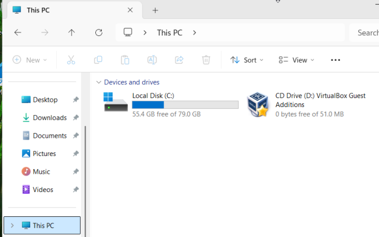

рис.33. 

- [ ] Після перезавантаження ВМ натисність `CTRL + F`  для переходу в повномасштабний режим. Зверніть увагу що у повномасштабному режимі меню керування ВМ знаходиться внизу екрану (може бути інше крайнє положення) і показується при наближенні мишки. 
- [ ] Натисніть ще раз `CTRL + F`  для переходу у віконний режим. Запам'ятайте цю комбінацію, вона використовується досить часто при роботі.  
- [ ] Завершіть роботу ВМ через відповідне меню гостьової ОС.
- [ ] У налаштуваннях ВМ у `Загальне -> Додатково` встановіть `Спільна кишеня = Двонаправлений` для можливістю копіювання через буфер обміну те саме зробіть для `Перетягування`. 


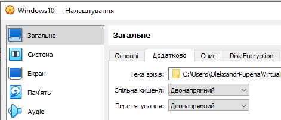

рис.34.

- [ ] У налаштуваннях ВМ у `Спільні теки` додайте теку (папку) з хостової ОС, яка буде використовуватися для доступу з гостьової ОС (рис.34). Виставте опцію `Автоматичне монтування` для того, щоб вона автоматично з'являлася в гостьовій ОС при завантаженні.    

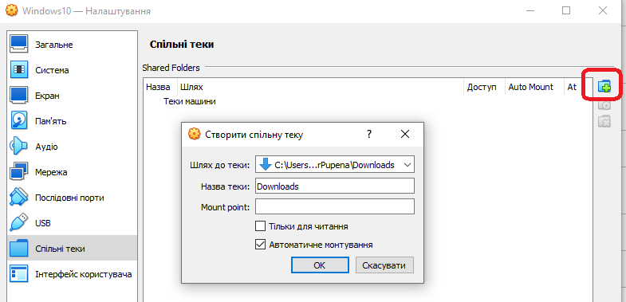

рис.35.

- [ ] Запустіть віртуальну машину, зареєструйтеся. Перевірте роботу буферу обміну, скопіювавши текст з хостової ОС в блокнот гостьової та навпаки.
- [ ] Зайдіть в браузер гостьової ОС. Ви повинні побачити підключену теку як мережний диск (рис.36) через який можна робити обмін файлами.

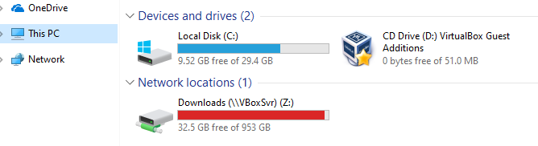

рис.36.


Про інші операції з віртуальними машинами можете дізнатися з [Встановлення та налаштування ВМ з Windows 10](labwin10.md) 


## Джерела

1. 


## Автори

Практичне заняття розробив [Олександр Пупена](https://github.com/pupenasan). 

Подяка учасникам спільноти, які надали схеми та коментарі для прикладів.

## Feedback

Якщо Ви хочете залишити коментар у Вас є наступні варіанти:

- [Обговорення у WhatsApp](https://chat.whatsapp.com/BRbPAQrE1s7BwCLtNtMoqN)
- [Обговорення в Телеграм](https://t.me/+GA2smCKs5QU1MWMy)
- [Група у Фейсбуці](https://www.facebook.com/groups/asu.in.ua)

Про проект і можливість допомогти проекту написано [тут](https://asu-in-ua.github.io/atpv/)
