[<- До підрозділу](README.md)

# Основи віртуалізації з використанням Virtual Box

## Віртуалізація та віртуальні машини

Віртуалізація забезпечує можливість використання не реальних ресурсів а їх програмного емулятора, який у свою чергу використовує частину фізичного ресурсу. Таким чином один фізичний ресурс, наприклад апаратний сервер може одночасно використовуватися кількома віртуальними серверами, що робить використання цього ресурсу гнучкішим. На сьогоднішній день використовуються два варіанти віртуалізації для використання застосунків: віртуальні машини та контейнери. У цьому модулі розгялдаються тільки віртуальні машини, контейнери розглядаються у іншому модулі. 

**Віртуальна машина** (**VM**, **ВМ**) - це емуляція комп'ютерної системи на іншому комп'ютері.  Це дає змогу запускати, як здається, багато окремих комп'ютерів на апаратних засобах, які є фактично одним комп'ютером.

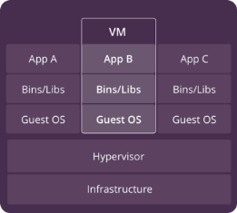

рис.1. Стек з віртуальною машиною та гіпервізором. 

Віртуалізацію віртуальних машин забезпечує **гіпервізор** (Hypervisor). Гіпервізор або монітор віртуальної машини - це програмне забезпечення, прошивка або апаратне забезпечення, яке створює і запускає віртуальні машини.  

У цьому випадку кажуть що **гостьова** операційна система (**guest OS**) - це ОС, яка працює всередині віртуальної машини. Гостьові ОС та їхні застосунки спільно використовують апаратні ресурси одного хост-сервера або з пулу хост-серверів (у випадка хмарного використання) через гіпервізор. Кожна віртуальна машина вимагає власної ОС, а її апаратне забезпечення є повністю віртуалізованим. 

Гіпервізор розташований між апаратним забезпеченням або ОС реальної машини і віртуальною машиною, і є необхідним для віртуалізації цієї машини. Гіпервізор може працювати безпосередньо поверх заліза (гіпервізор типу 1) або поверх іншої ОС (гіпервізор типу 2): 

- гіпервізор типу 1 (також називають мікроядром, тонким гіпервізором), по факту вже виконує функції ОС і має прямий доступ до заліза (bare-metal server); на рис.2 показаний прикладами такого гіпервізора - система Xen, VMware ESXi, Hyper-V; цей гіпервізор як правило забезпечує краще використання заліза для віртуальних машин, так як не використовує додатковий проміжний слой (додаткову хостову ОС)  

- гіпервізор типу 2 (також називають хостовим) працює як служба або застосунок в іншій ОС фізичного комп’ютера; у цьому випадку кажуть що ця ОС називається головною або **хостовою** операційною системою (**host OS**) у противагу гостьової, яка виконується на ОС віртуальної машини; на рис.2 показаний приклад такого гіпервізора KVM, інші приклади - Oracle VirtualBox, VMware Workstation 

- гібридний  

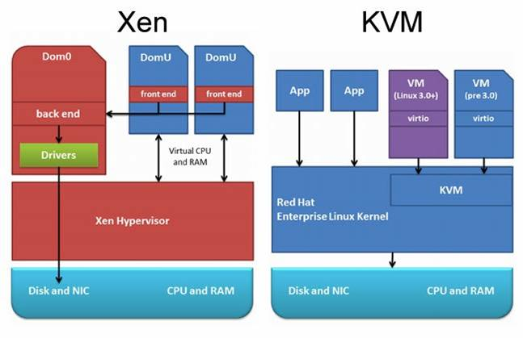

рис.2. Приклад роботи гіпервізорів поверх заліза або на рівні ОС.

Приклади гіпервізорів:

- [VMware vSphere](https://www.vmware.com/products/vsphere.html)
- [VirtualBox](https://www.virtualbox.org/)
- [Xen](https://www.xenproject.org/)
- [Hyper-V](https://docs.microsoft.com/en-us/virtualization/hyper-v-on-windows/about/)
- [KVM](https://www.linux-kvm.org/page/Main_Page)

Віртуальні машини використовуються як для віртуалізації на офісних ПК так і на серверах а також в хмарних інфраструктурах. Більшість постачальників хмарних рішень надають можливість створення і розгортання віртуальних машин для різних ОС.   

Віртуальні машини мають наступні особливості:

- можуть зайняти багато системних ресурсів:

- працює не тільки з повною копією операційної системи, але і з віртуальною копією всього обладнання, яке операційна система потребує для запуску

- потребують великий об’єм необхідної оперативної пам'яті, більше ніж той, що потребується для роботи гостьової ОС та її застосунків 

- необхідний додатковий процесорний час для віртуалізації обладнання та гостьової ОС

Серед основних переваги віртуальних машин можна виділити наступні:

- для застосунків (applications) доступні усі ресурси гостьової ОС, так само як на окремому ПК

- на віртуальну машину можна встановити будь яку ОС (гостьову ОС), незалежно від ОС хостової ОС 
- існують перевірені часом інструменти керування ВМ
- існують перевірені часом засоби безпеки

До недоліків можна віднести те, що потрібно дуже багато ресурсів і часу, щоб віртуалізувати залізо віртуальної машини. 

## Області використання віртуальних машин в промисловій автоматизації

У промисловій автоматизації віртуальні машини часто використовують в якості середовища розроблення ПЗ для різних платформ. По-перше, це убезпечує конфлікт інструментального ПЗ різних постачальників так і версій одного і того ж ПЗ. По-друге, це дає можливість переносити наперед сконфігуровані середовища між робочими станціями розробника. По-третє, це дає можливість використовувати тріальні версії ПЗ, зберігши образ зі встановленим ПЗ.

Інший варіант використання ВМ в промисловій автоматизації - це тестування роботи системи з кількома середовищами виконання об'єднаних віртуальною мережею.

Для популярних гіпервізорів є образи ВМ для великої кількості ОС. Це дає змогу використовувати їх в якості середовища розроблення і тестування. 

Віртуальні машини можуть функціонувати в якості середовища виконання. Це спрощує розгортання нових екземплярів або заміни існуючих. 

Окремої уваги заслуговує використання віртуальних машин для навчання. Безкоштовні версії як і платні дають можливість використовувати різні засоби віртуалізації, що незамінно для дистанційного навчання, коли відповідних апаратних засобів немає.     

## Огляд Virtual Box

VirtualBox — це програма віртуалізації (гіпервізор типу 2) для операційних систем, розроблена німецькою фірмою innotek, зараз вона належить Oracle Corporation. Підтримується основними операційними системами Linux, FreeBSD, Mac OS X, OS/2 Warp, Microsoft Windows, які підтримують роботу гостьових операційних систем FreeBSD, Linux, OpenBSD, OS/2 Warp, Windows і Solaris.

Існує дві версії, які відрізняються за ліцензією та функціональністю: 

- корпоративна версія, платна, у безкоштовному варіанті тільки для власного використання 
- відкрита версія (Open Source Edition) в якій початковий код доступний під ліцензією [GNU GPL](https://uk.wikipedia.org/wiki/GNU_General_Public_License), відповідно немає обмежень у використанні. Функціональність аналогічна повній версії, за винятком деяких особливостей, доступних для  корпоративних клієнтів.

Детальна документація по Virtual BOX доступна [за посиланням](https://www.virtualbox.org/manual) 

### Загальні області використання VirtualBox 

VirtualBox як і більшість гіпервізорів дають можливість:

- Одночасного запуску кількох операційних систем. 

- Простіші установки програмного забезпечення - постачальники програмного забезпечення можуть використовувати віртуальні машини для доставки повних конфігурацій програмного забезпечення. 
- Тестування та аварійне відновлення. 
  - Після встановлення віртуальну машину та її віртуальні жорсткі диски можна вважати контейнером, який можна довільно заморожувати, виводити з режиму сну, копіювати, створювати резервні копії та транспортувати між хостами. 

  - Використання віртуальних машин дозволяє створювати та тестувати, наприклад, багатовузлову мережеву службу. 

  - Проблеми з мережею, операційною системою та конфігурацією програмного забезпечення можна легко дослідити. 

  - За допомогою іншої функції Oracle VM VirtualBox, яка називається знімками, можна зберегти певний стан віртуальної машини та повернутися до цього стану, якщо це необхідно. Таким чином можна вільно експериментувати з обчислювальним середовищем. Якщо щось піде не так, як-от проблеми після встановлення програмного забезпечення або зараження гостя вірусом, ви можете легко повернутися до попереднього знімка та уникнути частого резервного копіювання та відновлення. Можна створити будь-яку кількість знімків, дозволяючи подорожувати назад і вперед у часі віртуальної машини. Потім можна видаляти знімки під час роботи віртуальної машини, щоб звільнити місце на диску.

- Консолідація інфраструктури. Віртуалізація може значно знизити витрати на обладнання та електроенергію. Сучасні комп’ютери здебільшого використовують лише частку своєї потенційної потужності та працюють із низьким середнім навантаженням системи. При цьому витрачається багато апаратних ресурсів, а також електроенергії. Отже, замість запуску багатьох таких фізичних комп’ютерів, які використовуються лише частково, можна упакувати багато віртуальних машин на кілька потужних хостів і збалансувати навантаження між ними.

### Огляд функцій

Нижче коротко наведені основні функції Oracle VM VirtualBox.

**Переносимість.** Oracle VM VirtualBox працює на великій кількості 64-розрядних операційних систем. Oracle VM VirtualBox — це так званий хостовий гіпервізор, який іноді називають гіпервізором типу 2, який працює поверх інших ОС.  Oracle VM VirtualBox значною мірою функціонально ідентичний на всіх хост-платформах, і використовуються однакові формати файлів і образів.  Крім того, віртуальні машини можна легко імпортувати та експортувати за допомогою відкритого формату віртуалізації (OVF), галузевого стандарту, створеного для цієї мети.  Для користувачів Oracle Cloud Infrastructure функціональні можливості поширюються на експорт та імпорт віртуальних машин у хмару та з хмари. 

**Гостьові доповнення (Guest Additions): спільні папки, безшовні вікна, 3D-віртуалізація.** Гостьові доповнення Oracle VM VirtualBox — це програмні пакети, які можна інсталювати всередині підтримуваних гостьових систем, щоб покращити їх продуктивність і забезпечити додаткову інтеграцію та зв’язок із хостовою ОС. Після встановлення гостьових доповнень віртуальна машина підтримуватиме автоматичне налаштування роздільної здатності відео, безшовні вікна, прискорену 3D-графіку тощо.  Зокрема, гостьові доповнення забезпечують спільні папки, які дозволяють отримати доступ до файлів у системі хоста з гостьової машини. 

**Повна підтримка апаратного забезпечення.** Серед інших функцій Oracle VM VirtualBox підтримує наступне:

- Гостьова багатопроцесорна обробка (SMP, Guest multiprocessing) - може представити до 32 віртуальних ЦП для кожної віртуальної машини, незалежно від того, скільки ядер ЦП фізично присутні на вашому хості.

- Підтримка USB-пристроїв - реалізує віртуальний USB-контролер і дає змогу підключати будь-які USB-пристрої до віртуальних машин без необхідності інсталювати драйвери для окремих пристроїв на хості. Підтримка USB не обмежується певними категоріями пристроїв.   
- Апаратна сумісність - віртуалізує величезну кількість віртуальних пристроїв, серед яких багато пристроїв, які зазвичай надаються іншими платформами віртуалізації. Це включає в себе контролери жорстких дисків IDE, SCSI та SATA, кілька віртуальних мережевих карт і звукових карт, віртуальні послідовні та паралельні порти та вдосконалений програмований контролер переривань вводу/виводу (I/O APIC), який є в багатьох комп’ютерних системах. Це дозволяє легко клонувати образи дисків із реальних машин та імпортувати віртуальні машини сторонніх розробників у Oracle VM VirtualBox.  
- Повна підтримка ACPI - повністю підтримується інтерфейс розширеної конфігурації та живлення (ACPI). Це дозволяє легко клонувати образи дисків із реальних машин або віртуальних машин сторонніх розробників у Oracle VM VirtualBox. Завдяки унікальній підтримці статусу живлення ACPI Oracle VM VirtualBox може навіть повідомляти гостьовим ОС із підтримкою ACPI статус живлення хоста. Для мобільних систем, що працюють від акумулятора, гість може таким чином увімкнути енергозбереження та повідомити користувача про залишок заряду, наприклад, у повноекранних режимах.
- Багатоекранна роздільна здатність - підтримується роздільна здатність екрану, яка у багато разів перевищує роздільну здатність фізичного екрана, що дозволяє розподіляти їх на великій кількості екранів, підключених до хост-системи.    
- Вбудована підтримка iSCSI. Ця унікальна функція дає змогу підключати віртуальну машину безпосередньо до сервера зберігання iSCSI без використання хост-системи. Віртуальна машина отримує прямий доступ до цілі iSCSI без додаткових витрат, необхідних для віртуалізації жорстких дисків у файлах-контейнерах.     
- Мережеве завантаження PXE. Інтегровані віртуальні мережеві карти Oracle VM VirtualBox повністю підтримують віддалене завантаження за допомогою Preboot Execution Environment (PXE).

**Багатогенераційні розгалужені знімки.** Oracle VM VirtualBox може зберігати довільні знімки стану віртуальної машини. Ви можете повернутися в минуле та повернути віртуальну машину до будь-якого такого знімка та запустити звідти альтернативну конфігурацію віртуальної машини, фактично створивши ціле дерево знімків. 

**Групи віртуальних машин.** Oracle VM VirtualBox надає функцію групування, яка дає змогу користувачеві організовувати та керувати віртуальними машинами як колективно, так і окремо. Окрім основних груп, будь-яка віртуальна машина також може входити до кількох груп, а також для груп, вкладених у ієрархію. Це означає, що ви можете мати групи груп. Загалом операції, які можна виконувати над групами, такі ж, як і ті, які можна застосовувати до окремих віртуальних машин: запуск, призупинення, скидання, закриття (збереження стану, надсилання вимкнення, вимкнення), скасування збереженого стану, відображення у файловій системі, сортування. 

**Чиста архітектура та безпрецедентна модульність.** Oracle VM VirtualBox має надзвичайно модульну конструкцію з чітко визначеними внутрішніми інтерфейсами програмування та чітким розділенням коду клієнта та сервера. Це дозволяє легко керувати нею з кількох інтерфейсів одночасно. Наприклад, ви можете запустити віртуальну машину, просто натиснувши кнопку в графічному інтерфейсі користувача Oracle VM VirtualBox, а потім керувати цією машиною з командного рядка або навіть віддалено. Завдяки своїй модульній архітектурі Oracle VM VirtualBox також може розкрити свою повну функціональність і конфігурацію за допомогою комплексного **набору для розробки програмного забезпечення (SDK)**, який забезпечує інтеграцію Oracle VM VirtualBox з іншими програмними системами.

**Дисплей віддаленого комп’ютера.** Розширення віддаленого робочого столу VirtualBox (VRDE) забезпечує високопродуктивний віддалений доступ до будь-якої запущеної віртуальної машини. Це розширення підтримує протокол віддаленого робочого стола (RDP), оригінально вбудований у Microsoft Windows, зі спеціальними доповненнями для повної підтримки клієнтського USB. VRDE не покладається на сервер RDP, вбудований у Microsoft Windows. Натомість VRDE підключається безпосередньо до рівня віртуалізації. Як результат, він працює з гостьовими ОС, відмінними від Windows, навіть у текстовому режимі, і також не потребує підтримки програм у віртуальній машині. Окрім цієї спеціальної можливості, Oracle VM VirtualBox пропонує вам більше унікальних функцій:       

-  **Розширена автентифікація RDP.** Oracle VM VirtualBox уже підтримує Winlogon у Windows і PAM у Linux для автентифікації RDP. Крім того, він містить простий у використанні SDK, який дозволяє створювати довільні інтерфейси для інших методів автентифікації. 
-  **USB через RDP.** Використовуючи підтримку віртуального каналу RDP, Oracle VM VirtualBox також дозволяє підключати довільні USB-пристрої локально до віртуальної машини, яка працює віддалено на сервері RDP Oracle VM VirtualBox.

## Використання VirtualBox Manager

### Інструменти налаштування

Oracle VM VirtualBox дозволяє використовувати кілька можливих інтерфейсів для керування віртуальними машинами. У стандартному пакеті Oracle VM VirtualBox поставляються наступні інтерфейси.

-  **VirtualBox** - це VirtualBox Manager, графічний інтерфейс користувача. Хоча це найпростіший інтерфейс для використання, деякі з більш розширених функцій Oracle VM VirtualBox не включені до нього.
-  **VBoxManage** - це інтерфейс командного рядка для автоматизованого та детального керування кожним екземпляром Oracle VM VirtualBox. 
-  **VBoxHeadless** - це інтерфейс, який взагалі не створює видимого виводу на хості, але може діяти як сервер RDP, якщо для віртуальної машини встановлено та ввімкнено розширення віддаленого робочого стола VirtualBox (VRDE). На відміну від інших графічних інтерфейсів, Headless інтерфейс не потребує графічної підтримки. Це корисно, наприклад, якщо ви хочете розмістити свої віртуальні машини на безінтерфейсному сервері Linux, на якому не встановлено систему X Window.     

Якщо наведені вище інтерфейси все ще не задовольняють конкретних потреб, можна створити власний інтерфейс, що взаємодіє через чистий API. 

У даному модулі розглядаються основи використання тільки графічного VirtualBox Manager. Ліва панель вікна VirtualBox Manager містить список усіх ваших віртуальних машин. На панелі праворуч відображаються властивості вибраної віртуальної машини. Кнопки панелі інструментів на панелі деталей можна використовувати для створення віртуальних машин і роботи з ними.  VirtualBox Manager надає два типи інструментів користувача: 

- Глобальні інструменти (Global Tools). Ці інструменти застосовуються до всіх віртуальних машин.

- Машинні інструменти (Machine Tools). Ці інструменти застосовуються до конкретної віртуальної машини. 

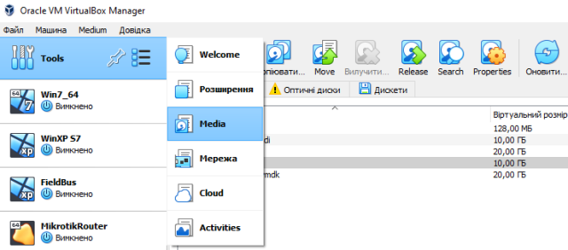

рис.3. Меню налаштування глобальних параметрів

Меню глобальних інструментів надає наступні можливості (рис.3):

- Extensions (Розширення). Відображає інструмент Extension Pack Manager. Цей інструмент використовується для встановлення та видалення Oracle VM VirtualBox Extension Packs. 
- Media (Диски). Відображає інструмент Virtual Media Manager. Цей інструмент використовується для керування образами дисків, які використовуються Oracle VM VirtualBox. 

- Network (Мережа). Відображає інструмент Network Manager. Цей інструмент використовується для створення та налаштування деяких типів мереж, які використовуються Oracle VM VirtualBox.

- Cloud (Хмара). Відображає інструмент Cloud Profile Editor. Цей інструмент використовується для налаштування підключень до хмарної служби, наприклад Oracle Cloud Infrastructure. 

- Activities (Діяльності). Відображає інструмент огляду активності віртуальної машини. Цей інструмент використовується для моніторингу продуктивності та використання ресурсів віртуальних машин. 

У списку машин на лівій панелі вікна VirtualBox Manager вибирається віртуальна машина, в якої також є меню Machine Tools.

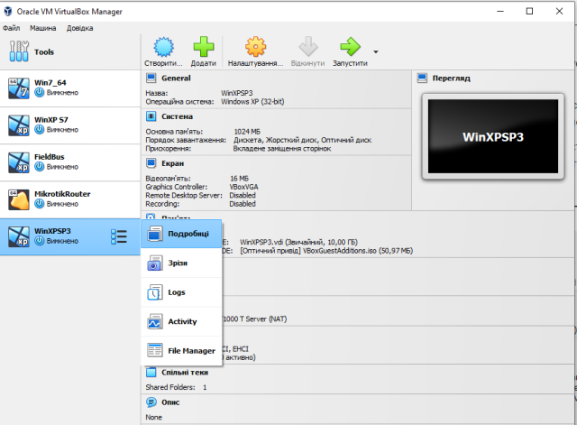

рис.4. Меню налаштування машинних інструментів

- Details (Подробиці). Відображає панель деталей для вибраної віртуальної машини. 
- Snapshots (Зрізи). Відображає інструмент «Зрізи». Цей інструмент дозволяє переглядати знімки віртуальної машини та керувати ними. 

- Logs (Журнали). Відображає інструмент перегляду журналів. Цей інструмент дозволяє переглядати та шукати системні журнали віртуальної машини. 

- Activity (Діяльність). Відображає сторінку «Діяльність віртуальної машини» діалогового вікна «Інформація про сеанс». Це діалогове вікно дозволяє переглядати та аналізувати показники продуктивності віртуальної машини. 

- File Manager (Файловий менеджер). Відображає інструмент гостьового керування файлами. Цей інструмент дозволяє керувати файлами в гостьовій системі. 

## Налаштування віртуальних машин

Oracle VM VirtualBox віртуалізує майже все апаратне забезпечення хосту. Залежно від конфігурації віртуальної машини, гостьова система побачить таке віртуальне обладнання:

- Пристрої введення. Oracle VM VirtualBox може емулювати стандартну клавіатуру та мишу PS/2. Ці пристрої підтримують більшість гостьових ОС. Крім того, Oracle VM VirtualBox може надавати віртуальні USB-пристрої введення, щоб уникнути необхідності захоплення миші та клавіатури.

- Графіка. Типовим графічним пристроєм Oracle VM VirtualBox для гостьових систем Windows є пристрій SVGA. Для гостьових систем Linux графічний пристрій за замовчуванням емулює графічний пристрій VMware SVGA. Для застарілих гостьових ОС доступний VGA-сумісний графічний пристрій.

- Зберігання. Oracle VM VirtualBox емулює найпоширеніші типи контролерів жорсткого диска. У той час як підтримки лише одного з цих контролерів було б достатньо для Oracle VM VirtualBox самої по собі, ця безліч адаптерів зберігання потрібна для сумісності з іншими гіпервізорами. Windows дуже вибірково ставиться до своїх завантажувальних пристроїв, і міграція віртуальних машин між гіпервізорами дуже складна або неможлива, якщо контролери сховища різні.

- Мережі. 

- USB. Oracle VM VirtualBox емулює такі типи хост-контролерів USB: xHCI, EHCI та OHCI. Хоча xHCI підтримує всі швидкості передачі через USB, деякі застарілі гостьові ОС можуть не підтримувати xHCI. Зауважте, що для деяких застарілих гостьових систем Windows потрібно інсталювати сторонні драйвери для підтримки xHCI. Застарілі гостьові ОС зазвичай підтримують OHCI та EHCI. Ці два контролери потрібні, оскільки OHCI обробляє лише низькошвидкісні та повношвидкісні пристрої USB (як USB 1.x, так і 2.0), тоді як EHCI обробляє лише високошвидкісні пристрої (лише USB 2.0). Емульовані контролери USB не спілкуються безпосередньо з пристроями на хості. Натомість вони спілкуються з віртуальним USB-рівнем, який абстрагує протокол USB і дозволяє використовувати віддалені USB-пристрої.

- Аудіо. 

Вибравши віртуальну машину можна перейти у вікно налаштування (рис.5)

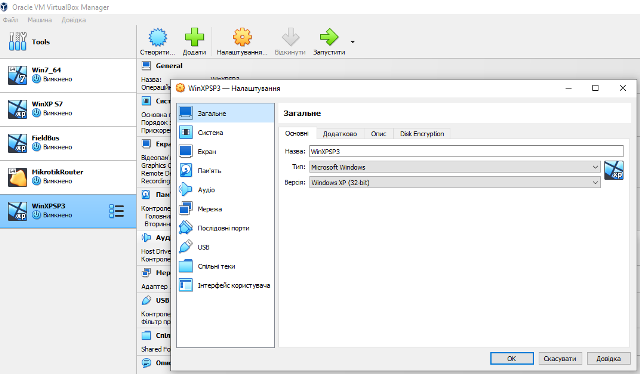

рис.5. Вікно віртуальної машини

Нижче наведений перелік є довідковим. Повний опис доступний [за посиланням](https://www.virtualbox.org/manual/ch03.html) 

### Загальні (General)

У розділі «Загальні» можна налаштувати найбільш фундаментальні аспекти віртуальної машини:

- Основні (Basic ): ім'я, тип та версію ОС
- Додаткові (Advanced): тека зрізів, спільна кишеня (налаштування поведінки буферу обміну), поведінка перетягування (Drag and Drop)
- шифрування дисків (Disk Encryption)

### Система (System)

У розділі "Система"  згруповані різні параметри, пов’язані з основним апаратним забезпеченням, яке відображається на віртуальній машині.

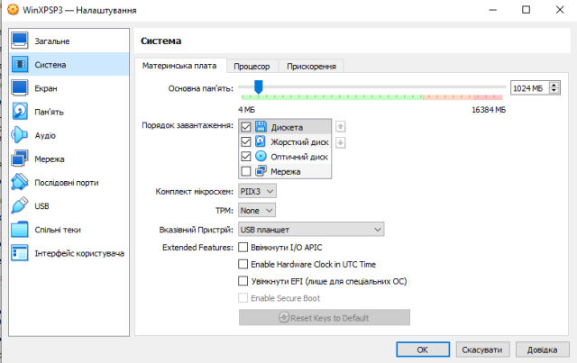

рис.6. 

- Вкладка Материнська плата (Motherboard). Тут можна налаштувати віртуальне обладнання, яке зазвичай знаходиться на материнській платі справжнього комп’ютера. З віртуальними машинами під керуванням сучасних серверних ОС Oracle VM VirtualBox також підтримує гаряче підключення ЦП.
  - Основна пам’ять (Base Memory): встановлює обсяг оперативної пам’яті, який виділяється та надається віртуальній машині під час її роботи. Зазначений обсяг пам’яті буде запитаний у ОС хоста, тому він має бути доступним як вільна пам’ять на хості під час спроби запуску віртуальної машини та не буде доступний хосту, поки віртуальна машина працює. Як правило, після встановлення гостьової ОС можна змінити розмір пам’яті. Але ви не повинні зменшувати пам'ять до такого обсягу, коли гостьова ОС більше не завантажуватиметься.
  - Порядок завантаження (Boot Order): означує порядок, у якому гостьова ОС намагатиметься завантажитися з різних віртуальних завантажувальних пристроїв. Подібно до налаштувань BIOS справжнього комп’ютера, Oracle VM VirtualBox може вказати гостьовій ОС запускатися з віртуальної дискети, віртуального CD/DVD-приводу, віртуального жорсткого диска (кожен із них визначено іншими налаштуваннями віртуальної машини), мережі, або нічого з цього. Якщо вибрати «Мережа», віртуальна машина спробує завантажитися з мережі за допомогою механізму PXE. Це потрібно детально налаштувати в командному рядку. 
  - Комплекс мікросхем (Chipset): ви можете вибрати, який набір мікросхем буде представлено віртуальній машині. PIIX3 є чіпсетом за умовчанням для більшості гостьових систем. Для деяких гостьових ОС, таких як Mac OS X, набір мікросхем PIIX3 не підтримується належним чином. Як наслідок, Oracle VM VirtualBox підтримує емуляцію чіпсета ICH9, який підтримує PCI Express, три шини PCI, мости PCI-PCI і переривання з сигналами повідомлень (MSI). Це дозволяє сучасним ОС адресувати більше пристроїв PCI і більше не потребує спільного використання IRQ. За допомогою набору мікросхем ICH9 також можна налаштувати до 36 мережевих карт, у порівнянні з максимум вісьмома мережевими адаптерами з PIIX3. Зауважте, що підтримка ICH9 є експериментальною та не рекомендована для гостьових ОС, яким вона не потрібна.
  - TPM: вмикає підтримку процесора безпеки Trusted Platform Module (TPM). Виберіть із підтримуваних версій TPM.
  - Вказівний пристрій (Pointing Device): типовим віртуальним вказівним пристроєм для деяких гостьових ОС є традиційна миша PS/2. Якщо встановлено значення USB Tablet, Oracle VM VirtualBox повідомляє віртуальній машині про присутність USB-планшета та передає події миші на віртуальну машину через цей пристрій. Іншим параметром є USB Multi-Touch Tablet, який підходить для гостьових ОС з Windows 8 або новішої версії. Використання віртуального USB-планшета має ту перевагу, що рухи повідомляються в абсолютних координатах, а не як відносні зміни положення. Це дозволяє Oracle VM VirtualBox перетворювати події миші над вікном віртуальної машини в події планшета без необхідності «захоплювати» мишу в гостьовій системі. Це робить використання віртуальної машини менш виснажливим, навіть якщо гостьові доповнення не встановлено.
  - Увімкнути  I/O APIC (Enable I/O APIC): розширені програмовані контролери переривань (APIC) — це апаратна функція x86, яка замінила програмовані контролери переривань (PIC). Завдяки APIC вводу/виводу ОС можуть використовувати більше 16 запитів на переривання (IRQ) і, отже, уникати спільного використання IRQ для підвищення надійності. Необхідно ввімкнути I/O APIC, особливо для 64-розрядних гостьових ОС Windows. Це також потрібно, якщо ви хочете використовувати більше одного віртуального ЦП у віртуальній машині. Однак програмна підтримка APIC вводу/виводу була ненадійною в деяких ОС, крім Windows. Крім того, використання APIC вводу-виводу дещо збільшує накладні витрати на віртуалізацію, а тому дещо сповільнює гостьову ОС. Усі ОС Windows встановлюють різні ядра залежно від наявності APIC вводу-виводу. Як і у випадку з ACPI, I/O APIC не можна вимикати після інсталяції гостьової ОС Windows. Однак увімкнення після встановлення не матиме ефекту.
  - Апаратний годинник у форматі UTC (Hardware Clock in UTC Time): якщо вибрано, Oracle VM VirtualBox повідомлятиме гостьовій системі системний час у форматі UTC замість локального часу (на хості). Це впливає на роботу віртуального годинника реального часу (RTC) і може бути корисним для UNIX-подібних гостьових ОС, які зазвичай очікують, що апаратний годинник буде встановлено на UTC.
  - Увімкнути EFI (Enable EFI): вмикає розширюваний інтерфейс вбудованого програмного забезпечення (EFI), який замінює застарілий BIOS і може бути корисним для певних розширених випадків використання. Детальніше див нижче.
  - Увімкнути безпечне завантаження (Enable Secure Boot): вмикає безпечне завантаження, щоб забезпечити безпечне середовище для запуску гостьової ОС.
- Вкладка Процесор (Processor). Тут можна налаштувати параметри ЦП, який використовується віртуальною машиною. У більшості випадків налаштування за замовчуванням на вкладці «Прискорення» працюватимуть добре. Oracle VM VirtualBox вибирає розумні параметри за замовчуванням залежно від ОС, яку ви вибрали під час створення віртуальної машини. Проте в певних ситуаціях ви можете змінити попередньо налаштовані параметри за замовчуванням.
  - Процесор(и): встановлює кількість віртуальних ядер ЦП, які можуть бачити гостьові ОС. Oracle VM VirtualBox підтримує симетричну багатопроцесорну обробку (SMP) і може надавати до 32 віртуальних ядер ЦП для кожної віртуальної машини. Ви не повинні налаштовувати віртуальні машини на використання більшої кількості ядер ЦП, ніж доступно фізично. Це включає реальні ядра без гіперпотоків.
  - Обмеження виконання (виконавча шапка, Execution Cap): налаштовує обмеження виконання ЦП. Це обмежує час, який центральний ЦП витрачає на емуляцію віртуального ЦП. За замовчуванням встановлено 100%, що означає відсутність обмежень. Значення 50% означає, що один віртуальний ЦП може використовувати до 50% ЦП одного хоста. Зауважте, що обмеження часу виконання віртуальних ЦП може спричинити проблеми з синхронізацією гостьових систем. Унизу вкладки «Процесор» відображається попередження, якщо встановлено параметр Execution Cap, який може вплинути на продуктивність системи.
  - Увімкнути PAE/NX (Enable PAE/NX): означує, чи будуть можливості PAE та NX центрального процесора доступні для віртуальної машини. PAE означає розширення фізичної адреси. Зазвичай, якщо це ввімкнено та підтримується ОС, навіть 32-розрядний ЦП x86 може отримати доступ до понад 4 ГБ оперативної пам’яті. Це стало можливим завдяки додаванню ще 4 бітів до адрес пам’яті, так що з 36 бітами можна адресувати до 64 ГБ. Деякі ОС, такі як Ubuntu Server, потребують підтримки PAE від центрального процесора, і їх неможливо запустити на віртуальній машині без неї.
  - Увімкнути вкладену віртуалізацію VT-x/AMD-V (Enable Nested VT-x/AMD-V): увімкнути вкладену віртуалізацію з передачі функцій апаратної віртуалізації на гостьову віртуальну машину.
- Вкладка Прискорення (Acceleration) - тут налаштовується Oracle VM VirtualBox на використання апаратних розширень віртуалізації, які підтримує ваш центральний процесор.
  - Інтерфейс паравіртуалізації (Paravirtualization Interface): Oracle VM VirtualBox надає інтерфейси паравіртуалізації для підвищення точності обліку часу та продуктивності гостьових ОС. 
  - Віртуалізація пристрою (Hardware Virtualization): ви можете налаштувати функції віртуалізації апаратного забезпечення для кожної віртуальної машини. Увімкнути вкладене заміщення сторінок (Enable Nested Paging): якщо центральний процесор підтримує функції вкладеної підкачки (AMD-V) або EPT (Intel VT-x), ви можете очікувати значного підвищення продуктивності, увімкнувши вкладену підкачку сторінок на додаток до апаратної віртуалізації. 

### Екран (Display) 

Наступні вкладки доступні для налаштування дисплея для віртуальної машини.

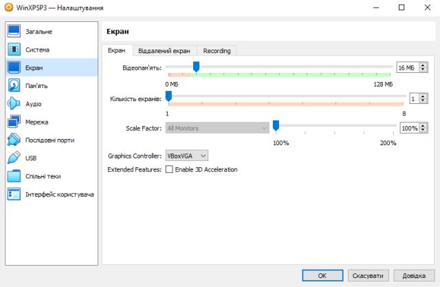

рис.7 

- Screen (Екран). 
  - Відеопам'ять (Video Memory): встановлює розмір пам'яті, наданої віртуальною відеокартою, доступною для гостьової ОС, у МБ. Як і у випадку з основною пам’яттю, вказаний обсяг буде виділено з резидентної пам’яті хоста. Залежно від обсягу відеопам’яті можуть бути доступні вищі роздільна здатність і глибина кольору. Менеджер VirtualBox покаже попередження, якщо обсяг відеопам’яті занадто малий, щоб можна було переключити віртуальну машину в повноекранний режим. Мінімальне значення залежить від кількості віртуальних моніторів, роздільної здатності екрана та глибини кольору головного дисплея, а також від використання 3D-прискорення та 2D-відеоприскорення. Приблизна оцінка: (глибина кольору / 8) x вертикальні пікселі x горизонтальні пікселі x кількість екранів = кількість байтів. Якщо використовується прискорення відображення, може знадобитися додаткова пам’ять.
  - Кількість екранів (Monitor Count): за допомогою цього параметра Oracle VM VirtualBox може надати віртуальній машині більше одного віртуального монітора. Якщо гостьова ОС підтримує кілька підключених моніторів, Oracle VM VirtualBox може вдавати, що присутні кілька віртуальних моніторів. Підтримується до восьми таких віртуальних моніторів. Вихідні дані кількох моніторів відображаються на хості в кількох вікнах віртуальної машини, які працюють поруч. Однак у повноекранному та безшовному режимі вони використовують доступні фізичні монітори, підключені до хоста. Як результат, щоб повноекранний і плавний режими працювали з декількома моніторами, вам знадобиться принаймні стільки фізичних моніторів, скільки у вас налаштовано віртуальних моніторів, інакше Oracle VM VirtualBox повідомить про помилку. Ви можете налаштувати зв’язок між гостьовим і хост-моніторами за допомогою меню «Перегляд», натиснувши клавішу Host + Home, коли ви перебуваєте в повноекранному або безшовному режимі.
  - Коефіцієнт масштабування (Scale Factor): дозволяє масштабувати розмір дисплея. Для кількох моніторів ви можете встановити коефіцієнт масштабування для окремих моніторів або глобально для всіх моніторів. Використовуйте повзунок, щоб вибрати коефіцієнт масштабування до 200%. Ви можете встановити коефіцієнт масштабування за замовчуванням для всіх віртуальних машин. Використовуйте вкладку «Дисплей» у вікні «Параметри».
  - Графічний контролер (Graphics Controller): означує тип графічного адаптера, який використовується гостьовою віртуальною машиною. Зауважте, що ви повинні інсталювати гостьові доповнення на гостьовій віртуальній машині, щоб указати графічний контролер VBoxSVGA або VMSVGA. 
  - Enable 3D Acceleration: Якщо на віртуальній машині встановлено гостьові доповнення, тут можна вибрати, чи повинна гостьова система підтримувати прискорену 3D-графіку.
- Remote (Віддалений екран). На вкладці Remote Display, якщо встановлено VirtualBox Remote Display Extension (VRDE), ви можете ввімкнути сервер VRDP, вбудований у Oracle VM VirtualBox. Це дає змогу віддалено підключатися до консолі віртуальної машини за допомогою будь-якого стандартного засобу перегляду RDP, наприклад `mstsc.exe`, який постачається з Microsoft Windows. У системах Linux і Oracle Solaris можна використовувати стандартну програму rdesktop з відкритим кодом.
  - Enable Server. Установіть цей прапорець і налаштуйте параметри підключення віддаленого дисплея. 
- Recording. Тут можна ввімкнути запис відео та аудіо для віртуальної машини та змінити відповідні параметри. Зауважте, що ці функції можна вмикати та вимикати під час роботи віртуальної машини.

### Пам'ять (Storage) 

Категорія «Сховище» в налаштуваннях віртуальної машини дає змогу підключати до віртуальної машини віртуальні жорсткі диски, компакт-диски та дискети, а також образи та дисководи.

У реальному комп’ютері так звані контролери зберігання підключають фізичні диски до решти комп’ютера. Подібним чином Oracle VM VirtualBox представляє віртуальні контролери сховища для віртуальної машини. Під кожним контролером показано віртуальні пристрої, такі як жорсткі диски, CD/DVD або дисководи, підключені до контролера.

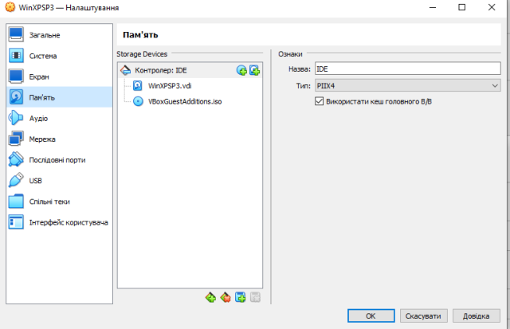

рис.8 

Залежно від типу гостьової ОС, який ви вибрали під час створення віртуальної машини, нова віртуальна машина включає такі пристрої зберігання:

- Контролер IDE. Віртуальний CD/DVD-привід підключається до пристрою 0 на вторинному каналі контролера IDE.
- Контролер SATA. Це сучасний тип контролера зберігання для більш високої пропускної здатності жорсткого диска, до якого приєднані віртуальні жорсткі диски. Спочатку у вас зазвичай буде один такий віртуальний диск, але можна мати більше одного. Кожен представлений файлом образу диска, таким як файл VDI.

Якщо ви створили свою віртуальну машину за допомогою старішої версії Oracle VM VirtualBox, макет сховища за замовчуванням може відрізнятися. Тоді у вас може бути лише контролер IDE, до якого під’єднано привід CD/DVD і жорсткі диски. Це також може застосовуватися, якщо під час створення віртуальної машини ви вибрали старіший тип ОС. Оскільки старі ОС не підтримують SATA без додаткових драйверів, Oracle VM VirtualBox переконається, що такі пристрої спочатку відсутні. 

Oracle VM VirtualBox також надає контролер дискет. До цього контролера не можна додавати інші пристрої, окрім дисководів. Віртуальні дисководи, як і віртуальні приводи для компакт-дисків/DVD, можна підключити або до головного дисководу, якщо він у вас є, або до образу диска, який у цьому випадку має бути у форматі RAW.

Ви можете вільно змінювати ці мультимедійні вкладення. Наприклад, якщо ви хочете скопіювати деякі файли з іншого віртуального диска, який ви створили, ви можете підключити цей диск як другий жорсткий диск. Ви також можете додати другий віртуальний привід CD/DVD або змінити місце підключення цих елементів. 

### Аудіо (Audio) 

Розділ «Аудіо» у вікні «Параметри» віртуальної машини визначає, чи виявлятиме віртуальна машина підключену звукову карту та чи має відтворюватися вихідний аудіо на головній системі.

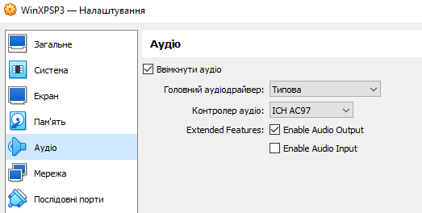

рис.9 

- Головний Аудіодрайвер (Host Audio Driver): аудіодрайвер, який Oracle VM VirtualBox використовує на хості. Параметр «Типова» увімкнено за умовчанням для всіх нових віртуальних машин. Цей параметр автоматично вибирає найкращий аудіодрайвер для хост-платформи. Це дає змогу переміщувати віртуальні машини між різними платформами без необхідності змінювати звуковий драйвер. 

- Контролер аудіо (Audio Controller): Ви можете вибрати емуляцію контролера Intel AC'97, контролера Intel HD Audio або карти SoundBlaster.

- Enable Audio Output (Увімкнути аудіовихід): вмикає аудіовивід лише для віртуальної машини.

- Enable Audio Input (Увімкнути аудіовхід): вмикає аудіовхід лише для віртуальної машини.

### Мережа (Network) 

Розділ «Мережа» у вікні налаштувань віртуальної машини дозволяє налаштувати, як Oracle VM VirtualBox представляє віртуальні мережеві карти вашій віртуальній машині та як вони працюють.

Коли ви вперше створюєте віртуальну машину, Oracle VM VirtualBox за замовчуванням вмикає одну віртуальну мережеву карту та вибирає для неї режим трансляції мережевих адрес (NAT). Таким чином гість може підключатися до зовнішнього світу за допомогою мережі хоста, а зовнішній світ може підключатися до служб гостьової системи, які ви вирішите зробити видимими за межами віртуальної машини. Це налаштування за замовчуванням підходить для більшості користувачів Oracle VM VirtualBox. Однак Oracle VM VirtualBox надзвичайно гнучкий у тому, як він може віртуалізувати мережу. Він підтримує багато віртуальних мережевих карт на віртуальну машину. Перші чотири віртуальні мережеві карти можна детально налаштувати в VirtualBox Manager. Додаткові мережеві карти можна налаштувати за допомогою команди VBoxManage.

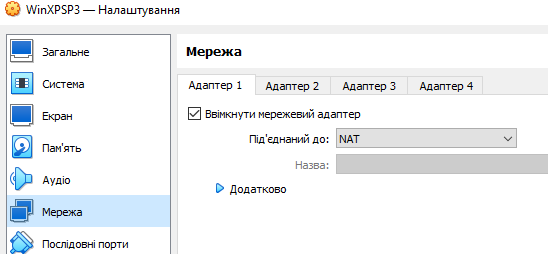

рис.10

Додатково про налаштування мережних карт для віртуальної машини розглядається в іншому модулі. 

### Послідовні порти (Serial Ports)

Oracle VM VirtualBox підтримує використання віртуальних послідовних портів у віртуальній машині.

Починаючи з оригінального IBM PC, персональні комп’ютери були оснащені одним або двома послідовними портами, які також називаються COM-портами в DOS і Windows. Послідовні порти зазвичай використовувалися з модемами, і деякі комп’ютерні миші підключалися до послідовних портів до того, як USB став звичним явищем. Незважаючи на те, що послідовні порти вже не такі поширені, як раніше, вони все ще мають кілька важливих застосувань. Наприклад, послідовні порти можна використовувати для налаштування примітивної мережі через нуль-модемний кабель, якщо Ethernet недоступний. Крім того, послідовні порти незамінні для системних програмістів, які потребують налагодження ядра, оскільки програмне забезпечення для налагодження ядра зазвичай взаємодіє з розробниками через послідовний порт. За допомогою віртуальних послідовних портів системні програмісти можуть виконувати налагодження ядра на віртуальній машині замість того, щоб підключатися до реального комп’ютера.

Якщо віртуальний послідовний порт увімкнено, гостьова ОС бачить стандартний 16550A-сумісний пристрій UART. Інші типи UART можна налаштувати за допомогою команди VBoxManage modifyvm. Підтримується як прийом, так і передача даних. Спосіб підключення цього віртуального послідовного порту до хоста можна налаштувати, а деталі залежать від вашої ОС хоста.

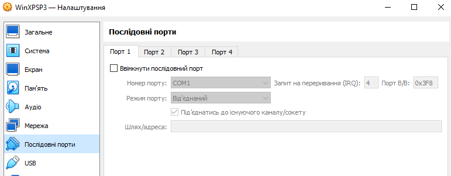

рис.11

Ви можете налаштувати до чотирьох віртуальних послідовних портів на віртуальну машину. Для кожного пристрою необхідно встановити наступне:

- Номер порту (Port Number): Це означує послідовний порт, який має бачити віртуальна машина. Для досягнення найкращих результатів використовуйте традиційні значення таким чином:

  - COM1: I/O base 0x3F8, IRQ 4 

  - COM2: I/O base 0x2F8, IRQ 3 

  - COM3: I/O base 0x3E8, IRQ 4 

  - COM4: I/O base 0x2E8, IRQ 3 

Ви також можете налаштувати означений користувачем послідовний порт. Введіть базову адресу введення/виведення та переривання (IRQ).

- Режим порту (Port Mode): До чого підключений віртуальний порт. Для кожного віртуального послідовного порту ви маєте такі параметри:

  - Від'єднаний (Disconnected): Гостьова ОС побачить пристрій, але він буде поводитися так, ніби до нього не було підключено кабель.

  - Головний пристрій (Host Device): Підключає віртуальний послідовний порт до фізичного послідовного порту на вашому хості. На хості з Windows це матиме назву по типу `COM1`. На хостах з Linux або Oracle Solaris це буде вузол пристрою, наприклад `/dev/ttyS0`. Тоді Oracle VM VirtualBox просто перенаправить усі дані, отримані з віртуального послідовного порту та надіслані на нього, на фізичний пристрій.

  - Головний канал (Host Pipe): Налаштуйте Oracle VM VirtualBox для підключення віртуального послідовного порту до програмного каналу (pipe) на хості. У цьому випадку ви можете налаштувати, чи повинен Oracle VM VirtualBox створювати іменований канал або хости локального доменного сокета, відмінні від Windows, чи Oracle VM VirtualBox повинен припускати, що канал або сокет уже існують. З параметрами командного рядка VBoxManage це називається режимом сервера або режимом клієнта відповідно. Для прямого з’єднання між двома віртуальними машинами, що відповідає нуль-модемному кабелю, просто налаштуйте одну віртуальну машину для створення каналу або сокета, а іншу – для приєднання до нього. Це залежить від вашої хост-ОС, а саме:

    - На хості Windows дані надсилатимуться та отримуватимуться через іменований канал. Ім’я каналу має бути у форматі `\\.\pipe\name`, де `name` має ідентифікувати віртуальну машину, але його можна вибрати вільно.
    - On a Mac OS, Linux, or Oracle Solaris host, a local domain socket is used instead. The socket filename must be chosen such that the user running Oracle VM VirtualBox has sufficient privileges to create and write to it. The /tmp directory is often a good candidate. 

    - On Linux there are various tools which can connect to a local domain socket or create one in server mode. The most flexible tool is socat and is available as part of many distributions. 

  In this case, you can configure whether Oracle VM VirtualBox should create the named pipe, or the local domain socket non-Windows hosts, itself or whether Oracle VM VirtualBox should assume that the pipe or socket exists already. With the VBoxManage command-line options, this is referred to as server mode or client mode, respectively. For a direct connection between two virtual machines, corresponding to a null-modem cable, simply configure one VM to create a pipe or socket and another to attach to it. 

  - Необроблений файлі (Raw File): Send the virtual serial port output to a file. This option is very useful for capturing diagnostic output from a guest. Any file may be used for this purpose, as long as the user running Oracle VM VirtualBox has sufficient privileges to create and write to the file. 

  - TCP: Useful for forwarding serial traffic over TCP/IP, acting as a server, or it can act as a TCP client connecting to other servers. This option enables a remote machine to directly connect to the guest's serial port using TCP. 

- TCP Server: Deselect the Connect to Existing Pipe/Socket check box and specify the port number in the Path/Address field. This is typically 23 or 2023. Note that on UNIX-like systems you will have to use a port a number greater than 1024 for regular users. 
- The client can use software such as PuTTY or the telnet command line tool to access the TCP Server. 
- TCP Client: To create a virtual null-modem cable over the Internet or LAN, the other side can connect using TCP by specifying *hostname*:*port* in the Path/Address field. The TCP socket will act in client mode if you select the Connect to Existing Pipe/Socket check box. 

Up to four serial ports can be configured per virtual machine, but you can pick any port numbers out of the above. However, serial ports cannot reliably share interrupts. If both ports are to be used at the same time, they must use different interrupt levels, for example COM1 and COM2, but not COM1 and COM3. 

### USB

Розділ USB у вікні налаштувань віртуальної машини дозволяє налаштувати складну підтримку USB Oracle VM VirtualBox. Oracle VM VirtualBox може надати віртуальним машинам прямий доступ до USB-пристроїв на хості. Для цього Oracle VM VirtualBox надає гостьовій ОС віртуальний контролер USB. Щойно гостьова система починає використовувати USB-пристрій, він відображатиметься як недоступний на хості.

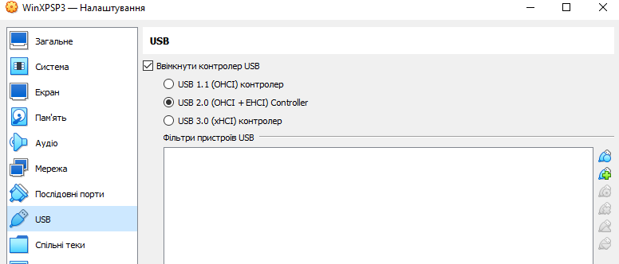

рис.12

### Спільні теки (Shared Folders)

Спільні папки дозволяють легко обмінюватися даними між віртуальною машиною та хостом. Ця функція вимагає встановлення гостьових доповнень Oracle VM VirtualBox на віртуальній машині, і вона детально описана в розділі 4.3 «Спільні папки».

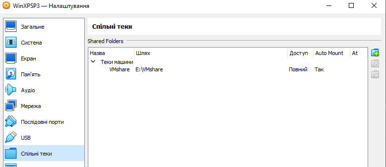

рис.13

### Інтерфейс користувача (User Interface)

У розділі «Інтерфейс користувача» можна змінити певні аспекти інтерфейсу користувача вибраної віртуальної машини.

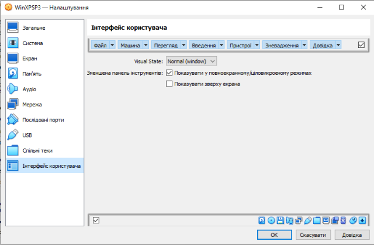

рис.14 

Теоретичне заняття розробив [Олександр Пупена](https://github.com/pupenasan). 
