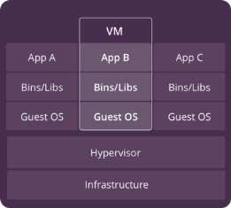
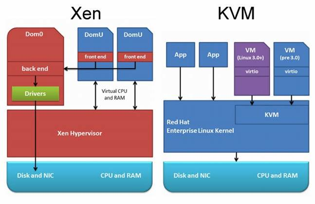

[<- Back to section](README_en.md)

# Basics of Virtualization with VirtualBox

## Virtualization and Virtual Machines

Virtualization enables the use of not real resources, but their software emulators, which in turn use a portion of physical resources. Thus, one physical resource, such as a hardware server, can simultaneously host several virtual servers, making the resource use more flexible. Today, two types of virtualization are commonly used for applications: virtual machines and containers. This module covers only virtual machines based on VirtualBox; containers are covered in a separate module.  

A **virtual machine** (**VM**) is an emulation of a computer system on another computer. This allows multiple independent virtual computers to run on hardware that is, in fact, a single physical machine.  

  

Fig.1. Stack with virtual machine and hypervisor.  

Virtual machine virtualization is provided by a **hypervisor**. A **hypervisor** (also called a virtual machine monitor) is software, firmware, or hardware that creates and runs virtual machines.  

In this context:  
- The **guest operating system (guest OS)** is the OS running inside the virtual machine.  
- Each virtual machine requires its own OS and has fully virtualized hardware.  

The hypervisor sits between the hardware or host OS of the physical machine and the virtual machine, and is necessary for virtualization. A hypervisor can run directly on hardware (Type 1) or on top of another OS (Type 2):  

- **Type 1 hypervisor** (also called bare-metal) runs directly on the hardware. Examples: Xen, VMware ESXi, Hyper-V. It generally provides better performance since no host OS layer is required.  
- **Type 2 hypervisor** (also called hosted) runs as an application on the host OS. Examples: KVM, Oracle VirtualBox, VMware Workstation.  
- Hybrid approaches also exist.  

  

Fig.2. Example of hypervisors running directly on hardware or on a host OS.  

Examples of hypervisors:  
- [VMware vSphere](https://www.vmware.com/products/vsphere.html)  
- [VirtualBox](https://www.virtualbox.org/)  
- [Xen](https://www.xenproject.org/)  
- [Hyper-V](https://docs.microsoft.com/en-us/virtualization/hyper-v-on-windows/about/)  
- [KVM](https://www.linux-kvm.org/page/Main_Page)  

Virtual machines are widely used on office PCs, servers, and cloud infrastructures. Most cloud providers allow creating and deploying virtual machines for various OS.  

In industrial automation, Type 2 hypervisors are most commonly used, installed on a PC’s host OS. Therefore, remember two important terms:  
- **Host OS** — the native OS of the computer.  
- **Guest OS** — the OS running inside the virtual machine.  

### Characteristics of Virtual Machines
- Can consume significant system resources.  
- Include not only a full copy of the OS, but also a virtual copy of all required hardware.  
- Require more RAM than the guest OS itself needs.  
- Require additional CPU time for virtualization overhead.  

### Advantages
- Applications have full access to the guest OS resources, as if on a standalone PC.  
- Any OS can be installed as a guest, regardless of the host OS.  
- Mature management tools and proven security.  

### Disadvantages
- High consumption of resources and processing time for virtualization.  

## Use of Virtual Machines in Industrial Automation

VMs are often used as software development environments for different platforms:  
- Avoids conflicts between vendor tools or versions.  
- Makes it possible to transfer preconfigured environments between developer workstations.  
- Allows testing with trial versions of software while keeping snapshots.  

Other uses:  
- Testing multi-environment systems connected via virtual networks.  
- Serving as runtime environments, simplifying deployment and scaling.  
- Training and education, especially for remote learning.  
- Cloud usage — fast deployment of servers without dedicated hardware.  

## Overview of VirtualBox

**VirtualBox** is a Type 2 hypervisor originally developed by innotek, now maintained by Oracle Corporation. It supports Linux, FreeBSD, Mac OS X, OS/2 Warp, and Windows as host OS, and can run guest OS like FreeBSD, Linux, OpenBSD, OS/2, Windows, and Solaris.  

Versions:  
- Enterprise (paid, limited free use).  
- Open Source Edition (OSE) under [GNU GPL](https://en.wikipedia.org/wiki/GNU_General_Public_License).  

Documentation: [VirtualBox Manual](https://www.virtualbox.org/manual)  

### Typical Uses of VirtualBox
- Running multiple VMs with different OS simultaneously.  
- Simplified software deployment and delivery.  
- Testing and disaster recovery with snapshots.  
- Infrastructure consolidation and resource savings.  

### Key Features
- **Portability:** works across 64-bit host OS, supports OVF import/export, Oracle Cloud integration.  
- **Guest Additions:** shared folders, seamless windows, 3D acceleration.  
- **Hardware support:** multiprocessor SMP (up to 32 vCPUs), USB passthrough, ACPI, iSCSI, PXE boot, multi-screen support.  
- **Snapshots:** multi-generation branching snapshots.  
- **VM Groups:** organize and manage multiple VMs together.  
- **Architecture & SDK:** modular architecture with APIs and SDK for integration.  
- **Remote Display (VRDE):** RDP-based remote access with advanced features like RDP authentication and USB over RDP.  

## Using VirtualBox Manager

VirtualBox provides multiple management interfaces:  
- **VirtualBox Manager** (GUI).  
- **VBoxManage** (command-line interface).  
- **VBoxHeadless** (headless mode with optional RDP server).  

This module covers only the graphical VirtualBox Manager.  

- **Global Tools:** Extensions, Media, Network, Cloud, Activity.  
- **Machine Tools:** Details, Snapshots, Logs, Activity, File Manager.  

## Virtual Machine Settings

VirtualBox virtualizes almost all host hardware. Depending on configuration, the guest sees virtualized:  
- Input devices (keyboard, mouse).  
- Graphics (VGA, SVGA, VMware SVGA).  
- Storage controllers (IDE, SATA, SCSI, floppy).  
- Network adapters (NAT, Bridged, Host-only, Internal, NAT Network).  
- USB controllers (xHCI, EHCI, OHCI).  
- Audio controllers (AC’97, HD Audio, SoundBlaster).  
- Serial ports.  

Key categories:  
- **General**: name, OS type/version, snapshots folder, encryption, clipboard & drag-drop behavior.  
- **System**: memory, CPUs, boot order, chipset (PIIX3, ICH9), TPM, APIC, EFI, secure boot.  
- **Display**: video memory, monitors, scaling, graphics controller, 3D acceleration, remote display.  
- **Storage**: manage disks, CD/DVD, floppy controllers.  
- **Audio**: host driver, audio controller, enable input/output.  
- **Network**: choose adapter mode (NAT, Bridged, Host-only, Internal, NAT Network).  
- **Serial Ports**: configure up to 4 COM ports with options (host device, host pipe, raw file, TCP).  
- **USB**: enable USB passthrough.  
- **Shared Folders**: host–guest file exchange.  
- **User Interface**: customize VM UI.  

Theoretical lesson developed by [Oleksandr Pupena](https://github.com/pupenasan).  

For feedback and discussion:  
- [WhatsApp group](https://chat.whatsapp.com/BRbPAQrE1s7BwCLtNtMoqN)  
- [Telegram group](https://t.me/+GA2smCKs5QU1MWMy)  
- [Facebook group](https://www.facebook.com/groups/asu.in.ua)  

More about the project and support: [here](https://asu-in-ua.github.io/atpv/)  
