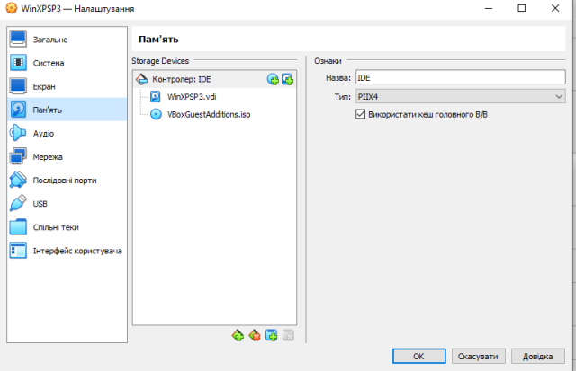
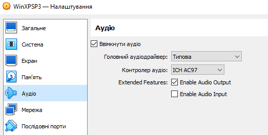

[<- Back to section](README_en.md)

# Basics of Virtualization with VirtualBox

## Virtualization and Virtual Machines

Virtualization enables the use of not real resources, but their software emulators, which in turn use a portion of physical resources. Thus, one physical resource, such as a hardware server, can simultaneously host several virtual servers, making the resource use more flexible. Today, two types of virtualization are commonly used for applications: virtual machines and containers. This module covers only virtual machines based on VirtualBox; containers are covered in a separate module.  

A **virtual machine (VM**) is an emulation of a computer system on another computer. This allows multiple independent virtual computers to run on hardware that is, in fact, a single physical machine.  

  

Fig.1. Stack with virtual machine and hypervisor.  

Virtual machine virtualization is provided by a hypervisor. A **hypervisor** (also called a virtual machine monitor) is software, firmware, or hardware that creates and runs virtual machines.  

In this context:  
- The **guest** operating system (**guest OS**) is the OS running inside the virtual machine.  
- Each virtual machine requires its own OS and has fully virtualized hardware.  

The hypervisor sits between the hardware or host OS of the physical machine and the virtual machine, and is necessary for virtualization. A hypervisor can run directly on hardware (Type 1) or on top of another OS (Type 2):  

- Type 1 hypervisor (also called bare-metal) runs directly on the hardware. Examples: Xen, VMware ESXi, Hyper-V. It generally provides better performance since no host OS layer is required.  
- Type 2 hypervisor (also called **hosted**) runs as an application on the **host OS**. Examples: KVM, Oracle VirtualBox, VMware Workstation.  
- Hybrid approaches also exist.  

  

Fig.2. Example of hypervisors running directly on hardware or on a host OS.  

Examples of hypervisors:  
- [VMware vSphere](https://www.vmware.com/products/vsphere.html)  
- [VirtualBox](https://www.virtualbox.org/)  
- [Xen](https://www.xenproject.org/)  
- [Hyper-V](https://docs.microsoft.com/en-us/virtualization/hyper-v-on-windows/about/)  
- [KVM](https://www.linux-kvm.org/page/Main_Page)  

Virtual machines are widely used on office PCs, servers, and cloud infrastructures. Most cloud providers allow creating and deploying virtual machines for various OS.  

In industrial automation, Type 2 hypervisors are most commonly used, installed on a PC’s host OS. Therefore, remember two important terms:  
- Host OS — the native OS of the computer.  
- Guest OS — the OS running inside the virtual machine.  

Virtual machines are used for virtualization on office PCs, servers, and also in cloud infrastructures. Most cloud solution providers offer the ability to create and deploy virtual machines for different operating systems.

The most widely used option in industrial automation is the use of Type 2 hypervisors, which are installed on the PC’s operating system. Therefore, it is important to remember two terms that will be frequently used later: host OS – the native operating system of the PC, and guest OS – the operating system of the virtual machine.

Virtual machines have the following characteristics:

- they can consume a large amount of system resources;
- they work not only with a full copy of the operating system, but also with a virtual copy of all the hardware the OS requires to run;
- they require a large amount of RAM, more than what is normally needed for the guest OS and its applications;
- additional CPU time is required for virtualizing the hardware and the guest OS.

Among the main advantages of virtual machines are:

- applications have access to all resources of the guest OS, just as on a standalone PC;
- any operating system (guest OS) can be installed on a VM, regardless of the host OS;
- there are time-tested tools for managing VMs;
- there are time-tested security mechanisms.

The main disadvantage is that virtualizing the hardware of a virtual machine requires significant resources and time.

## Areas of Application of Virtual Machines in Industrial Automation

In industrial automation, virtual machines are often used as software development environments for different platforms. First, this prevents conflicts between toolchains from different vendors and between different versions of the same software. Second, it allows preconfigured environments to be transferred between developer workstations. Third, it makes it possible to use trial versions of software while preserving an image with the installed tools.

Another use of VMs in industrial automation is testing system operation with several runtime environments interconnected by a virtual network.

Popular hypervisors provide VM images for a wide range of operating systems. This enables their use as development and testing environments.

Virtual machines can also function as runtime environments, which simplifies deployment of new instances or replacement of existing ones.

Particular attention should be paid to the use of virtual machines in education. Both free and commercial versions make it possible to use various virtualization tools, which is invaluable for distance learning when the necessary hardware is not available.

Another important case is the use of virtual machines in the cloud, which allows rapid deployment of servers and their 24/7 operation without dedicated physical hardware.

## Overview of VirtualBox

VirtualBox is a virtualization program (a Type 2 hypervisor) for operating systems, originally developed by the German company innotek and now owned by Oracle Corporation. It is supported on major host operating systems such as Linux, FreeBSD, Mac OS X, OS/2 Warp, and Microsoft Windows, and it can run guest operating systems including FreeBSD, Linux, OpenBSD, OS/2 Warp, Windows, and Solaris.

There are two versions that differ by license and functionality:

- Enterprise version – commercial, with the free edition available only for personal use.
- Open Source Edition (OSE) – the source code is available under the [GNU GPL](https://en.wikipedia.org/wiki/GNU_General_Public_License), with no restrictions on use. Its functionality is similar to the full version, except for some features available only to enterprise customers.

Detailed documentation on VirtualBox is available [here](https://www.virtualbox.org/manual).

### General Areas of VirtualBox Usage

Like most hypervisors, VirtualBox allows you to:

- Run multiple VMs with different operating systems simultaneously on a single host OS.
- Simplify software installation — software vendors can use virtual machines to deliver complete software configurations.
- Perform testing and disaster recovery.
  - Once installed, a virtual machine and its virtual hard disks can be treated as a container that can be freely frozen, resumed, copied, backed up, and transferred between hosts.
  - Virtual machines make it possible to create and test, for example, a multi-node network service.
  - Network, operating system, and software configuration issues can be easily investigated.
  - Using another feature of Oracle VM VirtualBox called snapshots, you can save a particular state of the virtual machine and return to it if necessary. This allows free experimentation with the computing environment. If something goes wrong — such as problems after installing software or a virus infection — you can easily revert to a previous snapshot and avoid frequent backups and restores. You can create any number of snapshots, allowing you to move back and forth in the VM’s timeline. Snapshots can then be deleted while the VM is running to free up disk space.
- Consolidate infrastructure. Virtualization can significantly reduce hardware and power costs. Modern computers typically use only a fraction of their potential capacity and operate with low average system load. As a result, a lot of hardware resources and electricity are wasted. Instead of running many such underutilized physical computers, you can pack multiple virtual machines onto a few powerful hosts and balance the load among them.

### Feature Overview

Below is a brief summary of the main features of Oracle VM VirtualBox.

Portability. Oracle VM VirtualBox runs on a wide range of 64-bit operating systems. It is a so-called hosted hypervisor (Type 2 hypervisor) that runs on top of other OS. Oracle VM VirtualBox is functionally almost identical across all host platforms, using the same file formats and images. In addition, virtual machines can be easily imported and exported using the Open Virtualization Format (OVF), an industry standard created for this purpose. For Oracle Cloud Infrastructure users, functionality extends to exporting and importing VMs to and from the cloud.

Guest Additions: shared folders, seamless windows, 3D virtualization. Oracle VM VirtualBox Guest Additions are software packages that can be installed inside supported guest systems to improve performance and provide additional integration and interaction with the host OS. After installation, the VM supports automatic video resolution adjustment, seamless windows, accelerated 3D graphics, and more. In particular, Guest Additions provide shared folders that allow access to host files from the guest machine.

Full hardware support. Among other features, Oracle VM VirtualBox supports:

- Guest multiprocessing (SMP) — can present up to 32 virtual CPUs per VM, regardless of how many CPU cores are physically present on the host.
- USB device support — implements a virtual USB controller that allows connecting any USB devices to VMs without installing separate drivers on the host.
- Hardware compatibility — virtualizes a large number of devices, including IDE, SCSI, and SATA disk controllers, several virtual network and sound cards, virtual serial and parallel ports, and an advanced programmable I/O interrupt controller (I/O APIC). This enables easy cloning of disk images from physical machines and importing third-party VMs into VirtualBox.
- Full ACPI support — Advanced Configuration and Power Interface is fully supported. This allows importing disk images from real or third-party VMs. Thanks to ACPI power status support, VirtualBox can even inform ACPI-enabled guest OS about the host’s power status. On mobile systems running on batteries, the guest can enable power saving and notify the user about remaining battery charge, e.g., in fullscreen mode.
- Multi-screen resolution — supports display resolutions far beyond the host’s physical screen, allowing distribution across multiple monitors connected to the host system.
- Built-in iSCSI support — lets a VM directly connect to an iSCSI storage server without host OS overhead, giving direct access to the iSCSI target.
- PXE network boot — VirtualBox’s integrated virtual NICs fully support network booting using PXE (Preboot Execution Environment).

Multi-generation branched snapshots. Oracle VM VirtualBox can store arbitrary snapshots of VM states. You can roll back to any snapshot and launch an alternative VM configuration, effectively creating a snapshot tree.

VM groups. VirtualBox provides grouping features that let users organize and manage VMs collectively or individually. Any VM can belong to multiple groups, and groups can be nested. Operations available on groups are the same as for individual VMs: start, pause, reset, close (save state, send shutdown signal, power off), discard saved state, show in file system, sort, etc.

Clean architecture and unprecedented modularity. Oracle VM VirtualBox has a highly modular design with well-defined internal programming interfaces and clear separation of client and server code. This makes it easy to manage from multiple interfaces simultaneously. For example, you can launch a VM from the graphical UI, then control it from the command line or even remotely. Its modular architecture also exposes full functionality and configuration through a comprehensive Software Development Kit (SDK), enabling integration with other software systems.

Remote display. The VirtualBox Remote Desktop Extension (VRDE) provides high-performance remote access to any running VM. It supports the Remote Desktop Protocol (RDP) originally built into Microsoft Windows, with special enhancements for full client USB support. VRDE does not rely on the built-in Windows RDP server; instead, it connects directly at the virtualization layer. As a result, it works with non-Windows guest OS, even in text mode, and does not require support from applications inside the VM. In addition, Oracle VM VirtualBox offers unique features such as:

- Extended RDP authentication. VirtualBox supports Winlogon in Windows and PAM in Linux for RDP authentication. It also provides an easy-to-use SDK to create custom interfaces for other authentication methods.
- USB over RDP. Through RDP virtual channel support, VirtualBox allows connecting arbitrary USB devices locally to a VM running remotely on a VirtualBox RDP server.

## Using VirtualBox Manager

### Configuration Tools

Oracle VM VirtualBox provides several possible interfaces for managing virtual machines. The standard Oracle VM VirtualBox package includes the following interfaces:

- VirtualBox – VirtualBox Manager, the graphical user interface. While this is the easiest interface to use, some of the more advanced features of Oracle VM VirtualBox are not included in it.
- VBoxManage – the command-line interface for automated and detailed management of each Oracle VM VirtualBox instance.
- VBoxHeadless – an interface that does not create any visible output on the host but can act as an RDP server if the VirtualBox Remote Desktop Extension (VRDE) is installed and enabled for a virtual machine. Unlike graphical interfaces, the headless interface does not require graphical support. This is useful, for example, if you want to host your VMs on a headless Linux server without the X Window system installed.

If the above interfaces still do not meet specific needs, you can create a custom interface that interacts through the clean API.

In this module, we only cover the basics of using the graphical VirtualBox Manager. The left panel of the VirtualBox Manager window contains a list of all your virtual machines. The right panel displays the properties of the selected VM. The toolbar buttons in the details panel can be used to create and manage VMs. VirtualBox Manager provides two types of user tools:

- Global Tools. These apply to all virtual machines.
- Machine Tools. These apply to a specific virtual machine.

Fig.3. Global tools settings menu

The Global Tools menu provides the following options (Fig.3):

- Extensions. Opens the Extension Pack Manager tool. This tool is used to install and remove Oracle VM VirtualBox Extension Packs.
- Media. Opens the Virtual Media Manager tool. This tool is used to manage disk images used by Oracle VM VirtualBox.
- Network. Opens the Network Manager tool. This tool is used to create and configure certain types of networks used by Oracle VM VirtualBox.
- Cloud. Opens the Cloud Profile Editor tool. This tool is used to configure connections to a cloud service, such as Oracle Cloud Infrastructure.
- Activities. Opens the VM Activity Overview tool. This tool is used to monitor the performance and resource usage of virtual machines.

In the list of machines in the left panel of VirtualBox Manager, you can select a virtual machine, which also has its own Machine Tools menu.

Fig.4. Machine tools menu

- Details. Displays the details panel for the selected virtual machine.
- Snapshots. Opens the Snapshots tool. This tool allows you to view and manage VM snapshots.
- Logs. Opens the log viewer tool. This tool allows you to view and search the VM’s system logs.
- Activity. Displays the “VM Activity” page in the “Session Information” dialog. This window allows you to view and analyze VM performance metrics.
- File Manager. Opens the guest file management tool. This tool allows you to manage files in the guest system.

## Configuring Virtual Machines

Oracle VM VirtualBox virtualizes almost all of the host’s hardware. Depending on the configuration of the virtual machine, the guest system will see the following virtual hardware:

- Input devices. Oracle VM VirtualBox can emulate a standard PS/2 keyboard and mouse. These devices are supported by most guest OS. In addition, Oracle VM VirtualBox can provide virtual USB input devices to avoid the need to capture the mouse and keyboard.
- Graphics. The default graphics device for Windows guest systems is SVGA. For Linux guests, the default is VMware SVGA. For legacy guest OS, a VGA-compatible graphics device is available.
- Storage. Oracle VM VirtualBox emulates the most common types of hard disk controllers. While support for just one would be enough for VirtualBox itself, the variety of storage adapters is needed for compatibility with other hypervisors. Windows is very particular about its boot devices, and VM migration between hypervisors is very difficult or impossible if the storage controllers differ.
- Networks.
- USB. Oracle VM VirtualBox emulates the following types of USB host controllers: xHCI, EHCI, and OHCI. While xHCI supports all USB transfer speeds, some legacy guest OS may not support it. Note that some legacy Windows guest systems require third-party drivers to support xHCI. Legacy guest OS usually support OHCI and EHCI. These two controllers are necessary because OHCI handles only low- and full-speed USB devices (USB 1.x and 2.0), while EHCI handles only high-speed devices (USB 2.0 only). The emulated USB controllers do not communicate directly with host devices. Instead, they communicate with the virtual USB layer, which abstracts the USB protocol and allows the use of remote USB devices.
- Audio.

After selecting a virtual machine, you can open the settings window (Fig.5).

Fig.5. Virtual machine settings window

The following list is for reference. A full description is available [here](https://www.virtualbox.org/manual/ch03.html).

### General

In the General section, you can configure the most fundamental aspects of a virtual machine:

- Basic: name, OS type and version
- Advanced: snapshots folder, shared clipboard (clipboard behavior), drag-and-drop behavior
- Disk Encryption

### System

The System section groups various settings related to the core hardware presented to the virtual machine.

Fig.6.

- Motherboard tab. Here you can configure the virtual hardware usually found on a real computer’s motherboard. With modern server OS guests, Oracle VM VirtualBox also supports hot-plugging CPUs.
  - Base Memory: sets the amount of RAM allocated to the VM while it is running. This memory is reserved from the host OS and must be available at VM startup; it is not available to the host while the VM is running. After installing the guest OS, you can adjust the amount, but do not reduce it below the minimum required for the OS to boot.
  - Boot Order: defines the order in which the guest OS will attempt to boot from different virtual boot devices. Similar to a real computer’s BIOS, VirtualBox can boot from virtual floppy, CD/DVD drive, hard disk, network, or none. Selecting “Network” makes the VM attempt PXE boot, which requires additional CLI configuration.
  - Chipset: you can choose which chipset is presented to the VM. PIIX3 is the default for most guests. Some OS, such as Mac OS X, are not properly supported with PIIX3, so VirtualBox also supports ICH9, which provides PCI Express, three PCI buses, PCI-to-PCI bridges, and MSI interrupts. This allows modern OS to address more PCI devices without IRQ sharing. ICH9 also supports up to 36 NICs compared to 8 with PIIX3. Note: ICH9 support is experimental and not recommended unless required.
  - TPM: enables Trusted Platform Module support. Select from supported TPM versions.
  - Pointing Device: default for some guests is a traditional PS/2 mouse. Selecting USB Tablet makes VirtualBox report a USB tablet to the VM, passing mouse events through it. Another option is USB Multi-Touch Tablet, suited for Windows 8 or newer. USB tablet reporting uses absolute coordinates instead of relative movement, making VM use easier even without Guest Additions.
  - Enable I/O APIC: I/O Advanced Programmable Interrupt Controllers allow more than 16 IRQs, improving reliability. Required for 64-bit Windows guests and for using multiple virtual CPUs. Some OS had unreliable I/O APIC support; it slightly increases virtualization overhead. All Windows OS install different kernels depending on I/O APIC presence. Like ACPI, it cannot be disabled after installation.
  - Hardware Clock in UTC Time: if enabled, VirtualBox provides system time in UTC instead of local time. Useful for UNIX-like guests that expect RTC in UTC.
  - Enable EFI: enables the Extensible Firmware Interface, replacing BIOS. Useful in certain advanced use cases.
  - Enable Secure Boot: enables secure boot to provide a safe boot environment for the guest OS.
- Processor tab. Configure CPU options for the VM. Defaults usually work well. VirtualBox selects reasonable defaults depending on the chosen OS, but you can override them.
  - Processor(s): sets the number of virtual CPU cores available to the guest OS. VirtualBox supports SMP and can provide up to 32 vCPUs per VM. Do not assign more vCPUs than physical cores available (excluding hyper-threading).
  - Execution Cap: sets a CPU execution limit. Restricts how much host CPU time a vCPU can use. Default is 100% (no limit). For example, 50% means one vCPU can use up to 50% of one host CPU. Capping may cause timing issues in guests. A warning appears if Execution Cap is set, as it may impact performance.
  - Enable PAE/NX: makes CPU Physical Address Extension and NX features available to the VM. PAE allows 32-bit CPUs to address more than 4 GB of RAM (up to 64 GB with 36-bit addressing). Some OS, like Ubuntu Server, require PAE and will not boot without it.
  - Enable Nested VT-x/AMD-V: enables nested virtualization, passing hardware virtualization features to the guest VM.
- Acceleration tab. Configures use of CPU hardware virtualization extensions.
  - Paravirtualization Interface: VirtualBox provides paravirtualization interfaces to improve timekeeping accuracy and guest performance.
  - Hardware Virtualization: configure hardware virtualization features per VM.
  - Enable Nested Paging: if supported (AMD-V or Intel VT-x with EPT), enabling nested paging significantly improves performance compared to software paging.

### Display

The following tabs are available for configuring the display of a virtual machine.

Fig.7

- Screen.
  - Video Memory: sets the amount of memory allocated to the virtual video card available to the guest OS, in MB. As with base memory, this amount is reserved from the host’s RAM. Depending on the amount of video memory, higher resolutions and color depths may be available. VirtualBox Manager will show a warning if the video memory is too low to switch the VM to fullscreen mode. The minimum depends on the number of virtual monitors, screen resolution, and color depth of the primary display, as well as use of 3D or 2D acceleration. Approximate formula: (color depth / 8) × vertical pixels × horizontal pixels × number of screens = number of bytes. Additional memory may be needed if display acceleration is enabled.
  - Monitor Count: this option lets Oracle VM VirtualBox provide more than one virtual monitor to the VM. If the guest OS supports multiple monitors, VirtualBox can emulate up to eight virtual monitors. The output of multiple monitors is displayed on the host in separate VM windows running side by side. However, in fullscreen and seamless modes, they use the available physical monitors connected to the host. Therefore, for fullscreen and seamless modes with multiple monitors, you need at least as many physical monitors as virtual ones configured, otherwise VirtualBox will display an error. The mapping between guest and host monitors can be adjusted from the View menu by pressing Host + Home in fullscreen or seamless mode.
  - Scale Factor: allows scaling of the display size. For multiple monitors, you can set a scale factor per monitor or globally for all. Use the slider to select up to 200%. You can also set a default scale factor for all VMs in the Display tab of the Preferences window.
  - Graphics Controller: defines the type of graphics adapter used by the guest VM. Note that Guest Additions must be installed to use VBoxSVGA or VMSVGA as the graphics controller.
  - Enable 3D Acceleration: if Guest Additions are installed, this option allows the guest OS to support accelerated 3D graphics.
- Remote Display. On this tab, if the VirtualBox Remote Display Extension (VRDE) is installed, you can enable the built-in VRDP server in Oracle VM VirtualBox. This allows remote connections to the VM console using any standard RDP viewer, such as `mstsc.exe` included with Microsoft Windows. On Linux and Oracle Solaris, the open-source `rdesktop` program can be used.
  - Enable Server: check this option and configure the remote display connection settings.
- Recording. Here you can enable video and audio recording for the VM and adjust related settings. These features can be turned on or off while the VM is running.

### Storage

The Storage category in the VM settings allows you to attach virtual hard disks, CDs/DVDs, and floppy drives, as well as disk images and controllers, to a virtual machine.

On a physical computer, so-called storage controllers connect physical disks to the rest of the system. Similarly, Oracle VM VirtualBox presents virtual storage controllers to a VM. Under each controller, the virtual devices connected to it are shown, such as hard disks, CD/DVD drives, or floppy drives.

Fig.8

Depending on the type of guest OS you selected when creating the VM, the new VM includes the following storage devices:

- IDE controller. The virtual CD/DVD drive is attached to device 0 on the secondary channel of the IDE controller.
- SATA controller. A modern storage controller type for higher hard disk throughput, to which virtual hard disks are attached. Initially, you will typically have one such virtual disk, but you can have more than one. Each is represented by a disk image file such as a VDI file.

If you created your VM with an older version of Oracle VM VirtualBox, the default storage layout may differ. In that case, you may only have an IDE controller, with the CD/DVD drive and hard disks attached to it. This may also apply if you selected an older OS type when creating the VM. Since older OS do not support SATA without additional drivers, VirtualBox ensures those devices are not present initially.

Oracle VM VirtualBox also provides a floppy controller. No devices other than floppy drives can be attached to this controller. Virtual floppy drives, like virtual CD/DVD drives, can be attached either to a physical drive (if available) or to a disk image, which in this case must be in RAW format.

You can freely change these media attachments. For example, if you want to copy some files from another virtual disk you created, you can attach that disk as a second hard disk. You can also add a second virtual CD/DVD drive or change the connection point of these devices.

### Audio

The Audio section in the VM settings window determines whether the virtual machine will detect a connected sound card and whether audio output should be played on the host system.

Fig.9

- Host Audio Driver: the audio driver that Oracle VM VirtualBox uses on the host. The “Default” option is enabled by default for all new VMs. This automatically selects the best audio driver for the host platform, allowing VMs to be moved between platforms without having to change the audio driver.
- Audio Controller: you can choose to emulate an Intel AC’97 controller, an Intel HD Audio controller, or a SoundBlaster card.
- Enable Audio Output: enables audio output for the VM.
- Enable Audio Input: enables audio input for the VM.

### Network

The Network section in the VM settings window allows you to configure how Oracle VM VirtualBox presents virtual network cards to your VM and how they operate.

When you first create a VM, VirtualBox by default enables one virtual network card and sets it to NAT (Network Address Translation) mode. This way, the guest can connect to the outside world using the host’s network, while the outside world can connect only to those guest services you explicitly make available outside the VM. This default setting is suitable for most VirtualBox users. However, VirtualBox is highly flexible in how it can virtualize networking. It supports multiple virtual NICs per VM. The first four network cards can be configured in detail in VirtualBox Manager; additional NICs can be configured using the `VBoxManage` command.

Fig.10

- NAT (Network Address Translation): the VM has Internet access through the host machine. External devices and even the host itself cannot directly connect to the VM, as the adapter is hidden behind NAT. This is similar to the host OS acting as a router with NAT enabled. Suitable for simple usage, such as browsing and updates. For a better understanding of NAT, see the module Basics of Computer Networks.
- Bridged Adapter: the VM becomes a “full participant” of the local network and receives its own IP address like a regular computer. To configure this mode, you specify the host NIC through which the virtual adapter connects. Useful when you need protocols at the IP layer or below, and when the VM must be visible to the same network as the host PC.
- Host-only Adapter: communication only with the host (and optionally with other VMs), without access to the host’s external networks.
- Internal Network: an isolated network only between multiple VMs. Useful when you need to emulate a network of several VMs interacting without using the physical network. Helpful for testing and training.
- NAT Network: similar to NAT, but multiple VMs can see each other.

### Serial Ports

Oracle VM VirtualBox supports the use of virtual serial ports in a virtual machine.

Since the original IBM PC, personal computers have been equipped with one or two serial ports, also called COM ports in DOS and Windows. Serial ports were commonly used with modems, and some computer mice connected to serial ports before USB became standard. While serial ports are no longer as common, they still have important uses. For example, serial ports can be used to configure a simple network with a null-modem cable if Ethernet is unavailable. They are also invaluable for system programmers who need kernel debugging, since kernel debuggers typically interact with developers over a serial port. With virtual serial ports, system programmers can debug a kernel on a virtual machine instead of connecting to a real computer.

If a virtual serial port is enabled, the guest OS sees a standard 16550A-compatible UART device. Other UART types can be configured using the `VBoxManage modifyvm` command. Both data transmission and reception are supported. The way this virtual serial port connects to the host can be configured, and the details depend on your host OS.

Fig.11

You can configure up to four virtual serial ports per VM. For each device, the following must be set:

- Port Number: Defines the serial port visible to the VM. For best results, use the traditional values:
  - COM1: I/O base 0x3F8, IRQ 4
  - COM2: I/O base 0x2F8, IRQ 3
  - COM3: I/O base 0x3E8, IRQ 4
  - COM4: I/O base 0x2E8, IRQ 3

You can also configure a user-defined serial port by specifying an I/O base address and IRQ.

- Port Mode: Defines how the virtual port is connected. Options:
  - Disconnected: The guest OS sees the device, but it behaves as if no cable is connected.
  - Host Device: Connects the virtual serial port to a physical serial port on the host. On Windows hosts, this will be named like `COM1`. On Linux or Oracle Solaris, it will be a device node such as `/dev/ttyS0`. VirtualBox simply redirects data between the virtual port and the physical device.
  - Host Pipe: Connects the virtual serial port to a software pipe on the host. You can configure whether VirtualBox should create the named pipe (Windows) or UNIX domain socket (Linux, macOS, Solaris), or assume it already exists. In `VBoxManage`, this corresponds to server or client modes. For direct connections between two VMs (like a null-modem cable), configure one VM to create the pipe/socket and the other to connect to it.
    - On Windows, data is sent and received through a named pipe. The pipe name must be in the format `\\.\pipe\name`.
    - On macOS, Linux, or Solaris, a UNIX domain socket is used. The socket path must be writable by the user running VirtualBox, often under `/tmp`.
    - On Linux, tools like socat can be used to create or connect to sockets.
  - Raw File: Sends output from the virtual serial port to a file. Useful for capturing diagnostic output from the guest OS. Any file can be used if the user running VirtualBox has write permissions.
  - TCP: Redirects serial traffic over TCP/IP. The virtual port can act as a TCP server or client, allowing remote machines to connect directly to the guest’s serial port.
- TCP Server: Uncheck Connect to Existing Pipe/Socket and specify a port number in Path/Address (commonly 23 or 2023). On UNIX-like systems, ports above 1024 must be used for non-root users. Clients can use software like PuTTY or `telnet` to access the TCP server.
- TCP Client: To create a virtual null-modem cable over the Internet or LAN, the other side connects over TCP by specifying hostname:port in Path/Address. If Connect to Existing Pipe/Socket is selected, the TCP socket works in client mode.

Each VM can have up to four serial ports configured, but they must use unique IRQs. Ports cannot reliably share the same interrupt. For example, COM1 and COM2 can be used together, but not COM1 and COM3.

### USB

The USB section in the VM settings window allows you to configure Oracle VM VirtualBox’s advanced USB support. VirtualBox can give virtual machines direct access to USB devices on the host. To achieve this, VirtualBox provides the guest OS with a virtual USB controller. Once the guest starts using a USB device, it will appear as unavailable on the host.

Fig.12

### Shared Folders

Shared folders make it easy to exchange data between the virtual machine and the host. This feature requires the Oracle VM VirtualBox Guest Additions to be installed in the VM and is described in detail in section 4.3 “Shared Folders.”

Fig.13

### User Interface

The User Interface section allows you to change certain aspects of the user interface of the selected VM.

Fig.14

Theoretical lesson developed by [Oleksandr Pupena](https://github.com/pupenasan).  

For feedback and discussion:  
- [WhatsApp group](https://chat.whatsapp.com/BRbPAQrE1s7BwCLtNtMoqN)  
- [Telegram group](https://t.me/+GA2smCKs5QU1MWMy)  
- [Facebook group](https://www.facebook.com/groups/asu.in.ua)  

More about the project and support: [here](https://asu-in-ua.github.io/atpv/)  
